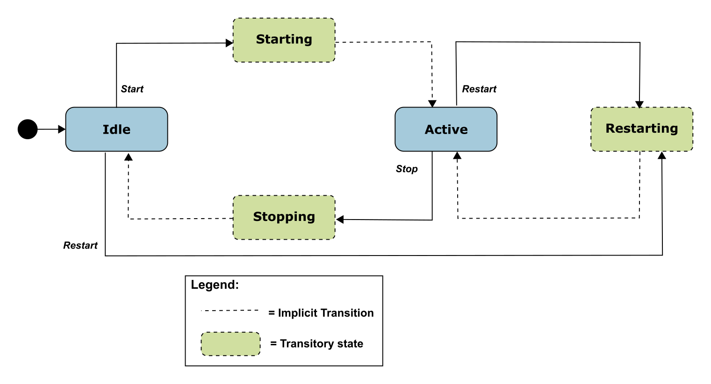

{#fig:no-secure-message-exchange}

### Sending a USP Record

**[R-SEC.23]{}** - When an Agent sends a USP Record, the Agent MUST execute logic that achieves the same results as in the mandatory decision flow elements (identified with "MUST") from @fig:send-record.

**[R-SEC.23a]{}** - When an Agent sends a USP Record, the Agent SHOULD execute logic that achieves the same results as in the optional decision flow elements (identified with "OPT") from @fig:send-record.

{#fig:send-record}

### Checking a Certificate

**[R-SEC.24]{}** - When an Agent analyzes a Controller certificate for authentication and determining permissions (Role), the Agent MUST execute logic that achieves the same results as in the mandatory decision flow elements (identified with "MUST") from [@fig:check-cert; @fig:determine-role].

**[R-SEC.24a]{}** - When an Agent analyzes a Controller certificate for authentication and determining permissions (Role), the Agent SHOULD execute logic that achieves the same results as in the optional decision flow elements (identified with "OPT") from [@fig:check-cert; @fig:determine-role].

**[R-SEC.25]{}** - When determining the inherited Role to apply based on Roles associated with a trusted CA, only the first matching CA in the chain will be used.

{#fig:check-cert}

---

{#fig:determine-role}

### Using a Trusted Broker

Support for Trusted Broker logic is optional.

**[R-SEC.26]{}** - If Trusted Brokers are supported, and a Trusted Broker is encountered (from the optional "OPT" "Trusted Broker cert?" decision diamonds in [@fig:no-secure-message-exchange, @fig:send-record]) the Agent MUST execute logic that achieves the same results as in the mandatory decision flow elements (identified with "MUST") from @fig:broker-with-received-record for a received USP Record and @fig:broker-with-sent-record for sending a USP Record.

**[R-SEC.26a]{}** - If Trusted Brokers are supported, and a Trusted Broker is encountered (from the optional "OPT" "Trusted Broker cert?" decision diamonds in [@fig:no-secure-message-exchange, @fig:send-record]) the Agent SHOULD execute logic that achieves the same results as in the optional decision flow elements (identified with "OPT") from @fig:broker-with-received-record for a received USP Record and @fig:broker-with-sent-record for sending a USP Record.

{#fig:broker-with-received-record}

---

{#fig:broker-with-sent-record}

## Theory of Operations

The following theory of operations relies on Objects, Parameters, events, and operations from the `LocalAgent` Object of the Device:2 Data Model [@TR-181].

### Data Model Elements

These data model elements play a role in reporting on and allowing control of trusted Controllers and the permissions they have to read and write parts of the Agents data model, and allowing an Agent to establish trust with a Controller.

* `LocalAgent.Controller.{i}.AssignedRole` Parameter
* `LocalAgent.Controller.{i}.InheritedRole` Parameter
* `LocalAgent.Controller.{i}.Credential` Parameter

From component `ControllerTrust`:

* Object `LocalAgent.ControllerTrust.`
* Parameters `UntrustedRole`, `BannedRole`, `TOFUAllowed`, `TOFUInactivityTimer`
* Commands `RequestChallenge()`, `ChallengeResponse()`
* Object `LocalAgent.ControllerTrust.Role.{i}.`
* Object `LocalAgent.ControllerTrust.Credential.{i}.`
* Object `LocalAgent.ControllerTrust.Challenge.{i}.`

The Object `LocalAgent.Certificate.` can be used to manage Controller and CA certificates, along with the `LocalAgent.AddCertificate()` and `LocalAgent.Controller.{i}.AddMyCertificate()` commands.

For brevity, `Device.LocalAgent.` is not placed in front of all further Object references in this Security section. However, all Objects references are under `Device.LocalAgent.`. This section does not describe use of Parameters under other top level components.

### Roles (Access Control)

Controller permissions are conveyed in the data model through Roles.

#### Role Definition

A Role is described in the data model through use of the `ControllerTrust.Role.{i}.` Object. Each entry in this Object identifies the Role it describes, and has a `Permission.` Sub-Object for the `Targets` (data model Path Names that the related permissions apply to), permissions related to Parameters, Objects, instantiated Objects, and commands identified by the `Targets` Parameter, and the relative `Order` of precedence among `Permission.` entries for the Role (the larger value of this Parameter takes priority over an entry with a smaller value in the case of overlapping `Targets` entries for the Role).

The permissions of a Role for the specified `Target` entries are described by `Param`, `Obj`, `InstantiatedObj`, and `CommandEvent` Parameters. Each of these is expressed as a string of 4 characters where each character represents a permission ("`r`" for Read, "`w`" for Write, "`x`" for Execute", and "`n`" for Notify). The 4 characters are always presented in the same order in the string (`rwxn`) and the lack of a permission is signified by a "`-`" character (e.g., `r--n`). How these permissions are applied to Parameters, Objects, and various Messages is described in the data model description of these Parameters.

An Agent that wants to allow Controllers to define and modify Roles will implement the `ControllerTrust.Role.{i}.` Object with all of the Parameters listed in the data model. In order for a Controller to define or modify Role entries, it will need to be assigned a Role that gives it the necessary permission. Care should be taken to avoid defining this Roles permissions such that an Agent with this Role can modify the Role and no longer make future modifications to the `ControllerTrust.Role.{i}.` Object.

A simple Agent that only wants to inform Controllers of pre-defined Roles (with no ability to modify or define additional Roles) can implement the `ControllerTrust.Role.` Object with read-only data model definition for all entries and Parameters. A simple Agent could even implement the Object with read-only data model definition and just the `Alias` and `Role` Parameters, and no `Permission.` Sub-Object; this could be sufficient in a case where the Role names convey enough information (e.g., there are only two pre-defined Roles named `"Untrusted"` and `"FullAccess"`).

#### Special Roles

Two special Roles are identified by the `UntrustedRole` and `BannedRole` Parameters under the `ControllerTrust.` Object. An Agent can expose these Parameters with read-only data model implementation if it simply wants to tell Controllers the names of these specific Roles.

The `UntrustedRole` is the Role the Agent will automatically assign to any Controller that has not been authorized for a different Role. Any Agent that has a means of allowing a Controllers Role to be changed (by users through a Challenge string, by other Controllers through modification of `Controller.{i}.AssignedRole`, or through some other external means) and that allows "unknown" Controllers to attach will need to have an "untrusted" Role defined; even if the identity of this Role is not exposed to Controllers through implementation of the `UntrustedRole` Parameter.

The `BannedRole` (if implemented) is assigned automatically by the Agent to Controllers whose certificates have been revoked. If it is not implemented, the Agent can use the `UntrustedRole` for this, as well. It is also possible to simply implement policy for treatment of invalid or revoked certificates (e.g., refuse to connect), rather than associate them with a specific Role. This is left to the Agent policy implementation.

#### A Controllers Role

A Controllers assigned Roles can be conveyed by the `Controller.{i}.AssignedRole` Parameter. This Parameter is a list of all Role values assigned to the Controller through means other than `ControllerTrust.Credential.{i}.Role`. A Controllers inherited Roles (those inherited from `ControllerTrust.Credential.{i}.Role` as described in the next section) need to be maintained separately from assigned Roles and can be conveyed by the `Controller.{i}.InheritedRole` Parameter. Where multiple assigned and inherited Roles have overlapping `Targets` entries, the resulting permission is the union of all assigned and inherited permissions. For example, if two Roles have the same `Targets` with one Role assigning the `Targets` `Param` a value of `r---` and the other Role assigning `Param` a value of `---n`, the resulting permission will be `r--n`. This is done after determining which `ControllerTrust.Role.{i}.Permission.{i}` entry to apply for each Role for specific `Targets`, in the case where a Role has overlapping `Permission.{i}.Targets` entries for the same Role.

For example,
 Given the following `ControllerTrust.Role.{i}.` entries:

```
  i=1, Role = "A"; Permission.1.: Targets = "Device.LocalAgent.", Order = 3, Param = "r---"
  i=1, Role = "A"; Permission.2.: Targets = "Device.LocalAgent.Controller.", Order = 55, Param = "r-xn"
  i=3, Role = "B"; Permission.1: Targets = "Device.LocalAgent.", Order = 20, Param = "r---"
  i=3, Role = "B"; Permission.5: Targets = "Device.LocalAgent.Controller.", Order = 78, Param = "----"
```

 and `Device.LocalAgent.Controller.1.AssignedRole` = "Device.LocalAgent. ControllerTrust.Role.1., Device.LocalAgent. ControllerTrust.Role.3."

When determining permissions for the `Device.LocalAgent.Controller.` table, the Agent will first determine that for Role A Permission.2 takes precedence over Permission.1 (55 > 3). For B, Permission.5 takes precedence over Permission.1 (78 > 20). The union of A and B is "r-xn" + "----" = "r-xn".

#### Role Associated with a Credential or Challenge

The `ControllerTrust.Credential.{i}.Role` Parameter value is inherited by Controllers whose credentials have been validated using the credentials in the same entry of the `ControllerTrust.Credential.{i}.` table. Whenever `ControllerTrust.Credential.{i}.` is used to validate a certificate, the Agent writes the current value of the associated `ControllerTrust.Credential.{i}.Role` into the `Controller.{i}.InheritedRole` Parameter.  For more information on use of this table for assigning Controller Roles and validating credentials, see the sections below.

The `ControllerTrust.Challenge.{i}.Role` Parameter is a Role that is assigned to Controllers that send a successful `ChallengeResponse()` command. For more information on use of challenges for assigning Controller Roles, see the sections below.

### Assigning Controller Roles

As mentioned above, the `Controller.{i}.AssignedRole` Parameter can be used to expose the Controllers assigned Role via the data model.

*Note: Even if it is not exposed through the data model, the Agent is expected to maintain knowledge of the permissions assigned to each known Controller.*

Controllers can be assigned Roles through a variety of methods, depending on the data model elements an Agent implements and the Agents coded policy. Note that it is possible for an Agent to maintain trusted CA credentials with associated permissions (as described by the `ControllerTrust.Credential.{i}.` Object) and various default permission definitions (as identified by the `UntrustedRole` and `BannedRole` Parameters) without exposing these through the data model. If the data is maintained but not exposed, the same methods can still be used.

[@fig:check-cert; @fig:determine-role] in the above [](#sec:analysis-controller-certificates) section identify points in the decision logic where some of the following calls to data model Parameters can be made. The following bullets note when they are identified in one of these figures.

* Another Controller (with appropriate permission) can insert a Controller (including the `AssignedRole` Parameter value) into the `Controller.{i}.` table, or can modify the `AssignedRole` Parameter of an existing `Controller.{i}.` entry. The `InheritedRole` value cannot be modified by another Controller.

* If credentials in an entry in a `ControllerTrust.Credential.{i}.Credential` Parameter with an associated `ControllerTrust.Credential.{i}.Role` Parameter are used to successfully validate the certificate presented by the Controller, the Controller inherits the Role from the associated `ControllerTrust.Credential.{i}.Role`. The Agent writes this value to the `Controller.{i}.InheritedRole` Parameter. This step is shown in @fig:determine-role.

* A Controller whose associated certificate is revoked by a CA can be assigned the role in `BannedRole`, if this Parameter or policy is implemented. In this case, the value of `BannedRole` must be the only value in `Controller.{i}.AssignedRole` (all other entries are removed) and `Controller.{i}.InheritedRole` must be empty (all entries are removed). This step is shown in @fig:check-cert. In the case of a Controller that has not previously been assigned a Role or who has been assigned the value of `UntrustedRole`:

* If the Controllers certificate is validated by credentials in a `ControllerTrust.Credential.{i}.Credential` Parameter but there is no associated `ControllerTrust.Credential.{i}.Role` Parameter (or the value is empty) and `Controller.{i}.AssignedRole` is empty, then the Controller is assigned the role in `UntrustedRole` (written to the `Controller.{i}.AssignedRole` Parameter). This step is shown in @fig:determine-role. Note that assigning `UntrustedRole` means there needs to be some implemented way to elevate the Controllers Role, either by another Controller manipulating the Role, implementing Challenges, or some non-USP method.

* If the Controllers certificate is self-signed or is validated by credentials not in `ControllerTrust.Credential.{i}.`, the Agent policy may be to assign the role in `UntrustedRole`. The optional policy decision (whether or not to allow Trust on First Use (TOFU), which can be codified in the data model with the ControllerTrust.TOFUAllowed flag) is shown in @fig:check-cert; @fig:determine-role shows the Role assignment.

* If the Agent implements the `RequestChallenge()` and `ChallengeResponse()` commands, a Controller assigned the role in `UntrustedRole` can have permission to read one or more `ControllerTrust.Challenge.{i}.Alias` and `Description` values and issue the commands. Roles with more extensive permissions can have permission to read additional `ControllerTrust.Challenge.{i}.Alias` and `Description` values. A successful Challenge results in the Controller being assigned the associated Role value.

### Controller Certificates and Certificate Validation

When an Agent is presented with a Controllers certificate, the Agent will always attempt to validate the certificate to whatever extent possible. [@fig:no-secure-message-exchange, @fig:check-cert; @fig:determine-role] identify points in the decision logic where data model Parameters can be used to influence policy decisions related to Controller certificate analysis.

Note that it is possible for an Agent to maintain policy of the type described by the `UntrustedRole`, `BannedRole`, and the information described by `ControllerTrust.Credential.{i}.` and `Controller.{i}.Credential` without exposing these through the data model. If the policy concepts and data are maintained but not exposed, the same methods can still be used. It is also possible for an Agent to have policy that is not described by any defined data model element.

### Challenges

An Agent can implement the ability to provide Controllers with challenges via USP, in order to be trusted with certain Roles. It is also possible to use non-USP methods to issue challenges, such as HTTP digest authentication with prompts for login and password.

To use the USP mechanism, the `RequestChallenge()` and `ChallengeResponse()` commands and `ControllerTrust.Challenge.{i}.` Object with at least the `Alias`, `Role`, and `Description` Parameters needs to be implemented. The functionality implied by the other `ControllerTrust.Challenge.{i}.` Parameters needs to be implemented, but does not have to be exposed through the data model.

A Controller that sends a Get Message on `Device.ControllerTrust.Challenge.{i}.` will receive all entries and Parameters that are allowed for its current assigned Role. In the simplest case, this will be a single entry and only Alias and Description will be supplied for that entry. It is important to restrict visibility to all other implemented Parameters to highly trusted Roles, if at all.

The Controller can display the value of `Description` to the user and allow the user to indicate they want to request the described challenge. If multiple entries were returned, the user can be asked to select which challenge they want to request, based on the description. An example of a description might be "Request administrative privileges" or "Request guest privilege".

When the user indicates to the Controller which challenge they want, the Controller sends `RequestChallenge()` with the Path Name of the `Challenge` Object Instance associated with the desired `Description`. The Agent replies with the associated `Instruction`, `InstructionType`, `ValueType` and an auto-generated `ChallengeID`. The Controller presents the value of `Instruction` to the user (in a manner appropriate for `InstructionType`). Examples of an instruction might be "Enter passphrase printed on bottom of device" or "Enter PIN sent to registered email address". The user enters a string per the instructions, and the Controller sends this value together with the `ChallengeID` in `ChallengeResponse()`.

If the returned value matches `Value`, the Agent gives a successful response - otherwise it returns an unsuccessful response. If successful, the `ControllerTrust.Challenge.{i}.Role` replaces an `UntrustedRole` in `Controller.{i}.AssignedRole` or is appended to any other `Controller.{i}.AssignedRole` value.

The number of times a `ControllerTrust.Challenge.{i}.` entry can be consecutively failed (across all Controllers, without intermediate success) is defined by `Retries`. Once the number of failed consecutive attempts equals `Retries`, the `ControllerTrust.Challenge.{i}.` cannot be retried until after `LockoutPeriod` has expired.

Type values other than `Passphrase` can be used and defined to trigger custom mechanisms, such as requests for emailed or SMS-provided PINs.

### Certificate Management

If an Agent wants to allow certificates associated with Controllers and CAs to be exposed through USP, the Agent can implement the `Controller.{i}.Credential` and `ControllerTrust.Credential.{i}.Credential` Parameters, which require implementation of the `LocalAgent.Certificate.` Object. Allowing management of these certificates through USP can be accomplished by implementing `LocalAgent.AddCertificate()`, `Controller.{i}.AddMyCertificate()` and `Certificate.{i}.Delete()` commands.

To allow a Controller to check whether the Agent has correct certificates, the `Certificate.{i}.GetFingerprint()` command can be implemented.

### Application of Modified Parameters

It is possible that various Parameters related to authentication and authorization may change that would impact cached encrypted sessions and Role permissions for Controllers. Example of such Parameters include `Controller.{i}.AssignedRole`, `Controller.{i}.Credential`, `ControllerTrust.Role.` definition of a Role, and `ControllerTrust.Credential.{i}.Role`.

There is no expectation that an Agent will apply these changes to cached sessions. It is up to the Agent to determine whether or not it will detect these changes and flush cached session information. However, it is expected that a reboot will clear all cached session information.

# Bulk Data Collection {.annex1}

*Note:  This Annex has been re-written in the 1.2 version of the USP specification to include the previously-defined USP Event Notification aspects of Bulk Data Collection and the new MQTT aspects of Bulk Data Collection, in addition to the already defined HTTP Bulk Data Collection mechanism.*

This section discusses the Theory of Operation for USP specific mechanisms related to the collection and transfer of bulk data using either HTTP, MQTT, or USP Event Notifications.  This includes an explanation of how the Agent can be configured to enable the collection of bulk data using HTTP, MQTT, or USP Event Notifications via the BulkData Objects, which are defined in the Device:2 Data Model [@TR-181].

## Introduction

The general concept behind the USP Bulk Data collection mechanism is that a USP Controller can configure an Agent to consistently deliver a bulk data report at a specific interval. For large CPE populations, this is a more efficient mechanism when compared to the alternative of polling each individual CPE for the data. There are four key aspects of configuring the bulk data collection mechanism on an Agent:

* **What data needs to be collected** :: The set of Object/Parameter Path Names that dictate the set of Parameters that will be included in each Bulk Data report.  Anything included in this set should be considered a filter that is applied against the Instantiated Data Model at the time of report generation, which means that the generation of the report is not contingent upon the Path Name being present in the Instantiated Data Model at the time of report generation.

* **How often does the data need to be collected** :: The interval and time reference that dictates the frequency and cycle of report generation. For example,  the interval could be set to 15 minutes while the time reference could be set to 42 minutes past 1 AM, which would mean that the report is generated every 15 minutes at 42 past the hour, 57 past the hour, 12 past the hour, and 27 past the hour.

* **Where does the data need to be sent** :: The destination of where the report needs to be delivered after it has been generated.  This is specific to the Bulk Data collection mechanism being used: HTTP vs MQTT vs USP Event Notification.

* **How does the data get sent** :: The protocol used to send the data across the wire, the encoding of the data, and the format of the data. From a Protocol perspective, the HTTP Bulk Data collection mechanism utilizes either the HTTP or HTTPS protocols, the MQTT Bulk Data Collection mechanism utilizes the MQTT protocol, and the USPEventNotif Bulk Data collection mechanism utilizes the existing USP communications channel related to the USP Controller that owns the bulk data profile. From a data encoding perspective, both Bulk Data collection mechanisms support the *CSV* and *JSON* options as described later. From a data formatting perspective, both Bulk Data collection mechanisms support the *Object Hierarchy* and *Name Value Pair* report formats, also described later.

The Bulk Data collection mechanism is configured within an Agent by creating a Bulk Data Profile.  A Bulk Data Profile defines the configuration of the four key aspects (as mentioned above) for a given Bulk Data Report.  Meaning, the Bulk Data Profile defines the protocol to use (HTTP vs MQTT vs USPEventNotif), the data encoding to use (CSV vs JSON), the report format to use (Object Hierarchy vs Name Value Pair), the destination of the report, the frequency of the report generation, and the set of Parameters to include in the report. Furthermore, the Bulk Data Profile has a `Controller` Parameter that is a read-only Parameter and is set by the Agent based on the Controller that created the Bulk Data Profile.  The Controller Parameter represents the owner of the Profile, which is used when determining permissions. When the Agent generates the Bulk Data Report it uses the permissions associated with the referenced Controller to determine what is included in the Report (Objects and Parameters that fail the permissions check are simply filtered out of the Report).

*Note:  When a Bulk Data Collection Profile is either created or updated the Agent performs validation checks for the associated Objects and Parameters against the Supported Data Model at the time of the operation.*

*Note:  When a Bulk Data Collection Report is generated the Agent performs permission checks for the associated Objects and parameters against the Instantiated Data Model, filtering out any Object instances or Parameters that are not present at that time.*


## HTTP Bulk Data Collection
The Bulk Data Collection mechanism that utilizes an out-of-band HTTP/HTTPS communications mechanism for delivering the Bulk Data Report.

### Enabling HTTP/HTTPS Bulk Data Communication

HTTP/HTTPS communication between the Agent and Bulk Data Collector is enabled by either configuring an existing `BulkData.Profile` Object Instance for the HTTP/HTTPS transport protocol or adding and configuring a new `BulkData.Profile` Object Instance using the [Add Message](#sec:add). For example:

    .BulkData.Profile.1
    .BulkData.Profile.1.Enable=true
    .BulkData.Profile.1.Protocol = "HTTP"
    .BulkData.Profile.1.ReportingInterval = 300
    .BulkData.Profile.1.TimeReference = "0001-01-01T00:00:00Z"
    .BulkData.Profile.1.HTTP.URL =  "https://bdc.acme.com/somedirectory"
    .BulkData.Profile.1.HTTP.Username = "username"
    .BulkData.Profile.1.HTTP.Password = "password"
    .BulkData.Profile.1.HTTP.Method = "POST"
    .BulkData.Profile.1.HTTP.UseDateHeader = true

The configuration above defines a profile that transfers data from the Agent to the Bulk Data Collector using secured HTTP. In addition the Agent will provide authentication credentials (username, password) to the Bulk Data Collector, if requested by the Bulk Data Collector. Finally, the Agent establishes a communication session with the Bulk Data Collector every 300 seconds in order to transfer the data defined by the `.BulkData.Report.` Object Instance.

Once the communication session is established between the Agent and Bulk Data Collector the data is transferred from the Agent using the POST HTTP method with a HTTP Date header and no compression.

**[R-BULK.0]{}** - In many scenarios Agents will utilize "chunked" transfer encoding. As such, the Bulk Data Collector MUST support the HTTP transfer-coding value of "chunked".

### Use of the URI Query Parameters

The HTTP Bulk Data transfer mechanism allows Parameters to be used as HTTP URI query parameters. This is useful when Bulk Data Collector utilizes the specific parameters that the Agent reports for processing (e.g., logging, locating directories) without the need for the Bulk Data Collector to parse the data being transferred.

**[R-BULK.1]{}** - The Agent MUST transmit the device's Manufacturer OUI, Product Class and Serial Number or the USP Endpoint ID as part of the URI query parameters. The data model Parameters are encoded as:

    .DeviceInfo.ManufacturerOUI -> oui
    .DeviceInfo.ProductClass  -> pc
    .DeviceInfo.SerialNumber  -> sn
    .LocalAgent.EndpointID -> eid

As such, the values of the devices OUI, Serial Number and Product Class are formatted in the HTTP request URI as follows:

    POST https://<bulk data collector url>?oui=00256D&pc=Z&sn=Y

If the USP Endpoint ID is used the HTTP request URI is formatted as:

    POST https://<bulk data collector url>?eid=os::000256:asdfa99384

*Note:  If the USP Endpoint ID should be transmitted together with the device's Manufacturer OUI, Product Class and Serial Number (e.g. to distinguish multiple bulk data collection instances on the same device), then the USP Endpoint ID has to be configured as additional URI parameter in the `.BulkData.Profile.{i}.HTTP.RequestURIParameter.{i}.` table.*

Configuring the URI query parameters for other Parameters requires that instances of a `.BulkData.Profile.{i}.HTTP.RequestURIParameter.{i}.` Object Instance be created and configured with the requested parameters. The additional parameters are appended to the required URI query parameters.

Using the example to add the device's current local time to the required URI parameters, the HTTP request URI would be as follows:

    POST https://<bulk data collector url>?oui=00256D&pc=Z&sn=Y&ct=2015-11-01T11:12:13Z

By setting the following Parameters using the Add Message as follows:

    .BulkData.Profile.1.HTTP.RequestURIParameter 1.Name ="ct"
    .BulkData.Profile.1.HTTP.RequestURIParameter.1.Reference ="Device.Time.CurrentLocalTime"

### Use of HTTP Status Codes

The Bulk Data Collector uses standard HTTP status codes, defined in the HTTP specification, to inform the Agent whether a bulk data transfer was successful.  The HTTP status code is set in the response header by the Bulk Data Collector.  For example, "`200 OK`" status code indicates an upload was processed successfully, "`202 Accepted`" status code indicates that the request has been accepted for processing, but the processing has not been completed, "`401 Unauthorized`" status code indicates user authentication failed and a "`500 Internal Server Error`" status code indicates there is an unexpected system error.

#### HTTP Retry Mechanism

**[R-BULK.2]{}** - When the Agent receives an unsuccessful HTTP status code and the HTTP retry behavior is enabled, the Agent MUST try to redeliver the data. The retry mechanism employed for the transfer of bulk data using HTTP uses the same algorithm as is used for [USP Notify retries](#sec:responses-and-retry).

The retry interval range is controlled by two Parameters, the minimum wait interval and the interval multiplier, each of which corresponds to a data model Parameter, and which are described in the table below. The factory default values of these Parameters MUST be the default values listed in the Default column. They MAY be changed by a Controller with the appropriate permissions at any time.

| Descriptive Name | Symbol | Default | Data Model Parameter Name |
| ---------: | :-----: | :------: | :------------ |
|Minimum wait interval | m | 5 seconds |	`Device.BulkData.Profile.{i}.HTTP.RetryMinimumWaitInterval` |
| Interval multiplier |	k | 2000 | `Device.BulkData.Profile.{i}.HTTP.RetryIntervalMultiplier` |

| Retry Count | Default Wait Interval Range (min-max seconds) | Actual Wait Interval Range (min-max seconds) |
| ----------: | :---------: | :-------------- |
| #1 | 5-10 | m - m.(k/1000) |
| #2 | 10-20 | m.(k/1000) - m.(k/1000)2 |
| #3 | 20-40 | m.(k/1000)2 - m.(k/1000)3 |
| #4 | 40-80 | m.(k/1000)3 - m.(k/1000)4 |
| #5 | 80-160 | m.(k/1000)4 - m.(k/1000)5 |
| #6 | 160-320 | m.(k/1000)5 - m.(k/1000)6 |
| #7 | 320-640 | m.(k/1000)6 - m.(k/1000)7 |
| #8 | 640-1280 | m.(k/1000)7 - m.(k/1000)8 |
| #9 | 1280-2560 | m.(k/1000)8 - m.(k/1000)9 |
| #10 and subsequent | 2560-5120 | m.(k/1000)9 - m.(k/1000)10 |

**[R-BULK.3]{}** - Beginning with the tenth retry attempt, the Agent MUST choose from the fixed maximum range. The Agent will continue to retry a failed bulk data transfer until it is successfully delivered or until the next reporting interval for the data transfer becomes effective.

**[R-BULK.4]{}** - Once a bulk data transfer is successfully delivered, the Agent MUST reset the retry count to zero for the next reporting interval.

**[R-BULK.5]{}** - If a reboot of the Agent occurs, the Agent MUST reset the retry count to zero for the next bulk data transfer.

#### Processing of Content for Failed Report Transmissions

When the content (report) cannot be successfully transmitted, including retries, to the data collector, the `NumberOfRetainedFailedReports` Parameter of the `BulkData.Profile` Object Instance defines how the content should be disposed based on the following rules:

*	When the value of the `NumberOfRetainedFailedReports` Parameter is greater than `0`, then the report for the current reporting interval is appended to the list of failed reports. How the content is appended is dependent on the type of encoding (e.g., CSV, JSON) and is described further in corresponding encoding section.
*	If the value of the `NumberOfRetainedFailedReports` Parameter is `-1`, then the Agent will retain as many failed reports as possible.
*	If the value of the NumberOfRetainedFailedReports Parameter is `0`, then failed reports are not to be retained for transmission in the next reporting interval.
*	If the Agent cannot retain the number of failed reports from previous reporting intervals while transmitting the report of the current reporting interval, then the oldest failed reports are deleted until the Agent is able to transmit the report from the current reporting interval.
*	If the value `BulkData.Profile` Object Instances `EncodingType` Parameter is modified any outstanding failed reports are deleted.

### Use of TLS and TCP

The use of TLS to transport the HTTP Bulk Data is RECOMMENDED, although the protocol MAY be used directly over a TCP connection instead. If TLS is not used, some aspects of security are sacrificed. Specifically, TLS provides confidentiality and data integrity, and allows certificate-based authentication in lieu of shared secret-based authentication.

**[R-BULK.6]{}** - Certain restrictions on the use of TLS and TCP are defined as follows:

*	The Agent MUST support TLS version 1.2 or later (with backward compatibility to TLS 1.2).
*	If the Collection Server URL has been specified as an HTTPS URL, the Agent MUST establish secure connections to the Collection Server, and MUST start the TLS session negotiation with TLS 1.2 or later.

*Note:  If the Collection Server does not support TLS 1.2 or higher with a cipher suite supported by the Agent, it may not be possible for the Agent to establish a secure connection to the Collection Server.*

*Note:  TLS_RSA_WITH_AES_128_CBC_SHA is the only mandatory TLS 1.2 cipher suite.*

*	The Agent SHOULD use the [@RFC6066] Server Name TLS extension to send the host portion of the Collection Server URL as the server name during the TLS handshake.
*	If TLS 1.2 (or a later version) is used, the Agent MUST authenticate the Collection Server using the certificate provided by the Collection Server. Authentication of the Collection Server requires that the Agent MUST validate the certificate against a root certificate. To validate against a root certificate, the Agent MUST contain one or more trusted root certificates that are either pre-loaded in the Agent or provided to the Agent by a secure means outside the scope of this specification. If as a result of an HTTP redirect, the Agent is attempting to access a Collection Server at a URL different from its pre-configured Collection Server URL, the Agent MUST validate the Collection Server certificate using the redirected Collection Server URL rather than the pre-configured Collection Server URL.
*	If the host portion of the Collection Server URL is a DNS name, this MUST be done according to the principles of RFC 6125 [@RFC6125], using the host portion of the Collection Server URL as the reference identifier.
*	If the host portion of the Collection Server URL is an IP address, this MUST be done by comparing the IP address against any presented identifiers that are IP addresses.

*Note:  the terms "reference identifier" and "presented identifier" are defined in RFC 6125 [@RFC6125].*

*Note:  wildcard certificates are permitted as described in RFC 6125 [@RFC6125].*

*	An Agent capable of obtaining absolute time SHOULD wait until it has accurate absolute time before contacting the Collection Server. If a Agent for any reason is unable to obtain absolute time, it can contact the Collection Server without waiting for accurate absolute time. If a Agent chooses to contact the Collection Server before it has accurate absolute time (or if it does not support absolute time), it MUST ignore those components of the Collection Server certificate that involve absolute time, e.g. not-valid-before and not-valid-after certificate restrictions.
*	Support for Agent authentication using client-side certificates is NOT RECOMMENDED.  Instead, the Collection Server SHOULD authenticate the Agent using HTTP basic or digest authentication to establish the identity of a specific Agent.

### Bulk Data Encoding Requirements

When utilizing the HTTP Bulk Data collection option, the encoding type is sent as a media type within the report. For CSV the media type is `text/csv` as specified in RFC 4180 [@RFC4180] and for JSON the media type is `application/json` as specified in RFC 7159 [@RFC7159]. For example, a CSV encoded report using `charset=UTF-8` would have the following Content-Type header:

    Content-Type: text/csv; charset=UTF-8

**[R-BULK.7]{}** - The "`media-type`" field and "`charset`" Parameters MUST be present in the Content-Type header.

In addition the report format that was used for encoding the report is included as an HTTP custom header with the following format:

    BBF-Report-Format: <ReportFormat>

The <ReportFormat> field is represented as a token.

For example a CSV encoded report using a ReportFormat for ParameterPerRow would have the following BBF-Report-Format header:

    BBF-Report-Format: "ParameterPerRow"

**[R-BULK.8]{}** - The BBF-Report-Format custom header MUST be present when transferring data to the Bulk Data Collector from the Agent using HTTP/HTTPS.


## MQTT Bulk Data Collection
The Bulk Data Collection mechanism that utilizes an out-of-band MQTT communications mechanism for delivering the Bulk Data Report.

### Enabling MQTT Bulk Data Communication

Bulk Data communications that utilizes MQTT for transferring the Bulk Data Report between the Agent and a Bulk Data Collector, is enabled by either configuring an existing `BulkData.Profile` Object Instance for the MQTT transport protocol or adding and configuring a new `BulkData.Profile` Object Instance using the [Add Message](#sec:add). For example:

    .BulkData.Profile.1
    .BulkData.Profile.1.Enable = true
    .BulkData.Profile.1.Name = "MQTT Profile 1"
    .BulkData.Profile.1.Protocol = "MQTT"
    .BulkData.Profile.1.EncodingType = "JSON"
    .BulkData.Profile.1.ReportingInterval = 300
    .BulkData.Profile.1.TimeReference = "0001-01-01T00:00:00Z"
    .BulkData.Profile.1.MQTT.Reference =  "Device.MQTT.Client.1"
    .BulkData.Profile.1.MQTT.PublishTopic = "/bulkdata"
    .BulkData.Profile.1.MQTT.PublishQoS = 1
    .BulkData.Profile.1.MQTT.PublishRetain = false

The configuration above defines a profile that transfers data from the Agent to a Bulk Data Collector via the MQTT protocol.  The Agent utilizes the referenced MQTT Client instance to determine the MQTT broker for this Bulk Data Collection Profile.  The Agent sends the Bulk Data Report to the reference MQTT Broker by issuing an MQTT PUBLISH message to the PublishTopic every 300 seconds (ReportingInterval).  The Bulk Data Collector would subscribe to the PublishTopic in order to receive the Bulk Data Reports.

### Determining Successful Transmission

Delivering a Bulk Data Collection report using MQTT means that successful transmission of the report is tied to the successful delivery of the MQTT PUBLISH message, which is determined by the PublishQoS configured as part of the Bulk Data Collection Profile.

#### Retrying Failed Transmissions

Delivering a Bulk Data Collection report using MQTT means that any failed transmissions are retried based on the referenced MQTT Client and the associated QoS value contained within the MQTT PUBLISH message, which is determined by the PublishQoS parmater.  Furthermore, the CleanSession (MQTT 3.1 and MQTT 3.1.1) and CleanStart (MQTT 5.0) flags determine if unacknowledged PUBLISH messages are re-delivered on client reconnect.  For MQTT 3.1 there is also the MessageRetryTime defined in the referenced MQTT Client that determines how frequently an unacknowledged PUBLISH message should be retried.

#### Processing of Content for Failed Report Transmissions

When the content (report) cannot be successfully transmitted, including retries, to the MQTT broker, the `NumberOfRetainedFailedReports` Parameter of the `BulkData.Profile` Object Instance defines how the content should be disposed based on the following rules:

*	When the value of the `NumberOfRetainedFailedReports` Parameter is greater than `0`, then the report for the current reporting interval is appended to the list of failed reports. How the content is appended is dependent on the type of encoding (e.g., CSV, JSON) and is described further in corresponding encoding section.
*	If the value of the `NumberOfRetainedFailedReports` Parameter is `-1`, then the Agent will retain as many failed reports as possible.
*	If the value of the NumberOfRetainedFailedReports Parameter is `0`, then failed reports are not to be retained for transmission in the next reporting interval.
*	If the Agent cannot retain the number of failed reports from previous reporting intervals while transmitting the report of the current reporting interval, then the oldest failed reports are deleted until the Agent is able to transmit the report from the current reporting interval.
*	If the value `BulkData.Profile` Object Instances `EncodingType` Parameter is modified any outstanding failed reports are deleted.

### Bulk Data Encoding Requirements

When utilizing the MQTT Bulk Data collection option with a MQTT 5.0 Client connection, the encoding type is sent as a media type within the MQTT PUBLISH message header and the Content Type property. For CSV the media type is `text/csv` as specified in RFC 4180 [@RFC4180] and for JSON the media type is `application/json` as specified in RFC 7159 [@RFC7159]. For example, a CSV encoded report using `charset=UTF-8` would have the following Content Type property:

    text/csv; charset=UTF-8

**[R-BULK.8a]{}** - The "`media-type`" field and "`charset`" parameters MUST be present in the Content Type property when using MQTT 5.0.

When utilizing the MQTT Bulk Data collection option with a MQTT 3.1 or MQTT 3.1.1 client connection, the encoding type is not sent in the MQTT PUBLISH message; instead the receiving Bulk Data Collector will need to know how the `.BulkData.Profile` Object Instance is configured.

In addition the data layout is not included in the MQTT PUBLISH message; instead the receiving Bulk Data Collector will need to know how the `.BulkData.Profile.{i}.CSVEncoding.ReportFormat` or `.BulkData.Profile.{i}.JSONEncoding.ReportFormat` Parameter is configured.


## USPEventNotif Bulk Data Collection
The Bulk Data Collection mechanism that utilizes the existing USP communications channel for delivering the Bulk Data Report via a [Notify Message](#sec:notify) that contains a Push! Event.

### Enabling USPEventNotif Bulk Data Communication

Bulk Data communications using a USP Event notification that utilizes the [Notify Message](#sec:notify) between the Agent and a Controller, acting as a Bulk Data Collector, is enabled by either configuring an existing `BulkData.Profile` Object Instance for the USPEventNotif transport protocol or adding and configuring a new `BulkData.Profile` Object Instance using the [Add Message](#sec:add). For example:

    .BulkData.Profile.1
    .BulkData.Profile.1.Enable = true
    .BulkData.Profile.1.Name = "USP Notif Profile 1"
    .BulkData.Profile.1.Protocol = "USPEventNotif"
    .BulkData.Profile.1.EncodingType = "JSON"
    .BulkData.Profile.1.ReportingInterval = 300
    .BulkData.Profile.1.TimeReference = "0001-01-01T00:00:00Z"

The configuration above defines a profile that transfers data from the Agent to a Controller that is acting as the Bulk Data Collector.  The Controller that receives an Event notification is dictated by the Agent's currently defined Subscriptions [](#sec:notifications-and-subscriptions). The Agent utilizes the existing communications session with the Controller acting as the Bulk Data Collector every 300 seconds in order to transfer the data defined by the `.BulkData.Profile` Object Instance.

The data is transferred from the Agent using the USP Notify Message and a `.BulkData.Profile.1.Push!` Event notification.

### Determining Successful Transmission

Delivering a Bulk Data Collection report using the USP Notify Message and a `.BulkData.Profile.1.Push!` Event notification means that successful transmission of the report is tied to the successful delivery of the notification itself [](#sec:responses-and-retry).

#### Retrying Failed Transmissions

Delivering a Bulk Data Collection report using the USP Notify Message and a `.BulkData.Profile.1.Push!` Event notification means that any failed transmissions are retried based on the notification retry requirements [R-NOT.1]() through [R-NOT.4]() [](#sec:responses-and-retry).

Furthermore, the `NumberOfRetainedFailedReports` Parameter of the `BulkData.Profile` Object Instance does not pertain to the USPEventNotif Bulk Data Collection mechanism as each report is wholly contained within a USP Notify Message.  This means that the notification retry mechanism will determine the life of each individual failed report, and that each reporting interval will generate a new report that is delivered via a new USP Notify Message.

### Bulk Data Encoding Requirements

When utilizing the USPEventNotif Bulk Data collection option, the encoding type is not sent in the USP Event notification; instead the receiving Controller will need to know how the `.BulkData.Profile` Object Instance is configured.

In addition the data layout is not included in the USP Event notification; instead the receiving Controller will need to know how the `.BulkData.Profile.{i}.CSVEncoding.ReportFormat` or `.BulkData.Profile.{i}.JSONEncoding.ReportFormat` Parameter is configured.


## Using Wildcards to Reference Object Instances in the Report

When the Agent supports the use of the Wildcard value "\*"  in place of instance identifiers for the Reference Parameter, then all Object Instances of the referenced Parameter are encoded. For example to encode the "`BroadPktSent`" Parameter for all Object Instances of the MoCA Interface Object the following will be configured:

```
    .BulkData.Profile.1.Parameter.1.Name =  ""
    .BulkData.Profile.1.Parameter.1.Reference =  "Device.MoCA.Interface.*.Stats.BroadPktSent"
```

## Using Alternative Names in the Report

Alternative names can be defined for the Parameter name in order to shorten the name of the Parameter. For example instead of encoding the full Parameter name "`Device.MoCA.Interface.1.Stats.BroadPktSent`" could be encoded with a shorter name "`BroadPktSent`". This allows the encoded data to be represented using the shorter name. This would be configured as:

    .BulkData.Profile.1.Parameter.1.Name =  "BroadPktSent"
    .BulkData.Profile.1.Parameter.1.Reference =  "Device.MoCA.Interface.1.Stats.BroadPktSent"

In the scenario where there are multiple instances of a Parameter (e.g., "`Device.MoCA.Interface.1.Stats.BroadPktSent`", "`Device.MoCA.Interface.2.Stats.BroadPktSent`") in a Report, the content of the Name parameter SHOULD be unique (e.g., `BroadPktSent.1`, `BroadPktSent.2`).

#### Using Object Instance Wildcards and Parameter Partial Paths with Alternative Names

Wildcards for Object Instances can be used in conjunction with the use of alternative names by reflecting Object hierarchy of the value of the Reference Parameter in the value of the Name Parameter.

**[R-BULK.9]{}** - When the value of the Reference Parameter uses a wildcard for an instance identifier, the value of the Name Parameter (as used in a report) MUST reflect the wild-carded instance identifiers of the Parameters being reported on.  Specifically, the value of the Name Parameter MUST be appended with a period (.) and then the instance identifier. If the value of the Reference Parameter uses multiple wildcard then each wild-carded instance identifier MUST be appended in order from left to right.

For example, for a device to report the Bytes Sent for the Associated Devices of the device's Wi-Fi Access Points the following would be configured:

    .BulkData.Profile.1.Parameter.1.Name =  "WiFi_AP_Assoc_BSent"
    .BulkData.Profile.1.Parameter.1.Reference = "Device.WiFi.AccessPoint.*.AssociatedDevice.*.Stats.BytesSent"

Using this configuration a device that has 2 Wi-Fi Access Points (with instance identifiers `1` and `3`) each with 2 Associated Devices (with instance identifiers `10` and `11`), would contain a Report with following Parameter names:

    WiFi_AP_Assoc_BSent.1.10
    WiFi_AP_Assoc_BSent.1.11
    WiFi_AP_Assoc_BSent.3.10
    WiFi_AP_Assoc_BSent.3.11

Object or Object Instance Paths can also be used to report all Parameters of the associated Object.

**[R-BULK.10]{}** - When the value of the Reference Parameter is an Object Path, the value of the Name Parameter (as used in a report) MUST reflect the remainder of the Parameter Path. Specifically, the value of Name Parameter MUST be appended with a "." and then the remainder of the Parameter Path.

For example, for a device to report the statistics of a Wi-Fi associated device Object Instance the following would be configured:

    .BulkData.Profile.1.Parameter.1.Name = "WiFi_AP1_Assoc10"
    .BulkData.Profile.1.Parameter.1.Reference = "Device.WiFi.AccessPoint.1.AssociatedDevice.10.Stats."

Using the configuration the device's report would contain the following Parameter names:

    WiFi_AP1_Assoc10.BytesSent
    WiFi_AP1_Assoc10.BytesReceived
    WiFi_AP1_Assoc10.PacketsSent
    WiFi_AP1_Assoc10.PacketsReceived
    WiFi_AP1_Assoc10.ErrorsSent
    WiFi_AP1_Assoc10.RetransCount
    WiFi_AP1_Assoc10.FailedRetransCount
    WiFi_AP1_Assoc10.RetryCount
    WiFi_AP1_Assoc10.MultipleRetryCount

It is also possible for the value of the Reference Parameter to use both wildcards for instance identifiers and be a partial Path Name. For example, for device to report the statistics for the device's Wi-Fi associated device, the following would be configured:

    .BulkData.Profile.1.Parameter.1.Name = "WiFi_AP_Assoc"
    .BulkData.Profile.1.Parameter.1.Reference = "Device.WiFi.AccessPoint.*.AssociatedDevice.*.Stats."

Using this configuration a device that has 1 Wi-Fi Access Point (with instance identifier `1`) with 2 Associated Devices (with instance identifiers `10` and `11`), would contain a Report with following Parameter names:

    WiFi_AP_Assoc.1.10.BytesSent
    WiFi_AP_Assoc.1.10.BytesReceived
    WiFi_AP_Assoc.1.10.PacketsSent
    WiFi_AP_Assoc.1.10.PacketsReceived
    WiFi_AP_Assoc.1.10.ErrorsSent
    WiFi_AP_Assoc.1.10.RetransCount
    WiFi_AP_Assoc.1.10.FailedRetransCount
    WiFi_AP_Assoc.1.10.RetryCount
    WiFi_AP_Assoc.1.10.MultipleRetryCount
    WiFi_AP_Assoc.1.11.BytesSent
    WiFi_AP_Assoc.1.11.BytesReceived
    WiFi_AP_Assoc.1.11.PacketsSent
    WiFi_AP_Assoc.1.11.PacketsReceived
    WiFi_AP_Assoc.1.11.ErrorsSent
    WiFi_AP_Assoc.1.11.RetransCount
    WiFi_AP_Assoc.1.11.FailedRetransCount
    WiFi_AP_Assoc.1.11.RetryCount
    WiFi_AP_Assoc.1.11.MultipleRetryCount


## Encoding of Bulk Data

### Encoding of CSV Bulk Data

**[R-BULK.11]{}** - CSV Bulk Data SHOULD be encoded as per RFC 4180 [@RFC4180], MUST contain a header line (column headers), and the media type MUST indicate the presence of the header line.

For example: `Content-Type: text/csv; charset=UTF-8; header=present`

In addition, the characters used to separate fields and rows as well as identify the escape character can be configured from the characters used in RFC 4180 [@RFC4180].

Using the HTTP example above, the following configures the Agent to transfer data to the Bulk Data Collector using CSV encoding, separating the fields with a comma and the rows with a new line character, by setting the following Parameters:

    .BulkData.Profile.1.EncodingType =  "CSV"
    .BulkData.Profile.1 CSVEncoding.FieldSeparator = ","
    .BulkData.Profile.1.CSVEncoding.RowSeparator="&#13;&#10;"
    .BulkData.Profile.1.CSVEncoding.EscapeCharacter="&quot;"

#### Defining the Report Layout of the Encoded Bulk Data

The layout of the data in the reports associated with the profiles allows Parameters to be formatted either as part of a column (`ParameterPerColumn`) or as a distinct row (`ParameterPerRow`) as defined below. In addition, the report layout allows rows of data to be inserted with a timestamp stating when the data is collected.

Using the HTTP example above, the following configures the Agent to format the data using a Parameter as a row and inserting a timestamp as the first column entry in each row using the "Unix-Epoch" time. The information is configured by setting the following Parameters:

    .BulkData.Profile.1.CSVEncoding.ReportFormat ="ParameterPerRow"
    .BulkData.Profile.1.CSVEncoding.RowTimestamp ="Unix-Epoch"

**[R-BULK.12]{}** - The report format of "`ParameterPerRow`" MUST format each Parameter using the `ParameterName`, `ParameterValue` and `ParameterType` in that order.

**[R-BULK.13]{}** - The `ParameterType` MUST be the Parameter's base data type as described in TR-106 [@TR-106].

#### Layout of Content for Failed Report Transmissions

*Note: This is only relevant for the HTTP variant of Bulk Data Collection.*

When the value of the `NumberOfRetainedFailedReports` Parameter of the `BulkData.Profile` Object Instance is `-1` or greater than `0`, then the report of the current reporting interval is appended to the failed reports. For CSV Encoded data the content of new reporting interval is added onto the existing content without any header data.

#### CSV Encoded Report Examples

##### CSV Encoded Reporting Using ParameterPerRow Report Format

Using the configuration examples provided in the previous sections the configuration for a CSV encoded HTTP report using the `ParameterPerRow` report format:

    .BulkData.Profile.1
    .BulkData.Profile.1.Enable=true
    .BulkData.Profile.1.Protocol = "HTTP"
    .BulkData.Profile.1.ReportingInterval = 300
    .BulkData.Profile.1.TimeReference = "0001-01-01T00:00:00Z"
    .BulkData.Profile.1.HTTP.URL =  "https://bdc.acme.com/somedirectory"
    .BulkData.Profile.1.HTTP.Username = "username"
    .BulkData.Profile.1.HTTP.Password = "password"
    .BulkData.Profile.1.HTTP.Compression = "Disabled"
    .BulkData.Profile.1.HTTP.Method = "POST"
    .BulkData.Profile.1.HTTP.UseDateHeader = true
    .BulkData.Profile.1.EncodingType =  "CSV"
    .BulkData.Profile.1 CSVEncoding.FieldSeparator = ","
    .BulkData.Profile.1.CSVEncoding.RowSeparator="&#13;&#10;"
    .BulkData.Profile.1.CSVEncoding.EscapeCharacter="&quot;"
    .BulkData.Profile.1.CSVEncoding.ReportFormat ="ParameterPerRow"
    .BulkData.Profile.1.CSVEncoding.ReportTimestamp ="Unix-Epoch"
    .BulkData.Profile.1.Parameter.1.Name =  ""
    .BulkData.Profile.1.Parameter.1.Reference =  "Device.MoCA.Interface.1.Stats.BroadPktSent"
    .BulkData.Profile.1.Parameter.2.Name =  ""
    .BulkData.Profile.1.Parameter.2.Reference =  "Device.MoCA.Interface.1.Stats.BytesReceived"
    .BulkData.Profile.1.Parameter.3.Name =  ""
    .BulkData.Profile.1.Parameter.3.Reference =  "Device.MoCA.Interface.1.Stats.BytesSent"
    .BulkData.Profile.1.Parameter.4.Name =  ""
    .BulkData.Profile.1.Parameter.4.Reference =  "Device.MoCA.Interface.1.Stats.MultiPktReceived"


The resulting CSV encoded data would look like:

    ReportTimestamp,ParameterName,ParameterValue,ParameterType
    1364529149,Device.MoCA.Interface.1.Stats.BroadPktSent,25248,unsignedLong
    1364529149,Device.MoCA.Interface.1.Stats.BytesReceived,200543250,unsignedLong
    1364529149, Device.MoCA.Interface.1.Stats.Stats.BytesSent,7682161,unsignedLong
    1364529149,Device.MoCA.Interface.1.Stats.MultiPktReceived,890682272,unsignedLong

##### CSV Encoded Reporting Using ParameterPerColumn Report Format

Using the configuration examples provided in the previous sections the configuration for a CSV encoded HTTP report using the `ParameterPerColumn` report format:

    .BulkData.Profile.1
    .BulkData.Profile.1.Enable=true
    .BulkData.Profile.1.Protocol = "HTTP"
    .BulkData.Profile.1.ReportingInterval = 300
    .BulkData.Profile.1.TimeReference = "0001-01-01T00:00:00Z"
    .BulkData.Profile.1.HTTP.URL =  "https://bdc.acme.com/somedirectory"
    .BulkData.Profile.1.HTTP.Username = "username"
    .BulkData.Profile.1.HTTP.Password = "password"
    .BulkData.Profile.1.HTTP.Compression = "Disabled"
    .BulkData.Profile.1.HTTP.Method = "POST"
    .BulkData.Profile.1.HTTP.UseDateHeader = true
    .BulkData.Profile.1.EncodingType =  "CSV"
    .BulkData.Profile.1 CSVEncoding.FieldSeparator = ","
    .BulkData.Profile.1.CSVEncoding.RowSeparator="&#13;&#10;"
    .BulkData.Profile.1.CSVEncoding.EscapeCharacter="&quot;"
    .BulkData.Profile.1.CSVEncoding.ReportFormat ="ParameterPerColumn"
    .BulkData.Profile.1.CSVEncoding.ReportTimestamp ="Unix-Epoch"
    .BulkData.Profile.1.Parameter.1.Name =  "BroadPktSent"
    .BulkData.Profile.1.Parameter.1.Reference =  "Device.MoCA.Interface.1.Stats.BroadPktSent"
    .BulkData.Profile.1.Parameter.2.Name =  "BytesReceived"
    .BulkData.Profile.1.Parameter.2.Reference =  "Device.MoCA.Interface.1.Stats.BytesReceived"
    .BulkData.Profile.1.Parameter.3.Name =  "BytesSent"
    .BulkData.Profile.1.Parameter.3.Reference =  "Device.MoCA.Interface.1.Stats.BytesSent"
    .BulkData.Profile.1.Parameter.4.Name =  "MultiPktReceived"
    .BulkData.Profile.1.Parameter.4.Reference =  "Device.MoCA.Interface.1.Stats.MultiPktReceived"


The resulting CSV encoded data with transmission of the last 3 reports failed to complete would look like:

    ReportTimestamp,BroadPktSent,BytesReceived,BytesSent,MultiPktReceived
    1364529149,25248,200543250,7682161,890682272
    1464639150,25249,200553250,7683161,900683272
    1564749151,25255,200559350,7684133,910682272
    1664859152,25252,200653267,7685167,9705982277

### Encoding of JSON Bulk Data

Using the HTTP example above, the Set Message is used to configure the Agent to transfer data to the Bulk Data Collector using JSON encoding as follows:

    .BulkData.Profile.1.EncodingType =  "JSON"

#### Defining the Report Layout of the Encoded Bulk Data

Reports that are encoded with JSON Bulk Data are able to utilize different report format(s) defined by the `JSONEncoding` objects `ReportFormat` Parameter as defined below.

In addition, a "`CollectionTime`" JSON object can be inserted into the report instance that defines when the data for the report was collected.

The following configures the Agent to encode the data using a Parameter as JSON Object named "`CollectionTime`" using the "Unix-Epoch" time format:

    .BulkData.Profile.1.JSONEncoding.ReportTimestamp ="Unix-Epoch"

Note: The encoding format of "`CollectionTime`" is defined as an JSON Object parameter encoded as: `"CollectionTime":1364529149`

Reports are defined as an Array of Report instances encoded as:

    "Report":[{...},{...}]

*Note: Multiple instances of Report instances may exist when previous reports have failed to be transmitted.*

#### Layout of Content for Failed Report Transmissions

*Note: This is only relevant for the HTTP variant of Bulk Data Collection.*

When the value of the `NumberOfRetainedFailedReports` Parameter of the `BulkData.Profile` Object Instance is `-1` or greater than `0`, then the report of the current reporting interval is appended to the failed reports. For JSON Encoded data the report for the current reporting interval is added onto the existing appended as a new "Data" object array instance as shown below:

    "Report": [
    {Report from a failed reporting interval},
    {Report from the current reporting interval}
    ]

#### Using the ObjectHierarchy Report Format

When a BulkData profile utilizes the JSON encoding type and has a `JSONEncoding.ReportFormat` Parameter value of "`ObjectHierarchy`", then the JSON objects are encoded such that each Object in the Object hierarchy of the data model is encoded as a corresponding hierarchy of JSON Objects with the parameters (i.e., parameterName, parameterValue) of the object specified as name/value pairs of the JSON Object.

For example the translation for the leaf Object "`Device.MoCA.Interface.*.Stats.`" would be:

```
    {
        "Report": [
            {
                "Device": {
                    "MoCA": {
                        "Interface": {
                            "1": {
                                "Stats": {
                                    "BroadPktSent": 25248,
                                    "BytesReceived": 200543250,
                                    "BytesSent": 25248,
                                    "MultiPktReceived": 200543250
                                }
                            },
                            "2": {
                                "Stats": {
                                    "BroadPktSent": 93247,
                                    "BytesReceived": 900543250,
                                    "BytesSent": 93247,
                                    "MultiPktReceived": 900543250
                                }
                            }
                        }
                    }
                }
            }
        ]
    }
```

*Note: The translated JSON Object name does not contain the trailing period "." of the leaf Object.*

#### Using the NameValuePair Report Format

When a BulkData profile utilizes the JSON encoding type and has a `JSONEncoding.ReportFormat` Parameter value of "`NameValuePair`", then the JSON objects are encoded such that each Parameter of the data model is encoded as an array instance with the parameterName representing JSON name token and parameterValue as the JSON value token.

For example the translation for the leaf Object "`Device.MoCA.Interface.*.Stats.`" would be:

    {
        "Report": [
            {
                "Device.MoCA.Interface.1.Stats.BroadPktSent": 25248,
                "Device.MoCA.Interface.1.Stats.BytesReceived": 200543250,
                "Device.MoCA.Interface.1.Stats.BytesSent": 25248,
                "Device.MoCA.Interface.1.Stats.MultiPktReceived": 200543250,
                "Device.MoCA.Interface.2.Stats.BroadPktSent": 93247,
                "Device.MoCA.Interface.2.Stats.BytesReceived": 900543250,
                "Device.MoCA.Interface.2.Stats.BytesSent": 93247,
                "Device.MoCA.Interface.2.Stats.MultiPktReceived": 900543250
            }
        ]
    }

*Note: The translated JSON Object name does not contain the trailing period "." of the leaf Object.*

#### Translating Data Types
JSON has a number of basic data types that are translated from the base data types defined in TR-106 [@TR-106]. The encoding of JSON Data Types MUST adhere to RFC 7159 [@RFC7159].

TR-106 named data types are translated into the underlying base TR-106 data types. Lists based on TR-106 base data types utilize the JSON String data type.

| TR-106 Data Type | JSON Data Type |
| ---------------: | :------------- |
| base64 | String: base64 representation of the binary data. |
| boolean | Boolean |
| dateTime | String represented as an ISO-8601 timestamp. |
| hexBinary | String: hex representation of the binary data. |
| int, long, unsignedInt, unsignedLong | Number |
| string | String |

#### JSON Encoded Report Example

Using the configuration examples provided in the previous sections the configuration for a JSON encoded HTTP report:

```
.BulkData.Profile.1
.BulkData.Profile.1.Enable=true
.BulkData.Profile.1.Protocol = "HTTP"
.BulkData.Profile.1.ReportingInterval = 300
.BulkData.Profile.1.TimeReference = "0001-01-01T00:00:00Z"
.BulkData.Profile.1.HTTP.URL =  "https://bdc.acme.com/somedirectory"
.BulkData.Profile.1.HTTP.Username = "username"
.BulkData.Profile.1.HTTP.Password = "password"
.BulkData.Profile.1.HTTP.Compression = "Disabled"
.BulkData.Profile.1.HTTP.Method = "POST"
.BulkData.Profile.1.HTTP.UseDateHeader = true
.BulkData.Profile.1.EncodingType =  "JSON"
.BulkData.Profile.1.JSONEncoding.ReportFormat ="ObjectHierarchy"
.BulkData.Profile.1.JSONEncoding.ReportTimestamp ="Unix-Epoch"
.BulkData.Profile.1.Parameter.1.Reference =  "Device.MoCA.Interface.*.Stats."
```

The resulting JSON encoded data would look like:

    {
        "Report": [
            {
                "CollectionTime": 1364529149,
                "Device": {
                    "MoCA": {
                        "Interface": {
                            "1": {
                                "Stats": {
                                    "BroadPktSent": 25248,
                                    "BytesReceived": 200543250,
                                    "BytesSent": 25248,
                                    "MultiPktReceived": 200543250
                                }
                            },
                            "2": {
                                "Stats": {
                                    "BroadPktSent": 93247,
                                    "BytesReceived": 900543250,
                                    "BytesSent": 93247,
                                    "MultiPktReceived": 900543250
                                }
                            }
                        }
                    }
                }
            }
        ]
    }

If the value of the `.BulkData.Profile.1.JSONEncoding.ReportFormat` Parameter was "`NameValuePair`", the results of the configuration would be:

    {
        "Report": [
            {
                "CollectionTime": 1364529149,
                "Device.MoCA.Interface.1.Stats.BroadPktSent": 25248,
                "Device.MoCA.Interface.1.Stats.BytesReceived": 200543250,
                "Device.MoCA.Interface.1.Stats.BytesSent": 25248,
                "Device.MoCA.Interface.1.Stats.MultiPktReceived": 200543250,
                "Device.MoCA.Interface.2.Stats.BroadPktSent": 93247,
                "Device.MoCA.Interface.2.Stats.BytesReceived": 900543250,
                "Device.MoCA.Interface.2.Stats.BytesSent": 93247,
                "Device.MoCA.Interface.2.Stats.MultiPktReceived": 900543250
            }
        ]
    }

# Software Module Management {.appendix1}

This section discusses the Theory of Operation for Software Module Management using USP and the Software Module Object defined in the Root data model.

As the home networking market matures, devices in the home are becoming more sophisticated and more complex.  One trend in enhanced device functionality is the move towards more standardized platforms and execution environments (such as Java, Linux, OSGi, Docker, etc.).  Devices implementing these more robust platforms are often capable of downloading new applications dynamically, perhaps even from third-party software providers.  These new applications might enhance the existing capabilities of the device or enable the offering of new services.

This model differs from previous device software architectures that assumed one monolithic firmware that was downloaded and applied to the device in one action.

That sophistication is a double-edged sword for developers, application providers, and service providers.  On one hand, these devices are able to offer new services to customers and therefore increase the revenue per customer, help companies differentiate, and reduce churn with "sticky" applications that maintain interest.  On the other hand, the increased complexity creates more opportunities for problems, especially as the users of these home-networking services cease to be early adopters and move into the mainstream.  It is important that the increased revenue opportunity is not offset with growing activation and support costs.

In order to address the need of providing more compelling dynamic applications on the device while ensuring a smooth "plug and play" user experience, it is necessary for manufacturers, application providers, and service providers to make use of USP to remotely manage the life cycle of these applications, including install, activation, configuration, upgrade, and removal.  Doing so ensures a positive user experience, improves service time-to-market, and reduces operational costs related with provisioning, support, and maintenance.

## Lifecycle Management

There are a number of possible actions in managing the lifecycle of these dynamic applications. One might want to install a new application on the device for the user.  One might want to update existing applications when new versions or patches are available. One might want to start and/or stop these applications as well. Finally, it may be necessary to uninstall applications that are no longer needed (or perhaps paid for) by the user.

The specifics of how applications run in different environments vary from platform to platform.  In order to avoid lifecycle management tailored to each specific operating environment, USP-based software management defines abstract state models and abstract software module concepts as described in the following sections.  These concepts are not tied to any particular platform and enable USP to manage dynamic software on a wide range of devices in a wide range of environments.

## Software Modules

A Software Module is any software entity that will be installed on a device.  This includes modules that can be installed/uninstalled and those that can be started and stopped.  All software on the device is considered a software module, with the exception of the primary firmware, which plays a different enough role that it is considered a separate entity.

A software module exists on an Execution Environment (EE), which is a software platform that supports the dynamic loading and unloading of modules.  It might also enable the dynamic sharing of resources among entities, but this differs across various execution environments.  Typical examples include Linux, Docker, OSGi, .NET, Android, and Java ME.  It is also likely that these environments could be "layered," i.e., that there could be one primary environment such as Linux on which one or more OSGi frameworks are stacked.  This is an implementation specific decision, however, and USP-based module management does not attempt to enable management of this layering beyond exposing which EE a given environment is layered on top of (if any).  USP-based Software Module Management also does not attempt to address the management of the primary firmware image, which is expected to be managed via the device's Firmware Image Objects defined in the Root data model.

Software modules come in two types: Deployment Units (DUs) and Execution Units (EUs). A DU is an entity that can be deployed on the EE.  It can consist of resources such as functional EUs, configuration files, or other resources.  Fundamentally it is an entity that can be Installed, Updated, or Uninstalled.  Each DU can contain zero or more EUs but the EUs contained within that DU cannot span across EEs.  An EU is an entity deployed by a DU, such as services, scripts, software components, or libraries.  The EU initiates processes to perform tasks or provide services.  Fundamentally it is an entity that can be Started or Stopped.  EUs also expose configuration for the services implemented, either via standard Software Module Management related data model Objects and Parameters or via EU specific Objects and Parameters.

It is possible that Software Modules can have dependencies on each other.  For example a DU could contain an EU that another DU depends on for functioning.  If all the resources on which a DU depends are present and available on an EE, it is said to be Resolved.  Otherwise the EUs associated with that DU might not be able to function as designed.  It is outside the scope of Software Module Management to expose these dependencies outside of indicating whether a particular DU is RESOLVED or not.

### Deployment Units

Below is the state machine diagram[^1] for the lifecycle of DUs.


This state machine shows 5 individual states (3 of which are transitory) and 3 explicitly triggered state transitions.

The explicit transitions among the non-transitory states are triggered by the USP commands: `InstallDU()`, `Update()` and `Uninstall()` or triggered via means other than the USP commands (e.g. user-triggered or device-triggered).

The explicit transitions include:

1 - Install, which initiates the process of Installing a DU.  The device might need to transfer a file from the location indicated by a URL in the method call. Once the resources are available on the device, the device begins the installation process:

  * In the Installing state, the DU is in the process of being Installed and will transition to that state unless prevented by a fault.  Note that the Controller has the option to choose which EE to install a particular DU to, although it can also leave that choice up to the device.  If the Controller does specify the EE, it is up to the Controller to specify one that is compatible with the DU it is attempting to Install (e.g., an OSGi framework for an OSGi bundle).

  * In the Installed state, the DU has been successfully downloaded and installed on the relevant EE.  At this point it might or might not be Resolved.  If it is Resolved, the associated EUs can be started; otherwise an attempt to start the associated EUs will result in a failure.  How dependencies are resolved is implementation and EE dependent.

**[R-SMM.0]{}** - An installed DU MUST persist across reboots. The DU persists until it is Uninstalled.

2 - Update, which initiates a process to update a previously existing DU.  As with Install, the device might need to transfer a file from the location indicated by a URL in the respective command.  If no URL is provided in the command, the device uses the last URL stored in the `DeploymentUnit` table (including any related authentication credentials) used from either Install or a previous Update. Once the resources are available on the device, the device begins the updating process:

* In the Updating state, the DU is in the process of being Updated and will transition to the Installed state.   As with initial installation, the DU might or might not have dependencies resolved at this time.

* During the Updating state, the associated EUs that had been in the Active state transition to Idle during the duration of the Update.  They are automatically restarted once the Update process is complete.

3 - Uninstall, which initiates the process of uninstalling the DU and removing the resources from the device.  It is possible that a DU to be Uninstalled could have been providing shared dependencies to another DU; it is possible therefore that the state of other DUs and/or EUs could be affected by the DU being Uninstalled.

* In the Uninstalling state, the DU is in the process of being Uninstalled and will transition to that state unless prevented by a fault.

* In the Uninstalled state, the DU is no longer available as a resource on the device. Garbage clean up of the actual resources are EE and implementation dependent.  In many cases, the resource(s) will be removed automatically at the time of un-installation.  The removal of any associated EUs is part of DU clean up.

**[R-SMM.1]{}** - The device MUST complete the requested operation within 24 hours of responding to the `InstallDU()`, `Update()` or `Uninstall()` command.  If the device has not been able to complete the operation request within that 24 hour time window, it MUST consider the operation in error and send the appropriate Error Message to the operation in the `DUStateChange!` event. If a DU state change fails, the device MUST NOT attempt to retry the state change on its own initiative, but instead MUST report the failure of the command in the `DUStateChange!` event.

The inventory of available DUs along with their current state can be found in the `SoftwareModules` service element found in the Root data model, i.e.,  the `SoftwareModules.DeploymentUnit.{i}.` Object.  This Object contains a list of all the DUs currently on the device, along with pertinent information such as DU identifiers, current state, whether the DU is Resolved, information about the DU itself such as vendor and version, the list of associated EUs, and the EEs on which the particular DU is installed.

DUs have a number of identifiers, each contributed by a different actor in the ecosystem:

* A Universally Unique Identifier (UUID) either assigned by the Controller or generated by the device at the time of Installation. This identifier gives the management server a means to uniquely identify a particular DU across the population of devices on which it is installed. A DU will, therefore, have the same UUID on different devices, but there can be no more than one DU with the same UUID and version installed to an EE on a particular device.  See [](#sec:uuid-generation) below for more information.

* A Deployment Unit Identifier (DUID) assigned by the EE on which it is deployed; this identifier is specific to the particular EE, and different EEs might have different logic for the assigning of this value.
A Name assigned by the author of the DU.

The creation of a particular DU instance in the data model occurs during the Installation process.  It is at this time that the DUID is assigned by the EE.  Upon Uninstall, the data model instance will be removed from the DU table once the resource itself has been removed from the device. Since garbage clean up is EE and implementation dependent, it is therefore possible that a particular DU might never appear in the data model in the Uninstalled state but rather disappear at the time of the state transition.  It is also possible that an event, such as a reboot, could be necessary before the associated resources are removed.

#### UUID Generation {#sec:uuid-generation}

An important aspect of the UUID is that it might be generated by either the Controller and provided to the device as part of the Install command, or generated by the device either if the Controller does not provide a UUID in the Install command or if the DU is Installed outside USP-based management, such as at the factory or via a LAN-side mechanism (e.g. UPnP DM).  Because the UUID is meant to uniquely identify a DU across a population of devices, it is important that the UUID be the same whether generated by the Controller or the device.  In order to ensure this, the UUID is generated (whether by Controller or device) according to the rules defined by RFC 4122 [@RFC4122] Version 5 (Name-Based) and the Device:2 Data Model [@TR-181].  The following are some possible scenarios:

* The DU is Installed via USP with a Controller generated UUID and is subsequently Updated/Uninstalled via USP.  All post-Install management actions require the UUID to address the DU, which is retained across version changes.

* The DU is factory Installed with a device generated UUID and is subsequently Updated/Uninstalled via USP.  In this case the Controller can either choose to generate this UUID if it has access to the information necessary to create it or to learn the UUID by interrogating the data model.

* The DU is Installed via USP with a Controller generated UUID and is subsequently Updated/Uninstalled via a LAN-side mechanism.  In this scenario it is possible that the LAN-side mechanism is unaware of the UUID and uses its own protocol-specific mechanism to identify and address the DU.  The UUID, however, is still retained across version changes.  If `DUStateChange!` events are subscribed to by the Controller for the device, the device also sends that event (containing the UUID) to the subscribed Controllers once the LAN-side triggered state change has completed.

* The DU is Installed via USP but the Controller provides no UUID in the `InstallDU()` command.  In this case the device generates the UUID, which must be used by the Controller in any future USP-based Updates or Uninstalls.  Depending on its implementation, the Controller might choose to generate the UUID at the time of the future operations, learn the value of the UUID from the `DUStateChange!` event for the `InstallDU()`, `Update()` or `Uninstall()` command, or learn it by interrogating the data model.

The DU is Installed via a LAN-side mechanism and is subsequently Updated/Uninstalled via USP.  Since it is likely that the LAN-side mechanism does not provide a Version 5 Name-Based UUID in its protocol-specific Install operation, it is expected that the device generates the UUID in this case when it creates the DU instance in the data model.  Depending on its implementation, the Controller might choose to generate the UUID for later operations if it has access to the information necessary to create it, learn the UUID from the `DUStateChange!` event, if subscribed, or learn it by interrogating the instantiated data model.

### Execution Units

Below is the state machine diagram[^2] for the lifecycle of EUs.



This state machine shows 4 states (2 of them transitory) and two explicitly triggered state transitions.

The state transitions between the non-transitory states are triggered by executing the `SoftwareModules.ExecutionUnit.{i}.SetRequestedState()` command.  The explicit transitions are as follows:

* In order to Start an EU, the Controller sends a `SetRequestedState()` command with the `RequestedState` Parameter set to Active.  The EU enters the Starting state, during which it takes any necessary steps to move to the Active state, and it will transition to that state unless prevented by a fault.  Note that an EU can only be successfully started if the DU with which it is associated has all dependencies Resolved.  If this is not the case, then the EUs status remains as Idle, and the `ExecutionFaultCode` and `ExecutionFaultMessage` Parameters are updated appropriately.

* In order to Stop an EU, the Controller sends a `SetRequestedState()` command with the `RequestedState` Parameter set to Idle.   The EU enters the Stopping state, during which it takes any necessary steps to move to the Idle state, and then transitions to that state.

* It is also possible that the EU could transition to the Active or Idle state without being explicitly instructed to do so by a Controller (e.g., if the EU is allowed to AutoStart, in combination with the run level mechanism, or if operation of the EU is disrupted because of a later dependency error).  A Controller can be notified of these autonomous state changes by creating a `Subscription.{i}.` Object Instance for a `ValueChange` notification type that references the `SoftwareModules.ExecutionUnit.{i}.Status` Parameter.

The inventory of available EUs along with their current state can be found in the `SoftwareModules` service element found in the Root data model; i.e., the `SoftwareModules.ExecutionUnit.{i}.` Object.  This Object contains a list of all the EUs currently on the device along with accompanying status and any current errors as well as resource utilization related to the EU, including memory and disk space in use.

EUs have a number of identifiers, each contributed by a different actor in the ecosystem:

* An Execution Unit Identifier (EUID) assigned by the EE on which it is deployed; this identifier is specific to the particular EE, and different EEs might have different logic for assigning this value.  There can be only one EU with a particular EUID.

* A Name provided by the developer and specific to the associated DU.

* A Label assigned by the EE; this is a locally defined name for the EU.

The creation of a particular EU instance in the data model occurs during the Installation process of the associated DU.  It is at this time that the EUID is assigned by the EE as well. The configuration exposed by a particular EU is available from the time the EU is created in the data model, whether or not the EU is Active.  Upon Uninstall of the associated DU, it is expected that the EU would transition to the Idle State, and the data model instance would be removed from the EU table once the associated resources had been removed from the device.  Garbage clean up, however, is EE and implementation dependent.

Although the majority of EUs represent resources such as scripts that can be started or stopped, there are some inert resources, such as libraries, which are represented as EUs.  In this case, these EUs behave with respect to the management interface as a "regular" EU.  In other words, they respond successfully to Stop and Start commands, even though they have no operational meaning and update the `SoftwareModules.ExecutionUnit.{i}.Status` Parameter accordingly. In most cases the `Status` would not be expected to transition to another state on its own, except in cases where its associated DU is Updated or Uninstalled or its associated EE is Enabled or Disabled, in which cases the library EU acts as any other EU.

The EUs created by the Installation of a particular DU might provide functionality to the device that requires configuration by a Controller.  This configuration could be exposed via the USP data model in five ways:

1. Service data model (if, for example, the EU provides VoIP functionality, configuration would be exposed via the Voice Service data model defined in TR-104).

2. Standard Objects and parameters in the devices root data model (if, for example, the EU provides port mapping capability, the configuration would be exposed via the port mapping table defined in the Device:2 Data Model [@TR-181]).

3. Instances of standard Objects in the Root or any Service data model, (if, for example, the EU provides support for an additional Codec in a VoIP service).

4. Vendor extension Objects and Parameters that enhance and extend the capabilities of standard Objects (if, for example, the EU provides enhanced UserInterface capabilities)

5. Standalone vendor extension Objects that are directly controlled Objects of the EU (for example, a new vendor specific Object providing configuration for a movies on demand service).

In all cases the [GetSupportedDM](#sec:the-getsupporteddm-message) and [GetInstances](#sec:getinstances) Messages can be used to retrieve the associated supported data model along with the corresponding Object Instances.

All data model services, Objects, and Parameters related to a particular EU come into existence at the time of Installation or Update of the related DU, The related data model disappears from the devices data model tree at the time of Uninstall and clean up of the related DU resources.  It is possible that the device could encounter errors during the process of discovering and creating EUs; if this happens, it is not expected that the device would roll back any data model it has created up until this point but would rather set the `ExecutionFaultCode` of the EU to "`Unstartable`."  In this case, it is not expected that any faults (with the exception of System Resources Exceeded) would have been generated in response to the Install or Update operation.  See below for more information on EU faults.

The configuration of EUs could be backed up and restored using vendor configuration files.  The EU Object in the data model contains a Parameter, which is a path reference to an instance in the vendor config file table in the Root data model.  This path reference indicates the vendor config file associated with the configuration of the particular EU from which the associated Object Instance could be backed up or restored using respective commands for that Object Instance.

It is also possible that applications could have dedicated log files.  The EU Object also contains a Parameter, which is a path reference to an instance in the log file table in the root data model. This path reference indicates the log file associated with a particular EU from which the referenced Object Instance could be retrieved using the Upload command for that Object Instance.

## Execution Environment Concepts

As discussed above, an EE is a software platform that supports the dynamic loading and unloading of modules. A given device can have multiple EEs of various types and these EEs can be layered on top of each other.  The following diagram gives a possible implementation of multiple EEs.


In this example, the device exposes its Linux Operating System as an EE and has two different OSGi frameworks layered on top of it, all of which are modeled as separate ExecEnv Object Instances. In order to indicate the layering to a Controller, the two OSGi framework Objects (`.ExecEnv.2` and `.ExecEnv.3`) would populate the `Exec.Env.{i}.Parent` Parameter with a path reference to the Linux Object (`.ExecEnv.1`).  The Linux EE Object would populate that Parameter with an empty string to indicate that it is not layered on top of any managed EE.

Multiple versions of a DU can be installed within a single EE instance, but there can only be one instance of a given version at a time.  In the above diagram, there are two versions of DU1, v1.0 and v1.2 installed on `.ExecEnv.2.`  If an attempt is made to update DU1 to version 1.2, or to install another DU with version 1.0 or 1.2, on `ExecEnv.2`, the operation will fail.

A DU can also be installed to multiple EEs.  In the above example, DU1 is installed both to `ExecEnv.2 `and `ExecEnv.3`.  The Installation is accomplished by sending two separate `InstallDU()` commands where one command's `ExecEnvRef` Parameter has a value of "`.ExecEnv.2`" and the other command's `ExecEnvRef` Parameter as a value of ".ExecEnv.3" ; note that the USP Controller is required to handle cases where there is an expectation that the installation of both deployment units is atomic.

When DUs are Updated, the DU instances on all EEs are affected.  For example, in the above diagram, if DU1 v.1.0 is updated to version 2.0, the instances on both `.ExecEnv.2` and `.ExecEnv.3` will update to version 2.0.

For Uninstall, a Controller can either indicate the specific EE from which the DU should be removed, or not indicate a specific EE, in which case the DU is removed from all EEs.

An EE can be enabled and disabled by a Controller.  Reboot of an EE is accomplished by first disabling and then later enabling the EE.  When an EE instance is disabled by a Controller, the EE itself shuts down.  Additionally, any EUs associated with the EE automatically transition to Stopped and the `ExecutionFaultCode` Parameter value is `Unstartable`. The state of the associated DUs remains the same. If a USP command that changes the DU state is attempted on any of the DUs associated with a disabled EE, the operation fails and an "`Invalid value`" error is returned in the `DUStateChange!` event for the affected DU instance. It should be noted if the Operating System of the device is exposed as an EE, disabling it could result in the device being put into a non-operational and non-manageable state.  It should also be noted that disabling the EE on which the USP Agent resides can result in the device becoming unmanageable via USP.

*Note that the above is merely an example; whether a device supports multiple frameworks of the same type and whether it exposes its Operating System as an Execution Environment for the purposes of management is implementation specific.*

## Fault Model

Faults can occur at a number of steps in the software module process.  The following sections discuss Deployment Unit faults and Execution Unit faults.

### DU Faults

There are two basic types of DU faults: Operation failures and USP message errors that are the result of the invoking the `InstallDU()`,` Update()`,` UninstallDU()`, `Reset()`, `SetRunLevel()` and `SetRequestedState()` commands.

#### Install Faults

Most Install faults will be recognized before resources or instances are created on the device.  When there is an Operation failure at Install, there are no resources installed on the device and no DU (or EU) instances are created in the data model.  Similarly, if there are any command failures, besides System Resources Exceeded, there are no resources installed on the device and no DU (or EU) instances created in the data model.

There are a number of command failures defined for Installation.  The first category is those faults associated with the file server or attempt to transfer the DU resource and are the same as those defined for the existing `InstallDU()` and `Update()` commands.  These include:

* Userinfo element being specified in the URL
* The URL being unavailable (either because the host cannot be reached or because the resource is unavailable)
* Authentication failures due to incorrectly supplied credentials
* The URL transport method specified not being supported by the device or server
* The file transfer being interrupted (because of a device reboot or loss of connectivity, for example)

The second category of faults relate to issues with the DU and the Execution Environment.  These are specific to Software Module Management and include:

* The EE reference specified by a Controller in the `InstallDU()` command does not exist in the data model.  Note that the Controller can simply omit the EE reference in the request and allow the deice to choose the destination.
* The EE being disabled.  This fault can occur when the `InstallDU()` command explicitly specifies a disabled EE.  If there is no EE specified in the request, this fault could occur because the only possible destination EE for the DU (the only OSGi framework instance in the case of an OSGi bundle, for example) is disabled.  The device is expected to make every attempt not to use a disabled EE in this scenario, however.
* Any mismatch existing between the DU and the EE (attempting to install a Linux package on an OSGi framework instance, for example).  This fault can occur when the request explicitly specifies a mismatching EE.  If there is no EE specified in the request, this fault could occur when there is no EE at all on the device that can support the DU.
* A DU of the same version already existing on the EE.

Finally there are a number of faults related to the DU resource itself.  These include:

* The UUID in the request not matching the format specified in RFC 4122 [@RFC4122] Version 5 (Name-based).
* A corrupted DU resource, or the DU not being installable for other reasons, such as not being signed by any trusted entity
* The installation of the DU requiring more system resources, such as disk space, memory, etc., than the device has available.  Note that this error is not to be used to indicate that more operations have been requested than the device can support, which is indicated by the Resourced Exceeded error (described above).

#### Update Faults

When there is a fault on an Update of a DU of any kind, the DU remains at the version it was before the attempted DU state change, and it also remains in the Installed state (i.e., it is not Uninstalled).  If for any reason the a Controller wishes to remove a DU after an unsuccessful Update, it must do so manually using an `Uninstall()` command.  When there is a USP message error for the Update, there are no new resources installed on the device and no DU (or EU) instances are changed in the data model.  Similarly, if there are any Operation failures, besides System Resources Exceeded, there are no new resources installed on the device and no DU (or EU) instances are changed in the data model.  The state of any associated EUs or any dependent EUs in the event of an Update failure is EE and implementation dependent.

There are a number of Operation failures defined for Update of a DU.  The first category is those faults associated with the file server or attempt to transfer the DU resource and are the same as those defined for the existing `Update()` command.  These include:

* Userinfo element being specified in the URL
* The URL being unavailable (either because the host cannot be reached or because the resource is unavailable)
* Authentication failures due to incorrectly supplied credentials
* The URL transport method specified not being supported by the device or server
* The file transfer being interrupted (because of a device reboot or loss of connectivity, for example)

The second category of faults relate to issues with the DU and the Execution Environment.  These are specific to Software Module Management and include:

* The EE on which the targeted DU resides being disabled.  This fault can occur when the request explicitly specifies the UUID of a DU on a disabled EE or when the request explicitly specifies a URL last used by a DU on a disabled EE.  If neither the URL nor UUID was specified in the request, this fault can occur when at least one DU resides on a disabled EE.
* Any mismatch existing between the DU and the EE.  This fault occurs when the content of the updated DU does not match the EE on which it resides (for example, an attempt is made to Update a Linux package with a DU that is an OSGi bundle).
* Updating the DU would cause it to have the same version as a DU already installed on the EE.
* The version of the DU not being specified in the request when there are multiple versions installed on the EE.

Finally there are a number of faults related to the DU resource itself.  These include:

* The UUID in the request not matching the format specified in RFC 4122 [@RFC4122] Version 5 (Name-Based).
* A corrupted DU resource, or the DU not being installable for other reasons, such as not being signed by any trusted entity
* The DU cannot be found in the data model.  This fault can occur when the request explicitly specifies the UUID (or combination of UUID and version) of a DU that is unknown. It can also occur when the request does not specify a UUID but explicitly specifies a URL that has never been used to previously Install or Update a DU.
* Attempting to downgrade the DU version.
* Attempting to Update a DU not in the Installed state.
* Updating the DU requiring more system resources, such as disk space, memory, etc., than the device has available.  Note that this error is not to be used to indicate that more operations have been requested than the device can support, which is indicated by the Resourced Exceeded USP error (described above).

#### Uninstall Faults

When there is a fault due to the Uninstall of a DU fault of any kind, the DU does not transition to the Uninstalled state and no resources are removed from the device.  No changes are made to the EU-related portions of the data model (including the EU Objects themselves and the related Objects and Parameters that came into existence because of this DU).

There are Operation failures defined for Uninstall of a DU.  They are as follows:

* The EE on which the targeted DU resides is disabled.  Note that if the Uninstall operation targets DUs across multiple EEs, this fault will occur if at least one of the EEs on which the DU resides is disabled.
* The DU cannot be found in the data model.  If the EE is specified in the request, this error occurs when there is no UUID (or UUID and version) matching the one requested for the specified EE.  If there is no EE specified in the request, this error occurs when there is no UUID matching the one in the requested on any EE in the data model, or, if the version is also specified in the request, then this error occurs when there is no DU with this combination of UUID and version on any EE in the data model.
* The UUID in the request not matching the format specified in RFC 4122 [@RFC4122] Version 5 (Name- Based).
* The DU caused an EE to come into existence on which at least 1 DU is Installed.

### EU Faults

EU state transitions are triggered by the `SetRequestedState()` command.  One type of EU fault is a USP Error Message sent in response to USP operate Message for the `SetRequestedState()` command.  The USP Error Message defined are therefore simply a subset of the errors defined for the generic USP Operate Message (e.g., Request Denied, Internal Error).

Note that there is one case specific to Software Module Management: if a Controller tries to Start an EU on a disabled EE using the `SetRequestedState()` command, the device returns a "`7012 Invalid Value`" error response to the command request.

There are also Software Module Management specific faults indicated in the `ExecutionFaultCode` and `ExecutionFaultMessage` Parameters in the data model.  In addition to providing software module specific fault information, this Parameter is especially important in a number of scenarios:

* Errors that occur at a later date than the original USP Message, such as a Dependency Failure that occurs several days after successful Start of an EU because a DU providing dependencies is later Uninstalled.
* State transition errors that are triggered by the Autostart/Run level mechanism.
* "Autonomous" state transitions triggered outside the purview of USP, such as by a LAN-side protocol.

The faults in the `ExecutionFaultCode` Parameter are defined as follows:

* `FailureOnStart`  the EU failed to start despite being requested to do so by the Controller.
* `FailureOnAutoStart`  the EU failed to start when enabled to do so automatically.
* `FailureOnStop`  the EU failed to stop despite being requested to do so by the Controller.
* `FailureWhileActive`  an EU that had previously successfully been started either via an explicit transition or automatically later fails.
* `DependencyFailure`  this is a more specific fault scenario in which the EU is unable to start or stops at a later date because of unresolved dependencies
* `Unstartable`  some error with the EU resource, its configuration, or the state of the associated DU or EE, such as the EE being disabled, prevents it from being started.

When the EU is not currently in fault, this Parameter returns the value `NoFault`.  The `ExecutionFaultMessage` Parameter provides additional, implementation specific information about the fault in question.
The `ExecutionFaultCode` and `ExecutionFaultMessage` Parameters are triggered Parameters.  In other words, it is not expected that an Controller could read this Parameter before issuing a USP Message and see that there was a Dependency Failure that it would attempt to resolve first.  If a Controller wants a notification when these Parameters change, the Controller can subscribe to the ValueChange notification type with the Parameters for the referenced EU.

[^1]: This state machine diagram refers to the successful transitions caused by the USP commands that change the DU state and does not model the error cases.
[^2]: This state machine diagram refers to the successful transitions caused by the `SetRequestedState()` command within the `ExecutionUnit` table and does not model the error cases.

# Firmware Management of Devices with USP Agents {.appendix1}

Many manufacturers build and deploy devices that are able to support multiple firmware images (i.e. multiple firmware images can be installed on an Agent at the same time). There are at least a couple of advantages to this strategy:

1. Having multiple firmware images installed improves the robustness and stability of the device because, in all likelihood, one of the installed images will be stable and bootable. Should a device not be able to boot a newly installed firmware image, it could have the ability to attempt to boot from a different firmware image, thus allowing the device to come back online.

2. Support for multiple firmware images offers the ability for the service provider to have a new firmware downloaded (but not activated) to the device at any point during the day, then perhaps requiring only a Set Message and an Operate Message to invoke the Reboot command at some later time (perhaps during a short maintenance window or when the device is idle) to cause the device to switch over to the new firmware. Along with reducing the impact on the subscriber, the ability to spread the download portion a firmware upgrade over a longer period of time (eg, the entire day or over several days) can help minimize the impact of the upgrade on the providers network.

This Appendix discusses how to utilize the firmware image table on a device to support firmware upgrades whether the device supports multiple instances or just a single instance.

## Getting the firmware image onto the device

A Controller can download a firmware image to an Agent by invoking the `Download()` command (via the Operate Message) found within an instance of the `Device.DeviceInfo.FirmwareImage.{i}.` data model table. The `Download()` command will cause the referenced file to be downloaded into the firmware image instance being operated on, and it will cause that file to be validated by the Agent (the validation process would include any normal system validate of a firmware image as well as the check sum validation provided in the `Download()` command).

If an Agent only supports a single firmware image instance then a Controller would invoke the `Download()` command on that active firmware image instance using the `AutoActivate` argument to immediately activate the new firmware after it has been downloaded.  Neither the `Device.DeviceInfo.BootFirmwareImage` Parameter nor the `Device.DeviceInfo.FirmwareImage.{i}.Activate()` command would typically be implemented by a device that only supports a single firmware image instance.

If an Agent supports more than a single firmware image instance then a Controller would typically invoke the `Download()` command on a non-active firmware image instance in an effort of preserving the current firmware image in case of an error while upgrading the firmware. A firmware image instance is considered active if it is the currently running firmware image.

## Using multiple firmware images

This section discusses the added functionality available when a device supports two or more instances in the `Device.DeviceInfo.FirmwareImage.{i}.` data model table.

### Switching firmware images

Once a device has multiple firmware images downloaded, validated, and available, a Controller can use the data model to query what images are on the device, which image is active, and configure which image to activate.

A Controller can activate a new firmware image by following one of two different procedures: (A) the Controller can modify the `Device.DeviceInfo.BootFirmwareImage` Parameter to point to the `Device.DeviceInfo.FirmwareImage.{i}.` Object Instance that contains the desired firmware image and then reboot the device by invoking an `Operate` Message with a `Reboot()` command or (B) the Controller can invoke an Operate Message with an `Activate()` command against the desired `FirmwareImage` instance.

When attempting to get a device to switch to a different firmware image, it is recommended that the Controller either subscribe to a `ValueChange` notification on the `DeviceInfo.SoftwareVersion` Parameter or subscribe to the `Boot!` Event notification. If the Software Version value has not changed or the `Boot!` Event's `FirmwareUpdated` argument is false, it could be an indication that the device had problems booting the target firmware image.

### Performing a delayed firmware upgrade

One of the benefits to having support for multiple firmware images on a device is that it provides an opportunity to push a firmware image to a device and then have the device switch to that image at a later time. This functionally allows a service provider to push a firmware image to a set of devices at any point during the day and then use a maintenance window to switch all of the target devices to the target firmware.

This ability is of value because normally the download of the firmware and the switch to the new image would both have to take place during the maintenance window. Bandwidth limitations may have an impact on the number of devices that can be performing the download at the same time. If this is the case, the number of devices that can be upgrading at the same time may be lower than desired, requiring multiple maintenance windows to complete the upgrade. However, support for multiple firmware images allows for the service provider to push firmware images over a longer period of time and then use a smaller maintenance window to tell the device to switch firmware images. This can result is shorter system-wide firmware upgrades.

### Recovering from a failed upgrade

Another benefit of having multiple firmware images on a device is that if a device cannot boot into a target firmware image because of some problem with the image, the device could then try to boot one of the other firmware images.

When there are two images, the device would simply try booting the alternate image (which, ideally, holds the previous version of the firmware). If there are more than two images, the device could try booting from any of the other available images. Ideally, the device would keep track of and try to boot from the previously known working firmware (assuming that firmware is still installed on the device).

Should the device boot a firmware image other than that specified via the `Device.DeviceInfo.BootFirmwareImage` Parameter, it is important that the device not change the value of the `Device.DeviceInfo.BootFirmwareImage` Parameter to point to the currently-running firmware image Object. If the device was to change this Parameter value, it could make troubleshooting problems with a firmware image switch more difficult.

It was recommended above that the Controller keep track of the value of `Device.DeviceInfo.SoftwareVersion` Parameter or the `FirmwareUpdated` flag in the `Boot!` event. If the version changes unexpectedly or the `FirmwareUpdated` flag is set to `true`, it could be an indication that the device had problems booting a particular firmware image.

# Device Proxy {.appendix1}

This appendix describes a Theory of Operations for the `Device.ProxiedDevice.` Object
defined in the Device:2 Data Model [@TR-181].

The `Device.ProxiedDevice` table is defined as:

> "Each entry in the table is a ProxiedDevice Object that is a mount point. Each ProxiedDevice represents distinct hardware Devices. ProxiedDevice Objects are virtual and abstracted representation of functionality that exists on hardware other than that which the Agent is running."

An implementation of the `Device.ProxiedDevice.` Object may be used in an IoT Gateway that proxies devices that are connected to it via technologies other than USP such as Z-Wave, ZigBee, Wi-Fi, etc. By designating a table of `ProxiedDevice` Objects, each defined as a mount point, this allows a data model with Objects that are mountable to be used to represent the capabilities of each of the `ProxiedDevice` table instances.

For example, if `Device.WiFi.` and `Device.TemperatureStatus.` Objects are modeled by the Agent, then `Device.ProxiedDevice.1.WiFi.Radio.1.` models a distinctly separate hardware device and has no relationship with `Device.WiFi.Radio.1.`. The `ProxiedDevice` Objects may each represent entirely different types of devices each with a different set of Objects. The `ProxiedDevice.1.TemperatureStatus.TemperatureSensor.1.` Object has no physical relationship to `ProxiedDevice.2.TemperatureStatus.TemperatureSensor.1.` as they represent temperature sensors that exist on separate hardware. The mount point allows `Device.ProxiedDevice.1.WiFi.Radio.` and `Device.ProxiedDevice.1.TemperatureStatus.TemperatureSensor.` to represent the full set of capabilities for the device being proxied. This provides a Controller a distinct path to each `ProxiedDevice` Object.

# Proxying {.appendix1}

This appendix describes a variety of proxies that can be created and deployed in order to enhance the USP experience.

The types of proxies described are:

* Discovery Proxy: proxies discovery and advertisement; does not proxy USP messages
* Connectivity Proxy: proxies USP messages at the IP layer; does not care about MTP or USP message headers or content; may do message caching for sleeping devices
* MTP Proxy: proxies USP messages at the MTP layer and below; does not care about USP Message headers or content; may do message caching for sleeping devices \[*Note: The MTP Proxy may choose to look at the USP Record to get information related to USP Endpoints, especially when proxying WebSocket MTP.*\]
* USP to Non-USP Proxy: Proxies between USP and a non-USP management or control protocol

## Proxying Building Block Functions

These proxies are comprised of one or more of the building block functions described in @tbl:proxy-building-block-functions.

: Proxy Building Block Functions {#tbl:proxy-building-block-functions}

| Function | Description |
| -------- | ----------- |
| *L3/4 Translation Function* | Translates up to and including the IP and transport layer (e.g., UDP, TCP) protocol headers, while leaving all higher layer protocol headers and payloads untouched. |
| *MTP Translation Function* | Translates up to and including the Message Transfer Protocol (MTP) header, while leaving the USP Record untouched. Requires knowledge of how to bind USP to two or more MTPs. |
| *USP to non-USP Translation Function* | Translates all headers and the USP Record and USP Message into data model and headers of another management protocol. Requires proxy to have an Agent. |
| *Caching Function* | Can hold on to USP Messages intended for Endpoints that are intermittently connected, until a time when that Endpoint is connected. The USP Message is not altered, so no Endpoint is required to be aware of the existence of this function. |
| *Non-USP Advertisement Function* | Responds to discovery queries using protocols other than USP (e.g., DNS-SD, DNS, DHCP) on behalf of Endpoints. May include a DNS Server. See Discovery section for formatting of various non-USP discovery protocols in the context of USP. |
| *Non-USP Discovery Function* | Discovers Endpoints through discovery queries using protocols other than USP. See Discovery section for formatting of various non-USP discovery protocols in the context of USP. |
| *Agent USP Advertisement Function* | Maintains a USP data model table of discovered Agents. Requires an Agent. |

## Discovery Proxy

A Discovery Proxy simply repeats the exact information that it discovers from Endpoints. This is particularly useful in a multi-segment LAN, where mDNS messages do not cross segment boundaries. The DNS-SD Discovery Proxy [@RFC8766] functionality is recommended as a component of a Discovery Proxy. When used inside a LAN, this would need the *Non-USP Discovery Function* and the *Non-USP Advertisement Function* described in @tbl:proxy-building-block-functions.

An *Agent USP Advertisement Function* would be needed to support Endpoints in different networks (e.g., discovery of Agents on the LAN by a Controller on the WAN).

USP Messages between proxied Endpoints go directly between the Endpoints and do not go across the Discovery Proxy. The Discovery Proxy has no role in USP outside discovery.

## Connectivity Proxy

This describes proxying of discovery and IP connectivity of Endpoints that need IP address or port translation to communicate, and/or do not maintain continual IP connectivity. The Connectivity Proxy may cache USP Messages on behalf of Endpoints that do not maintain continual connectivity.  The USP Message is not processed by the proxy function, but it does go through the proxy for address translation or so it can be cached, if necessary. Therefore, the connectivity information provided by the Connectivity Proxy directs IP packets (that contain the USP Records) be sent to the proxy and not to the destination IP address of the Endpoint being proxied.

Both Endpoints must be using the same MTP. This Proxy translates the IP address (and possibly the TCP or UDP port) from the Connectivity Proxy to the proxied Endpoint, but does not touch (or need to understand) the MTP headers or USP Message.

It is also possible to combine the caching functionality with the MTP Proxy, by adding the *Caching Function* to the MTP Proxy (see Section 3).

In order to serve as a Connectivity Proxy, the following functions (from @tbl:proxy-building-block-functions) are needed:
1. *L3/4 Translation Function*
1. Depending on whether the proxy is on the same network as the proxied Endpoints:
   1. *Non-USP Discovery Function* and/or otherwise determined/configured knowledge of Agent(s)
   1. *Non-USP Advertisement Function* and/or *Agent USP Advertisement Function*

The Connectivity Proxy can also include the *Caching Function* to support Endpoints with intermittent connectivity.

## Message Transfer Protocol (MTP) Proxy

This describes proxying between two USP Endpoints that do not support a common MTP. The USP Record is untouched by the proxy function. MTP and IP headers are changed by the proxy.

In order to serve as a MTP Proxy, the following functions (from @tbl:proxy-building-block-functions) are needed:

1. *MTP Translation Function*
1. Depending on whether it is on the same network as the proxied Agents and/or the Controller that wants to communicate with those Agents:
   1. *Non-USP Discovery Function* and/or otherwise determined/configured knowledge of Agent(s)
   1. *Non-USP Advertisement Function* and/or *Agent USP Advertisement Function*

The MTP Proxy can also include the *Caching Function* to support Endpoints with intermittent connectivity.

### MTP Header Translation Algorithms

In order to implement a meaningful translation algorithm, the MTP Proxy will need to:
1. Maintain mapping of discovered or configured Endpoint information to information the MTP Proxy generates or is configured with. This allows it to advertise that Endpoint on a different MTP and to translate the MTP when it receives a message destined for that Endpoint.
1. Maintain a mapping of received "reply to" and other connection information to connection and "reply to" information included by the MTP Proxy in the sent message. This allows it to translate the MTP when it receives a response message destined for that Endpoint.
1. Identify the target Endpoint for a received message.

The following information will need to be stored in a maintained mapping for an Endpoint:

1. URL -or- the IP Address (es) (IPv4 and/or IPv6) and UDP or TCP ports -or- the socket for an established connection (note that the information and configured data needed to establish this connection is out-of-scope of this specification)
1. MTP-specific destination information (including destination resource)
   1. For CoAP, this is the uri-path of the CoAP server Endpoint resource
   1. For WebSocket, this is either an established WebSocket connection or the WebSocket server Endpoint resource
   1. For STOMP, this is the STOMP destination of the Endpoint
   1. For MQTT, this is a Topic that is subscribed to by the Endpoint

This mapping information is used to construct important parts of the sent IP, UDP/TCP, and MTP headers. Other information used to construct these headers may come from the received MTP Headers or even the received USP Record.

The following table describes possible ways to accomplish the activities for proxying from or to a particular MTP, and possible sources of  information. Other possibilities for proxying between two MTPs may also exist. This table is not normative and is not intended to constrain implementations.

: Possible MTP Proxy Methods {#tbl:possible-mtp-proxy-methods}

| MTP | Activity | when Proxying from | when Proxying to |
| --- | -------- | ------------------ | ---------------- |
| CoAP | Maintain mapping of discovered/configured info to advertised info | store discovered CoAP path/url/IP address/port with "reply to" and/or connectivity info for other MTP | generate a CoAP *uri-path* for discovered info |
|  | Maintain mapping of received info | store received *uri-query reply-to* CoAP Parameter with "reply to" and/or connectivity info of the sent message | store the supplied "reply to" and/or connectivity info with a generated CoAP *uri-path* |
|  | Identify target USP Endpoint for a received message | possible source: received CoAP *uri-path* | put value from a maintained mapping in *uri-path* and use IP address and port from mapping |
| WebSocket | Maintain mapping of discovered/configured info to advertised info | store WebSocket connection info (and Endpoint ID, if socket is used for more than one Endpoint) with "reply to" and/or connectivity info for other MTP | establish WebSocket connection or associate Endpoint with existing connection, for discovered info |
|  | Maintain mapping of received info | store WebSocket connection info (and Endpoint ID, if socket is used for more than one Endpoint) with "reply to" and/or connectivity info for other MTP | store the supplied "reply to" and/or connectivity info with a WebSocket connection (and Endpoint ID, if socket is used for more than one Endpoint) |
|  | Identify target USP Endpoint for a received message | possible source: WebSocket connection established per proxied Endpoint\
possible source: to\_id in USP Record | send over WebSocket connection associated with the proxied Endpoint |
| STOMP | Maintain mapping of discovered/configured info to advertised info | store subscribed-to STOMP destination with "reply to" and/or connectivity info for other MTP | subscribe to STOMP destination for discovered info |
|  | Maintain mapping of received info | store *reply-to-dest* STOMP header (and associated STOMP connection) with "reply to" or socket info of the sent message | store the supplied "reply to" and/or connectivity info with subscribed-to STOMP destination and connection |
|  | Identify target USP Endpoint for a received message | possible source: received STOMP *destination*\
possible source: to\_id in USP Record | put value from maintained mapping in STOMP destination header and use STOMP connection from that mapping |
| MQTT | Maintain mapping of discovered/configured info to advertised info | store subscribed-to Topic (Filter) with "reply to" and/or connectivity info for other MTP | subscribe to MQTT Topic (Filter) for discovered info (if Topic Filter, know which specific Topic to use for "reply to" info) |
|  | Maintain mapping of received info | store Response Topic or other provided "reply to" info (and associated MQTT connection) with "reply to" or connectivity info of the sent message | store the supplied "reply to" and/or connectivity info with a specific MQTT Topic (within subscribed-to Topic Filter) and connection |
|  | Identify target USP Endpoint for a received message | possible source: received MQTT `PUBLISH` Topic Name\
possible source: to\_id in USP Record | put value from maintained mapping in MQTT `PUBLISH` Topic Name and use MQTT connection from that mapping |

@fig:example-of-mtp-proxy-in-lan-with-wan-controller shows an example of how an MTP Proxy might be used to proxy between an MTP used by a Cloud Server in the WAN and an MTP used inside the LAN. It also shows proxying between MTPs and internal APIs used to communicate with multiple Agents internal to the Services Gateway.


### CoAP / STOMP MTP Proxy Example Message Flow

The following example is provided as a detailed look at a sample CoAP (LAN) / STOMP (WAN) MTP Proxy to describe one possible way to do discovery, connectivity and security. This example makes several assumptions as to the nature of the STOMP connection between the MTP Proxy and the STOMP server, which is completely undefined. It also makes assumptions about implemented, enabled and configured Agent capabilities.

Assumptions include:
* a STOMP connection per proxied device
* the STOMP server supplies a subscribe-dest header in CONNECTED frames (this is optional for a STOMP server)
* there exists some means for the Controller to discover the proxied Agent connection to the STOMP server
* the CoAP Agent does mDNS advertisement (optional but recommended behavior)
* the CoAP Agent and Proxy support and have enabled DTLS
* the CoAP Agent has been configured with the Proxy's certificate for use as a Trusted Broker.
* the proxy uses the subscribe-dest value (supplied by the STOMP server) as the value for the reply-to-dest header.


**Controller connects to the STOMP server**

**A / B / C**  At any point prior to #5 the USP Controller Endpoint ctrl1 connects to STOMP and subscribes to destination A

* OUT OF SCOPE how the USP Endpoint ctrl1 destination A is discovered by Proxy
* OUT OF SCOPE how the proxied USP Endpoint agent1 STOMP destination Y is discovered by USP Endpoint ctrl1

Agent appears on network and Proxy allows Controller to communicate with Agent

**#1** The USP Endpoint agent1 appears on the network. Proxy receives advertisement and gets the USP Endpoint identifier "agent1" of the Agent (retrieved from mDNS advertisement see [R-DIS.8]()).

**#2** Proxy sends a CONNECT frame to the STOMP server with endpoint-id header of "agent1".

**#3** Proxy receives a subscribe-dest header in the CONNECTED frame identifying the STOMP destination it needs to subscribe to on behalf of agent1.

**#4** The Proxy sends a SUBSCRIBE frame to the STOMP server with destination:Y and stores a mapping of USP Endpoint agent1 with coaps:\/\/\<Agent IP\>:\<port\>/agent1 to this STOMP connection with destination Y.

**#5 / #6** USP Endpoint ctrl1 initiates USP message to agent. Proxy creates a STOMP reply-to-dest:A (on this STOMP connection) to coaps:\/\/\<Proxy IP\>:\<port\>/destA mapping.

**#7/ #7.1** Proxy takes USP Record from the STOMP frame and sends it in a CoAP payload with CoAP URI coming from the step #4 mapping of STOMP destination Y to coap://\<Agent IP\>:\<port\>/agent1. To secure the communication, the proxy and Agent establish a DTLS session (exchange certificates) and the Agent determines whether the proxy is a Trusted Broker.

**#8 / #8.1**  USP Endpoint agent1 sends a USP Record in reply to ctrl1 using CoAP, to coaps:\/\/\<Proxy IP\>:\<port\>/destA.

**#9 / #10** Proxy takes USP Record from the CoAP payload and sends it in a STOMP SEND frame using the mapping (created in steps #5 / #6) of coaps:\/\/\<Proxy IP\>:\<port\>/destA to STOMP destination A (and associated STOMP connection) created in steps #5 / #6 .

**Agent sends Notify Message to Controller**

These steps include the following additional assumptions:
* Controller has configured Agent with a notification subscription.
* Controller configured Agent with CoAP MTP information for itself.
* Proxy replies to mDNS queries for Controller with "ctrl1" Instance. Controller was able to assume or otherwise determine that Proxy would do this and that its proxied CoAP connection would be discoverable by querying for ctrl1.\_usp-ctrl-coap.\_udp.\_local.
* Proxy can use the previous reply-to-dest header value to reach this Controller

**#11** The Agent sends mDNS query for ctrl1.\_usp-ctrl-coap.\_udp.\_local.

**#12** The Proxy response to the Agent includes TXT record with path of coaps:\/\/\<Proxy IP\>:\<port\>/ctrl1. This provides a URL for the Agent to use to send a Notify Message to the Controller.

**#13 / #13.1** The Agent sends a Notify Message to Controller at coaps:\/\/\<Proxy IP\>:\<port\>/ctrl1.

**#14 / #15** Proxy takes the USP Record from the CoAP payload and sends it in a STOMP SEND frame using the mapping (stored in #5 / #6 ) of coaps:\/\/\<Proxy IP\>:\<port\>/destA to STOMP destination:A (and associated STOMP connection).

## USP to Non-USP Proxy

This describes proxying between a Controller and some other management protocol with its own data model schema (e.g., UPnP DM, ZigBee, NETCONF, RESTCONF). In this case the proxy is expected to maintain a USP representation of the non-USP data. This requires the proxy to expose itself as a full Agent to the Controller. See the [Device Proxy appendix](#sec:device-proxy) for the Theory of Operations for the `Device.ProxiedDevice.` Object defined in the Device:2 Data Model [@TR-181].

In order to serve as a USP to non-USP Proxy, the *USP to non-USP Translation Function* (from @tbl:proxy-building-block-functions) is needed.

# IoT Data Model Theory of Operation {.appendix1}

## Introduction

Since there are thousands of different Internet of Things (IoT) devices, the data model needs a flexible modular way to support them using generic building block templates. To achieve this, an IoT device is represented in the data model by sensor and control capabilities:

* Sensor capabilities, which allow reading a state, e.g. a temperature value, a battery level, a light color, etc.
* Control capabilities, which allow changing a value, e.g. set a temperature, switch a light etc.

The Device:2 Data Model [@TR-181] defines capability Objects that reflect capabilities found on many different devices (example: BinaryControl). By using these Objects, a large ecosystem of devices can be described using a small set of capabilities (see table below).

##  IoT data model overview

The figure shows the overall structure of the IoT data model:


The data model defines an IoT Capability table, whose instances describe the IoT device's exposed capabilities. The capability table can appear directly under the `Device.` Object (if the IoT device hosts a USP Agent) or under a `Device.ProxiedDevice.{i}.`  or `Device.ProxiedDevice.{i}.Node.{i}.` instance.

### IoT Capability table

A capability is represented in the `Device.IoTCapability.` table as a generic Object Instance with a specific class, and an instantiated Sub-Object depending on this class. The class name is defined by the Sub-Object name in a `Class` Parameter for each IoT Capability table entry, to allow the Controller to detect the instantiated Sub-Object.

Only one out of the following Sub-Objects can exist per instance:

| Capability Sub-Object | Description                              |
| --------------------- | ---------------------------------------- |
| `BinaryControl`       | Allows setting a binary value (e.g. on or off) |
| `LevelControl`        | Allows setting a continuous value in a predefined range |
| `EnumControl`         | Allows setting a value from a predefined set of values |
| `BinarySensor`        | Provides a binary reading value (true/false) |
| `LevelSensor`         | Provides a continuous reading value      |
| `MultiLevelSensor`    | Provides multiple reading values, which belong together |

Each IoT capability Sub-Object has a `Type` Parameter to identify the functionality the capability is representing. See the [Type definition](#sec:) section for details.

### Node Object table

The `Device.Node.{i}.` and `Device.ProxiedDevice.{i}.Node.{i}.` Objects are mount points that provide the ability to support complex devices - that is, a group of capabilities. Each node is a container for a group of device capabilities that have a direct relationship with each other (sub-device) and a hierarchal relationship with the top-level. A node may have the same capabilities as the top-level, but applicable only for the node, with no impact to the top-level. Capabilities for the top-level node may have an effect on the lower level nodes, such as power.

## Architecture mappings

### Individual IoT devices

Stand-alone IoT devices, which are capable of supporting their own USP Agent, provide their own data models, which expose the IoT sensor and control capabilities of the device:


Each device registers as an individual entity to the USP Controller. With the help of `Node` Objects, the capabilities can be additionally structured (not shown in the picture).

### Proxied IoT devices

IoT devices connected over a proxy protocol (e.g. ZigBee) with an IoT control device hosting the USP Agent are modeled as proxied devices (i.e., using the `Device.ProxiedDevice.` table) in the data model of the control device's USP Agent:


Each IoT device is represented as a `Device.ProxiedDevice.{i}.` instance in the data model of the control device, which exposes its IoT capabilities in the corresponding Objects. The capabilities can be additionally structured with the help of `Node` Object (not shown in the picture).

## IoT data model Object details

### Common capability Parameters

These Parameters have the same behavior for all capability Sub-Objects, where defined.

#### Type definition

**Applies to:** All capability Sub-Objects

All capability Objects contain a mandatory `Type` enumeration value.

The `Type` value is a predefined enumeration value with the goal of giving a unified description of the capability Object.  If the `Type`  value requires further detail, the `Description` Parameter may provided a further definition.

*Note: The `Type` enumeration in the data model can also, like all Parameters, be extended using the rules defined in TR-106 [@TR-106].*

#### Unit definition

**Applies to:** LevelControl, LevelSensor, MultilevelSensor

To define the used unit a similar concept as for the type definition is used. The definition consists of the `Unit` enumeration value.

The `Unit` value is a predefined enumeration value with the goal of giving a unified representation of the used unit.

*Note: The `Unit` enumeration in the data model can also, like all Parameters, be extended using the rules defined in TR-106 [@TR-106].*

*Note:  Imperial units are intentionally not modeled in favor of the metric system to increase the inter-working. If the Controller needs imperial units, it can easily convert the metric units into imperial ones by using the well-defined conversion routines.*


### Control Objects

Control Objects represent IoT capabilities that involve the manipulation of device or application states. They include Binary Controls, Level Controls, and Enumerated Controls.

#### BinaryControl

The binary controller defines the simplest type of controller, which allows to switch between two values like true/false, on/off, full/empty, etc. Its value is modeled as a Boolean, which can be either `true` or `false`.

The minimum definition of a "BinaryControl" consists of:

```
    IoTCapability.i.Class               = "BinaryControl"
    IoTCapability.i.BinaryControl.Type  = ...
    IoTCapability.i.BinaryControl.Value = ...
```

The value can be changed either directly by a USP Set operation, or via The `Toggle()` command, which corresponds to the behavior of a switch, changing the value to the other state.

#### LevelControl

The level controller capability allows a continuous change of a value within a predefined range. Its capabilities are defined by these three mandatory Parameters:

* `Unit` - The unit used for the value
* `MinValue` - The minimum value the value can be set
* `MaxValue` - The maximum value the value can be set

Implementations have to provide the minimum and maximum values to allow the controller to detect what values can be applied.

The minimum definition of a "LevelControl" consists of:

```
    IoTCapability.i.Class                 = "LevelControl"
    IoTCapability.i.LevelControl.Type     = ...
    IoTCapability.i.LevelControl.Unit     = ...
    IoTCapability.i.LevelControl.MinValue = ...
    IoTCapability.i.LevelControl.MaxValue = ...
    IoTCapability.i.LevelControl.Value    = ...
```

The value can be changed either directly by a USP Set operation, or via the step commands.

If the `StepUp()` command and/or the `StepDown()` command are implemented, the `StepValue` Parameter has to be implemented, which indicates the amount of change triggered by a step command. If resulting value of a step command would exceed the defined range, the operation does not result in a failure - instead, the result is set to the range limit value.

For example, if a temperature range is defined from 5.5 degC to 25 degC with a step value of 1 degC, a step down from 6 degC would result in 5.5 degC and not in 5 degC.

Additionally, if the lowest possible value is already set, a `StepDown()` will not change the current value, since the defined minimum range would be exceeded. The same also applies to the maximum value and `StepUp()` command.

#### EnumControl

The enumeration controller capability allows setting one of a set of predefined values. Examples are mode selections, with more than two modes. If only two values exist, the binary controller Object is preferred.

The minimum definition of an "EnumControl" consists of:

```
    IoTCapability.i.Class                   = "EnumControl"
    IoTCapability.i.EnumControl.Type        = ...
    IoTCapability.i.EnumControl.ValidValues = <list of possible values>
    IoTCapability.i.EnumControl.Value       = <current value>
```

The value can be changed either directly by a USP Set operation, or via the step commands.

The step commands will cycle through the value range, meaning that if the last valid value is reached, the next `StepUp()` command will select the first value of the valid values and vice versa for the `StepDown()` command. The valid values are stored in the Parameter `ValidValues` as a comma-separated list; that order of the list will be followed by the step commands.

It is possible to implement only one of the step commands, if only one direction is needed.

### Sensor Objects

Sensor Objects represent IoT capabilities that involve reading or reporting on a device or application state. They include Binary Sensors, Level Sensors, and Enumerated Sensors, along with support for thresholds and triggering events.

#### Binary Sensor

The binary sensor Object Instance supports different kinds of binary sensor operations:

* Simple binary state, e.g. a door or window state
* Threshold trigger, e.g. trigger a Carbon Dioxide Alarm if a certain threshold is exceeded.
* Repeated trigger with grace period, e.g. movement detector.

##### Simple binary state sensor

To model a simple sensor, which changes between two distinct states (e.g. a window or door open/close sensor), only the `Value` Parameter is needed.

The minimum definition of a BinarySensor consists of:

```
    IoTCapability.i.Class              = "BinarySensor"
    IoTCapability.i.BinarySensor.Type  = ...
    IoTCapability.i.BinarySensor.Value = {true/false}
```

The values of `true` and `false` represent the two possible `Value` states. Each time the state changes the value toggles.

For example, a motion sensor would be modeled as:

```
    IoTCapability.i.Class              = "BinarySensor"
    IoTCapability.i.BinarySensor.Type  = "MotionDetected"
    IoTCapability.i.BinarySensor.Value = true
```

Note that binary sensor types are meaningful for binary state behavior, e.g., "WindowOpen" rather than "Window".

##### Threshold trigger sensor

To model a sensor, which additionally triggers on a certain threshold, add the `Sensitivity` Parameter to the definition:

```
    IoTCapability.1.Class                    = "BinarySensor"
    IoTCapability.1.BinarySensor.Type        = "CarbonDioxideDetected"
    IoTCapability.1.BinarySensor.Value       = {true/false}
    IoTCapability.1.BinarySensor.Sensitivity = 50
```

With the `Sensitivity` Parameter, the threshold is controlled. As soon as the measured value exceeds the threshold, the `Value` Parameter is set to `true`. As soon as the measured value goes below the threshold the `Value` Parameter is set to `false`.


The sensitivity value is a relative value in the range 0 to 100 percent. The exact meaning depends on the implementation.

##### Trigger time control

If the sensor state, after being triggered, should stay active for a minimum period, the `HoldTime` Parameter is used:

```
    IoTCapability.1.Class                    = "BinarySensor"
    IoTCapability.1.BinarySensor.Type        = "CarbonDioxideDetected"
    IoTCapability.1.BinarySensor.Value       = {true/false}
    IoTCapability.1.BinarySensor.Sensitivity = 50
    IoTCapability.1.BinarySensor.HoldTime    = 5000
```

This figure shows the effect of the `HoldTime` Parameter on the resulting value:


If the `HoldTime` Parameter is not implemented or is set to `0`, the handling is disabled.

##### Repeated trigger with grace period

Some sensors might produce too many triggers, e.g. continuous movement, when only one trigger in a specific time period is needed. To filter these the `RestTime` Parameter is used:

```
    IoTCapability.1.Class                    = "BinarySensor"
    IoTCapability.1.BinarySensor.Type        = "CarbonDioxideDetected"
    IoTCapability.1.BinarySensor.Value       = {true/false}
    IoTCapability.1.BinarySensor.Sensitivity = 50
    IoTCapability.1.BinarySensor.RestTime    = 10000
```

With this setting, new trigger events are ignored for 10 seconds (10000 miliseconds) after the first trigger has been detected, resulting in the following pattern:


If the `RestTime` Parameter is not implemented or is set to `0`, the handling is disabled.

##### Repeated trigger with minimum duration

To get readings with a minimum duration, combine rest and hold times:

```
    IoTCapability.1.Class                    = "BinarySensor"
    IoTCapability.1.BinarySensor.Type        = "CarbonDioxideDetected"
    IoTCapability.1.BinarySensor.Value       = {true/false}
    IoTCapability.1.BinarySensor.Sensitivity = 50
    IoTCapability.1.BinarySensor.HoldTime    = 5000
    IoTCapability.1.BinarySensor.RestTime    = 10000
```

Which results in the following pattern:


#### Level Sensor

The `LevelSensor` Object provides a template for modeling devices that report various levels. `LevelSensor` is used to reflect the functionality of a sensor that reports a level in units and supports different kinds of sensor operation:

* Level reading
* Additional Threshold trigger: e.g., a Battery Alarm is triggered.

##### Level reading

To model a level reading, the reading value and its unit are defined.
The minimum definition of a `LevelSensor` consists of:

```
    IoTCapability.i.Class             = "LevelSensor"
    IoTCapability.i.LevelSensor.Type  = ...
    IoTCapability.i.LevelSensor.Unit  = ...
    IoTCapability.i.LevelSensor.Value = ...
```

For example, to show the remaining load of a battery in percent, this capability would have the following values:

```
    IoTCapability.1.Class             = "LevelSensor"
    IoTCapability.1.LevelSensor.Type  = "Battery"
    IoTCapability.1.LevelSensor.Unit  = "%"
    IoTCapability.1.LevelSensor.Value = 63"
```

With this definition, the remaining load is expressed in percent, here 63 percent.
Since the unit value is a decimal type it is also possible to specify fractions for the value:

```
    IoTCapability.1.Class = "LevelSensor"
    IoTCapability.1.LevelSensor.Type  = "Battery"
    IoTCapability.1.LevelSensor.Unit  = "%"
    IoTCapability.1.LevelSensor.Value = 63.26
```

This expresses a total remaining load of 63.26 percent.

##### Threshold trigger

In cases where not only the actual value is of interest, but also important to know if a predefined threshold is reached or undershot, the `LevelSensor` Object can be extended with threshold Parameters. Once the `LowLevel` or `HighLevel` Parameter is `true`, it will remain `true` until the device is reset or the condition no longer exists. This will depend on the particular device.

| Parameter            | Type    | R/W  | Description                              |
| -------------------- | ------- | ---- | ---------------------------------------- |
| `LowLevel`           | boolean | R    | True means that the low level threshold is reached or undershot. |
| `LowLevelThreshold`  | decimal | R/W  | The defined low level value.             |
| `HighLevel`          | boolean | R    | True means that the high level threshold is reached or exceeded. |
| `HighLevelThreshold` | decimal | R/W  | The defined high level value.            |

Table 17  IoT LevelSensor threshold Parameters

When modeling a battery with a `LevelSensor` Object, an additional low level warning (Boolean) may be supported along with a Low Level threshold that provides a setting for the warning. The resulting Object looks like this:

```
    IoTCapability.1.Class                         = "LevelSensor"
    IoTCapability.1.LevelSensor.Type              = "Battery"
    IoTCapability.1.LevelSensor.Unit              = "%"
    IoTCapability.1.LevelSensor.LowLevelThreshold = 20
    IoTCapability.1.LevelSensor.Value             = 19
    IoTCapability.1.LevelSensor.LowLevel          = true
```

*Note:  For more complex scenarios, like having a grace period, the binary sensor Object can be used instead of the LowLevel or HighLevel Threshold Parameters.*

##### Multi Level Sensor

A `MultiLevelSensor` instance models sensors, which provide a set of related values with the same unit.

The minimum definition of a "MultiLevelSensor" consists of:

```
    IoTCapability.i.Class                   = "MultiLevelSensor"
    IoTCapability.i.MultiLevelSensor.Type   = ...
    IoTCapability.i.MultiLevelSensor.Unit   = ...
    IoTCapability.i.MultiLevelSensor.Values = ...
    IoTCapability.1.MultiLevelSensor.ValueNames = ...
```

An example is a location reading consisting of the two values longitude and latitude in decimal degree notation, which have to be read together:

```
    IoTCapability.1.Class                       = "MultiLevelSensor"
    IoTCapability.1.MultiLevelSensor.Type       = "Location"
    IoTCapability.1.MultiLevelSensor.Unit       = "deg"
    IoTCapability.1.MultiLevelSensor.Values     = "48.1372056,11.57555"
    IoTCapability.1.MultiLevelSensor.ValueNames = "Latitude,Longitude"
```

This example uses the Parameter `ValueNames` to provide information about the individual value meanings.

#### Enum Sensor

An `EnumSensor` instance provides a reading value from a predefined set of values. This allows modeling of sensors, which can output discreet values from a predefined set.

The minimum definition of an "EnumSensor" consists of:

```
    IoTCapability.i.Class                  = "EnumSensor"
    IoTCapability.i.EnumSensor.Type        = ...
    IoTCapability.i.EnumSensor.Unit        = ...
    IoTCapability.i.EnumSensor.ValidValues = ...
    IoTCapability.i.EnumSensor.Value       = ...
```

The `ValidValues` Parameter determines the set of values, which will be delivered by the sensor.

For example, a traffic light could be modeled as:

```
    IoTCapability.1.Class                  = "EnumSensor"
    IoTCapability.1.EnumSensor.Type        = "X_<oui>_TrafficLight"
    IoTCapability.1.EnumSensor.ValidValues = "Red, Yellow, Green"
    IoTCapability.1.EnumSensor.Value       = "Green"
```

## Examples

This chapter gives several examples how to model IoT Devices.

### Example: A/C Thermostat

This example shows an A/C Thermostat connected over Z-Wave as a proxied device of an IoT Gateway:

Structure elements:

* IoTCapability.1 (EnumControl) :  Operation Mode
* IoTCapability.2 (LevelControl) : Cool Temperature in range from 14 to 25 degC
* IoTCapability.3 (LevelControl) : Heat Temperature in range from 14 to 25 degC
* IoTCapability.4 (LevelControl) : Energy Saving Cool Temperature in range from 14 to 25 degC
* IoTCapability.5 (LevelControl) : Energy Saving Heat Temperature in range from 14 to 25 degC
* IoTCapability.6 (LevelSensor) : Current Temperature
* IoTCapability.7 (EnumControl) : Fan Mode Control
* IoTCapability.8 (EnumSensor) : Current Fan Operating State

Instantiated data model:

```
    ProxiedDevice.1.Type                                    = "Thermostat"
    ProxiedDevice.1.Online                                  = true
    ProxiedDevice.1.ProxyProtocol                           = "Z-Wave"

    ProxiedDevice.1.IoTCapabilityNumberOfEntries            = 9

    ProxiedDevice.1.IoTCapability.1.Class                   = "EnumControl"
    ProxiedDevice.1.IoTCapability.1.EnumControl.Type        = "ThermostatMode"
    ProxiedDevice.1.IoTCapability.1.EnumControl.Value       = "Cool"
    ProxiedDevice.1.IoTCapability.1.EnumControl.ValidValues = "Heat, Cool,
                                                              Energy_heat,
                                                              Energy_cool, Off,
                                                              Auto"

    ProxiedDevice.1.IoTCapability.2.Class                   = "LevelControl"
    ProxiedDevice.1.IoTCapability.2.LevelControl.Type       = "Temperature"
    ProxiedDevice.1.IoTCapability.2.LevelControl.Description = "TargetCoolTemperature"
    ProxiedDevice.1.IoTCapability.2.LevelControl.Value      = 17
    ProxiedDevice.1.IoTCapability.2.LevelControl.Unit       = "degC"
    ProxiedDevice.1.IoTCapability.2.LevelControl.MinValue   = 14
    ProxiedDevice.1.IoTCapability.2.LevelControl.MaxValue   = 25

    ProxiedDevice.1.IoTCapability.3.Class                   = "LevelControl"
    ProxiedDevice.1.IoTCapability.3.LevelControl.Type       = "Temperature"
    ProxiedDevice.1.IoTCapability.3.LevelControl.Description = "TargetHeatTemperature"
    ProxiedDevice.1.IoTCapability.3.LevelControl.Value      = 21
    ProxiedDevice.1.IoTCapability.3.LevelControl.Unit       = "degC"
    ProxiedDevice.1.IoTCapability.3.LevelControl.MinValue   = 14
    ProxiedDevice.1.IoTCapability.3.LevelControl.MaxValue   = 25

    ProxiedDevice.1.IoTCapability.4.Class                   = "LevelControl"
    ProxiedDevice.1.IoTCapability.4.LevelControl.Type       = "Temperature"
    ProxiedDevice.1.IoTCapability.4.LevelControl.Description = "TargetEnergyCoolTemp"
    ProxiedDevice.1.IoTCapability.4.LevelControl.Value      = 19
    ProxiedDevice.1.IoTCapability.4.LevelControl.Unit       = "degC"
    ProxiedDevice.1.IoTCapability.4.LevelControl.MinValue   = 14
    ProxiedDevice.1.IoTCapability.4.LevelControl.MaxValue   = 25

    ProxiedDevice.1.IoTCapability.5.Class                   = "LevelControl"
    ProxiedDevice.1.IoTCapability.5.LevelControl.Type       = "Temperature"
    ProxiedDevice.1.IoTCapability.5.LevelControl.Description = "TargetEnergyHeatTemp"
    ProxiedDevice.1.IoTCapability.5.LevelControl.Value      = 19
    ProxiedDevice.1.IoTCapability.5.LevelControl.Unit       = "degC"
    ProxiedDevice.1.IoTCapability.5.LevelControl.MinValue   = 14
    ProxiedDevice.1.IoTCapability.5.LevelControl.MaxValue   = 25

    ProxiedDevice.1.IoTCapability.6.Class                   = "LevelSensor"
    ProxiedDevice.1.IoTCapability.6.LevelSensor.Type        = "Temperature"
    ProxiedDevice.1.IoTCapability.6.LevelSensor.Value       = 19.5
    ProxiedDevice.1.IoTCapability.6.LevelSensor.Unit        = "degC"

    ProxiedDevice.1.IoTCapability.7.Class                   = "EnumControl"
    ProxiedDevice.1.IoTCapability.7.EnumControl.Type        = "FanMode"
    ProxiedDevice.1.IoTCapability.7.EnumControl.Value       = "Low"
    ProxiedDevice.1.IoTCapability.7.EnumControl.ValidValues = "Auto_low, Low,
                                                              Circulation, Off"

    ProxiedDevice.1.IoTCapability.8.Class                   = "EnumSensor"
    ProxiedDevice.1.IoTCapability.8.EnumSensor.Type         = "OperatingState"
    ProxiedDevice.1.IoTCapability.8.EnumSensor.Value        = "Cooling"
    ProxiedDevice.1.IoTCapability.8.EnumSensor.ValidValues  =
                "Heating, Cooling,
                FanOnly, PendingHeat, PendingCool, VentEconomizer,
                AuxHeating, 2ndStageHeating, 2ndStageCooling,
                2ndStageAuxHeat, 3rdStageAuxHeat"
```

### Example: Light with a dimmer and switch

This example shows a dimmable light connected over Z-Wave as proxied device to an IoT Gateway.

Structure elements:

* IoTCapability.1 (BinaryControl) : On/Off Switch, expressed as `true` and `false` value
* IoTCapability.2 (LevelControl) : Brightness control from 0% to 100%

Instantiated data model:

```
    ProxiedDevice.2.Type                                      = "Light"
    ProxiedDevice.2.Online                                    = "true"
    ProxiedDevice.2.ProxyProtocol                             = "Z-Wave"
    ProxiedDevice.2.Name                                      = "GE DimMing Bulb"
    ProxiedDevice.2.IoTCapabilityNumberOfEntries              = 2

    ProxiedDevice.2.IoTCapability.1.Class                     = "BinaryControl"
    ProxiedDevice.2.IoTCapability.1.BinaryControl.Type        = "Switch"
    ProxiedDevice.2.IoTCapability.1.BinaryControl.Value       = true

    ProxiedDevice.2.IoTCapability.2.Class                     = "LevelControl"
    ProxiedDevice.2.IoTCapability.2.LevelControl.Type         = "Brightness"
    ProxiedDevice.2.IoTCapability.2.LevelControl.Value        = 100
    ProxiedDevice.2.IoTCapability.2.LevelControl.Min          = 0
    ProxiedDevice.2.IoTCapability.2.LevelControl.Max          = 100
    ProxiedDevice.2.IoTCapability.2.LevelControl.Unit         = "%"
```

### Example: Fan

This example shows a simple fan connected over Z-Wave as proxied device to an IoT Gateway.

Structure elements:

* IoTCapability.1 (EnumControl) : Fan state

Instantiated data model:

```
    ProxiedDevice.3.Type                                       = "Fan"
    ProxiedDevice.3.Online                                     = "true"
    ProxiedDevice.3.ProxyProtocol                              = "Z-Wave"
    ProxiedDevice.3.name                                       = "GE Fan"
    ProxiedDevice.3.IoTCapabilityNumberOfEntries               = 1

    ProxiedDevice.2.IoTCapability.1.Class                      = "EnumControl"
    ProxiedDevice.3.IoTCapability.1.EnumControl.Type           = "FanMode"
    ProxiedDevice.3.IoTCapability.1.EnumControl.Value          = "Off"
    ProxiedDevice.3.IoTCapability.1.EnumControlValidValues     =
                            "Off, Low, Medium, High, On, Auto, Smart"
```

### Example: Multi-Sensor strip with a common battery.

The sensors are inserted into the strip and may have their own power switch, battery, energy consumption and manufacturer.

Instantiated data model:

```
    ProxiedDevice.4.Type                                             = "SensorStrip"
    ProxiedDevice.4.Online                                           = true
    ProxiedDevice.4.ProxyProtocol                                    = "Z-Wave"
    ProxiedDevice.4.Name                                             = "Insertable Sensor Strip"
    ProxiedDevice.4.IoTCapabilityNumberOfEntries                     = 1
    ProxiedDevice.4.NodeNumberOfEntries                              = 2

    ProxiedDevice.4.IoTCapability.1.Class                            = "LevelSensor"
    ProxiedDevice.4.IoTCapability.1.LevelSensor.Value                = 80
    ProxiedDevice.4.IoTCapability.1.LevelSensor.Unit                 = "%"
    ProxiedDevice.4.IoTCapability.1.LevelSensor.Type                 = "Battery"
    ProxiedDevice.4.IoTCapability.1.LevelSensor.LowLevelThreshold    = 30
    ProxiedDevice.4.IoTCapability.1.LevelSensor.LowLevel             = false

    ProxiedDevice.4.Node.1.Type                                      = "Sensor"
    ProxiedDevice.4.Node.1.IoTCapabilityNumberOfEntries              = 1

    ProxiedDevice.4.Node.1.IoTCapability.1.Class                     = "BinarySensor"
    ProxiedDevice.4.Node.1.IoTCapability.1.BinarySensor.HoldTime     = 0
    ProxiedDevice.4.Node.1.IoTCapability.1.BinarySensor.Sensitivity  = 5
    ProxiedDevice.4.Node.1.IoTCapability.1.BinarySensor.RestTime     = 10000
    ProxiedDevice.4.Node.1.IoTCapability.1.BinarySensor.Value        = false
    ProxiedDevice.4.Node.1.IoTCapability.1.BinarySensor.Type         = "MotionDetected"
    ProxiedDevice.4.Node.1.IoTCapability.1.BinarySensor.LastSensingTime  = 1573344000
```

### Example: Ceiling Fan with integrated light

This example shows a ceiling fan with integrated light connected over Z-Wave as proxied device to an IoT Gateway.

Structure elements:

* IoTCapability.1 (BinaryControl) :
* Node.1 : Represents the light control
* .IoTCapability.1 (LevelControl) : Brightness control from 0% to 100%
* .IoTCapability.2 (BinaryControl) : On/Off Switch, expressed as `true` and `false` value
* Node.2 : Fan control
* .IoTCapability.1 (EnumControl) : Set fan state

Instantiated data model:

```
    ProxiedDevice.5.Type                                           = "Fan"
    ProxiedDevice.5.Online                                         = true
    ProxiedDevice.5.ProxyProtocol                                  = "Z-Wave"
    ProxiedDevice.5.Name                                           = "42'' Ceiling Fan"

    ProxiedDevice.5.IoTCapabilityNumberOfEntries                   = 1
    ProxiedDevice.5.NodeNumberOfEntries                            = 2

    ProxiedDevice.5.IoTCapability.1.Class                          = "BinaryControl"
    ProxiedDevice.5.IoTCapability.1.BinaryControl.Type             = "Switch"
    ProxiedDevice.5.IoTCapability.1.BinaryControl.State            = true

    ProxiedDevice.5.Node.1.Type                                    = "Light"
    ProxiedDevice.5.Node.1.IoTCapabilityNumberOfEntries            = 2

    ProxiedDevice.5.Node.1.IoTCapability.1.Class                   = "LevelControl"
    ProxiedDevice.5.Node.1.IoTCapability.1.LevelControl.Type       = "Brightness"
    ProxiedDevice.5.Node.1.IoTCapability.1.LevelControl.Value      = 99
    ProxiedDevice.5.Node.1.IoTCapability.1.LevelControl.MinValue   = 0
    ProxiedDevice.5.Node.1.IoTCapability.1.LevelControl.MaxValue   = 100
    ProxiedDevice.5.Node.1.IoTCapability.1.LevelControl.Unit       = "%"

    ProxiedDevice.5.Node.1.IoTCapability.2.Class                   = "BinaryControl"
    ProxiedDevice.5.Node.1.IoTCapability.2.BinaryControl.Type      = "Switch"
    ProxiedDevice.5.Node.1.IoTCapability.2.BinaryControl.Value     = true

    ProxiedDevice.5.Node.2.Type                                    = "Fan"
    ProxiedDevice.5.Node.2.IoTCapabilityNumberOfEntries            = 1

    ProxiedDevice.5.Node.2.IoTCapability.1.Class                   = "EnumControl"
    ProxiedDevice.5.Node.2.IoTCapability.1.EnumControl.Type        = "FanMode"
    ProxiedDevice.5.Node.2.IoTCapability.1.EnumControl.Value       = "Off"
    ProxiedDevice.5.Node.2.IoTCapability.1.EnumControl.ValidValues = "Off, Low,
                                                                  Medium, High,
                                                                  Auto, Smart
```

### Example: Power strip

This example shows a power strip with integrated power measurements connected over Z-Wave as proxied device to an IoT Gateway.

Structure elements:

* IoTCapability.1 (BinaryControl) : On/Off Switch for complete power strip
* IoTCapability.2 (LevelSensor) : Total power reading of strip in KWh.
* Node.1 - 3: Each node represents a power outlet with:
    * .IoTCapability.1 (BinaryControl) : On/Off Switch, expressed as `true` and `false` value
    * .IoTCapability.2 (LevelSensor) : Current power reading of outlet in Watt.
    * .IoTCapability.3 (LevelSensor) : Total used power reading of outlet in KWh.

Instantiated data model:

```
    ProxiedDevice.6.Type                                         = "PowerStrip"
    ProxiedDevice.6.Online                                       = "true"
    ProxiedDevice.6.ProxyProtocol                                = "Z-Wave"
    ProxiedDevice.6.Name                                         = "3 Plug Strip"
    ProxiedDevice.6.IoTCapabilityNumberOfEntries                 = 2
    ProxiedDevice.6.NodeNumberOfEntries                          = 3

    ProxiedDevice.6.IoTCapability.1.Class                        = "BinaryControl"
    ProxiedDevice.6.IoTCapability.1.BinaryControl.Type           = "Switch"
    ProxiedDevice.6.IoTCapability.1.BinaryControl.Value          = true
    ProxiedDevice.6.IoTCapability.3.Class                        = "LevelSensor"
    ProxiedDevice.6.IoTCapability.3 Name                         = "Total Accumulated Power"
    ProxiedDevice.6.IoTCapability.3.LevelSensor.Type             = "Power"
    ProxiedDevice.6.IoTCapability.3.LevelSensor.Unit             = "KWh"
    ProxiedDevice.6.IoTCapability.3.LevelSensor.Value            = "2227,56"

    ProxiedDevice.6.Node.1.Type                                  = "Switch"
    ProxiedDevice.6.Node.1.IoTCapabilityNumberOfEntries          = 3
    ProxiedDevice.6.Node.1.IoTCapability.1.Class                 = "BinaryControl"
    ProxiedDevice.6.Node.1.IoTCapability.1.BinaryControl.Type    = "Switch"
    ProxiedDevice.6.Node.1.IoTCapability.1.BinaryControl.State   = true
    ProxiedDevice.6.Node.1.IoTCapability.2.Class                 = "LevelSensor"
    ProxiedDevice.6.Node.1.IoTCapability.2.LevelSensor.Type      = "Power"
    ProxiedDevice.6.Node.1.IoTCapability.2.LevelSensor.Unit      = "W"
    ProxiedDevice.6.Node.1.IoTCapability.2.LevelSensor.Value     = 99
    ProxiedDevice.6.Node.1.IoTCapability.3.Class                 = "LevelSensor"
    ProxiedDevice.6.Node.1.IoTCapability.3 Name                  = "Accumulated Power"
    ProxiedDevice.6.Node.1.IoTCapability.3.LevelSensor.Type      = "Power"
    ProxiedDevice.6.Node.1.IoTCapability.3.LevelSensor.Unit      = "KWh"
    ProxiedDevice.6.Node.1.IoTCapability.3.LevelSensor.Value     = 390.67

    ProxiedDevice.6.Node.2.Type                                  = "Switch"
    ProxiedDevice.6.Node.2.IoTCapabilityNumberOfEntries          = 3
    ProxiedDevice.6.Node.2.IoTCapability.1.Class                 = "BinaryControl"
    ProxiedDevice.6.Node.2.IoTCapability.1.BinaryControl.Type    = "Switch"
    ProxiedDevice.6.Node.2.IoTCapability.1.BinaryControl.State   = true
    ProxiedDevice.6.Node.2.IoTCapability.2.Class                 = "LevelSensor"
    ProxiedDevice.6.Node.2.IoTCapability.2.LevelSensor.Type      = "Power"
    ProxiedDevice.6.Node.2.IoTCapability.2.LevelSensor.Unit      = "W"
    ProxiedDevice.6.Node.2.IoTCapability.2.LevelSensor.Value     = 76
    ProxiedDevice.6.Node.2.IoTCapability.3.Class                 = "LevelSensor"
    ProxiedDevice.6.Node.2.IoTCapability.3 Name                  = "Accumulated Power"
    ProxiedDevice.6.Node.2.IoTCapability.3.LevelSensor.Type      = "Power"
    ProxiedDevice.6.Node.2.IoTCapability.3.LevelSensor.Unit      = "KWh"
    ProxiedDevice.6.Node.2.IoTCapability.3.LevelSensor.Value     = 1783.63

    ProxiedDevice.6.Node.3.Type                                  = "Switch"
    ProxiedDevice.6.Node.3.IoTCapabilityNumberOfEntries          = 3
    ProxiedDevice.6.Node.3.IoTCapability.1.Class                 = "BinaryControl"
    ProxiedDevice.6.Node.3.IoTCapability.1.BinaryControl.Type    = "Switch"
    ProxiedDevice.6.Node.3.IoTCapability.1.BinaryControl.State   = true
    ProxiedDevice.6.Node.3.IoTCapability.2.Class                 = "LevelSensor"
    ProxiedDevice.6.Node.3.IoTCapability.2.LevelSensor.Type      = "Power"
    ProxiedDevice.6.Node.3.IoTCapability.2.LevelSensor.Unit      = "W"
    ProxiedDevice.6.Node.3.IoTCapability.2.LevelSensor.Value     = 0
    ProxiedDevice.6.Node.3.IoTCapability.3.Class                 = "LevelSensor"
    ProxiedDevice.6.Node.3.IoTCapability.3 Name                  = "Accumulated Power"
    ProxiedDevice.6.Node.3.IoTCapability.3.LevelSensor.Type      = "Power"
    ProxiedDevice.6.Node.3.IoTCapability.3.LevelSensor.Unit      = "KWh"
    ProxiedDevice.6.Node.3.IoTCapability.3.LevelSensor.Value     = 53.26
```

### Example: Battery powered radiator thermostat

This example shows the IoT model for a radiator thermostat with an integrated USP Agent, which is directly controlled.

Structure elements:

* IoTCapability.1 (EnumControl): Operation Mode
* IoTCapability.2 (EnumControl): Auto/Manual Temperature setting
* IoTCapability.3 (EnumControl): Vacation Temperature setting
* IoTCapability.4 (LevelSensor) : Current Temperature
* IoTCapability.5 (LevelSensor): Valve position
* IoTCapability.6 (LevelSensor): Battery status

*Note:  All temperature settings are modeled as "EnumControl" to define a range between 4 and 23 degC in steps of 0.5 or an "Off" value.*

Instantiated data model:

```
    Device.DeviceInfo.Description                  = "Battery powered radiator
                                                      thermostat"

    Device.IoTCapabilityNumberOfEntries            = 6

    Device.IoTCapability.1.Class                   = "EnumControl
    Device.IoTCapability.1.EnumControl.Type        = "ThermostatMode"
    Device.IoTCapability.1.EnumControl.ValidValues = "Off, Auto, Manual, Vacation"
    Device.IoTCapability.1.EnumControl.Value       = "Auto"      # current mode

    Device.IoTCapability.2.Class                   = "EnumControl
    Device.IoTCapability.2.Name                    = "Desired Temperature"
    Device.IoTCapability.2.EnumControl.Type        = "TemperatureMode"
    Device.IoTCapability.2.EnumControl.ValidValues = "Off, 4, 4.5, 5.0, 5.5,
                                                     6, 6.5, 7, 7.5, 8, 8.5,
                                                     9, 9.5, 10, 10.5, 11,
                                                     11.5, 12, 12.5, 13, 13.5,
                                                     14, 14.5, 15.0, 15.5, 16,
                                                     16.5, 17, 17.5, 18, 18.5,
                                                     19, 19.5, 20, 20.5, 21,
                                                     21.5, 22, 22.5, 23"
    Device.IoTCapability.2.EnumControl.Value       = 19   # Requested temperature

    Device.IoTCapability.3.Class                   = "EnumControl"
    Device.IoTCapability.3.Name                    = "Vacation Temperature"
    Device.IoTCapability.3.EnumControl.Type        = "TemperatureMode"
    Device.IoTCapability.3.EnumControl.ValidValues = "Off, 4, 4.5, 5.0, 5.5,
                                                     6, 6.5, 7, 7.5, 8, 8.5,
                                                     9, 9.5, 10, 10.5, 11,
                                                     11.5, 12, 12.5, 13, 13.5,
                                                     14, 14.5, 15.0, 15.5, 16,
                                                     16.5, 17, 17.5, 18, 18.5,
                                                     19, 19.5, 20, 20.5, 21,
                                                     21.5, 22, 22.5, 23"
    Device.IoTCapability.3.EnumControl.Value       = 12   # Requested temperature
                                                            # during absence

    Device.IoTCapability.4.Class                   = "LevelSensor"
    Device.IoTCapability.4.Name                    = "Current Temperature"
    Device.IoTCapability.4.LevelSensor.Type        = "Temperature"
    Device.IoTCapability.4.LevelSensor.Unit        = "degC"
    Device.IoTCapability.4.LevelSensor.Value       = 19.3 # Current temperature

    Device.IoTCapability.5.Class                   = "LevelSensor"
    Device.IoTCapability.5.Name                    = "Valve Position"
    Device.IoTCapability.5.LevelSensor.Type        = "Position"
    Device.IoTCapability.5.LevelSensor.Unit        = "%"
    Device.IoTCapability.5.LevelSensor.MinValue    = 0
    Device.IoTCapability.5.LevelSensor.MaxValue    = 100
    Device.IoTCapability.5.LevelSensor.Value       = 16     # e.g. 16% valve
                                                               # opening

    Device.IoTCapability.6.Class                   = "LevelSensor"
    Device.IoTCapability.6.Name                    = "Local Battery"
    Device.IoTCapability.6.LevelSensor.Type        = "Battery"
    Device.IoTCapability.6.LevelSensor.Unit        = "%"
    Device.IoTCapability.6.LevelSensor.MinValue    = 0
    Device.IoTCapability.6.LevelSensor.MaxValue    = 100
    Device.IoTCapability.6.LevelSensor.Value       = 82      # e.g. 82% battery load
```

