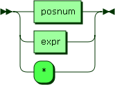

# Architecture

The User Services Platform consists of a collection of Endpoints (Agents and Controllers) that allow applications to manipulate Service Elements. These Service Elements are made up of a set of Objects and Parameters that model a given service, such as network interfaces, software modules, device firmware, remote elements proxied through another interface, virtual elements, or other managed services.

USP is made up of several architectural components:

* Mechanisms for discovery and trust establishment
* A method for encoding messages for transport
* A system for end-to-end confidentiality, integrity and identity
  authentication
* Transport of messages over one or more Message Transfer Protocols (MTPs) with
  associated MTP security
* A set of standardized messages based on the CRUD model (create, read, update,
  delete), plus an Object defined operations mechanism and a notification
  mechanism (CRUD-ON)
* Authorization and access control on a per element basis
* A method for modeling service elements using a set of Objects, Parameters,
  operations, and events (supported and instantiated data models)

## Endpoints

A USP Endpoint can act as Agent or a Controller. Controllers only send messages to Agents, and Agents send messages to Controllers. A USP Endpoint communicates over a secure session between other Endpoints, over one or more Message Transfer Protocols (MTP) that may or may not be secured.

{#fig:usp-agent-and-controller-architecture}

### Agents

A USP Agent exposes (to Controllers) one or more Service Elements that are represented in its data model. It contains or references both an Instantiated Data Model (representing the current state of Service Elements it represents) and a Supported Data Model.

### Controllers

A USP Controller manipulates (through Agents) a set of Service Elements that are represented in Agent data models. It may maintain a database of Agents, their capabilities, and their states, in any combination. A Controller usually acts as an interface to a user application or policy engine that uses the User Services Platform to address particular use cases.

## Endpoint Identifier

Endpoints are identified by an Endpoint Identifier.

The Endpoint Identifier is a locally or globally unique USP layer identifier of an Endpoint. Whether it is globally or locally unique depends on the scheme used for assignment.

The Endpoint Identifier (ID) is used in the USP Record and various Parameters in a USP Message to uniquely identify Controller and Agent Endpoints. It can be globally or locally unique, either among all Endpoints or among all Controllers or all Agents, depending on the scheme used for assignment.

The Endpoint ID is comprised of two mandatory and one optionally mandatory components: `authority-scheme`, `authority-id`, and `instance-id`.

These three components are combined as:

`authority-scheme ":" [authority-id] ":" instance-id`

The format of the authority-id is dictated by the authority-scheme. The format of the instance-id is dictated either by the authority-scheme or by the entity identified by the authority-id.

When used in a certificate, an Endpoint ID is expressed as a urn in the bbf namespace as:

`"urn:bbf:usp:id:" authority-scheme ":" [authority-id] ":" instance-id`

When used anywhere else (e.g. in the `to_id` and `from_id` of a USP Record), the namespace information is omitted, and the Endpoint ID is expressed as:

`authority-scheme ":" [authority-id] ":" instance-id`

### Use of authority-scheme and authority-id

The authority-scheme follows the following syntax:

`authority-scheme = "oui" | "cid" | "pen" | "self"  | "user" | "os" | "ops" | "uuid" | "imei" | "proto" | "doc"`

How these authority-scheme values impact the format and values of authority-id and instance-id is described below.

The authority defined by an OUI, CID, or Private Enterprise Number (including OUI used in "ops" and "os" authority scheme) is responsible for ensuring the uniqueness of the resulting Endpoint ID. Uniqueness can be global, local, unique across all Endpoints, or unique among all Controllers or all Agents. For the "user" authority scheme, the assigning user or machine is responsible for ensuring uniqueness. For the "self" authority scheme, the Endpoint is responsible for ensuring uniqueness.

**[R-ARC.0]{}** - A Controller and Agent within the same ecosystem MAY use the same Endpoint ID.

**[R-ARC.1]{}** - Endpoints MUST tolerate the same Endpoint ID being used by an Agent and a Controller in the same ecosystem.

**[R-ARC.2]{}** - Endpoints that share the same Endpoint ID MUST NOT communicate with each other via USP.

No conflict identification or resolution process is defined in USP to deal with a situation where an Endpoint ID is not unique among either all Agents or all Controllers in whatever ecosystem it operates. Therefore, a non-unique Endpoint ID will result in unpredictable behavior. An Endpoint ID that changes after having been used to identify an Endpoint can also result in unpredictable behavior.

Unless the authority responsible for assigning an Endpoint ID assigns meaning to an Agent and Controller having the same Endpoint ID, no meaning can be construed. That is, unless the assigning authority specifically states that an Agent and Controller with the same Endpoint ID are somehow related, no relationship can be assumed to exist.

**[R-ARC.2a]{}** - Endpoints MUST follow the authority-scheme requirements outlined in the following table:

| authority-scheme | usage and rules for authority-id and instance-id |
| ---------------: | :----------------------------------------------- |
|`oui`             | `authority-id` MUST be an OUI assigned and registered by the IEEE Registration Authority [@IEEEREG] to the entity responsible for this Endpoint. authority-id MUST use hex encoding of the 24-bit ID (resulting in 6 hex characters). `instance-id` syntax is defined by this entity, who is also responsible for determining instance-id assignment mechanisms and for ensuring uniqueness of the instance-id within the context of the OUI. Example:` oui:00256D:my-unique-bbf-id-42` |
| `cid`            | `authority-id` MUST be a CID assigned and registered by the IEEE Registration Authority [@IEEEREG] to the entity responsible for this Endpoint. `authority-id` MUST use hex encoding of the 24-bit ID (resulting in 6 hex characters).\
`instance-id` syntax is defined by this entity, who is also responsible for determining instance-id assignment mechanisms and for ensuring uniqueness of the instance-id within the context of the CID.\
Example: cid:3AA3F8:my-unique-usp-id-42 |
| `pen`            | `authority-id` MUST be a Private Enterprise Number assigned and registered by the [IANA](http://pen.iana.org/pen/PenApplication.page) to the entity responsible for this Endpoint. `authority-id` MUST use decimal encoding of the IANA-assigned number.\
`instance-id` syntax is defined by this entity, who is also responsible for determining instance-id assignment mechanisms and for ensuring uniqueness of the instance-id within the context of the Private Enterprise Number.\
Example: `pen:3561:my-unique-bbf-id-42` |
| `self`           | When present, an `authority-id` for "`self`" MUST be between 1 and 6 non-reserved characters in length. When present, it is generated by the Endpoint. It is not required to have an `authority-id` for "`self`".\
The Endpoint ID, including `instance-id`, is generated by the Endpoint.\
The Endpoint MUST change its Endpoint ID if it ever encounters another Endpoint using the identical Endpoint ID.\
Example: `self::my-Agent` |
| `user`           | An `authority-id` for "`user`" MUST be between 0 and 6 non-reserved characters in length.\
The Endpoint ID, including `instance-id`, is assigned to the Endpoint via a user or management interface. |
| `os`             | `authority-id` MUST be zero-length.\
`instance-id `is `<OUI> "-" <SerialNumber>`, as defined in TR-069 [@TR-069, Section 3.4.4].\
Example: `os::00256D-0123456789` |
| `ops`            | `authority-id` MUST be zero-length.\
`instance-id` is `<OUI> "-" <ProductClass> "-" <SerialNumber>`, as defined in TR-069 [@TR-069, Section 3.4.4].\
Example: `ops::00256D-STB-0123456789` |
| `uuid`           | `authority-id` MUST be zero-length.\
`instance-id` is a UUID [@RFC4122]\
Example:`uuid::f81d4fae-7dec-11d0-a765-00a0c91e6bf6` |
| `imei`           | `authority-id` MUST be zero-length.\
`instance-id` is an IMEI as defined by GSMA (https://imeidb.gsma.com/imei/index).\
Example: `imei::990000862471854` |
| `proto`          | `authority-id` MUST be between 0 and 6 non-reserved characters (except ".") in length.\
"`proto`" is used for prototyping purposes only. Any `authority-id` and `instance-id` value (or scheme for creating the value) is left to the prototyper.\
Example: `proto::my-Agent` |
| `doc`            | `authority-id` MUST be between 0 and 6 non-reserved characters in length.\
"`doc`" is used for documentation purposes only (for creating examples in slide decks, tutorials, and other explanatory documents). Any `authority-id` and `instance-id` value (or scheme for creating the value) is left to the document creator. |

**[R-ARC.3]{}** - BBF OUI (`00256D`) and Private Enterprise Number (`3561`) are reserved for use in BBF documentation and BBF prototyping and MUST NOT be used by any entity other than BBF.

**[R-ARC.4]{}** - The "`proto`" and "`doc`" authority-scheme values MUST NOT be used in production environments.

The "`proto`" and "`doc`" values are intended only for prototyping and documentation (tutorials, examples, etc.), respectively.

### Use of instance-id

**[R-ARC.5]{}** - `instance-id` MUST be encoded using only the following characters:
```
    instance-id = unreserved / pct-encoded
    unreserved = ALPHA / DIGIT / "-" / "." / "_"
    pct-encoded = "%" HEXDIG HEXDIG
```
The above expression uses the Augmented Backus-Naur Form (ABNF) notation of RFC 2234 [@RFC2234], including the following core ABNF syntax rules defined by that specification: ALPHA (letters), DIGIT (decimal digits), HEXDIG (hexadecimal). It is taken from RFC 3986 [@RFC3986] as the set of unreserved characters and percent-encoded characters that are acceptable for all components of a URI. This set is also allowed for use in URNs RFC 2141 [@RFC2141], and all MTP headers.

**[R-ARC.6]{}** - An `instance-id` value MUST be no more than 50 characters in length.

Shorter values are preferred, as end users could be exposed to Endpoint IDs. Long values tend to create a poor user experience when users are exposed to them.

## Service Elements

"Service Element" is a general term referring to the set of Objects, Sub-Objects, commands, events, and Parameters that comprise a set of functionality that is manipulated by a Controller on an Agent. An Agent's Service Elements are represented in a Data Model - the data model representing an Agent's current state is referred to as its Instantiated Data Model, and the data model representing the Service Elements it supports is called its Supported Data Model. The Supported Data Model is described in a Device Type Definition (DT). An Agent's Data Model is referenced using Path Names.

## Data Models

USP is designed to allow a Controller to manipulate Service Elements on an Agent using a standardized description of those Service Elements. This standardized description is known as an information model, and an information model that is further specified for use in a particular protocol is known as a "Data Model".

*Note: This should be understood by those familiar with CWMP. For those unfamiliar with that protocol, a Data Model is similar to a Management Information Base (MIB) used in the Simple Network Management Protocol (SNMP) or YANG definitions used in NETCONF.*

This version of the specification defines support for the following Data Model(s):

* The Device:2 Data Model [@TR-181]

This Data Model is specified in XML. The schema and normative requirements for defining Objects, Parameters, Events, and Commands for the Device:2 Data Model [@TR-181], and for creating Device Type Definitions based on that Data Model, are defined in Broadband Forum TR-106 [@TR-106].

The use of USP with any of the above data models creates some dependencies on specific Objects and Parameters that must be included for base functionality.

### Instantiated Data Model

An Agent's Instantiated Data Model represents the Service Elements (and their state) that are currently represented by the Agent. The Instantiated Data Model includes a set of Objects, and the Sub-Objects ("children"), Parameters, Events, and Commands associated with those Objects.

### Supported Data Model

An Agent's Support Data Model represents the Service Elements that an Agent understands. It includes references to the Data Model(s) that define the Objects, Parameters, Events, and Commands implemented by the Service Elements the Agent represents. A Supported Data Model consists of the union of all Device Type Definitions used by the Agent.

### Objects

Objects are data structures that are defined by their Sub-Objects, Parameters, Events, Commands, and creation criteria. They are used to model resources represented by the Agent. Objects may be static (single-instance) or dynamic (a multi-instance Object, or "table").

#### Single-Instance Objects

Static Objects, or "single instance" Objects, are not tables and do not have more than one instance of them in the Agent. They are usually used to group Service Element functionality together to allow for easy definition and addressing.

#### Multi-Instance Objects

Dynamic Objects, or "multi-instance" Objects, are those Objects that can be the subject of "create" and "delete" operations (using the Add and Delete Messages, respectively), with each instance of the Object represented in the Instantiated Data Model with an Instance Identifier (see below). A Multi-Instance Object is also referred to as a "Table", with each instance of the Object referred to as a "Row". Multi-Instance Objects can be also the subject of a search.

### Parameters

Parameters define the attributes or variables of an Object. They are retrieved by a Controller using the read operations of USP and configured using the update operations of USP (the Get and Set Messages, respectively). Parameters have data types and are used to store values.

### Commands

Commands define Object specific methods within the Data Model. A Controller can invoke these methods using the "Operate" Message in USP (i.e., the Operate Message). Commands have associated input and output arguments that are defined in the Data Model and used when the method is invoked and returned.

### Events

Events define Object specific notifications within the Data Model. A Controller can subscribe to these events by creating instances of the Subscription table, which are then sent in a Notify request by the Agent (see [](#sec:notifications-and-subscriptions)). Events may also have information associated with them that are delivered in the Notify Request - this information is defined with the Event in the Data Model.

## Path Names

A Path Name is a fully qualified reference to an Object, Object Instance, or Parameter in an Agent's instantiated or Supported Data Model. The syntax for Path Names is defined in TR-106 [@TR-106].

**[R-ARC.7]{}** - All USP Endpoints MUST support the Path Name syntax as defined in TR-106 [@TR-106].

Path Names are represented by a hierarchy of Objects ("parents") and Sub-Objects ("children"), separated by the dot "." character, ending with a Parameter if referencing a Parameter Path. There are six different types of Path Names used to address the data model of an Agent:

1.	Object Path - This is a Path Name of either a single-instance ("static") Object, or the Path Name to a Data Model Table (i.e., a Multi-Instance Object). An Object Path ends in a "." Character (as specified in TR-106 [@TR-106]), except when used in a reference Parameter (see [](#sec:reference-following)). When addressing a Table in the Agent's Supported Data Model that contains one or more Multi-Instance Objects in the Path Name, the sequence "{i}" is used as a placeholder (see [](#sec:the-getsupporteddm-message)).

2.	Object Instance Path - This is a Path Name to a Row in a Table in the Agent's Instantiated Data Model (i.e., an Instance of a Multi-Instance Object). It uses an Instance Identifier to address a particular Instance of the Object.  An Object Instance Path ends in a "." Character (as specified in TR-106 [@TR-106]), except when used in a reference Parameter (see [](#sec:reference-following)).

3.	Parameter Path - This is a Path Name of a particular Parameter of an Object.

4.	Command Path - This is a Path Name of an Object defined [Operation](#sec:operations-and-command-path-names).

5.	Event Path - This is a Path Name of an Object defined [Event](#sec:event-path-names).

6.	Search Path - This is a Path Name that contains search criteria for addressing a set of Multi-Instance Objects and/or their Parameters. A Search Path may contain a Search Expression or Wildcard.

This creates two functions of Path Names: Addressing and Searching. The first five Path Names are used for addressing a particular Object, Parameter, Command, or Event. A Search Path uses Searching to return a set of Object Instances and/or their Parameters. When addressing, the expectation is that the Path Name will resolve to either 0 or 1 instance (and depending on the context, 0 instances could be an error).  When searching, the expectation is that the Search Path will resolve to 0, 1, or many instances (and depending on the context, 0 instances is often not an error).

*Note: When resolving a Path Name, the Agent is expected to use locally cached information and/or information that can be obtained rapidly and cheaply. Specifically, there is no expectation that the Agent would issue a network request in order to resolve a Path Name.*

*Note: Obviously only one form of addressing or searching can be used for a given Instance Identifier in a Path Name, but different forms of addressing can be used if more than one Instance Identifier needs to be specified in a Path Name.*

For example, the following Path Name uses Unique Key Addressing for the Interface table but a Search Expression for the IPv4Address table to select Enabled IPv4 Addresses associated with the "eth0" IP Interface:

`Device.IP.Interface.[Name=="eth0"].IPv4Address.[Status=="Enabled"].IPAddress`

### Relative Paths

Several USP Messages make use of Relative Paths to address Objects or Parameters. A Relative Path is used to address the child Objects and Parameters of a given Object Path or Object Instance Path. To build a Path Name using a Relative Path, a USP Endpoint uses a specified Object Path or Object Instance Path, and concatenates the Relative Path. This allows some efficiency in Requests and Responses when passing large numbers of repetitive Path Names. This Relative Path may include [instance identifiers](#sec:using-instance-identifiers-in-path-names) to Multi-Instance Objects.

For example, for an Object Path of:

    Device.WiFi.Radio.1.

Relative Paths would include Parameters:

    Status
    SupportedStandards
    OperatingStandards

Etc., as well as the following Sub-Object and its Parameters:

    Stats.BytesSent
    Stats.BytesReceived

Etc.

### Using Instance Identifiers in Path Names

#### Addressing by Instance Number

Instance Number Addressing allows an Object Instance to be addressed by using its Instance Number in the Path Name. An Instance Number is expressed in the Path Name as a positive integer (>=1) with no additional surrounding characters. The Instance Number assigned by the Agent is arbitrary.

**[R-ARC.8]{}** - The assigned Instance Number MUST persist unchanged until the Object Instance is subsequently deleted (either by the USP Delete Message or through some external mechanism). This implies that the Instance Number MUST persist across a reboot of the Agent, and that the Agent MUST NOT allow the Instance Number of an existing Object Instance to be modified by an external source.

For example, the `Device.IP.Interface` table entry with an Instance Number of 3 would be addressed with the following Path Name: `Device.IP.Interface.3`.

#### Addressing by Unique Key

Key-based addressing allows an Object Instance to be addressed by using a Unique Key (as defined in the Device:2 Data Model [@TR-181]) in the Path Name.

Unique Keys used for addressing are expressed in the Path Name by using square brackets surrounding a string that contains the name and value of the Unique Key Parameter using the equality operator (==).

For example, the `Device.IP.Interface` table has two separate unique keys: `Name` and `Alias`. It could be addressed with the following Path Names:

`Device.IP.Interface.[Name=="eth0"]`\
`Device.IP.Interface.[Alias=="WAN"]`

If an Object has a multi-parameter unique key, then the Instance Identifier specifies all of the key's Parameters using the AND (&&) logical operator (the Parameter order is not significant).

For example, the `Device.NAT.PortMapping` table has a multi-parameter unique key consisting of RemoteHost, ExternalPort, and Protocol. It could be addressed with the following Path Name:

`Device.NAT.PortMapping.[RemoteHost==""&&ExternalPort==0&&Protocol=="TCP"].`

*Note: Addressing by Unique Key uses the same syntax as [Searching with Expressions](#sec:searching-with-expressions). If a multi-parameter unique key expression omits any of the key's Parameters then it's a search (which might match multiple instances) rather than an address (which can't match multiple instances).*

### Searching

Searching is a means of matching 0, 1 or many instances of a Multi-Instance Object by using the properties of Object. Searching can be done with Expressions or Wildcards.

### Searching with Expressions

Search Paths that use expressions are enclosed in square brackets as the Instance Identifier within a Path Name.

**[R-ARC.9]{}** - An Agent MUST return Path Names that include all Object Instances that match the criteria of a given Search Path.

The basic format of a Search Path is:

`Device.IP.Interface.[<expression>].Status`

An Expression consists of one or more Expression Components that are concatenated by the AND (&&) logical operator *(Note: the OR logical operator is not supported)*.

The basic format of a Search Path with the Expression element expanded is:

`Device.IP.Interface.[<expression component>&&<expression component>].Status`

An Expression Component is a combination of an Expression Parameter followed by an Expression Operator followed by an Expression Constant.

The basic format of a Search Path with the Expression Component element expanded is:

`Device.IP.Interface.[<expression parameter><expression operator><expression constant>].Status`

Further, this Relative Path can't include any child tables. *(Note: this is never necessary because any child tables that need to be referenced in the Search Path can and should have their own Expression)*

An Expression Operator dictates how the Expression Component will be evaluated. The supported operators are equals (==), not equals (!=), contains (~=), less than (<), greater than (>), less than or equal (<=) and greater than or equal (>=).

An Expression Parameter will always be of the type defined in the data model. Expression operators will only evaluate for appropriate data types. The literal value representations for all data types are found in TR-106 [@TR-106]. **For string, boolean and enumeration types, only the '==' and '!=' operators are valid.**

The '~=' operator is only valid for comma-separated lists. It is used to check whether a list contains a certain element using an exact match of the element. The Expression Constant used in the Search Expression must be of the same type as the values in the list. For example, for a list of integers, the Expression Constant must also be an integer.

*Note: Literal values are conceptually converted to their internal representations before comparison. For example, `dateTime` values are converted to their numeric equivalents, `int` values `123`, `+123` and `0123` all represent the same value, and so do `boolean` values `1` and `true`.*

The Expression Constant is the value that the Expression Parameter is being evaluated against; Expression Parameters must match the type as defined for the associated Parameter in the Device:2 Data Model [@TR-181].

*Note: String values are enclosed in double quotes. In order to allow a string value to contain double quotes, quote characters can be percent-escaped as %22 (double quote). Therefore, a literal percent character has to be quoted as %25.*

The use of whitespace on either side of an Expression Operator is allowed, but its support is not required. Controllers cannot assume that an Agent tolerates whitespace. An example of an Expression with whitespace would be `[Type == "Normal"]` (which would be `[Type=="Normal"]` without whitespace).

**[R-ARC.9a]{}** - Agents SHOULD tolerate whitespace on either side of an Expression Operator.

**[R-ARC.9b]{}** - Controllers SHOULD NOT include whitespace on either side of an Expression Operator.

##### Search Expression Examples

*Valid Searches:*

- Status for all IP Interfaces with a "Normal" type:

  `Device.IP.Interface.[Type=="Normal"].Status`

- IPv4 Addresses for all IP Interfaces with a Normal type and a Static addressing type:

  `Device.IP.Interface.[Type=="Normal"].IPv4Address.[AddressingType=="Static"].IPAddress`

- IPv4 Addresses for all IP Interfaces with a Normal type and Static addressing type that have at least 1 Error Sent:

  `Device.IP.Interface.[Type=="Normal"&&Stats.ErrorsSent>0].IPv4Address.[AddressingType=="Static"].IPAddress`

- Current profiles used by all DSL lines which are enabled:

  `Device.DSL.Line.[Enable==true].CurrentProfile`

  or

  `Device.DSL.Line.[Enable==1].CurrentProfile`

- All IPv6 Addresses of all interfaces with a lifetime expiring before 2021-06-06 08:00 UTC:

  `Device.IP.Interface.*.IPv6Address.[ValidLifetime<2021-06-06T08:00:00Z].IPAddress`

- All Parameters of all connected USB devices of class 0x08 (Mass Storage Device):

  `Device.USB.USBHosts.Host.*.Device.[DeviceClass==08].`

- All Parameters of all PCP servers with IPv6Firewall capabilities:

  `Device.PCP.Client.*.Server.[Capabilities~="IPv6Firewall"].`

- All Parameters of all PeriodicStatistics SampleSets that collected data for 5 seconds:

  `Device.PeriodicStatistics.SampleSet.[SampleSeconds~=5].`

*Searches that are NOT VALID:*

- Invalid because the Expression is empty:

  `Device.IP.Interface.[].`

- Invalid because the Expression Component has an Expression Parameter that descends into a child table (always need to use a separate Expression Variable for each child table instance):

  `Device.IP.Interface.[Type=="Normal"&&IPv4Address.*.AddressingType=="Static"].Status`

- Invalid because the search expression uses curly brackets:

  `Device.IP.Interface.{Type=="Normal"}.Status`

- Invalid because the `Enable` Parameter is of type `boolean` and not a `string` or derived from `string`:

  `Device.DSL.Line.[Enable=="true"].CurrentProfile`

### Searching by Wildcard

Wildcard-based searching is a means of matching all currently existing Instances (whether that be 0, 1 or many instances) of a Multi-Instance Object by using a wildcard character "\*" in place of the Instance Identifier.

**[R-ARC.10]{}** - An Agent MUST return Path Names that include all Object Instances that are matched by the use of a Wildcard.

Examples:

All Parameters for all IP Interfaces that currently exist

`Device.IP.Interface.*.`

Type of each IP Interface that currently exists

`Device.IP.Interface.*.Type`

## Other Path Decorators

### Reference Following {#sec:reference-following}

The Device:2 Data Model [@TR-181] contains Parameters that reference other Parameters or Objects. The Reference Following mechanism allows references to Objects (not Parameters) to be followed from inside a single Path Name. Reference Following is indicated by a "+" character after the Parameter Path, referencing the Object followed by a ".", optionally followed by a Relative Object or Parameter Path that are children of the Referenced Object.

For example, `Device.NAT.PortMapping.{i}.Interface` references an IP Interface Object (`Device.IP.Interface.{i}.`) and that Object has a Parameter called "`Name`". With Reference Following, a Path Name of `Device.NAT.PortMapping.1.Interface+.Name` references the "`Name`" Parameter of the `Interface` Object that the `PortMapping` is associated with (i.e. it is the equivalent of using `Device.IP.Interface.1.Name` as the Path Name).

The steps that are executed by the Agent when following the reference in this example would be:

1.	Retrieve the appropriate instance of the `PortMapping` Object based on the Instance Number Addressing information

2.	Retrieve the value of the reference Parameter that contains the reference, Interface, which in this case has the value "`Device.IP.Interface.1`"

3.	Replace the preceding Path Name (`Device.NAT.PortMapping.1.Interface+`) with the value retrieved in Step 2

4.	Append the remainder of the Path Name (`.Name`), which builds the Path Name: `Device.IP.Interface.1.Name`

5.	Use `Device.IP.Interface.1.Name` as the Path Name for the action

*Note: It should be noted that according to the Device:2 Schema [@TR-106], reference Parameters:*

* *Always contain Path Names (not Search Expressions)*
* *When configured, can be configured using Path Names using Instance Number Addressing or Unique-Key Addressing, however:*
* *When the value of a reference Parameter is read, all Instance Identifiers are returned as Instance Numbers.*

**[R-ARC.11]{}** - A USP Agent MUST support the ability to use Key-based addressing in reference values.

For example, the following Path Names might illustrate a reference to the same Object (defined as having the Parameter named `KeyParam` as unique key) instance using an Instance Number and then a key value:

  * Object.SomeReferenceParameter = "Object.FooObject.5"
  * Object.SomeReferenceParameter = 'Object.FooObject.[KeyParam=="KeyValueForInstance5"]'

In the first example, the reference points to the FooObject with Instance Number 5. In the second example, the reference points to the FooObject with a `KeyParam` value of "KeyValueForInstance5".

**[R-ARC.12]{}** - The following requirements relate to reference types and the associated Agent behavior:

  * An Agent MUST reject an attempt to set a strong reference Parameter if the new value does not reference an existing Parameter or Object.
  * An Agent MUST NOT reject an attempt to set a weak reference Parameter because the new value does not reference an existing Parameter or Object.
  * An Agent MUST change the value of a non-list-valued strong reference Parameter to a null reference when a referenced Parameter or Object is deleted.
  * An Agent MUST remove the corresponding list item from a list-valued strong reference Parameter when a referenced Parameter or Object is deleted.
  * An Agent MUST NOT change the value of a weak reference Parameter when a referenced Parameter or Object is deleted.

#### List of References

The USP data models have Parameters whose values contain a list of references to other Parameters or Objects.  This section explains how the Reference Following mechanism allows those references to be followed from inside a single Path Name.  The Reference Following syntax as defined above still applies, but the "`+`" character is preceded by a means of referencing a list item or items.

* The additional syntax consists of a "`#`" character followed by a list item number (1-indexed), which is placed between the Parameter name and the "`+`" character.

  * The "`#`" and list item number are optional. If they are omitted, the first list item is used, i.e., "`ReferenceParameter+`" means the same as "`ReferenceParameter#1+`".

* To follow *all* references in the list, use a wildcard ("`*`") character instead of a list item number, i.e., "`ReferenceParameter#*+`".

For example, `Device.WiFi.SSID.{i}.LowerLayers` references a list of Wi-Fi Radio Object (defined as `Device.WiFi.Radio.{i}.`) Instances that are associated with the SSID. This Object has a `Name` Parameter; so when following the first reference in the list of references a Path Name of `Device.WiFi.SSID.1.LowerLayers#1+.Name` references the Name of the Wi-Fi Radio associated with this SSID Object Instance.

The steps that are executed by the Agent when following the reference in this example would be:

1.	Retrieve the appropriate `Device.WiFi.SSID.{i}` instance based on the Instance Number Addressing information

2.	Retrieve the value of the LowerLayers Parameter, which in this case has a value of "`Device.WiFi.Radio.1, Device.WiFi.Radio.2`"

3.	Retrieve the first list item within the value retrieved in Step 2 (i.e., "`Device.WiFi.Radio.1`")

4.	Replace the preceding Path Name (`Device.WiFi.SSID.1.LowerLayers#1+`) with the value retrieved in Step 3

5.	Append the remainder of the Path Name (`.Name`), resulting in a Path Name of: `Device.WiFi.Radio.1.Name`

6.	Use `Device.WiFi.Radio.1.Name` as the Path Name for the action

#### Search Expressions and Reference Following

The Reference Following and Search Expression mechanisms can be combined.

For example, reference the Signal Strength of all Wi-Fi Associated Devices using the "ac" Operating Standard on the "MyHome" SSID, you would use the Path Name:

`Device.WiFi.AccessPoint.[SSIDReference+.SSID=="MyHome"].AssociatedDevice.[OperatingStandard=="ac"].SignalStrength`

### Operations and Command Path Names

The [Operate Message](#sec:operate) allows a USP Controller to execute Commands defined in the USP data models.  Commands are synchronous or asynchronous operations that don't fall into the typical REST-based concepts of CRUD-N that have been incorporated into the protocol as specific Messages. Commands are addressed like Parameter Paths that end with parentheses "()" to symbolize that it is a Command.

For example: `Device.IP.Interface.[Name=="eth0"].Reset()`

### Event Path Names

The Notify request allows a type of generic event (called Event) message that allows a USP Agent to emit events defined in the USP data models. Events are defined in and related to Objects in the USP data models like commands. Events are addressed like Parameter Paths that end with an exclamation point "!" to symbolize that it is an Event.

For example: `Device.Boot!`

## Data Model Path Grammar

Expressed as a [Backus-Naur Form (BNF)](https://en.wikipedia.org/wiki/Backus-Naur_form) for context-free grammars, the Path Name lexical rules for referencing the Instantiated Data Model are:

```
idmpath   ::= objpath | parampath | cmdpath | evntpath
objpath   ::= name '.' (name (('.' inst)|(reffollow '.' name) )? '.')*
parampath ::= objpath name
cmdpath   ::= objpath  name '()'
evntpath  ::= objpath  name '!'
inst      ::= posnum | expr | '*'
expr      ::= '[' (exprcomp ( '&&' exprcomp )*) ']'
exprcomp  ::= relpath oper value
relpath   ::= name (reffollow? '.' name )*
reffollow ::=  ( '#' (posnum | '*') '+' )|  '+'
oper      ::= '==' | '!=' | '~=' | '<' | '>' | '<=' | '>='
value     ::= literal | number
name      ::= [A-Za-z_] [A-Za-z_0-9]*
literal   ::= '"' [^"]* '"'
posnum    ::= [1-9] [0-9]*
number    ::= '0' | ( '-'? posnum )
```

The Path Name lexical rules for referencing the Supported Data Model are:

```
sdmpath   ::= name '.' ( name '.' ( ( posnum | '{i}' ) '.' )? )* name?
name      ::= [A-Za-z_] [A-Za-z_0-9]*
posnum    ::= [1-9] [0-9]*
```

### BNF Diagrams for Instantiated Data Model

**[idmpath]{#bnf:}**:


::: {.ebnf}
idmpath  ::= objpath
           | parampath
           | cmdpath
           | evntpath
:::

\
**[objpath]{#bnf:}**:


::: {.ebnf}
objpath ::= name '.' ( name ( '.' inst | reffollow '.' name)? '.' )*
:::

referenced by:

*   [cmdpath](bnf:)
*   [evntpath](bnf:)
*   [idmpath](bnf:)
*   [parampath](bnf:)

\
**[parampath]{#bnf:}**:


::: {.ebnf}
parampath ::= objpath name
:::

referenced by:

*   [idmpath](bnf:)

\
**[cmdpath]{#bnf:}**:


::: {.ebnf}
cmdpath ::= objpath name '()'
:::

referenced by:

*   [idmpath](bnf:)

\
**[evntpath]{#bnf:}**:


::: {.ebnf}
evntpath ::= objpath name '!'
:::

referenced by:

*   [idmpath](bnf:)

\
**[inst]{#bnf:}**:



::: {.ebnf}
inst ::= posnum
       | expr
       | '*'
:::

referenced by:

*   [objpath](bnf:)

\
**[expr]{#bnf:}**:


::: {.ebnf}
expr ::= '[' exprcomp ( '&&' exprcomp )* ']'
:::

referenced by:

*   [inst](bnf:)

\
**[exprcomp]{#bnf:}**:


::: {.ebnf}
exprcomp ::= relpath oper value
:::

referenced by:

*   [expr](bnf:)

\
**[relpath]{#bnf:}**:


::: {.ebnf}
relpath ::= name ( reffollow? '.' name )*
:::

referenced by:

*   [exprcomp](bnf:)

\
**[reffollow]{#bnf:}**:


::: {.ebnf}
reffollow ::= ( '#' ( posnum | '*' ) )? '+'
:::

referenced by:

*   [objpath](bnf:)
*   [relpath](bnf:)

\
**[oper]{#bnf:}**:


::: {.ebnf}
oper ::= '=='
       | '!='
       | '~='
       | '<'
       | '>'
       | '<='
       | '>='
:::

referenced by:

*   [exprcomp](bnf:)

\
**[value]{#bnf:}**:


::: {.ebnf}
value ::= literal
        | number
:::

referenced by:

*   [exprcomp](bnf:)

\
**[name]{#bnf:}**:


::: {.ebnf}
name ::= [A-Za-z_] [A-Za-z_0-9]*
:::

referenced by:

*   [cmdpath](bnf:)
*   [evntpath](bnf:)
*   [objpath](bnf:)
*   [parampath](bnf:)
*   [relpath](bnf:)

\
**[literal]{#bnf:}**:


::: {.ebnf}
literal ::= '"' [^"]* '"'
:::

referenced by:

*   [value](bnf:)

\
**[number]{#bnf:}**:


::: {.ebnf}
number ::= '0'
         | '-'? posnum
:::

referenced by:

*   [value](bnf:)

\
**[posnum]{#bnf:}**:


::: {.ebnf}
posnum ::= [1-9] [0-9]*
:::

referenced by:

*   [inst](bnf:)
*   [number](bnf:)
*   [reffollow](bnf:)

### BNF Diagrams for Supported Data Model

**[sdmpath]{#bnf:}**:


::: {.ebnf}
sdmpath ::= name '.' ( name '.' ( ( posnum | '{i}' ) '.' )? )* name?
:::

\
**[name]{#bnf:}**:


::: {.ebnf}
name  ::= [A-Za-z_] [A-Za-z_0-9]*
:::

referenced by:

*   [sdmpath](bnf:)

\
**[posnum]{#bnf:}**:


::: {.ebnf}
posnum ::= [1-9] [0-9]*
:::

referenced by:

*   [sdmpath](bnf:)
