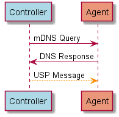

<!-- Reference Links -->
[1]:	https://www.broadband-forum.org/technical/download/TR-181_Issue-2_Amendment-12.pdf "TR-181 Issue 2 Device Data Model for TR-069"
[2]: https://www.broadband-forum.org/technical/download/TR-069.pdf	"TR-069 Amendment 6	CPE WAN Management Protocol"
[3]:	https://www.broadband-forum.org/technical/download/TR-106_Amendment-8.pdf "TR-106 Amendment 8	Data Model Template for TR-069 Enabled Devices"
[4]:	https://tools.ietf.org/html/rfc7228 "RFC 7228	Terminology for Constrained-Node Networks"
[5]:	https://tools.ietf.org/html/rfc2136	"RFC 2136 Dynamic Updates in the Domain Name System"
[6]:	https://tools.ietf.org/html/rfc3007	"RFC 3007 Secure Domain Name System Dynamic Update"
[7]:	https://tools.ietf.org/html/rfc6763	"RFC 6763 DNS-Based Service Discovery"
[8]:	https://tools.ietf.org/html/rfc6762	"RFC 6762 Multicast DNS"
[9]:	https://tools.ietf.org/html/rfc7252	"RFC 7252 The Constrained Application Protocol (CoAP)"
[10]:	https://tools.ietf.org/html/rfc7390	"RFC 7390 Group Communication for the Constrained Application Protocol (CoAP)"
[11]:	https://tools.ietf.org/html/rfc4033	"RFC 4033 DNS Security Introduction and Requirements"
[12]:	https://developers.google.com/protocol-buffers/docs/proto3 "Protocol Buffers v3	Protocol Buffers Mechanism for Serializing Structured Data Version 3"
[Conventions]: https://www.ietf.org/rfc/rfc2119.txt "Key words for use in RFCs to Indicate Requirement Levels"

# Discovery and Advertisement

Discovery is the process by which USP Endpoints learn the USP properties and MTP connection details of another Endpoint, either for sending USP Messages in the context of an existing relationship (where the Controller’s USP Endpoint Identifier, credentials, and authorized Role are all known to the Agent) or for the establishment of a new relationship. Advertisement is the process by which USP Endpoints make their presence known (or USP Endpoint presence is made known) to other USP Endpoints. Agents may also be pre-configured with some or all information about certain Controllers.

##	Configuration
<a id="configuration" />

###	Agent Configuration

**R-DIS.0** – An Agent that has a USP relationship with a Controller MUST be configured with that Controller’s Endpoint Identifier, credentials, and authorized Role.

The authorized role may be a default “Public” Role.

**R-DIS.1** – An Agent that has a USP relationship with a Controller MUST be configured with information that allows it to determine the MTP, IP address, port, and resource path (if required by the MTP) of the Controller. This may be a URL with all of these components, a FQDN that resolves to provide all of these components via DNS-SD records, or mDNS discovery in the LAN.

Example mechanisms for configuration include but are not limited to:

* Pre-configured in firmware
* Configured by an already-known-and-trusted Controller
*	Configured through a separate bootstrap mechanism such as a user interface or other management interface.
*	DHCP, DNS, or [mDNS discovery](#mdns).

**R-DIS.2** – An Agent that supports configuration by an already-known-and-trusted Controller MUST implement the Controller Object.

The Agent can be pre-configured with trusted root certificates or trusted certificates to allow authentication of Controllers. Other trust models are also possible, where an Agent without a current Controller association will trust the first discovered Controller, or where the Agent has a UI that allows a User to indicate whether a discovered Controller is authorized to configure that Agent.

###	Controller Configuration

**R-DIS.3** – A Controller that has a relationship with an Agent MUST have the Agent’s Endpoint Identifier, connectivity information for the Agent’s MTP(s), and credentials.

Controllers acquires this information upon initial connection by an Agent, though a LAN based Controller may acquire an Agent’s MTP information through mDNS Discovery. It is each Controller’s responsibility to maintain a record of known Agents.

##	DHCP Options for Acquiring Controller Information
<a id="dhcp" />

DHCP can be employed as a method for Agents to discover Controllers. The DHCPv4 Vendor-Identifying Vendor-Specific Information Option [RFC 3925](https://tools.ietf.org/html/rfc3925) (option code 125) and DHCPv6 Vendor-specific Information Option [RFC 3315](https://tools.ietf.org/html/rfc3315) (option code 17) can be used to provide information to Agents about a single Controller. The options that may be returned by DNS are shown below. Description of these options can be found in [Device:2][1].

**R-DIS.4** - If an Agent is configured to request Controller DHCP information, the Agent MUST include in its DHCPv4 requests a DHCPv4 V-I Vendor Class Option (option 124) and in its DHCPv6 requests a DHCPv6 Vendor Class (option 16). This option MUST include the Broadband Forum Enterprise Number (`3561` decimal, `0x0DE9` hex) as an enterprise-number, and the string “`usp`” (all lower case) in a vendor-class-data instance associated with this enterprise-number.

**R-DIS.5** - If an Agent is configured to request Controller DHCP information, the Agent MUST store all received Controller information in its list of Controllers and associate a Role with that Controller.

The Role to associate with DHCP-discovered Controller is programmatically determined.

**R-DIS.6** - If the Agent has an existing relationship with a Controller with an Admin Role, it is RECOMMENDED the Agent not assign a Role with privileges greater than Public to a Controller discovered by DHCP.

**R-DIS.7** - If the URL provided by DHCP includes the FQDN of a Controller, the Agent MUST use [DNS](#dns) to retrieve additional Controller information.

ISPs are advised to limit the use of DHCP for configuration of a Controller to situations in which the security of the link between the DHCP server and the Agent can be assured by the service provider.  Since DHCP does not itself incorporate a security mechanism, it is a good idea to use pre-configured certificates or other means of establishing trust to provide security.

### DHCP Options for Controller Discovery
|Encapsulated Option |DHCPv4 Option 125 | DHCPv6 Option 17	| Parameter in [Device:2][1] |
| ----------: | :---------: | :----------: | :-------- |
| URL of the Controller | `25` | `25` | `Device.LocalAgent.Controller.{i}.MTP.{i}.*.URL` |
| Provisioning code | `26` | `26` |	`Device.LocalAgent.Controller.{i}.ProvisioningCode` |
| USP retry mini¬mum wait interval | `27` | `27` |	`Device.Controller.{i}.USPRetryMinimumWaitInterval` |
| USP retry interval multiplier | `28` | `28` |	`Device.Controller.{i}.USPRetryIntervalMultiplier` |

##	mDNS
<a id="mdns" />

**R-DIS.8** - If mDNS discovery is supported by a USP Endpoint, the USP Endpoint MUST implement mDNS client and server functionality as defined in [RFC 6762][8].

**R-DIS.9** – If mDNS advertisement for a MTP is enabled on an Endpoint, the Endpoint MUST listen for messages using that MTP from other Endpoints requesting establishment of USP communication over that MTP.

**R-DIS.10** - If mDNS is enabled, an USP Endpoint MUST use mDNS to resolve a FQDN with domain “`.local.`”.

###	DNS
<a id="dns" />

Requirements for implementation of a DNS client and configuration of the DNS client with DNS server address(es) (through static configuration, DHCPv4, DHCPv6, or Router Solicitation) are not provided. These are sufficiently well-known that they were not considered necessary for this specification. If the Agent knows of no DNS Server, it cannot do DNS resolution.

**R-DIS.11** - If DNS is enabled, an Endpoint MUST use DNS to resolve an FQDN with domain other than “`.local.`”.

**R-DIS.12** - If the Agent is resolving an FQDN for a Controller, and the MTP or resource path are unknown, the Agent MUST request DNS-SD information (PTR, SRV and TXT resource records) in addition to A, AAAA or other resource records it is programmatically set to request.

###	DNS-SD Records
<a id="dns-sd" />

DNS Service Discovery (DNS-SD) [RFC 6763][7] is a mechanism for naming and structuring of DNS resource records to facilitate service discovery. It can be used to create DNS records for USP Endpoints, so they can be discoverable via DNS PTR queries [RFC 1035](https://www.ietf.org/rfc/rfc1035.txt) or Multicast DNS (mDNS) [RFC 6762][8]. DNS-SD uses DNS SRV and TXT records to express information about “services”, and DNS PTR records to help locate the SRV and TXT records. To discover these DNS records, DNS or mDNS queries can be used. [RFC 6762] recommends using the query type PTR to get both the SRV and TXT records. A and AAAA records will also be returned, for address resolution.

The format of a DNS-SD Service Instance Name (which is the resource record (RR) Name of the DNS SRV and TXT records) is “`<Instance>.<Service>.<Domain>`“. `<Instance>` will be the USP Identifier of the USP Endpoint.

**R-DIS.13** –  USP Endpoint DNS-SD records MUST include the USP Identifier of the USP Endpoint as the DNS-SD Service Instance Name.
Service Name values [registered by BBF with IANA](http://www.broadband-forum.org/assignments]) used by USP are shown below. As described in [RFC 6763][7], the `<Service>` part of a Service Instance Name is constructed from these values as “`_<Service Name>._<Transport Protocol>`” (e.g., “`_usp-agt-coap._udp`”).

#### IANA-Registered USP Service Names
| Service Name | Transport Protocol | MTP | Type of USP Endpoint |
| ---------: | :-----: | :----: | :----------- |
| `usp-agt-coap` | udp | CoAP | Agent |
| `usp-ctr-coap` | udp | CoAP	| Controller |
| `usp-agt-http` | tcp | HTTP | Agent |
| `usp-ctr-http` | tcp | HTTP | Controller |
| `usp-agt-stomp` | tcp | STOMP | Agent |
| `usp-ctr-stomp` | tcp | STOMP | Controller |


DNS PTR records with a service subtype identifier (e.g., `._<subtype>._usp-agt-coap._udp.<Domain>`) in the RR can be used to provide searchable simple (single layer) functional groupings of USP Agents. The registry of subtypes for Service Names registered by BBF is listed at http://www.broadband-forum.org/assignments. DNS SRV and TXT records can be pointed to by multiple PTR records, which allow a USP Endpoint to potentially be discoverable as belonging to various functional groupings.

DNS TXT records allow for a small set of additional information to be included in the reply sent to the querier. This information cannot be used as search criteria. The registry of TXT record attributes for BBF Service Names are listed at http://www.broadband-forum.org/assignments.

**R-DIS.14** –  Agent DNS-SD records MUST include a TXT record with the “path” and “name” attributes.

**R-DIS.15** – The “name” attribute included in the Agent DNS-SD records MUST be identical to the .FriendlyName parameter defined in [Device:2][1].

**R-DIS.16** – Controller DNS-SD records MUST include a TXT record with the “path” attribute.

The “path” attribute is dependent on each Message Transfer Protocol, and the specific requirements are outlined in the appropriate Annex of this document.

The TXT record can include other attributes defined in the TXT record attribute registry, as well.

Whether a particular USP Endpoint respond to DNS or mDNS queries or populates (through configuration or mDNS advertisement) their information in a local DNS-SD server can be a configured option that can be enabled/disabled, depending on the intended deployment usage scenario.

###	Example Controller Unicast DNS-SD Resource Records
```
    ; One PTR record for each supported MTP
    _usp-ctr-http._tcp.host.example.com      PTR <Controller USP ID>._usp-ctr-http._tcp.example.com.

    ; One SRV+TXT (DNS-SD Service Instance) record for each supported MTP
    <USP ID>._usp-ctr-http._tcp.example.com.   SRV 0 1 443 host.example.com.
    <USP ID>._usp-ctr-http._tcp.example.com.   TXT “path=<pathname>“

    ; Controller A and AAAA records
    host.example.com.  A      192.0.2.200
    host.example.com.  AAAA   2001:db8::200
```
###	Example Agent Multicast DNS-SD Resource Records
```
    ; One PTR record (DNS-SD Service) for each supported MTP
    _usp-agt-http._tcp                 PTR <USP ID>._usp-agt-http._tcp.local.
    _usp-agt-coap._udp                 PTR <USP ID>._usp-agt-coap._udp.local.

    ; One PTR record (DNS-SD Service Subtype) for each supported MTP per device type
    _iot-device._sub._usp-agt-http._tcp    PTR <USP ID>._usp-agt-http._tcp.local.
    _gateway._sub._usp-agt-http._tcp       PTR <USP ID>._usp-agt-http._tcp.local.
    _iot-device._sub._usp-agt-coap._udp    PTR <USP ID>._usp-agt-coap._udp.local.
    _gateway._sub._usp-agt-coap._udp       PTR <USP ID>._usp-agt-coap._udp.local.

    ; One SRV+TXT record (DNS-SD Service Instance) for each supported MTP
    <USP ID>._usp-agt-http._tcp.local.    SRV 0 1 443 <USP ID>.local.
    <USP ID>._usp-agt-http._tcp.local.    TXT “path=<pathname>“ “name=kitchen light”
    <USP ID>._usp-agt-coap._udp.local.    SRV 0 1 5694 <Agent USP ID>.local.
    <USP ID>._usp-agt-coap._udp.local.    TXT “path=<pathname>“ “name=kitchen light”

    ; Agent A and AAAA records
    <USP ID>.local.  A      192.0.2.100
    <USP ID>.local.  AAAA   2001:db8::100
```

###	Example Controller Multicast DNS-SD Resource Records

LAN Controllers do not need to have PTR records, as they will only be queried using the DNS-SD instance identifier of the Controller.
```
    ; One SRV+TXT record (DNS-SD Service Instance) for each supported MTP
    <USP ID>._usp-ctr-coap._tcp.local.    SRV 0 1 443 <USP ID>.local.
    <USP ID>._usp-ctr-coap._tcp.local.    TXT “path=<pathname>“

    ; Controller A and AAAA records
    <USP ID>.local.  A      192.0.2.200
    <USP ID>.local.  AAAA   2001:db8::200
```

###	Example DNS-SD Discovery Message Flow

The example below shows simple LAN-based mDNS discovery. In this example, the Controller is initiating the discovery process, looking for either a specific Agent it wants to communicate with or for previously unknown Agents in the LAN (to determine if there are any it would like to communicate with).



Figure 1 – Example DNS-SD Discovery Message Flow
