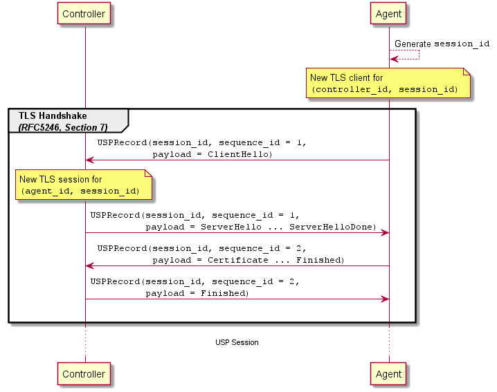

<!-- Reference Links -->
[1]:	https://github.com/BroadbandForum/usp/tree/master/data-model "TR-181 Issue 2 Device:2 Data Model for TR-069 Devices and USP Agents"
[2]: https://www.broadband-forum.org/technical/download/TR-069.pdf	"TR-069 Amendment 6	CPE WAN Management Protocol"
[3]:	https://www.broadband-forum.org/technical/download/TR-106_Amendment-8.pdf "TR-106 Amendment 8	Data Model Template for TR-069 Enabled Devices"
[4]:	https://tools.ietf.org/html/rfc7228 "RFC 7228	Terminology for Constrained-Node Networks"
[5]:	https://tools.ietf.org/html/rfc2136	"RFC 2136 Dynamic Updates in the Domain Name System"
[6]:	https://tools.ietf.org/html/rfc3007	"RFC 3007 Secure Domain Name System Dynamic Update"
[7]:	https://tools.ietf.org/html/rfc6763	"RFC 6763 DNS-Based Service Discovery"
[8]:	https://tools.ietf.org/html/rfc6762	"RFC 6762 Multicast DNS"
[9]:	https://tools.ietf.org/html/rfc7252	"RFC 7252 The Constrained Application Protocol (CoAP)"
[10]:	https://tools.ietf.org/html/rfc7390	"RFC 7390 Group Communication for the Constrained Application Protocol (CoAP)"
[11]:	https://tools.ietf.org/html/rfc4033	"RFC 4033 DNS Security Introduction and Requirements"
[12]:	https://developers.google.com/protocol-buffers/docs/proto3 "Protocol Buffers v3	Protocol Buffers Mechanism for Serializing Structured Data Version 3"
[13]: https://regauth.standards.ieee.org/standards-ra-web/pub/view.html#registries "IEEE Registration Authority"
[14]: https://tools.ietf.org/html/rfc4122 "RFC 4122 A Universally Unique IDentifier (UUID) URN Namespace"
[15]: https://tools.ietf.org/html/rfc5280 "RFC 5290 Internet X.509 Public Key Infrastructure Certificate and Certificate Revocation List (CRL) Profile"
[16]: https://tools.ietf.org/html/rfc6818 "RFC 6818 Updates to the Internet X.509 Public Key Infrastructure Certificate and Certificate Revocation List (CRL) Profile"
[17]: https://tools.ietf.org/html/rfc2234 "RFC 2234 Augmented BNF for Syntax Specifications: ABNF"
[18]: https://tools.ietf.org/html/rfc3986 "RFC 3986 Uniform Resource Identifier (URI): Generic Syntax"
[19]: https://tools.ietf.org/html/rfc2141 "RFC 2141 URN Syntax"
[20]: https://tools.ietf.org/html/rfc6455 "RFC 6455 The WebSocket Protocol"
[21]: https://stomp.github.io/stomp-specification-1.2.html "Simple Text Oriented Message Protocol"
[22]: https://tools.ietf.org/html/rfc5246 "The Transport Layer Security (TLS) Protocol Version 1.2"
[23]: https://tools.ietf.org/html/rfc6347 "Datagram Transport Layer Security Version 1.2"
[Conventions]: https://tools.ietf.org/html/rfc2119 "Key words for use in RFCs to Indicate Requirement Levels"


# End to End Message Exchange

USP Messages are exchanged between Controllers and Agents. In some deployment scenarios, the Controller and Agent have a direct connection. In other deployment scenarios, the messages exchanged by the Controller and Agent traverse multiple intermediate MTP Proxies. The latter deployment scenario typically occurs when the Agent or Controller is deployed outside the proximal or Local Area Network. In both types of scenarios, the End-to-End (E2E) message exchange capabilities of USP permit the:

* Exchange of USP Records within a E2E Session Context that allows for:
  *	Integrity protection for non-payload fields
  * Protected and unprotected payloads
  * Segmentation and reassembly of E2E Messages that would be too large to transfer through the intermediate MTP Proxies.
* Exchange of USP Records without a E2E Session Context that allows for:
  * Integrity protection for non-payload fields
  * Unprotected payloads or protected payloads where the payload protection security mechanism doesn’t require a concept of a session (e.g., COSE)

Protected payloads provide a secure message exchange (confidentiality, integrity and identity authentication) through exchange of USP Messages that are secured by the originating and receiving USP Endpoints.

*Note - the requirements below reference Objects and Parameters used to manage the E2E Session. These are specified in the [Device:2 Data Model for USP Agents][1].*

## USP Record Encapsulation

The USP Record Message is defined as the transport layer payload, encapsulating a sequence of datagrams that comprise the USP Message as well as providing additional metadata needed for integrity protection, payload protection and delivery of fragmented USP Messages. Additional metadata elements are used to identify the E2E session context, determine the state of the segmentation and reassembly function, acknowledge received datagrams, request retransmissions, and determine the type of encoding and security mechanism used to encode the USP Message.

#### Record Definition

The following elements this section describe the elements contained within a USP Record. When not explicitly set, the elements have a default value based on the type of element. For strings, the default value is an empty byte string. For numbers (uint64) and enumerations, the default value is 0. For repeating lists, the default value is an empty list.

`string version`

Required. Version of the USP Protocol. The only valid value is `1.0`.

`string to_id`

Required. Receiving/Target USP Endpoint Identifier.

`string from_id`

Required. Originating/Source USP Endpoint Identifier.

`uint64 session_id`

Optional. Session Context identifier, used to identify the USP Session Context. Used only for exchange of USP Records with a E2E Session Context.

The value 0 is reserved for exchange of USP Records without a E2E Session Context.

`uint64 sequence_id`

Optional. Datagram sequence identifier. Used only for exchange of USP Records with a E2E Session Context. When used, the field is initialized to zero and incremented after each sent USP Record.

*Note: Endpoints maintain independent values for `sequence_id`, based on the number of sent records.*

`uint64 expected_id`

Optional. Next `sequence_id` the sender is expecting to receive. Implicitly acknowledges to the recipient all transmitted datagrams less than `expected_id`.  Used only for exchange of USP Records with a E2E Session Context.

`uint64 retransmit_id`

Optional. Used to request a USP Record retransmission by a USP Endpoint to request a missing USP Record using the missing USP Record's anticipated `sequence_id`. Used only for exchange of USP Records with a E2E Session Context.

`enum payload_encoding`

Optional. When the payload is present, indicates the encoding protocol used to encode and decode the reassembled payload as the payload was prior to the application of `payload_security`. Valid values are:

`0 – ProtoBuf3`

`enum payload_security`

Optional. When the payload is present, indicates the protocol or mechanism used to secure the USP Message. Valid values are:

```
0 – PLAINTEXT
1 – TLS
2 – COSE
```

`enum payload_sar_state`

Optional. When payload is present, indicates the segmentation and reassembly state represented by the USP Record. Valid values are:

```
0 – No segmentation
1 – Begin segmentation
2 – Segmentation in process
3 – Complete segmentation
```

`enum payloadrec_sar_state`

Optional. When payload segmentation is being performed, indicates the segmentation and reassembly state represented by an instance of the payload datagram. Valid values are:

```
0 – Reserved (Unused)
1 – Begin segmentation
2 – Segmentation in process
3 – Complete segmentation
```

`bytes mac_signature`

Optional. When integrity protection of non-payload fields is performed, this is the message authentication code or signature used to ensure the integrity of the non-payload fields of the USP Record.

`bytes sender_cert`

Optional. The certificate of the sending USP Endpoint used to provide the signature in the `mac_signature` field, when integrity protection is used and the payload security mechanism doesn’t provide the mechanism to generate the `mac_signature`.

`bytes payload`

Optional. Repeating list of one or more datagrams. When using `TLS` payload security this element can contain multiple entries with each entry containing an encrypted TLS record. When using `PLAINTEXT` payload security this element only has 1 entry in the list.

**R-E2E.1** – When exchanging USP Records between USP Endpoints, a USP Record MUST contain either a `payload`, a `retransmit_id`, or both elements.

**R-E2E.2** - The target USP endpoint MUST ignore any message that does not contain its own Endpoint Identifier.

## Exchange of USP Records within a E2E Session Context

When the exchange of USP Records within a E2E Session Context is used, it contains the `session_id`, `sequence_id` and `expected_id` elements. In addition, when a retransmission is requested, the `retransmit_id` element is also supplied.

### Establishing an E2E Session Context

For the exchange of USP Records within a E2E Session Context to happen between two USP Endpoints, an E2E Session Context (Session Context) is established between the participating USP Endpoints. The Session Context is uniquely identified within the USP Endpoint by the combination of the Session Identifier and remote USP Endpoint's Identifier.

In USP, either a Controller or an Agent can begin the process of establishing a Session Context. This is done by the Controller or Agent sending a USP Record with a `session_id` element that is not currently associated with the Agent/Controller combination and a `sequence_id` element value of `0`.

**R-E2E.3** – Session Context identifiers MUST be generated by the USP Endpoint that originates the session such that it is greater than 1 and scoped to the remote USP Endpoint.

When a Session Context had been previously established between an Agent and Controller and the remote USP Endpoint receives a USP Record with a different `session_id` element, the remote USP Endpoint will restart the Session Context using the new `session_id` element.

**R-E2E.4** – When a USP Endpoint receives a USP Record from another USP Endpoint with a new Session Context identifier, the USP Endpoint MUST start a new Session Context for the remote USP Endpoint.

**R-E2E.5** – At most one (1) Session Context is established between an Agent and Controller.

**R-E2E.6** – When a USP Endpoint receives a USP Record from a remote USP Endpoint with a different Session Context identifier than was previously established, the USP Endpoint MUST start a new Session Context for the remote USP Endpoint.

*Note: Implementations need to consider if outstanding USP Messages that have not been transmitted to the remote USP Endpoint need to be transmitted within the newly established Session Context.*

#### Session Context Expiration

Sessions Contexts have a lifetime and can expire. The expiration of the Session Context is handled by the `Device.Controller.{i}.E2ESession.SessionContextExpiration` Parameter in the Agent. If the Agent does not see activity (an exchange of USP Records) within the Session Context, the Agent considers the Session Context expired and for the next interaction with the Controller a new Session Context is established.

**R-E2E.7** – When a Session Context between a Controller or Agent expires the Agent MUST initiate a new Session Context upon the next interaction with the remote USP Endpoint or from a Session Context request by the remote USP Endpoint.

#### Exhaustion of Sequence Identifiers

USP Endpoints identify the USP Record using the `sequence_id` element. When the `sequence_id` element for a USP Record that is received or transmitted by a USP Endpoint nears the maximum value that can be handled by the USP Endpoint, the USP Endpoint will attempt to establish a new Session Context in order to avoid a rollover of the `sequence_id` element.

**R-E2E.8** – When an USP Endpoint receives a USP Record with a value of the `sequence_id` element that is within 10,000 of the maximum size for the data type of the `sequence_id` element, the USP Endpoint MUST establish a new Session Context with the remote USP Endpoint.

**R-E2E.9** – When an USP Endpoint transmits a USP Record with a value of the `sequence_id` element that is within 10,000 of the maximum size for the data type of the `sequence_id` element, the USP Endpoint MUST attempt establish a new Session Context with the remote USP Endpoint upon its next contact with the remote USP Endpoint.

#### Failure Handling in the Session Context

In some situations, (e.g., TLS negotiation handshake) the failure to handle a received USP Record is persistent, causing an infinite cycle of "receive failure/request->session/establish->session/receive->failure" to occur. In these situations, the Agent enforces a policy as defined in this section regarding establishment of failed Session Contexts or failed interactions within a Session Context. The policy is controlled by the `Device.Controller.{i}.E2ESession.Enable` Parameter.

**R-E2E.10** – When retrying USP Records, the Agent MUST use the following retry algorithm to manage the retransmission Session Context establishment procedure:

The retry interval range is controlled by two Parameters, the minimum wait interval and the interval multiplier, each of which corresponds to a data model Parameter, and which are described in the table below. The factory default values of these Parameters MUST be the default values listed in the Default column. They MAY be changed by a Controller with the appropriate permissions at any time.

| Descriptive Name | Symbol | Default | Data Model Parameter Name |
| ---------: | :-----: | :------: | :------------ |
|Minimum wait interval | m | 5 seconds |	`Device.Controller.{i}.E2ESession.SessionRetryMinimumWaitInterval` |
| Interval multiplier |	k | 2000 | `Device.Controller.{i}.E2ESession.SessionRetryIntervalMultiplier` |

| Retry Count | Default Wait Interval Range (min-max seconds) | Actual Wait Interval Range (min-max seconds) |
| ----------: | :---------: | :-------------- |
| #1 | 5-10 | m - m.(k/1000) |
| #2 | 10-20 | m.(k/1000) - m.(k/1000)2 |
| #3 | 20-40 | m.(k/1000)2 - m.(k/1000)3 |
| #4 | 40-80 | m.(k/1000)3 - m.(k/1000)4 |
| #5 | 80-160 | m.(k/1000)4 - m.(k/1000)5 |
| #6 | 160-320 | m.(k/1000)5 - m.(k/1000)6 |
| #7 | 320-640 | m.(k/1000)6 - m.(k/1000)7 |
| #8 | 640-1280 | m.(k/1000)7 - m.(k/1000)8 |
| #9 | 1280-2560 | m.(k/1000)8 - m.(k/1000)9 |
| #10 and subsequent | 2560-5120 | m.(k/1000)9 - m.(k/1000)10 |

**R-E2E.11** - Beginning with the tenth retry attempt, the Agent MUST choose from the fixed maximum range. The Agent will continue to retry a failed session establishment until a USP message is successfully received by the Agent or until the SessionExpiration time is reached.

**R-E2E.12** – Once a USP Record is successfully received, the Agent MUST reset the Session Context retry count to zero for the next Session Context establishment.

**R-E2E.13** – If a reboot of the Agent occurs, the Agent MUST reset the Session Context retry count to zero for the next Session Context establishment.

### USP Record Exchange

Once a Session Context is established, USP Records are created to exchange payloads in the Session Context. USP Records are uniquely identified by their originating USP Endpoint Identifier (`from_id`), Session Context identifier (`session_id`) and USP Record sequence identifier (`sequence_id`).

#### USP Record Transmission

When an originating USP Endpoint transmits a USP Record, it creates the USP Record with a monotonically increasing sequence identifier (`sequence_id`).

**R-E2E.14** – When an originating USP Endpoint transmits a USP Record, it MUST set the sequence identifier of the first transmitted USP Record in the Session Context to zero (0).

**R-E2E.15** – When an originating USP Endpoint transmits additional USP Records, the originating USP Endpoint MUST monotonically increase the sequence identifier from the last transmitted USP Record in the Session Context by one (1).

To communicate the sequence identifier of the last USP Record received by a receiving USP Endpoint to the originating USP Endpoint, whenever a USP Endpoint transmits a USP Record the originating USP Endpoint communicates the next sequence identifier of a USP Record it expects to receive in the `expected_id` element. The receiving USP Endpoint uses this information to maintain its buffer of outgoing (transmitted) USP Records such that any USP Records with a sequence identifier less than the `expected_id` can be removed from the receiving USP Endpoints buffer of transmitted USP Records for this Session Context.

**R-E2E.16** – When an originating USP Endpoint transmits a USP Record, the originating USP Endpoint MUST preserve it in an outgoing buffer, for fulfilling retransmit requests, until the originating USP Endpoint receives a USP Record from the receiving USP Endpoint with a greater `expected_id`.

**R-E2E.17** – When an originating USP Endpoint transmits a USP Record, the originating USP Endpoint MUST inform the receiving USP Endpoint of the next sequence identifier in the Session Context for a USP Record it expects to receive.

#### Payload Security within the Session Context

The value of the `payload_security` element defines the type of payload security that is performed in the Session Context. Once a Session Context is established the payload security stays the same throughout the lifetime of the Session Context. If the payload security changes in the USP Record from what payload security in which the Session Context originated, the receiving USP Endpoint fails the USP Record.

**R-E2E.18** – The originating USP Endpoint MUST use the same value in the payload_security element for all USP Records within a Session Context.

#### USP Record Reception

USP Records received by a USP Endpoint have information that is used by the receiving USP Endpoint to process:

1.	The payload contained within the USP Record,
2.	A request to retransmit a USP Record, and
3.	The contents of the of the outgoing buffer to clear the USP Records that the originating USP Endpoint has indicated it has received from the receiving USP Endpoint.

As USP Records can be received out of order or not at all, the receiving USP Endpoint only begins to process a USP Record when the `sequence_id` element of the USP Record in the Session Context is the `sequence_id` element that the receiving USP Endpoint expects to receive. The following figure depicts the high-level processing for USP Endpoints that receive a USP Record.


Figure E2E.1 – Processing of received USP Records

**R-E2E.19** – The receiving USP Endpoint MUST ensure that the value in the `payload_security` element for all USP Records within a Session Context is the same and fail the USP Record if the value of the `payload_security` element is different.

**R-E2E.20** – Incoming USP Records MUST be processed per the following rules:

1. If the USP Record does not contain the next expected `sequence_id` element, the USP Record is added to an incoming buffer of unprocessed USP Records.
2. Otherwise, for the USP Record and any sequential USP Records in the incoming buffer:
    1. If a payload is set, it is passed to the implementation for processing based on the type of payload in the `payload_security` and `payload_encoding` elements and if the payload requires reassembly according to the values of the `payload_sar_state` and `payloadrec_sar_state` elements.
      2. If a `retransmit_id` element is set, the USP Record with the sequence identifier of the `retransmit_id` element is resent from the outgoing buffer.
3. Any record in the outgoing buffer with sequence identifier less than the value of the `expected_id` element is cleared.
4. The `expected_id` element for new outgoing records is set to `sequence_id` element + 1 of this USP Record.

##### Failure Handling of Received USP Records Within a Session Context

When a receiving USP Endpoint fails to either buffer or successfully process a USP Record, the receiving USP Endpoint initiates a new Session Context.

**R-E2E.21** – When a USP Endpoint that receives a USP Record within a Session Context that fails to buffer or successfully process (e.g., decode, decrypt, retransmit) the USP Endpoint MUST start a new Session Context.

#### USP Record Retransmission

An Agent or Controller can request to receive USP Records that it deems as missing at any time within the Session Context. The originating USP Endpoint requests a USP Record from the receiving USP Endpoint by placing the sequence identifier of the requested USP Record in the `retransmit_id` element of the USP Record to be transmitted.

The receiving USP Endpoint will determine if USP Record exists and then re-send the USP Record to the originating USP Endpoint.

If the USP Record doesn't exist, the USP Endpoint that received the USP Record will consider the USP Record as failed and perform the failure processing a defined in section Failure Handling of Received USP Records.

To guard against excessive requests to retransmit a specific USP Record, the USP Endpoint checks to see if the number of times the USP Record has been retransmitted is greater than or equal to maximum times a USP Record can be retransmitted as defined in the `Device.Controller.{i}.E2ESession.MaxRetransmitTries` Parameter. If this condition is met, then the USP Endpoint that received the USP Record with the retransmit request will consider the USP Record as failed and perform the failure processing as defined in section Failure Handling of Received USP Records.

### Guidelines for Handling Session Context Restarts

A Session Context can be restarted for a number of reasons (e.g., sequence id exhaustion, errors, manual request). When a Session Context is restarted, the USP Endpoints could have USP Records that have not been transmitted, received or processed. This section provides guidance for USP Endpoints when the Session Context is restarted.

The originating endpoint is responsible to recovering from USP records that were not transmitted.

**R-E2E.22** – For USP Records that have been received, but the USP Endpoint has not yet processed when the Session Context is restarted, the receiving USP endpoint is not responsible for USP Records that it has not communicated to the originating USP Endpoint via the `expected_id` element but MUST successfully process the USP Record through the `expected_id` element.

When a USP Endpoint receives a USP Record that cannot pass an integrity check or have a correct value in the `session_id` element, the Session Context is restarted.

**R-E2E.23** – USP Records that do not pass integrity checks MUST be silently ignored and the receiving USP Endpoint MUST restart the Session Context.

This allows keys to be distributed and enabled under the old session keys and then request a session restarted under the new keys.

**R-E2E.24** – USP Records that pass the integrity check but have an invalid value in the session_id element MUST be silently ignored and the receiving USP Endpoint MUST restart the Session Context.

### Segmented Message Exchange

In many complex deployments, a USP Message will be transferred across Message Transfer Protocol (MTP) proxies that are used to forward the USP Message between Controllers and Agents that use different transport protocols.


Figure E2E.2 – Example E2E Deployment Scenario

Since USP can use different types of MTPs, some MTPs place a constraint on the size of the USP Message that it can transport. For example, in the above figure, if the ACS Controller would want to exchange USP Messages with the Smart Home Gateway, the STOMP and CoAP protocols would be used. Since many STOMP server and other broker MTP implementations have a constraint for the size of message that it can transfer, the Controller and Agent implements a mechanism to segment or break up the USP Message into small enough "chunks" that will permit transmission of the USP Message through the STOMP server and then be reassembled at the receiving endpoint. When this Segmentation and Reassembly function is performed by Controller and Agent, it removes the possibly that the message may be blocked (and typically) dropped by the intermediate transport servers. The Segmentation and Reassembly is described in the figure below the where the ACS Controller would segment the USP Message within the USP Record into segments of 64K bytes because in this example, the MTP's STOMP MTP endpoint can handle messages up to 64K bytes. The Smart Home Gateway would then reassemble the segments into the original USP Message.

While the `sequence_id` element identifies the USP Record sequence identifier within the context of a Session Context and the `retransmit_id` element provides a means of a receiving USP Endpoint to indicate to the transmitting USP Endpoint that it needs a specific USP Record to ensure information elements are processed in a first-in-first-out (FIFO) manner, the Segmentation and Reassembly function allows multiple payloads to be segmented by the transmitting USP Endpoint and reassembled by the receiving USP Endpoint by augmenting the USP Record with additional information elements without changing the current semantics of the USP Record's field definitions. This is done using the `payload_sar_state` and `payloadrec_sar_state` elements in the USP Record to indicate status of the segmentation and reassembly procedure. This status along with the existing `sequence_id`, `expected_id` and `retransmit_id` elements and the foreknowledge of the E2E maximum transmission unit `MaxUSPRecordSize` Parameter in the Agent's Controller table provide the information needed for two USP Endpoints to perform segmentation and reassembly of payloads conveyed by USP Records. In doing so, the constraint imposed by MTP Endpoints (that could be intermediate MTP endpoints) that do not have segmentation and reassembly capabilities are alleviated. USP Records of any size can now be conveyed across any USP MTP endpoint as depicted below:


Figure E2E.3 – E2E Segmentation and Reassembly

#### SAR function algorithm

The following algorithm is used to provide the SAR function.

##### Originating USP Endpoint

For each USP Message segment the Payload:

1.	Prepare the USP Message (e.g., secure the message) where the number of payload datagrams (e.g., TLS Records) + the size of the USP Record doesn't exceed the E2EMTU.
2.	Indicate the start of the segmentation and transmit the first USP Record using the procedures defined in section USP Record Message Exchange.
3.	For each instance of the USP Record's payload element's record, segment the payload record indicating the start, in-process and completion status of the payload record in the USP Records's `payloadrec_sar_state` element. The integrity of the payload delineated is retained meaning that all segmentation does not occur across instances of the USP Record's payload element. The USP Record's `payload_sar_state` will either indicate that segmentation has begun or is in process. The `payload_sar_state` element is set to `1 – Begin segmentation` when the first instance of the payload element is segmented. Subsequent USP Record's payload_sar_state is set to `2 – Segmentation` in process unless it is the final USP Record.
4.	The final USP Record indicates that the segmentation is complete.

##### Receiving Endpoint

For each USP Message reassemble the segmented payload:

1.	When a USP Record that indicates segmentation has started, store the USP Records until a USP Record is indicated to be complete. A completed segmentation is where the USP Record's `payload_sar_state` and `payloadrec_sar_state` have a value of `3 – Complete segmentation`.
2.	Follow the procedures in USP Record Retransmission to retransmit any USP Records that were not received.
3.	Once the USP Record is received that indicates that the segmentation is complete, reassemble the payload by appending the payloads using the monotonically increasing `sequence_id` element's value from the smaller number to larger sequence numbers. The reassembly keeps the integrity of the instances of the payload element's payload records. To keep the integrity of the payload record, the payload record is reassembled using the `payloadrec_sar_state` values.
4.	Reassembly of the payload that represents the USP Message is complete.

If the segmentation and reassembly fails for any reason, the USP Endpoint that received the segmented USP Records will consider the last received USP Record as failed and perform the failure processing as defined in section Failure Handling of Received USP Records.

### Handling Duplicate USP Records

Circumstances may arise (such as multiple Message Transfer Protocols, retransmission requests) that cause duplicate USP Records (those with an identical `sequence_id` and `session_id` elements from the same USP Endpoint) to arrive at the target USP endpoint.

**R-E2E.25** - When exchanging USP Records with a E2E Session Context, if a target USP Endpoint receives a USP Record with duplicate `sequence_id` and `session_id` elements from the same originating USP Endpoint, it MUST gracefully ignore the duplicate USP Record.

## Exchange of USP Records without a E2E Session Context

When the exchange of USP Records without a E2E Session Context is used, each Record contains the `session_id` element with has a value of 0. The `sequence_id`, `expected_id` and retransmit elements are not used.

**R-E2E.26** – A Session Context identifier with a value of 0 is reserved for exchange of USP Records without a E2E Session Context.

### Failure Handling of Received USP Records Without a Session Context

When a receiving USP Endpoint fails to either buffer or successfully process a USP Record, the receiving USP Endpoint reports a failure.

**R-E2E.27** – When a USP Endpoint that receives a USP Record without a Session Context that fails to buffer or successfully process (e.g., decode, decrypt, retransmit) the USP Endpoint MUST report the failure to the receiving MTP that indicates a "bad request".

## Validating the Integrity of the USP Record

When a USP Record is transmitted to a USP Endpoint, the transmitting USP Endpoint has the capability to protect the integrity of the non-payload elements of the USP Record. The payload element is not part of the generation or verification process, as the expectation is that this element will be secured using one the E2E security protection mechanisms.
The integrity of the USP Record is required to be validated when the USP Record cannot be protected by the underlying MTP.

**R-E2E.28** - When a USP Record is received or transmitted the following conditions MUST apply for the USP Record to be considered protected by the underlying MTP:

* The MTP is encrypted per requirements in the applicable MTP section
* The peer MTP certificate contains an Endpoint ID and this Endpoint ID is the same as the USP Record `from_id` element.

**R-E2E.29** – Unless protected by the underlying MTP, when a USP Endpoint transmits a USP Record, the USP Endpoint MUST protect the integrity of the non-payload portion of the USP Record.

**R-E2E.30** – When a USP Endpoint receives a USP Record, the USP Endpoint MUST verify the integrity of the non-payload portion of the USP Record when it receives a USP Record with the mac-signature element or the USP Endpoint is not protected by the underlying MTP.

The integrity of the non-payload elements is accomplished by the transmitting USP Endpoint generating a Message Authentication Code (MAC) or signature of the non-payload elements which is then placed into the mac-signature element where the receiving USP Endpoint then verifies the MAC or signature as appropriate. The method to generate and validate MAC or signature depends on the value of the `payload_security` element. If the value of the `payload_security` element is PLAINTEXT then the integrity validation method always uses the signature method described in section Using the Signature Method to Validate the Integrity of USP Records. If the value of the `payload_security` element is TLS then the validation method that is used is dependent on whether the TLS handshake has been completed. If the TLS handshake has not been completed, the signature method described in section Using the Signature Method to Validate the Integrity of USP Records is used otherwise the MAC method described in section Using TLS to Validate the Integrity of USP Records is used.

### Using the Signature Method to Validate the Integrity of USP Records

When the transmitting USP Endpoint protects the integrity of the non-payload fields of the USP Record using the signature method in this section, the non-payload fields are protected by signing a hash of the non-payload fields using the private key of the sending USP Endpoint's certificate. The receiving USP Endpoint then verifies the integrity using either the public key of the certificate in the USP Record `sender_cert` element or of the certificate used for Secure Message Exchange.

This signature method uses a SHA-256 hash algorithm that generates a signature for the hash using the PKCS#1 Probabilistic Signature Scheme (PSS) scheme as defined in RFC 8017(https://tools.ietf.org/html/rfc8017), with the MGF1 mask generation function, and a salt length that matches the output size of the hash function.

**R-E2E.31** – When using the signature method to protect the integrity of the non-payload portion of the USP Record, the transmitting USP Endpoint MUST protect the integrity using the PKCS#1 Probabilistic Signature Scheme (PSS) scheme as defined in RFC 8017(https://tools.ietf.org/html/rfc8017), with the MGF1 mask generation function, and a salt length that matches the output size of the hash function where the non-payload fields are protected using the SHA-256 hash algorithm to sign and verify the protection. The transmitting USP Endpoint MUST create the signature using the private key of the transmitting USP Endpoint's certificate. The receiving USP Endpoint MUST verify the signature using the public key of the transmitted sender's certificate.

### Using TLS to Validate the Integrity of USP Records

When the transmitting and receiving USP Endpoints have established a TLS session between the USP Endpoints, the transmitting USP Endpoint no longer needs to generate a signature or transmit the sender’s certificate with the USP Record. Instead the transmitting USP Record generates a MAC that is verified by the receiving USP Endpoint. The MAC ensures the integrity of the non-payload fields of the USP Record. The MAC mechanism used in USP for this purpose is the SHA-256 keyed-Hash Message Authentication Code (HMAC) algorithm. The key used for the HMAC algorithm uses a Key Derivation Function (KDF) in accordance with RFC 5869(https://tools.ietf.org/html/rfc5869) and requires the following inputs to be known by the UPS Endpoints involved in the generation and validation of the MAC: length of the output MAC, salt, key and application context information (i.e., KDF info element). The application context information uses a constant value for all USP implementations ("`USP_Record`") and the length is fixed at 32 octets. The salt and key inputs are based on the underlying mechanism used to protect the payload of the USP Record. For TLS, the salt and key are taken from the TLS session once TLS negotiation is completed. The input key to the KDF uses the master key of the TLS session. The salt depends on role played by the USP Endpoint in the TLS Session (i.e., TLS session’s client or server random).

**R-E2E.32** – If using the TLS MAC method to protect the integrity of a USP Record, a USP Endpoint transmits a USP Record, the USP Endpoint MUST generate a MAC using the SHA-256 HMAC algorithm for the non-payload portion of the USP Record.

**R-E2E.31** – If using the TLS MAC method to protect the integrity of a USP Record, and a USP Endpoint receives a USP Record, the USP Endpoint MUST verify the MAC using the SHA-256 HMAC algorithm for the non-payload portion of the USP Record.

**R-E2E.32** – If using the TLS MAC method to protect the integrity of a USP Record, when generating or validating the MAC of the USP Record, the sequence of the non-payload fields MUST use the field identifier of the USP Record's protobuf specification proceeding from lowest to highest.

**R-E2E.33** – If using the TLS MAC method to protect the integrity of a USP Record, when generating or validating the MAC of the USP Record, the USP Endpoint MUST derive the key using the KDF as defined in RFC 5869(https://tools.ietf.org/html/rfc5869).

**R-E2E.34** – If using the TLS MAC method to protect the integrity of a USP Record, when generating or validating the MAC of the USP Record, the USP Endpoint MUST use the application context information value of "`USP_Record`".

**R-E2E.35** – If using the TLS MAC method to protect the integrity of a USP Record, when generating or validating the MAC of the USP Record, the USP Endpoint MUST use the MAC length of 32.

**R-E2E.36** – If using the TLS MAC method to protect the integrity of a USP Record, when generating or validating the MAC of the USP Record and the USP Endpoint uses TLS to secure the payload of the USP Record, the USP Endpoint MUST derive the key from the negotiated TLS session's master key.

**R-E2E.37** – If using the TLS MAC method to protect the integrity of a USP Record, when generating the MAC of the USP Record and the USP Endpoint uses TLS to secure the payload of the USP Record, the USP Endpoint MUST use TLS session's client or server random for the salt depending on the role the USP Endpoint plays in the TLS session.

## Secure Message Exchange

While message transport bindings implement point-to-point security, the existence of broker-based message transports and transport proxies creates a need for end-to-end security within the USP protocol. End-to-end security is established by securing the payloads prior to segmentation and transmission by the originating USP Endpoint and the decryption of reassembled payloads by the receiving USP Endpoint. The indication whether and how the USP Message has been secured is via the `payload_security` element. This element defines the security protocol or mechanism applied to the USP payload, if any. This section describes the payload security protocols supported by USP.

### TLS Payload Encapsulation

USP employs TLS 1.2 as one security mechanism for protection of USP payloads in Agent-Controller message exchanges.

While traditionally deployed over reliable streams, TLS is a record-based protocol that can be carried over datagrams, with considerations taken for reliable and in-order delivery. To aid interoperability, USP endpoints are initially limited to a single cipher specification, though future revisions of the protocol may choose to expand cipher support.

**R-E2E.38** – When using TLS to protect USP payloads in USP Records, USP Endpoints MUST implement TLS 1.2 with the ECDHE-ECDSA-AES128-GCM-SHA256 cipher and P-256 curve.

*Note: The cipher listed above requires a USP Endpoint acting as the TLS server to use X.509 certificates signed with ECDSA and Diffie-Hellman key exchange credentials to negotiate the cipher.*

#### Session Handshake

When TLS is used as a payload protection mechanism for USP Message, TLS requires the use of the Session Context to negotiate its TLS session. The USP Endpoint that initiated the Session Context will act in the TLS client role when establishing the security layer. The security layer is constructed using a standard TLS handshake, encapsulated within one or more of the above-defined USP Record payload datagrams. Per the TLS protocol, establishment of a new TLS session requires two round-trips.



Figure E2E.4 – TLS session handshake

**R-E2E.39** – USP Endpoints that specify TLS in the `payload_security` element MUST exchange USP Records within an E2E Session Context.

If the TLS session cannot be established for any reason, the USP Endpoint that received the USP Record will consider the USP Record as failed and perform the failure processing as defined in section Failure Handling of Received USP Records.

TLS provides a mechanism to renegotiate the keys of a TLS session without tearing down the existing session called TLS renegotiation. However, for E2E Message exchange in USP, TLS renegotiation is ignored.

**R-E2E.40** – USP Endpoints MUST ignore requests for TLS renegotiation when used for E2E Message exchange.

#### Authentication

USP relies upon peer authentication using X.509 certificates, as provided by TLS. Each USP endpoint identifier is identified within an X.509 certificate.

**R-E2E.41** – USP Endpoints MUST be mutually authenticated using X.509 certificates using the USP Endpoint identifier encoded within the X.509 certificates `subjectAltName` field.


[<-- Message Encoding](/specification/encoding/)

[USP Messages -->](/specification/messages/)
