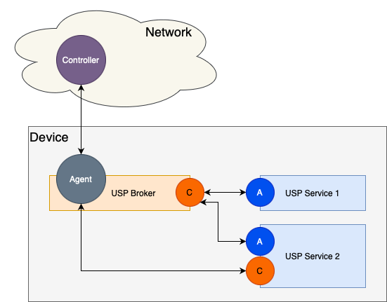

# Software Modularization and USP-Enabled Applications Theory of Operation {#sec:software-modularization-theory-of-operations .appendix1}

This section discusses the Theory of Operation for Software Modularization and USP-Enabled Applications within Connected Devices.

## Background

Operators and manufacturers of connected devices are moving away from monolithic firmware images and toward a more modular approach to firmware architecture. The reasons for this trend are mostly related to the ability to more quickly adapt to subscriber demands. By moving to a more modularized software stack on the connected device, Operators are able to reduce the current device firmware versioning lead times (typically 12 to 18 months) and introduce new services at a much faster pace. To aid in this evolution, there needs to be a standard mechanism to install/update/uninstall software modules (see [Software Module Management appendix](#sec:software-module-management)) and there needs to be a standard communications mechanism that allows the services to expose their own data model to both internal components and remote management entities as well as consume other portions of the device's data model (the purpose of this Appendix). A side-effect of this software modularization is that certain individual services can also be updated independently of the overall firmware, which helps in both enhancing already enabled services and performing quick patches to address any security issues.

## Basic Solution Concepts

The following concepts are key components of the overall solution to enable connected device software modularization by deploying USP-enabled applications.

- USP Broker:
	- **An entity that is responsible for exposing a consolidated set of Service Elements for the device to external USP Controllers. This includes any data model elements exposed by the USP Agent contained within the USP Broker as well as any data model elements exposed by USP Services that have connected to the USP Broker. Furthermore, the USP Broker serves as an intermediary for USP Services looking to interact with data model elements that are maintained by other portions of the device (the USP Broker or other USP Services).**
	- A USP Broker has both a USP Agent and a USP Controller embedded in it.
	- The USP Agent serves as both the Agent that exposes the device’s management environment to the external world and the Agent to any USP Controllers that reside inside the device.
	- The USP Controller serves as the Controller for all communications with USP services.
	- For a USP Broker to recognize a USP Agent as a USP Service, it needs to register a portion of its data model via the Register message.

- USP Service:
	- **An entity that is responsible for implementing a portion of the device's overall functionality. A USP Service exposes a set of Service Elements related to the functionality that it is responsible for implementing. A USP Service could have a need to interact with Service Elements that are outside of its functional domain, whether that be Service Elements exposed by the USP Broker or some other USP Service.**
	- A USP Service has a USP Agent and could have a USP Controller embedded in it.
	- The USP Agent serves to expose the portion of the data model that is controlled by the USP Service to the USP Broker. (data model provider).
	- The USP Controller serves to retrieve/configure portions of the data model that are not directly exposed by the USP Service. (data model consumer).
	- If a USP Service has both a USP Agent and a USP Controller then it is highly recommended that they both use the same Endpoint ID.
		- If the USP Agent and USP Controller don't use the same Endpoint ID then the USP Broker won't be able to correlate the two USP Endpoints as a single USP Service.
	- Based on use cases (see below) not all USP Services will need a USP Controller.

- UNIX Domain Socket MTP:
	- **An internal MTP for communications within the device via UNIX Domain Sockets.**
	- The USP Broker will maintain a well-known UNIX Domain Socket facilitating an easy place for Controllers within  USP Services to connect.
	- The USP Broker will maintain a well-known UNIX Domain Socket facilitating an easy place for Agents within  USP Services to connect.
	- TLVs are used to encapsulate any headers (e.g. identification, length of full message) and the USP Record itself in protobuf form.
	- No authentication is needed as the installation of the software module itself will essentially grant access (assumption that you should only install trusted applications).
		- This can be enhanced in later versions.

## USP Service Use Cases

The following 3 use cases represent 3 unique types of USP Services.

1. Data Model Provider Application
	1. **Description:** USP Service that exposes a data model
	2. **Example:** A Software Module that implements a Speed Test
	3. **Components:**
		1. USP Agent (data model provider)
2. Integrated Data Model Application
	1. **Description:** USP Service that both exposes a data model and needs to interact with dependent portions of the data model being exposed by other entities
	2. **Example:** A Software Module that implements a Network Topology View
	3. **Components:**
		1. USP Agent (data model provider)
		2. USP Controller (data model consumer)
3. Cloud Application
	1. **Description:** USP Service that resides in the cloud
	2. **Example:** A Software Module that implements a cloud-based Wi-Fi mesh controller
	3. **Components:** Could be any Agent/Controller combination as described in use case 1 or 2

The following image depicts the first 2 use cases where the USP Service number corresponds to the use case number (i.e., USP Service 1 is a reflection of use case 1).

## USP Broker Responsibilities

A USP Broker generally has 3 main responsibilities:

* Track the Service Elements (portions of the data model) that the USP Services wish to expose to other entities.
* Proxy USP communications internally within the device based on the Service Elements that the USP Services have exposed.
* Provide a consolidated view of the device's Service Elements to USP Controllers that reside externally to the device.

When a USP Service is started, there will be a data model registration to inform the USP Broker which Service Elements (portions of the data model) should be exposed for this USP Service. This means that one of the key responsibilities of the USP Broker is to track the portion of the data model associated with each USP Service, which is facilitated by receiving a Register USP message from the USP Agent of the USP Service.

The USP Agent portion of the USP Broker provides a consolidated view of the device's Service Elements (including all Service Elements exposed by USP Services) to USP Controllers that are external to the device, and those USP Controllers will send USP messages to the device that require the USP Broker to proxy either the entire USP message or a portion of the USP message to one or more USP Services based on the Service Elements being exposed by the various USP Services. These USP messages can come in many forms:

* A Get message to retrieve various portions of the data model that could be distributed across multiple USP Services.
* A Set message to configure various portions of the data model that could be distributed across multiple USP Services.
* An Add message to create and configure a new instance of a data model object, and while each data model object is only served by a single USP Service, the Add message could be creating instances of multiple data model objects that could be distributed across multiple USP Services.
* A Delete message to remove an existing instance of a data model object, and while each data model object is only served by a single USP Service, the Delete message could be removing instances from multiple data model objects that could be distributed across multiple USP Services.
* An Operate message to execute a data model command, which would be handled by a single USP Service.

The USP Agent portion of the USP Broker might also need to handle notifications and subscriptions. These subscriptions might be created by either USP Controllers that are external to the device or USP Services that are internal to the device, where they are looking for notifications related to a part of the device's Service Elements where some portions of that subscription could be distributed across multiple USP Services. This means that the USP Agent portion of the USP Broker might need to send USP Notify messages to external USP Controllers or internal USP Controllers associated with USP Services that have created associated Subscriptions.

## Data Model Implications for USP Brokers and USP Services

### UNIX Domain Socket Data Model Table and the UDS MTP Objects

The MTP table of the LocalAgent object represents the Message Transfer Protocols (MTPs) that a USP Agent is currently using. So an MTP instance with a Protocol of UNIX Domain Socket means that the USP Broker or USP Service has an Agent that is configured to use the UNIX Domain Socket MTP for communications within the device between the USP Broker and one or more USP Services.

Each instance of the LocalAgent.Controller table represents a USP Controller that has access to the associated USP Agent. For a USP Service that would be the USP Broker's Controller, which means that a USP Service will only have 1 instance of the LocalAgent.Controller table and the UDS MTP object will contain a Reference to the UnixDomainSocket Object instance containing the Path to the Controller portion of the USP Broker and be in a Connect Mode. For a USP Broker that would be the USP Service's Controller (if it exists), which means that a USP Broker will have an instance of the LocalAgent.Controller table for each USP Service that contains a Controller. Each LocalAgent.Controller instance would have a UDS MTP object that contains a reference to the USPService Object instance containing details about the USP Service itself.

The LocalAgent.MTP.UDS instance will be auto-created based on the USP Broker or USP Service supporting the UNIX Domain Socket MTP. The LocalAgent.Controller instances for a USP Broker and USP Services will be automatically created with the UDS instance based on USP Service startup procedures. Given that and the USP Broker has well-known paths for the Agent and Controller UNIX Domain Socket MTP, the UDS objects are read-only.

Due to the lack of a discovery mechanism and to ensure a interoperable environment where 3rd party USP Services can communicate with the USP Broker, it is highly recommended that the USP Broker's UNIX Domain Socket paths used for both its USP Agent and USP Controller be preset as follows:

* USP Broker's USP Agent: /var/run/usp/broker_agent_path
* USP Broker's USP Controller: /var/run/usp/broker_controller_path

### USPService Data Model Table

The USP Broker should keep track of all USP Services it has an active connection to, which includes the following parameters:

* **EndpointID:** the Endpoint ID of the USP Agent within the USP Service
* **DataModelPaths:** a list of data model paths that have been registered by the USP Service
* **DeploymentUnitRef:** a reference to the Software Module Deployment Unit, if applicable
* **HasController:** a flag that indicates whether or not the USP Service has an embedded USP Controller (NOTE: this can be determined when the USP Service's USP Controller connects to the USP Broker's USP Agent if it is using the same Endpoint ID as the USP Service's USP Agent)

When a USP Service disconnects then the associated USPService table instance is removed.

### Example Data Models for a USP Broker and USP Services

Here's an example set of data models for a USP Broker and 2 USP Services that matches the use cases depicted in the Figure shown in the previous section.

USP Broker (NOTE: there isn't a Controller.1 instance because USP Service 1 doesn't have a Controller):

    UnixDomainSocket.1.Path = /tmp/broker_agent_path
    UnixDomainSocket.1.Mode = Listen
    UnixDomainSocket.2.Path = /tmp/broker_controller_path
    UnixDomainSocket.2.Mode = Listen
    LocalAgent.MTP.1.UDS.UnixDomainSocketRef = UnixDomainSocket.1
    LocalAgent.Controller.2.MTP.1.UDS.UnixDomainSocketRef = <empty>
    LocalAgent.Controller.2.MTP.1.UDS.USPServiceRef = USPService.2
    USPService.1.EndpointID = doc::Service1
    USPService.1.DataModelPaths = PathA, PathB, PathC
    USPService.1.DeploymentUnitRef = SoftwareModules.DeploymentUnit.1
    USPService.1.HasController = false
    USPService.2.EndpointID = doc::Service2
    USPService.2.DataModelPaths = PathX, PathY, PathZ
    USPService.2.DeploymentUnitRef = SoftwareModules.DeploymentUnit.2
    USPService.2.HasController = true

USP Service 1 (NOTE: USP Service 1 doesn't have a Controller, so there isn't a Controller instance in the USP Broker for this USP Service):

    UnixDomainSocket.2.Path = /tmp/broker_controller_path
    UnixDomainSocket.2.Mode = Connect
    LocalAgent.MTP.1.UDS.UnixDomainSocketRef = <empty>
    LocalAgent.Controller.1.MTP.1.UDS.UnixDomainSocketRef = UnixDomainSocket.2
    LocalAgent.Controller.1.MTP.1.UDS.USPServiceRef = <empty>

USP Service 2 (has both an Agent and a Controller):

    UnixDomainSocket.1.Path = /tmp/broker_agent_path
    UnixDomainSocket.1.Mode = Connect
    UnixDomainSocket.2.Path = /tmp/broker_controller_path
    UnixDomainSocket.2.Mode = Connect
    LocalAgent.MTP.1.UDS.UnixDomainSocketRef = <empty>
    LocalAgent.Controller.1.MTP.1.UDS.UnixDomainSocketRef = UnixDomainSocket.2
    LocalAgent.Controller.1.MTP.1.UDS.USPServiceRef = <empty>

## Startup and Shutdown Procedures

### Device Boot Procedures

When the device boots up, the USP Broker comes online.  The USP Broker exposes both a USP Agent (communicating externally and internally; listening on a well-known internal path for communications via the Unix Domain Socket MTP) and an internal USP Controller (listening on a well-known internal path for communications via the Unix Domain Socket MTP).  The USP Agent communicates externally via one or more of the USP defined MTPs (MQTT, STOMP,  or WebSocket).  The USP Agent also communicates internally via the Unix Domain Socket MTP and begins to listen on a well-known internal path.  The USP Controller communicates internally via the Unix Domain Socket MTP and begins to listen on a well-known internal path.  Each installed and enabled USP Service also starts up - see the next section.

### USP Service Startup Procedures

*Use Case 1 - Data Model Provider Application:*

As the USP Service starts up, it begins to connect to the USP Broker...

- The Agent within the USP Service initiates the UNIX Domain Socket connection to the Controller on the USP Broker and the well-known internal path
	 - Once the UNIX Domain Socket is connected, the USP Service's Agent will initiate the UNIX Domain Socket MTP Handshake mechanism
	 - Once the USP Broker's Controller receives the UNIX Domain Socket MTP Handshake message, it will respond with its own Handshake message
	 - Once the UNIX Domain Socket MTP Handshake mechanism is successfully completed, the Agent within the USP Service sends an empty UnixDomainSocketConnectRecord
	 - After sending the empty UnixDomainSocketConnectRecord, the Agent within the USP Service sends a Register message to the Controller in the USP Broker that details the portion of the data model that is being exposed by the USP Service.

*Use Case 2 - Integrated Data Model Application:*

As the USP Service starts up, it begins to connect to the USP Broker...

- The Agent within the USP Service initiates the UNIX Domain Socket connection to the Controller on the USP Broker and the well-known internal port
	- Once the UNIX Domain Socket is connected, the USP Service's Agent will initiate the UNIX Domain Socket MTP Handshake mechanism
	- Once the USP Broker's Controller receives the UNIX Domain Socket MTP Handshake message, it will respond with its own Handshake message
	- Once the UNIX Domain Socket MTP Handshake mechanism is successfully completed, the Agent within the USP Service sends an empty UnixDomainSocketConnectRecord
	- After sending the empty UnixDomainSocketConnectRecord, the Agent within the USP Service sends a Register message to the Controller in the USP Broker that details the portion of the data model that is being exposed by the USP Service.
- The Controller within the USP Service initiates the UNIX Domain Socket connection to the Agent on the USP Broker and the well-known internal port
	- Once the UNIX Domain Socket is connected, the USP Service's Controller will initiate the UNIX Domain Socket MTP Handshake mechanism
	- Once the USP Broker's Agent receives the UNIX Domain Socket MTP Handshake message, it will respond with its own Handshake message
	- Once the UNIX Domain Socket MTP Handshake mechanism is successfully completed, the Agent within the USP Broker sends an empty UnixDomainSocketConnectRecord
	- Once the USP Service identifies that it is connected to the USP Broker, the USP Service’s Controller can issue a GSDM to retrieve portions of the USP Broker’s supported data model that it might need to interact with

*Use Case 3 - Cloud Application:*

**Note:** One of the key tenets of USP was that multiple MTPs were defined not for general preferences but because each of them serves a different kind of use case.  So when we define a new use case (like this one), it is certainly conceivable that some MTPs might not be appropriate.  In this case, the WebSocket MTP is less appropriate, because it would require 2 socket connections to a WebSocket server.

As the USP Service starts up, it begins to connect to the USP Broker...

- The Cloud USP Service establishes a connection to the STOMP/MQTT Broker based on the Agent's data model (STOMP.Connection / MQTT.Client)
	- The Agent within the Cloud USP Service send a STOMP/MQTT Connect Record to the Controller of the USP Broker
	- After sending the appropriate Connect Record, the Agent within the USP Service sends a Register message to the Controller in the USP Broker that details the portion of the data model that is being exposed by the USP Service.
- The USP Broker establishes a connection to the STOMP/MQTT Broker based on the Agent's data model (STOMP.Connection / MQTT.Client)
	- **Note:** The USP Controller will need to configure the USP Broker to communicate with the Cloud USP Service by setting up the associated MTP connection details.
	- The Agent within the USP Broker sends a STOMP/MQTT Connect Record to the Controller of the Cloud USP Service
		- **Note:** This looks just like any other external USP Controller that is configured within the USP Broker's Agent.
	- Once the Controller within the Cloud USP Service receives the appropriate Connect Record, the Cloud USP Service’s Controller can issue a GSDM to retrieve portions of the USP Broker’s supported data model that it might need to interact with

### USP Service Shutdown Procedures

When a USP Service terminates (either gracefully by sending a Disconnect Record or abruptly by closing the UNIX Domain Socket connection), the USP Broker will remove the portion of the data model that was being exposed for the given USP Service.

## USP Services and Software Modules

USP Services have a rough correlation to Software Modules and the Software Module Management concepts defined within USP.  This means that the installation of a Software Module might cause a USP Service to come into existence, and that the removal of a Software Module might cause a USP Service to cease to exist.  That being said, not all Software Modules will contain a USP Service and not all USP Services will be part of a Software Module.

If the USP Service includes a Controller, its access to the data model will be subject to the permissions described in . The Roles which the Service needs in order to function at all, and the Roles which are not essential but would enable the Service to offer more functionality, can be included in the `InstallDU()` command using the `RequiredRoles` and `OptionalRoles` arguments respectively; these arguments can also be included in the `Update()` command if needed. The `AvailableRoles` parameter of the Execution Environment into which the Service is being installed lists the Roles which are available to Services according to the security policy of the EE.

Note: Special care needs to be taken when processing requests to create a new EE or to change the `AvailableRoles` of an existing EE, for example to prevent a Controller from creating an EE with Roles which it does not itself have and thereby enabling privilege escalation.

Once the Controller has connected to the USP Broker, a reference to the resulting instance of `LocalAgent.Controller` will be exposed in parameter `InternalController` of the Deployment Unit.

### Installing a Software Module

Installing a Software Module that contains a USP Service will cause the USP Service to startup (see @sec:usp-service-startup-procedures) once the Software Module is installed and running.

### Updating a Software Module

Updating a Software Module that contains a USP Service will cause the USP Service to be stopped (see @sec:usp-service-shutdown-procedures) and then restarted (see "USP Service Startup Procedures") once the Software Module is updated and running once again.

### Deleting a Software Module

Deleting a Software Module that contains a USP Service will  cause the USP  Service to be removed (see @sec:usp-service-shutdown-procedures).
