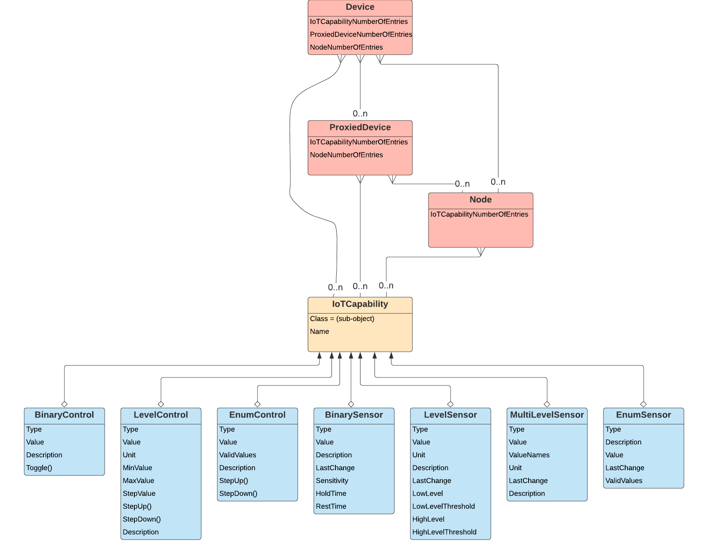
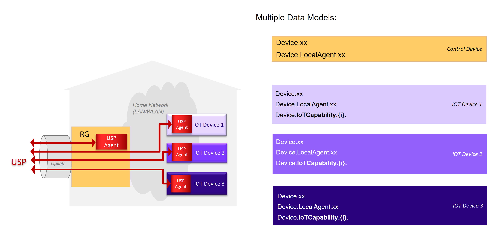
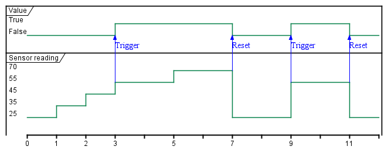
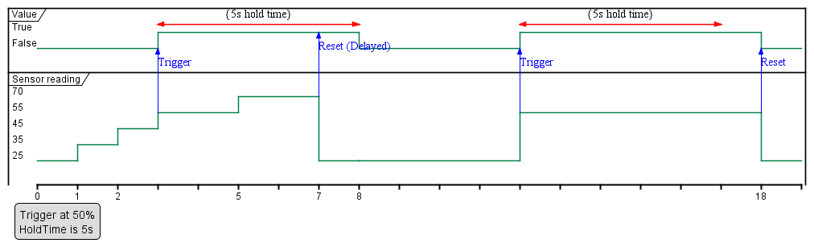
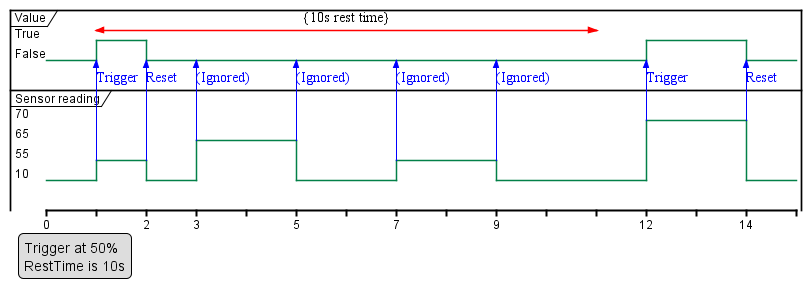
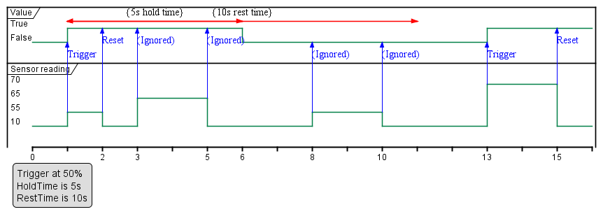

# IoT Data Model Theory of Operation {.appendix1}

## Introduction

Since there are thousands of different Internet of Things (IoT) devices, the data model needs a flexible modular way to support them using generic building block templates. To achieve this, an IoT device is represented in the data model by sensor and control capabilities:

* Sensor capabilities, which allow reading a state, e.g. a temperature value, a battery level, a light color, etc.
* Control capabilities, which allow changing a value, e.g. set a temperature, switch a light etc.

The Device:2 Data Model [@TR-181] defines capability Objects that reflect capabilities found on many different devices (example: BinaryControl). By using these Objects, a large ecosystem of devices can be described using a small set of capabilities (see table below).

##  IoT data model overview

The figure shows the overall structure of the IoT data model:



The data model defines an IoT Capability table, whose instances describe the IoT device's exposed capabilities. The capability table can appear directly under the `Device.` Object (if the IoT device hosts a USP Agent) or under a `Device.ProxiedDevice.{i}.`  or `Device.ProxiedDevice.{i}.Node.{i}.` instance.

### IoT Capability table

A capability is represented in the `Device.IoTCapability.` table as a generic Object Instance with a specific class, and an instantiated Sub-Object depending on this class. The class name is defined by the Sub-Object name in a `Class` Parameter for each IoT Capability table entry, to allow the Controller to detect the instantiated Sub-Object.

Only one out of the following Sub-Objects can exist per instance:

| Capability Sub-Object | Description                              |
| --------------------- | ---------------------------------------- |
| `BinaryControl`       | Allows setting a binary value (e.g. on or off) |
| `LevelControl`        | Allows setting a continuous value in a predefined range |
| `EnumControl`         | Allows setting a value from a predefined set of values |
| `BinarySensor`        | Provides a binary reading value (true/false) |
| `LevelSensor`         | Provides a continuous reading value      |
| `MultiLevelSensor`    | Provides multiple reading values, which belong together |

Each IoT capability Sub-Object has a `Type` Parameter to identify the functionality the capability is representing. See the [Type definition](#sec:) section for details.

### Node Object table

The `Device.Node.{i}.` and `Device.ProxiedDevice.{i}.Node.{i}.` Objects are mount points that provide the ability to support complex devices - that is, a group of capabilities. Each node is a container for a group of device capabilities that have a direct relationship with each other (sub-device) and a hierarchal relationship with the top-level. A node may have the same capabilities as the top-level, but applicable only for the node, with no impact to the top-level. Capabilities for the top-level node may have an effect on the lower level nodes, such as power.

## Architecture mappings

### Individual IoT devices

Stand-alone IoT devices, which are capable of supporting their own USP Agent, provide their own data models, which expose the IoT sensor and control capabilities of the device:



Each device registers as an individual entity to the USP Controller. With the help of `Node` Objects, the capabilities can be additionally structured (not shown in the picture).

### Proxied IoT devices

IoT devices connected over a proxy protocol (e.g. ZigBee) with an IoT control device hosting the USP Agent are modeled as proxied devices (i.e., using the `Device.ProxiedDevice.` table) in the data model of the control device's USP Agent:


Each IoT device is represented as a `Device.ProxiedDevice.{i}.` instance in the data model of the control device, which exposes its IoT capabilities in the corresponding Objects. The capabilities can be additionally structured with the help of `Node` Object (not shown in the picture).

## IoT data model Object details

### Common capability Parameters

These Parameters have the same behavior for all capability Sub-Objects, where defined.

#### Type definition

**Applies to:** All capability Sub-Objects

All capability Objects contain a mandatory `Type` enumeration value.

The `Type` value is a predefined enumeration value with the goal of giving a unified description of the capability Object.  If the `Type`  value requires further detail, the `Description` Parameter may provided a further definition.

*Note: The `Type` enumeration in the data model can also, like all Parameters, be extended using the rules defined in TR-106 [@TR-106].*

#### Unit definition

**Applies to:** LevelControl, LevelSensor, MultilevelSensor

To define the used unit a similar concept as for the type definition is used. The definition consists of the `Unit` enumeration value.

The `Unit` value is a predefined enumeration value with the goal of giving a unified representation of the used unit.

*Note: The `Unit` enumeration in the data model can also, like all Parameters, be extended using the rules defined in TR-106 [@TR-106].*

*Note:  Imperial units are intentionally not modeled in favor of the metric system to increase the inter-working. If the Controller needs imperial units, it can easily convert the metric units into imperial ones by using the well-defined conversion routines.*


### Control Objects

Control Objects represent IoT capabilities that involve the manipulation of device or application states. They include Binary Controls, Level Controls, and Enumerated Controls.

#### BinaryControl

The binary controller defines the simplest type of controller, which allows to switch between two values like true/false, on/off, full/empty, etc. Its value is modeled as a Boolean, which can be either `true` or `false`.

The minimum definition of a "BinaryControl" consists of:

```
    IoTCapability.i.Class               = "BinaryControl"
    IoTCapability.i.BinaryControl.Type  = ...
    IoTCapability.i.BinaryControl.Value = ...
```

The value can be changed either directly by a USP Set operation, or via The `Toggle()` command, which corresponds to the behavior of a switch, changing the value to the other state.

#### LevelControl

The level controller capability allows a continuous change of a value within a predefined range. Its capabilities are defined by these three mandatory Parameters:

* `Unit` - The unit used for the value
* `MinValue` - The minimum value the value can be set
* `MaxValue` - The maximum value the value can be set

Implementations have to provide the minimum and maximum values to allow the controller to detect what values can be applied.

The minimum definition of a "LevelControl" consists of:

```
    IoTCapability.i.Class                 = "LevelControl"
    IoTCapability.i.LevelControl.Type     = ...
    IoTCapability.i.LevelControl.Unit     = ...
    IoTCapability.i.LevelControl.MinValue = ...
    IoTCapability.i.LevelControl.MaxValue = ...
    IoTCapability.i.LevelControl.Value    = ...
```

The value can be changed either directly by a USP Set operation, or via the step commands.

If the `StepUp()` command and/or the `StepDown()` command are implemented, the `StepValue` Parameter has to be implemented, which indicates the amount of change triggered by a step command. If resulting value of a step command would exceed the defined range, the operation does not result in a failure - instead, the result is set to the range limit value.

For example, if a temperature range is defined from 5.5 degC to 25 degC with a step value of 1 degC, a step down from 6 degC would result in 5.5 degC and not in 5 degC.

Additionally, if the lowest possible value is already set, a `StepDown()` will not change the current value, since the defined minimum range would be exceeded. The same also applies to the maximum value and `StepUp()` command.

#### EnumControl

The enumeration controller capability allows setting one of a set of predefined values. Examples are mode selections, with more than two modes. If only two values exist, the binary controller Object is preferred.

The minimum definition of an "EnumControl" consists of:

```
    IoTCapability.i.Class                   = "EnumControl"
    IoTCapability.i.EnumControl.Type        = ...
    IoTCapability.i.EnumControl.ValidValues = <list of possible values>
    IoTCapability.i.EnumControl.Value       = <current value>
```

The value can be changed either directly by a USP Set operation, or via the step commands.

The step commands will cycle through the value range, meaning that if the last valid value is reached, the next `StepUp()` command will select the first value of the valid values and vice versa for the `StepDown()` command. The valid values are stored in the Parameter `ValidValues` as a comma-separated list; that order of the list will be followed by the step commands.

It is possible to implement only one of the step commands, if only one direction is needed.

### Sensor Objects

Sensor Objects represent IoT capabilities that involve reading or reporting on a device or application state. They include Binary Sensors, Level Sensors, and Enumerated Sensors, along with support for thresholds and triggering events.

#### Binary Sensor

The binary sensor Object Instance supports different kinds of binary sensor operations:

* Simple binary state, e.g. a door or window state
* Threshold trigger, e.g. trigger a Carbon Dioxide Alarm if a certain threshold is exceeded.
* Repeated trigger with grace period, e.g. movement detector.

##### Simple binary state sensor

To model a simple sensor, which changes between two distinct states (e.g. a window or door open/close sensor), only the `Value` Parameter is needed.

The minimum definition of a BinarySensor consists of:

```
    IoTCapability.i.Class              = "BinarySensor"
    IoTCapability.i.BinarySensor.Type  = ...
    IoTCapability.i.BinarySensor.Value = {true/false}
```

The values of `true` and `false` represent the two possible `Value` states. Each time the state changes the value toggles.

For example, a motion sensor would be modeled as:

```
    IoTCapability.i.Class              = "BinarySensor"
    IoTCapability.i.BinarySensor.Type  = "MotionDetected"
    IoTCapability.i.BinarySensor.Value = true
```

Note that binary sensor types are meaningful for binary state behavior, e.g., "WindowOpen" rather than "Window".

##### Threshold trigger sensor

To model a sensor, which additionally triggers on a certain threshold, add the `Sensitivity` Parameter to the definition:

```
    IoTCapability.1.Class                    = "BinarySensor"
    IoTCapability.1.BinarySensor.Type        = "CarbonDioxideDetected"
    IoTCapability.1.BinarySensor.Value       = {true/false}
    IoTCapability.1.BinarySensor.Sensitivity = 50
```

With the `Sensitivity` Parameter, the threshold is controlled. As soon as the measured value exceeds the threshold, the `Value` Parameter is set to `true`. As soon as the measured value goes below the threshold the `Value` Parameter is set to `false`.



The sensitivity value is a relative value in the range 0 to 100 percent. The exact meaning depends on the implementation.

##### Trigger time control

If the sensor state, after being triggered, should stay active for a minimum period, the `HoldTime` Parameter is used:

```
    IoTCapability.1.Class                    = "BinarySensor"
    IoTCapability.1.BinarySensor.Type        = "CarbonDioxideDetected"
    IoTCapability.1.BinarySensor.Value       = {true/false}
    IoTCapability.1.BinarySensor.Sensitivity = 50
    IoTCapability.1.BinarySensor.HoldTime    = 5000
```

This figure shows the effect of the `HoldTime` Parameter on the resulting value:



If the `HoldTime` Parameter is not implemented or is set to `0`, the handling is disabled.

##### Repeated trigger with grace period

Some sensors might produce too many triggers, e.g. continuous movement, when only one trigger in a specific time period is needed. To filter these the `RestTime` Parameter is used:

```
    IoTCapability.1.Class                    = "BinarySensor"
    IoTCapability.1.BinarySensor.Type        = "CarbonDioxideDetected"
    IoTCapability.1.BinarySensor.Value       = {true/false}
    IoTCapability.1.BinarySensor.Sensitivity = 50
    IoTCapability.1.BinarySensor.RestTime    = 10000
```

With this setting, new trigger events are ignored for 10 seconds (10000 miliseconds) after the first trigger has been detected, resulting in the following pattern:



If the `RestTime` Parameter is not implemented or is set to `0`, the handling is disabled.

##### Repeated trigger with minimum duration

To get readings with a minimum duration, combine rest and hold times:

```
    IoTCapability.1.Class                    = "BinarySensor"
    IoTCapability.1.BinarySensor.Type        = "CarbonDioxideDetected"
    IoTCapability.1.BinarySensor.Value       = {true/false}
    IoTCapability.1.BinarySensor.Sensitivity = 50
    IoTCapability.1.BinarySensor.HoldTime    = 5000
    IoTCapability.1.BinarySensor.RestTime    = 10000
```

Which results in the following pattern:



#### Level Sensor

The `LevelSensor` Object provides a template for modeling devices that report various levels. `LevelSensor` is used to reflect the functionality of a sensor that reports a level in units and supports different kinds of sensor operation:

* Level reading
* Additional Threshold trigger: e.g., a Battery Alarm is triggered.

##### Level reading

To model a level reading, the reading value and its unit are defined.
The minimum definition of a `LevelSensor` consists of:

```
    IoTCapability.i.Class             = "LevelSensor"
    IoTCapability.i.LevelSensor.Type  = ...
    IoTCapability.i.LevelSensor.Unit  = ...
    IoTCapability.i.LevelSensor.Value = ...
```

For example, to show the remaining load of a battery in percent, this capability would have the following values:

```
    IoTCapability.1.Class             = "LevelSensor"
    IoTCapability.1.LevelSensor.Type  = "Battery"
    IoTCapability.1.LevelSensor.Unit  = "%"
    IoTCapability.1.LevelSensor.Value = 63"
```

With this definition, the remaining load is expressed in percent, here 63 percent.
Since the unit value is a decimal type it is also possible to specify fractions for the value:

```
    IoTCapability.1.Class = "LevelSensor"
    IoTCapability.1.LevelSensor.Type  = "Battery"
    IoTCapability.1.LevelSensor.Unit  = "%"
    IoTCapability.1.LevelSensor.Value = 63.26
```

This expresses a total remaining load of 63.26 percent.

##### Threshold trigger

In cases where not only the actual value is of interest, but also important to know if a predefined threshold is reached or undershot, the `LevelSensor` Object can be extended with threshold Parameters. Once the `LowLevel` or `HighLevel` Parameter is `true`, it will remain `true` until the device is reset or the condition no longer exists. This will depend on the particular device.

| Parameter            | Type    | R/W  | Description                              |
| -------------------- | ------- | ---- | ---------------------------------------- |
| `LowLevel`           | boolean | R    | True means that the low level threshold is reached or undershot. |
| `LowLevelThreshold`  | decimal | R/W  | The defined low level value.             |
| `HighLevel`          | boolean | R    | True means that the high level threshold is reached or exceeded. |
| `HighLevelThreshold` | decimal | R/W  | The defined high level value.            |

Table 17 – IoT LevelSensor threshold Parameters

When modeling a battery with a `LevelSensor` Object, an additional low level warning (Boolean) may be supported along with a Low Level threshold that provides a setting for the warning. The resulting Object looks like this:

```
    IoTCapability.1.Class                         = "LevelSensor"
    IoTCapability.1.LevelSensor.Type              = "Battery"
    IoTCapability.1.LevelSensor.Unit              = "%"
    IoTCapability.1.LevelSensor.LowLevelThreshold = 20
    IoTCapability.1.LevelSensor.Value             = 19
    IoTCapability.1.LevelSensor.LowLevel          = true
```

*Note:  For more complex scenarios, like having a grace period, the binary sensor Object can be used instead of the LowLevel or HighLevel Threshold Parameters.*

##### Multi Level Sensor

A `MultiLevelSensor` instance models sensors, which provide a set of related values with the same unit.

The minimum definition of a "MultiLevelSensor" consists of:

```
    IoTCapability.i.Class                   = "MultiLevelSensor"
    IoTCapability.i.MultiLevelSensor.Type   = ...
    IoTCapability.i.MultiLevelSensor.Unit   = ...
    IoTCapability.i.MultiLevelSensor.Values = ...
    IoTCapability.1.MultiLevelSensor.ValueNames = ...
```

An example is a location reading consisting of the two values longitude and latitude in decimal degree notation, which have to be read together:

```
    IoTCapability.1.Class                       = "MultiLevelSensor"
    IoTCapability.1.MultiLevelSensor.Type       = "Location"
    IoTCapability.1.MultiLevelSensor.Unit       = "deg"
    IoTCapability.1.MultiLevelSensor.Values     = "48.1372056,11.57555"
    IoTCapability.1.MultiLevelSensor.ValueNames = "Latitude,Longitude"
```

This example uses the Parameter `ValueNames` to provide information about the individual value meanings.

#### Enum Sensor

An `EnumSensor` instance provides a reading value from a predefined set of values. This allows modeling of sensors, which can output discreet values from a predefined set.

The minimum definition of an "EnumSensor" consists of:

```
    IoTCapability.i.Class                  = "EnumSensor"
    IoTCapability.i.EnumSensor.Type        = ...
    IoTCapability.i.EnumSensor.Unit        = ...
    IoTCapability.i.EnumSensor.ValidValues = ...
    IoTCapability.i.EnumSensor.Value       = ...
```

The `ValidValues` Parameter determines the set of values, which will be delivered by the sensor.

For example, a traffic light could be modeled as:

```
    IoTCapability.1.Class                  = "EnumSensor"
    IoTCapability.1.EnumSensor.Type        = "X_<oui>_TrafficLight"
    IoTCapability.1.EnumSensor.ValidValues = "Red, Yellow, Green"
    IoTCapability.1.EnumSensor.Value       = "Green"
```

## Examples

This chapter gives several examples how to model IoT Devices.

### Example: A/C Thermostat

This example shows an A/C Thermostat connected over Z-Wave as a proxied device of an IoT Gateway:

Structure elements:

* IoTCapability.1 (EnumControl) :  Operation Mode
* IoTCapability.2 (LevelControl) : Cool Temperature in range from 14 to 25 degC
* IoTCapability.3 (LevelControl) : Heat Temperature in range from 14 to 25 degC
* IoTCapability.4 (LevelControl) : Energy Saving Cool Temperature in range from 14 to 25 degC
* IoTCapability.5 (LevelControl) : Energy Saving Heat Temperature in range from 14 to 25 degC
* IoTCapability.6 (LevelSensor) : Current Temperature
* IoTCapability.7 (EnumControl) : Fan Mode Control
* IoTCapability.8 (EnumSensor) : Current Fan Operating State

Instantiated data model:

```
    ProxiedDevice.1.Type                                    = "Thermostat"
    ProxiedDevice.1.Online                                  = true
    ProxiedDevice.1.ProxyProtocol                           = "Z-Wave"

    ProxiedDevice.1.IoTCapabilityNumberOfEntries            = 9

    ProxiedDevice.1.IoTCapability.1.Class                   = "EnumControl"
    ProxiedDevice.1.IoTCapability.1.EnumControl.Type        = "ThermostatMode"
    ProxiedDevice.1.IoTCapability.1.EnumControl.Value       = "Cool"
    ProxiedDevice.1.IoTCapability.1.EnumControl.ValidValues = "Heat, Cool,
                                                              Energy_heat,
                                                              Energy_cool, Off,
                                                              Auto"

    ProxiedDevice.1.IoTCapability.2.Class                   = "LevelControl"
    ProxiedDevice.1.IoTCapability.2.LevelControl.Type       = "Temperature"
    ProxiedDevice.1.IoTCapability.2.LevelControl.Description = "TargetCoolTemperature"
    ProxiedDevice.1.IoTCapability.2.LevelControl.Value      = 17
    ProxiedDevice.1.IoTCapability.2.LevelControl.Unit       = "degC"
    ProxiedDevice.1.IoTCapability.2.LevelControl.MinValue   = 14
    ProxiedDevice.1.IoTCapability.2.LevelControl.MaxValue   = 25

    ProxiedDevice.1.IoTCapability.3.Class                   = "LevelControl"
    ProxiedDevice.1.IoTCapability.3.LevelControl.Type       = "Temperature"
    ProxiedDevice.1.IoTCapability.3.LevelControl.Description = "TargetHeatTemperature"
    ProxiedDevice.1.IoTCapability.3.LevelControl.Value      = 21
    ProxiedDevice.1.IoTCapability.3.LevelControl.Unit       = "degC"
    ProxiedDevice.1.IoTCapability.3.LevelControl.MinValue   = 14
    ProxiedDevice.1.IoTCapability.3.LevelControl.MaxValue   = 25

    ProxiedDevice.1.IoTCapability.4.Class                   = "LevelControl"
    ProxiedDevice.1.IoTCapability.4.LevelControl.Type       = "Temperature"
    ProxiedDevice.1.IoTCapability.4.LevelControl.Description = "TargetEnergyCoolTemp"
    ProxiedDevice.1.IoTCapability.4.LevelControl.Value      = 19
    ProxiedDevice.1.IoTCapability.4.LevelControl.Unit       = "degC"
    ProxiedDevice.1.IoTCapability.4.LevelControl.MinValue   = 14
    ProxiedDevice.1.IoTCapability.4.LevelControl.MaxValue   = 25

    ProxiedDevice.1.IoTCapability.5.Class                   = "LevelControl"
    ProxiedDevice.1.IoTCapability.5.LevelControl.Type       = "Temperature"
    ProxiedDevice.1.IoTCapability.5.LevelControl.Description = "TargetEnergyHeatTemp"
    ProxiedDevice.1.IoTCapability.5.LevelControl.Value      = 19
    ProxiedDevice.1.IoTCapability.5.LevelControl.Unit       = "degC"
    ProxiedDevice.1.IoTCapability.5.LevelControl.MinValue   = 14
    ProxiedDevice.1.IoTCapability.5.LevelControl.MaxValue   = 25

    ProxiedDevice.1.IoTCapability.6.Class                   = "LevelSensor"
    ProxiedDevice.1.IoTCapability.6.LevelSensor.Type        = "Temperature"
    ProxiedDevice.1.IoTCapability.6.LevelSensor.Value       = 19.5
    ProxiedDevice.1.IoTCapability.6.LevelSensor.Unit        = "degC"

    ProxiedDevice.1.IoTCapability.7.Class                   = "EnumControl"
    ProxiedDevice.1.IoTCapability.7.EnumControl.Type        = "FanMode"
    ProxiedDevice.1.IoTCapability.7.EnumControl.Value       = "Low"
    ProxiedDevice.1.IoTCapability.7.EnumControl.ValidValues = "Auto_low, Low,
                                                              Circulation, Off"

    ProxiedDevice.1.IoTCapability.8.Class                   = "EnumSensor"
    ProxiedDevice.1.IoTCapability.8.EnumSensor.Type         = "OperatingState"
    ProxiedDevice.1.IoTCapability.8.EnumSensor.Value        = "Cooling"
    ProxiedDevice.1.IoTCapability.8.EnumSensor.ValidValues  =
                "Heating, Cooling,
                FanOnly, PendingHeat, PendingCool, VentEconomizer,
                AuxHeating, 2ndStageHeating, 2ndStageCooling,
                2ndStageAuxHeat, 3rdStageAuxHeat"
```

### Example: Light with a dimmer and switch

This example shows a dimmable light connected over Z-Wave as proxied device to an IoT Gateway.

Structure elements:

* IoTCapability.1 (BinaryControl) : On/Off Switch, expressed as `true` and `false` value
* IoTCapability.2 (LevelControl) : Brightness control from 0% to 100%

Instantiated data model:

```
    ProxiedDevice.2.Type                                      = "Light"
    ProxiedDevice.2.Online                                    = "true"
    ProxiedDevice.2.ProxyProtocol                             = "Z-Wave"
    ProxiedDevice.2.Name                                      = "GE DimMing Bulb"
    ProxiedDevice.2.IoTCapabilityNumberOfEntries              = 2

    ProxiedDevice.2.IoTCapability.1.Class                     = "BinaryControl"
    ProxiedDevice.2.IoTCapability.1.BinaryControl.Type        = "Switch"
    ProxiedDevice.2.IoTCapability.1.BinaryControl.Value       = true

    ProxiedDevice.2.IoTCapability.2.Class                     = "LevelControl"
    ProxiedDevice.2.IoTCapability.2.LevelControl.Type         = "Brightness"
    ProxiedDevice.2.IoTCapability.2.LevelControl.Value        = 100
    ProxiedDevice.2.IoTCapability.2.LevelControl.Min          = 0
    ProxiedDevice.2.IoTCapability.2.LevelControl.Max          = 100
    ProxiedDevice.2.IoTCapability.2.LevelControl.Unit         = "%"
```

### Example: Fan

This example shows a simple fan connected over Z-Wave as proxied device to an IoT Gateway.

Structure elements:

* IoTCapability.1 (EnumControl) : Fan state

Instantiated data model:

```
    ProxiedDevice.3.Type                                       = "Fan"
    ProxiedDevice.3.Online                                     = "true"
    ProxiedDevice.3.ProxyProtocol                              = "Z-Wave"
    ProxiedDevice.3.name                                       = "GE Fan"
    ProxiedDevice.3.IoTCapabilityNumberOfEntries               = 1

    ProxiedDevice.2.IoTCapability.1.Class                      = "EnumControl"
    ProxiedDevice.3.IoTCapability.1.EnumControl.Type           = "FanMode"
    ProxiedDevice.3.IoTCapability.1.EnumControl.Value          = "Off"
    ProxiedDevice.3.IoTCapability.1.EnumControlValidValues     =
                            "Off, Low, Medium, High, On, Auto, Smart"
```

### Example: Multi-Sensor strip with a common battery.

The sensors are inserted into the strip and may have their own power switch, battery, energy consumption and manufacturer.

Instantiated data model:

```
    ProxiedDevice.4.Type                                             = "SensorStrip"
    ProxiedDevice.4.Online                                           = true
    ProxiedDevice.4.ProxyProtocol                                    = "Z-Wave"
    ProxiedDevice.4.Name                                             = "Insertable Sensor Strip"
    ProxiedDevice.4.IoTCapabilityNumberOfEntries                     = 1
    ProxiedDevice.4.NodeNumberOfEntries                              = 2

    ProxiedDevice.4.IoTCapability.1.Class                            = "LevelSensor"
    ProxiedDevice.4.IoTCapability.1.LevelSensor.Value                = 80
    ProxiedDevice.4.IoTCapability.1.LevelSensor.Unit                 = "%"
    ProxiedDevice.4.IoTCapability.1.LevelSensor.Type                 = "Battery"
    ProxiedDevice.4.IoTCapability.1.LevelSensor.LowLevelThreshold    = 30
    ProxiedDevice.4.IoTCapability.1.LevelSensor.LowLevel             = false

    ProxiedDevice.4.Node.1.Type                                      = "Sensor"
    ProxiedDevice.4.Node.1.IoTCapabilityNumberOfEntries              = 1

    ProxiedDevice.4.Node.1.IoTCapability.1.Class                     = "BinarySensor"
    ProxiedDevice.4.Node.1.IoTCapability.1.BinarySensor.HoldTime     = 0
    ProxiedDevice.4.Node.1.IoTCapability.1.BinarySensor.Sensitivity  = 5
    ProxiedDevice.4.Node.1.IoTCapability.1.BinarySensor.RestTime     = 10000
    ProxiedDevice.4.Node.1.IoTCapability.1.BinarySensor.Value        = false
    ProxiedDevice.4.Node.1.IoTCapability.1.BinarySensor.Type         = "MotionDetected"
    ProxiedDevice.4.Node.1.IoTCapability.1.BinarySensor.LastSensingTime  = 1573344000
```

### Example: Ceiling Fan with integrated light

This example shows a ceiling fan with integrated light connected over Z-Wave as proxied device to an IoT Gateway.

Structure elements:

* IoTCapability.1 (BinaryControl) :
* Node.1 : Represents the light control
* .IoTCapability.1 (LevelControl) : Brightness control from 0% to 100%
* .IoTCapability.2 (BinaryControl) : On/Off Switch, expressed as `true` and `false` value
* Node.2 : Fan control
* .IoTCapability.1 (EnumControl) : Set fan state

Instantiated data model:

```
    ProxiedDevice.5.Type                                           = "Fan"
    ProxiedDevice.5.Online                                         = true
    ProxiedDevice.5.ProxyProtocol                                  = "Z-Wave"
    ProxiedDevice.5.Name                                           = "42'' Ceiling Fan"

    ProxiedDevice.5.IoTCapabilityNumberOfEntries                   = 1
    ProxiedDevice.5.NodeNumberOfEntries                            = 2

    ProxiedDevice.5.IoTCapability.1.Class                          = "BinaryControl"
    ProxiedDevice.5.IoTCapability.1.BinaryControl.Type             = "Switch"
    ProxiedDevice.5.IoTCapability.1.BinaryControl.State            = true

    ProxiedDevice.5.Node.1.Type                                    = "Light"
    ProxiedDevice.5.Node.1.IoTCapabilityNumberOfEntries            = 2

    ProxiedDevice.5.Node.1.IoTCapability.1.Class                   = "LevelControl"
    ProxiedDevice.5.Node.1.IoTCapability.1.LevelControl.Type       = "Brightness"
    ProxiedDevice.5.Node.1.IoTCapability.1.LevelControl.Value      = 99
    ProxiedDevice.5.Node.1.IoTCapability.1.LevelControl.MinValue   = 0
    ProxiedDevice.5.Node.1.IoTCapability.1.LevelControl.MaxValue   = 100
    ProxiedDevice.5.Node.1.IoTCapability.1.LevelControl.Unit       = "%"

    ProxiedDevice.5.Node.1.IoTCapability.2.Class                   = "BinaryControl"
    ProxiedDevice.5.Node.1.IoTCapability.2.BinaryControl.Type      = "Switch"
    ProxiedDevice.5.Node.1.IoTCapability.2.BinaryControl.Value     = true

    ProxiedDevice.5.Node.2.Type                                    = "Fan"
    ProxiedDevice.5.Node.2.IoTCapabilityNumberOfEntries            = 1

    ProxiedDevice.5.Node.2.IoTCapability.1.Class                   = "EnumControl"
    ProxiedDevice.5.Node.2.IoTCapability.1.EnumControl.Type        = "FanMode"
    ProxiedDevice.5.Node.2.IoTCapability.1.EnumControl.Value       = "Off"
    ProxiedDevice.5.Node.2.IoTCapability.1.EnumControl.ValidValues = "Off, Low,
                                                                  Medium, High,
                                                                  Auto, Smart
```

### Example: Power strip

This example shows a power strip with integrated power measurements connected over Z-Wave as proxied device to an IoT Gateway.

Structure elements:

* IoTCapability.1 (BinaryControl) : On/Off Switch for complete power strip
* IoTCapability.2 (LevelSensor) : Total power reading of strip in KWh.
* Node.1 - 3: Each node represents a power outlet with:
    * .IoTCapability.1 (BinaryControl) : On/Off Switch, expressed as `true` and `false` value
    * .IoTCapability.2 (LevelSensor) : Current power reading of outlet in Watt.
    * .IoTCapability.3 (LevelSensor) : Total used power reading of outlet in KWh.

Instantiated data model:

```
    ProxiedDevice.6.Type                                         = "PowerStrip"
    ProxiedDevice.6.Online                                       = "true"
    ProxiedDevice.6.ProxyProtocol                                = "Z-Wave"
    ProxiedDevice.6.Name                                         = "3 Plug Strip"
    ProxiedDevice.6.IoTCapabilityNumberOfEntries                 = 2
    ProxiedDevice.6.NodeNumberOfEntries                          = 3

    ProxiedDevice.6.IoTCapability.1.Class                        = "BinaryControl"
    ProxiedDevice.6.IoTCapability.1.BinaryControl.Type           = "Switch"
    ProxiedDevice.6.IoTCapability.1.BinaryControl.Value          = true
    ProxiedDevice.6.IoTCapability.3.Class                        = "LevelSensor"
    ProxiedDevice.6.IoTCapability.3 Name                         = "Total Accumulated Power"
    ProxiedDevice.6.IoTCapability.3.LevelSensor.Type             = "Power"
    ProxiedDevice.6.IoTCapability.3.LevelSensor.Unit             = "KWh"
    ProxiedDevice.6.IoTCapability.3.LevelSensor.Value            = "2227,56"

    ProxiedDevice.6.Node.1.Type                                  = "Switch"
    ProxiedDevice.6.Node.1.IoTCapabilityNumberOfEntries          = 3
    ProxiedDevice.6.Node.1.IoTCapability.1.Class                 = "BinaryControl"
    ProxiedDevice.6.Node.1.IoTCapability.1.BinaryControl.Type    = "Switch"
    ProxiedDevice.6.Node.1.IoTCapability.1.BinaryControl.State   = true
    ProxiedDevice.6.Node.1.IoTCapability.2.Class                 = "LevelSensor"
    ProxiedDevice.6.Node.1.IoTCapability.2.LevelSensor.Type      = "Power"
    ProxiedDevice.6.Node.1.IoTCapability.2.LevelSensor.Unit      = "W"
    ProxiedDevice.6.Node.1.IoTCapability.2.LevelSensor.Value     = 99
    ProxiedDevice.6.Node.1.IoTCapability.3.Class                 = "LevelSensor"
    ProxiedDevice.6.Node.1.IoTCapability.3 Name                  = "Accumulated Power"
    ProxiedDevice.6.Node.1.IoTCapability.3.LevelSensor.Type      = "Power"
    ProxiedDevice.6.Node.1.IoTCapability.3.LevelSensor.Unit      = "KWh"
    ProxiedDevice.6.Node.1.IoTCapability.3.LevelSensor.Value     = 390.67

    ProxiedDevice.6.Node.2.Type                                  = "Switch"
    ProxiedDevice.6.Node.2.IoTCapabilityNumberOfEntries          = 3
    ProxiedDevice.6.Node.2.IoTCapability.1.Class                 = "BinaryControl"
    ProxiedDevice.6.Node.2.IoTCapability.1.BinaryControl.Type    = "Switch"
    ProxiedDevice.6.Node.2.IoTCapability.1.BinaryControl.State   = true
    ProxiedDevice.6.Node.2.IoTCapability.2.Class                 = "LevelSensor"
    ProxiedDevice.6.Node.2.IoTCapability.2.LevelSensor.Type      = "Power"
    ProxiedDevice.6.Node.2.IoTCapability.2.LevelSensor.Unit      = "W"
    ProxiedDevice.6.Node.2.IoTCapability.2.LevelSensor.Value     = 76
    ProxiedDevice.6.Node.2.IoTCapability.3.Class                 = "LevelSensor"
    ProxiedDevice.6.Node.2.IoTCapability.3 Name                  = "Accumulated Power"
    ProxiedDevice.6.Node.2.IoTCapability.3.LevelSensor.Type      = "Power"
    ProxiedDevice.6.Node.2.IoTCapability.3.LevelSensor.Unit      = "KWh"
    ProxiedDevice.6.Node.2.IoTCapability.3.LevelSensor.Value     = 1783.63

    ProxiedDevice.6.Node.3.Type                                  = "Switch"
    ProxiedDevice.6.Node.3.IoTCapabilityNumberOfEntries          = 3
    ProxiedDevice.6.Node.3.IoTCapability.1.Class                 = "BinaryControl"
    ProxiedDevice.6.Node.3.IoTCapability.1.BinaryControl.Type    = "Switch"
    ProxiedDevice.6.Node.3.IoTCapability.1.BinaryControl.State   = true
    ProxiedDevice.6.Node.3.IoTCapability.2.Class                 = "LevelSensor"
    ProxiedDevice.6.Node.3.IoTCapability.2.LevelSensor.Type      = "Power"
    ProxiedDevice.6.Node.3.IoTCapability.2.LevelSensor.Unit      = "W"
    ProxiedDevice.6.Node.3.IoTCapability.2.LevelSensor.Value     = 0
    ProxiedDevice.6.Node.3.IoTCapability.3.Class                 = "LevelSensor"
    ProxiedDevice.6.Node.3.IoTCapability.3 Name                  = "Accumulated Power"
    ProxiedDevice.6.Node.3.IoTCapability.3.LevelSensor.Type      = "Power"
    ProxiedDevice.6.Node.3.IoTCapability.3.LevelSensor.Unit      = "KWh"
    ProxiedDevice.6.Node.3.IoTCapability.3.LevelSensor.Value     = 53.26
```

### Example: Battery powered radiator thermostat

This example shows the IoT model for a radiator thermostat with an integrated USP Agent, which is directly controlled.

Structure elements:

* IoTCapability.1 (EnumControl): Operation Mode
* IoTCapability.2 (EnumControl): Auto/Manual Temperature setting
* IoTCapability.3 (EnumControl): Vacation Temperature setting
* IoTCapability.4 (LevelSensor) : Current Temperature
* IoTCapability.5 (LevelSensor): Valve position
* IoTCapability.6 (LevelSensor): Battery status

*Note:  All temperature settings are modeled as "EnumControl" to define a range between 4 and 23° degC in steps of 0.5° or an "Off" value.*

Instantiated data model:

```
    Device.DeviceInfo.Description                  = "Battery powered radiator
                                                      thermostat"

    Device.IoTCapabilityNumberOfEntries            = 6

    Device.IoTCapability.1.Class                   = "EnumControl
    Device.IoTCapability.1.EnumControl.Type        = "ThermostatMode"
    Device.IoTCapability.1.EnumControl.ValidValues = "Off, Auto, Manual, Vacation"
    Device.IoTCapability.1.EnumControl.Value       = "Auto"      # current mode

    Device.IoTCapability.2.Class                   = "EnumControl
    Device.IoTCapability.2.Name                    = "Desired Temperature"
    Device.IoTCapability.2.EnumControl.Type        = "TemperatureMode"
    Device.IoTCapability.2.EnumControl.ValidValues = "Off, 4, 4.5, 5.0, 5.5,
                                                     6, 6.5, 7, 7.5, 8, 8.5,
                                                     9, 9.5, 10, 10.5, 11,
                                                     11.5, 12, 12.5, 13, 13.5,
                                                     14, 14.5, 15.0, 15.5, 16,
                                                     16.5, 17, 17.5, 18, 18.5,
                                                     19, 19.5, 20, 20.5, 21,
                                                     21.5, 22, 22.5, 23"
    Device.IoTCapability.2.EnumControl.Value       = 19   # Requested temperature

    Device.IoTCapability.3.Class                   = "EnumControl"
    Device.IoTCapability.3.Name                    = "Vacation Temperature"
    Device.IoTCapability.3.EnumControl.Type        = "TemperatureMode"
    Device.IoTCapability.3.EnumControl.ValidValues = "Off, 4, 4.5, 5.0, 5.5,
                                                     6, 6.5, 7, 7.5, 8, 8.5,
                                                     9, 9.5, 10, 10.5, 11,
                                                     11.5, 12, 12.5, 13, 13.5,
                                                     14, 14.5, 15.0, 15.5, 16,
                                                     16.5, 17, 17.5, 18, 18.5,
                                                     19, 19.5, 20, 20.5, 21,
                                                     21.5, 22, 22.5, 23"
    Device.IoTCapability.3.EnumControl.Value       = 12   # Requested temperature
                                                            # during absence

    Device.IoTCapability.4.Class                   = "LevelSensor"
    Device.IoTCapability.4.Name                    = "Current Temperature"
    Device.IoTCapability.4.LevelSensor.Type        = "Temperature"
    Device.IoTCapability.4.LevelSensor.Unit        = "degC"
    Device.IoTCapability.4.LevelSensor.Value       = 19.3 # Current temperature

    Device.IoTCapability.5.Class                   = "LevelSensor"
    Device.IoTCapability.5.Name                    = "Valve Position"
    Device.IoTCapability.5.LevelSensor.Type        = "Position"
    Device.IoTCapability.5.LevelSensor.Unit        = "%"
    Device.IoTCapability.5.LevelSensor.MinValue    = 0
    Device.IoTCapability.5.LevelSensor.MaxValue    = 100
    Device.IoTCapability.5.LevelSensor.Value       = 16     # e.g. 16% valve
                                                               # opening

    Device.IoTCapability.6.Class                   = "LevelSensor"
    Device.IoTCapability.6.Name                    = "Local Battery"
    Device.IoTCapability.6.LevelSensor.Type        = "Battery"
    Device.IoTCapability.6.LevelSensor.Unit        = "%"
    Device.IoTCapability.6.LevelSensor.MinValue    = 0
    Device.IoTCapability.6.LevelSensor.MaxValue    = 100
    Device.IoTCapability.6.LevelSensor.Value       = 82      # e.g. 82% battery load
```
