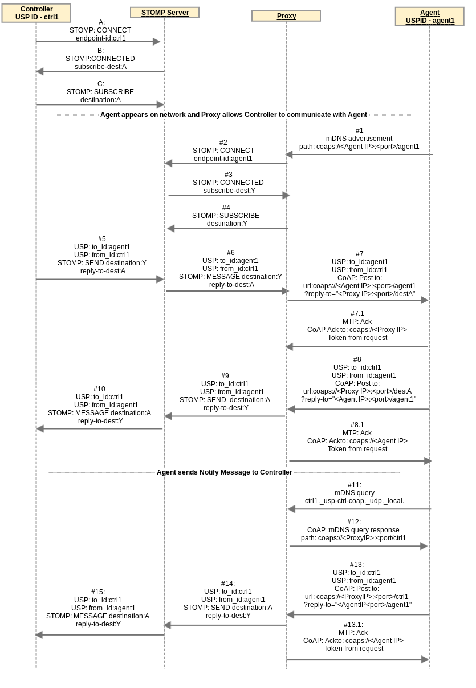

<!-- Reference Links -->
[1]:	https://broadbandforum.github.io/usp-data-models/ "TR-181 Issue 2 Device:2 Data Model"
[2]: https://www.broadband-forum.org/technical/download/TR-069.pdf	"TR-069 Amendment 6	CPE WAN Management Protocol"
[3]:	https://www.broadband-forum.org/technical/download/TR-106_Amendment-8.pdf "TR-106 Amendment 8	Data Model Template for TR-069 Enabled Devices"
[4]:	https://tools.ietf.org/html/rfc7228 "RFC 7228	Terminology for Constrained-Node Networks"
[5]:	https://tools.ietf.org/html/rfc2136	"RFC 2136 Dynamic Updates in the Domain Name System"
[6]:	https://tools.ietf.org/html/rfc3007	"RFC 3007 Secure Domain Name System Dynamic Update"
[7]:	https://tools.ietf.org/html/rfc6763	"RFC 6763 DNS-Based Service Discovery"
[8]:	https://tools.ietf.org/html/rfc6762	"RFC 6762 Multicast DNS"
[9]:	https://tools.ietf.org/html/rfc7252	"RFC 7252 The Constrained Application Protocol (CoAP)"
[10]:	https://tools.ietf.org/html/rfc7390	"RFC 7390 Group Communication for the Constrained Application Protocol (CoAP)"
[11]:	https://tools.ietf.org/html/rfc4033	"RFC 4033 DNS Security Introduction and Requirements"
[12]:	https://developers.google.com/protocol-buffers/docs/proto3 "Protocol Buffers v3	Protocol Buffers Mechanism for Serializing Structured Data Version 3"
[13]: https://regauth.standards.ieee.org/standards-ra-web/pub/view.html#registries "IEEE Registration Authority"
[14]: https://tools.ietf.org/html/rfc4122 "RFC 4122 A Universally Unique IDentifier (UUID) URN Namespace"
[15]: https://tools.ietf.org/html/rfc5280 "RFC 5290 Internet X.509 Public Key Infrastructure Certificate and Certificate Revocation List (CRL) Profile"
[16]: https://tools.ietf.org/html/rfc6818 "RFC 6818 Updates to the Internet X.509 Public Key Infrastructure Certificate and Certificate Revocation List (CRL) Profile"
[17]: https://tools.ietf.org/html/rfc2234 "RFC 2234 Augmented BNF for Syntax Specifications: ABNF"
[18]: https://tools.ietf.org/html/rfc3986 "RFC 3986 Uniform Resource Identifier (URI): Generic Syntax"
[19]: https://tools.ietf.org/html/rfc2141 "RFC 2141 URN Syntax"
[20]: https://tools.ietf.org/html/rfc6455 "RFC 6455 The WebSocket Protocol"
[21]: https://stomp.github.io/stomp-specification-1.2.html "Simple Text Oriented Message Protocol"
[22]: https://tools.ietf.org/html/rfc5246 "The Transport Layer Security (TLS) Protocol Version 1.2"
[23]: https://tools.ietf.org/html/rfc6347 "Datagram Transport Layer Security Version 1.2"
[Conventions]: https://tools.ietf.org/html/rfc2119 "Key words for use in RFCs to Indicate Requirement Levels"

# Appendix IV - Proxying

1. [Proxying Building Block Functions](#proxying_building_block_functions)
2. [Discovery Proxy](#discovery_proxy)
3. [Connectivity Proxy](#connectivity_proxy)
4. [Message Transfer Protocol (MTP) Proxy](#MTP_proxy)
    1. [MTP Header Translation Algorithms](#MTP_header_translation_algorithms)
    2. [CoAP / STOMP MTP Proxy Example Message Flow](#CoAP_STOMP_MTP_proxy_example)
5. [USP to Non-USP Proxy](#USP_to_non-USP_proxy)

This appendix describes a variety of proxies that can be created and deployed in order to enhance the USP experience.

The types of proxies described are:

* Discovery Proxy: proxies discovery and advertisement; does not proxy USP messages
* Connectivity Proxy: proxies USP messages at the IP layer; does not care about MTP or USP message headers or content; may do message caching for sleeping devices
* MTP Proxy: proxies USP messages at the MTP layer and below; does not care about USP Message headers or content; may do message caching for sleeping devices \[*Note: The MTP Proxy may choose to look at the USP Record to get information related to USP Endpoints, especially when proxying WebSocket MTP.*\]
* USP to Non-USP Proxy: Proxies between USP and a non-USP management or control protocol

<a id='proxying_building_block_functions' />

## Proxying Building Block Functions

These proxies are comprised of one or more of the building block functions described in the [Table PRX.1](#table_PRX1).

<a id='table_PRX1' />
Table PRX.1: Proxy Building Block Functions

| Function | Description |
| -------- | ----------- |
| *L3/4 Translation Function* | Translates up to and including the IP and transport layer (e.g., UDP, TCP) protocol headers, while leaving all higher layer protocol headers and payloads untouched. |
| *MTP Translation Function* | Translates up to and including the Message Transfer Protocol (MTP) header, while leaving the USP Record untouched. Requires knowledge of how to bind USP to two or more MTPs. |
| *USP to non-USP Translation Function* | Translates all headers and the USP Record and USP Message into data model and headers of another management protocol. Requires proxy to have an Agent. |
| *Caching Function* | Can hold on to USP Messages intended for Endpoints that are intermittently connected, until a time when that Endpoint is connected. The USP Message is not altered, so no Endpoint is required to be aware of the existence of this function. |
| *Non-USP Advertisement Function* | Responds to discovery queries using protocols other than USP (e.g., DNS-SD, DNS, DHCP) on behalf of Endpoints. May include a DNS Server. See Discovery section for formatting of various non-USP discovery protocols in the context of USP. |
| *Non-USP Discovery Function* | Discovers Endpoints through discovery queries using protocols other than USP. See Discovery section for formatting of various non-USP discovery protocols in the context of USP. |
| *Agent USP Advertisement Function* | Maintains a USP data model table of discovered Agents. Requires an Agent. |

<a id='discovery_proxy' />

## Discovery Proxy

A Discovery Proxy simply repeats the exact information that it discovers from Endpoints. This is particularly useful in a multi-segment LAN, where mDNS messages do not cross segment boundaries. The [DNS-SD Discovery Proxy](https://tools.ietf.org/html/draft-ietf-dnssd-hybrid) functionality is recommended as a component of a Discovery Proxy. When used inside a LAN, this would need the *Non-USP Discovery Function* and the *Non-USP Advertisement Function* described in [Table PRX.1](#table_PRX1).

An *Agent USP Advertisement Function* would be needed to support Endpoints in different networks (e.g., discovery of Agents on the LAN by a Controller on the WAN).

USP Messages between proxied Endpoints go directly between the Endpoints and do not go across the Discovery Proxy. The Discovery Proxy has no role in USP outside discovery.

<a id='connectivity_proxy' />

## Connectivity Proxy

This describes proxying of discovery and IP connectivity of Endpoints that need IP address or port translation to communicate, and/or do not maintain continual IP connectivity. The Connectivity Proxy may cache USP Messages on behalf of Endpoints that do not maintain continual connectivity.  The USP Message is not processed by the proxy function, but it does go through the proxy for address translation or so it can be cached, if necessary. Therefore, the connectivity information provided by the Connectivity Proxy directs IP packets (that contain the USP Records) be sent to the proxy and not to the destination IP address of the Endpoint being proxied.

Both Endpoints must be using the same MTP. This Proxy translates the IP address (and possibly the TCP or UDP port) from the Connectivity Proxy to the proxied Endpoint, but does not touch (or need to understand) the MTP headers or USP Message.

It is also possible to combine the caching functionality with the MTP Proxy, by adding the *Caching Function* to the MTP Proxy (see Section 3).

In order to serve as a Connectivity Proxy, the following functions (from [Table PRX.1](#table_PRX1)) are needed:
1. *L3/4 Translation Function*
1. Depending on whether the proxy is on the same network as the proxied Endpoints:
   1. *Non-USP Discovery Function* and/or otherwise determined/configured knowledge of Agent(s)
   1. *Non-USP Advertisement Function* and/or *Agent USP Advertisement Function*

The Connectivity Proxy can also include the *Caching Function* to support Endpoints with intermittent connectivity.

<a id='MTP_proxy' />

## Message Transfer Protocol (MTP) Proxy

This describes proxying between two USP Endpoints that do not support a common MTP. The USP Record is untouched by the proxy function. MTP and IP headers are changed by the proxy.

In order to serve as a MTP Proxy, the following functions (from [Table PRX.1](#table_PRX1)) are needed:

1. *MTP Translation Function*
1. Depending on whether it is on the same network as the proxied Agents and/or the Controller that wants to communicate with those Agents:
   1. *Non-USP Discovery Function* and/or otherwise determined/configured knowledge of Agent(s)
   1. *Non-USP Advertisement Function* and/or *Agent USP Advertisement Function* 

The MTP Proxy can also include the *Caching Function* to support Endpoints with intermittent connectivity.

<a id='MTP_header_translation_algorithms' />

### MTP Header Translation Algorithms

In order to implement a meaningful translation algorithm, the MTP Proxy will need to:
1. Maintain mapping of discovered or configured Endpoint information to information the MTP Proxy generates or is configured with. This allows it to advertise that Endpoint on a different MTP and to translate the MTP when it receives a message destined for that Endpoint.
1. Maintain a mapping of received "reply to" and other connection information to connection and "reply to" information included by the MTP Proxy in the sent message. This allows it to translate the MTP when it receives a response message destined for that Endpoint.
1. Identify the target Endpoint for a received message.

The following information will need to be stored in a maintained mapping for an Endpoint:

1. URL -or- the IP Address (es) (IPv4 and/or IPv6) and UDP or TCP ports -or- the socket for an established connection (note that the information and configured data needed to establish this connection is out-of-scope of this specification)
1. MTP-specific destination information (including destination resource)
   1. For CoAP, this is the uri-path of the CoAP server Endpoint resource
   1. For WebSocket, this is either an established WebSocket connection or the WebSocket server Endpoint resource
   1. For STOMP, this is the STOMP destination of the Endpoint
   1. For MQTT, this is a Topic that is subscribed to by the Endpoint 

This mapping information is used to construct important parts of the sent IP, UDP/TCP, and MTP headers. Other information used to construct these headers may come from the received MTP Headers or even the received USP Record.

The following table describes possible ways to accomplish the activities for proxying from or to a particular MTP, and possible sources of  information. Other possibilities for proxying between two MTPs may also exist. This table is not normative and is not intended to constrain implementations.

Table PRX.2: Possible MTP Proxy Methods

| MTP | Activity | when Proxying from | when Proxying to |
| --- | -------- | ------------------ | ---------------- |
| CoAP | Maintain mapping of discovered/configured info to advertised info | store discovered CoAP path/url/IP address/port with "reply to" and/or connectivity info for other MTP | generate a CoAP *uri-path* for discovered info |
|  | Maintain mapping of received info | store received *uri-query reply-to* CoAP parameter with "reply to" and/or connectivity info of the sent message | store the supplied "reply to" and/or connectivity info with a generated CoAP *uri-path* |
|  | Identify target USP Endpoint for a received message | possible source: received CoAP *uri-path* | put value from a maintained mapping in *uri-path* and use IP address and port from mapping |
| WebSocket | Maintain mapping of discovered/configured info to advertised info | store WebSocket connection info (and Endpoint ID, if socket is used for more than one Endpoint) with "reply to" and/or connectivity info for other MTP | establish WebSocket connection or associate Endpoint with existing connection, for discovered info |
|  | Maintain mapping of received info | store WebSocket connection info (and Endpoint ID, if socket is used for more than one Endpoint) with "reply to" and/or connectivity info for other MTP | store the supplied "reply to" and/or connectivity info with a WebSocket connection (and Endpoint ID, if socket is used for more than one Endpoint) |
|  | Identify target USP Endpoint for a received message | possible source: WebSocket connection established per proxied Endpoint   possible source: to\_id in USP Record | send over WebSocket connection associated with the proxied Endpoint |
| STOMP | Maintain mapping of discovered/configured info to advertised info | store subscribed-to STOMP destination with "reply to" and/or connectivity info for other MTP | subscribe to STOMP destination for discovered info |
|  | Maintain mapping of received info | store *reply-to-dest* STOMP header (and associated STOMP connection) with "reply to" or socket info of the sent message | store the supplied "reply to" and/or connectivity info with subscribed-to STOMP destination and connection |
|  | Identify target USP Endpoint for a received message | possible source: received STOMP *destination*   possible source: to\_id in USP Record | put value from maintained mapping in STOMP destination header and use STOMP connection from that mapping |
| MQTT | Maintain mapping of discovered/configured info to advertised info | store subscribed-to Topic (Filter) with "reply to" and/or connectivity info for other MTP | subscribe to MQTT Topic (Filter) for discovered info (if Topic Filter, know which specific Topic to use for "reply to" info) |
|  | Maintain mapping of received info | store Response Topic or other provided "reply to" info (and associated MQTT connection) with "reply to" or connectivity info of the sent message | store the supplied "reply to" and/or connectivity info with a specific MQTT Topic (within subscribed-to Topic Filter) and connection |
|  | Identify target USP Endpoint for a received message | possible source: received MQTT `PUBLISH` Topic Name   possible source: to\_id in USP Record | put value from maintained mapping in MQTT `PUBLISH` Topic Name and use MQTT connection from that mapping |

Figure PRX.1 shows an example of how an MTP Proxy might be used to proxy between an MTP used by a Cloud Server in the WAN and an MTP used inside the LAN. It also shows proxying between MTPs and internal APIs used to communicate with multiple Agents internal to the Services Gateway.

Figure PRX.1: Example of MTP Proxy in LAN with WAN Controller

<a id='CoAP_STOMP_MTP_proxy_example' />

### CoAP / STOMP MTP Proxy Example Message Flow

The following example is provided as a detailed look at a sample CoAP (LAN) / STOMP (WAN) MTP Proxy to describe one possible way to do discovery, connectivity and security. This example makes several assumptions as to the nature of the STOMP connection between the MTP Proxy and the STOMP server, which is completely undefined. It also makes assumptions about implemented, enabled and configured Agent capabilities.

Assumptions include:
* a STOMP connection per proxied device
* the STOMP server supplies a subscribe-dest header in CONNECTED frames (this is optional for a STOMP server)
* there exists some means for the Controller to discover the proxied Agent connection to the STOMP server
* the CoAP Agent does mDNS advertisement (optional but recommended behavior)
* the CoAP Agent and Proxy support and have enabled DTLS
* the CoAP Agent has been configured with the Proxy's certificate for use as a Trusted Broker.
* the proxy uses the subscribe-dest value (supplied by the STOMP server) as the value for the reply-to-dest header.

Figure PRX.2: CoAP-STOMP MTP Proxy Example Flow

**Controller connects to the STOMP server**

**A / B / C**  At any point prior to #5 the USP Controller Endpoint ctrl1 connects to STOMP and subscribes to destination A

* OUT OF SCOPE how the USP Endpoint ctrl1 destination A is discovered by Proxy
* OUT OF SCOPE how the proxied USP Endpoint agent1 STOMP destination Y is discovered by USP Endpoint ctrl1

Agent appears on network and Proxy allows Controller to communicate with Agent

**#1** The USP Endpoint agent1 appears on the network. Proxy receives advertisement and gets the USP Endpoint identifier "agent1" of the Agent (retrieved from mDNS advertisement see R-DIS.8).

**#2** Proxy sends a CONNECT frame to the STOMP server with endpoint-id header of "agent1".

**#3** Proxy receives a subscribe-dest header in the CONNECTED frame identifying the STOMP destination it needs to subscribe to on behalf of agent1.

**#4** The Proxy sends a SUBSCRIBE frame to the STOMP server with destination:Y and stores a mapping of USP Endpoint agent1 with coaps:://\<Agent IP\>:\<port\>/agent1 to this STOMP connection with destination Y.

**#5 / #6** USP Endpoint ctrl1 initiates USP message to agent. Proxy creates a STOMP reply-to-dest:A (on this STOMP connection) to coaps:://\<Proxy IP\>:\<port\>/destA mapping.

**#7/ #7.1** Proxy takes USP Record from the STOMP frame and sends it in a CoAP payload with CoAP URI coming from the step #4 mapping of STOMP destination Y to coap:://\<Agent IP\>:\<port\>/agent1. To secure the communication, the proxy and Agent establish a DTLS session (exchange certificates) and the Agent determines whether the proxy is a Trusted Broker.

**#8 / #8.1**  USP Endpoint agent1 sends a USP Record in reply to ctrl1 using CoAP, to coaps:://\<Proxy IP\>:\<port\>/destA.

**#9 / #10** Proxy takes USP Record from the CoAP payload and sends it in a STOMP SEND frame using the mapping (created in steps #5 / #6) of coaps:://\<Proxy IP\>:\<port\>/destA to STOMP destination A (and associated STOMP connection) created in steps #5 / #6 .

**Agent sends Notify Message to Controller**

These steps include the following additional assumptions:
* Controller has configured Agent with a notification subscription.
* Controller configured Agent with CoAP MTP information for itself.
* Proxy replies to mDNS queries for Controller with "ctrl1" Instance. Controller was able to assume or otherwise determine that Proxy would do this and that its proxied CoAP connection would be discoverable by querying for ctrl1.\_usp-ctrl-coap.\_udp.\_local.
* Proxy can use the previous reply-to-dest header value to reach this Controller

**#11** The Agent sends mDNS query for ctrl1.\_usp-ctrl-coap.\_udp.\_local. 

**#12** The Proxy response to the Agent includes TXT record with path of coaps:://\<Proxy IP\>:\<port\>/ctrl1. This provides a URL for the Agent to use to send a Notify Message to the Controller.

**#13 / #13.1** The Agent may sends a Notify Message to Controller at coaps:://\<Proxy IP\>:\<port\>/ctrl1.

**#14 / #15** Proxy takes the USP Record from the CoAP payload and sends it in a STOMP SEND frame using the mapping (stored in #5 / #6 ) of coaps:://\<Proxy IP\>:\<port\>/destA to STOMP destination:A (and associated STOMP connection).

<a id='USP_to_non-USP_proxy' />

## USP to Non-USP Proxy

This describes proxying between a Controller and some other management protocol with its own data model schema (e.g., UPnP DM, ZigBee, NETCONF, RESTCONF). In this case the proxy is expected to maintain a USP representation of the non-USP data. This requires the proxy to expose itself as a full Agent to the Controller. See the [Device Proxy](../device-proxy/index.md) appendix for the Theory of Operations for the `Device.ProxiedDevice.` object defined in the [Device:2 Data Model][1].

In order to serve as a USP to non-USP Proxy, the *USP to non-USP Translation Function* (from [Table PRX.1](#table_PRX1)) is needed.
