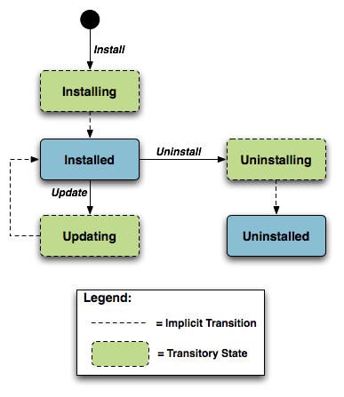
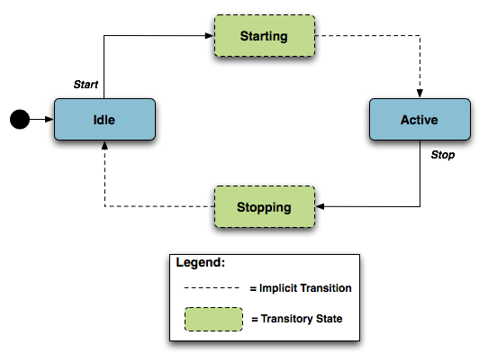
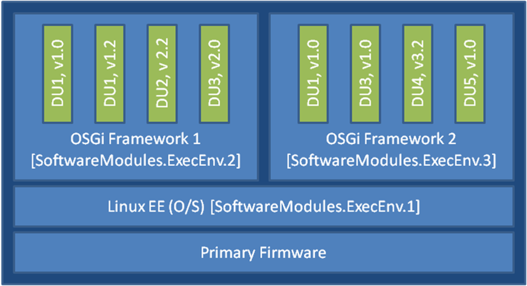
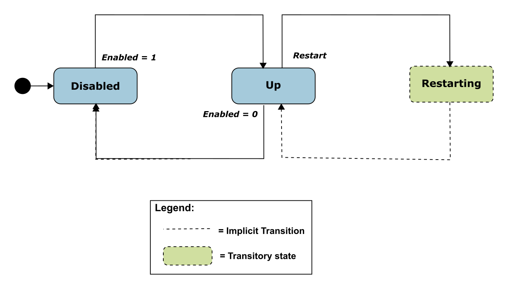

# Software Module Management {.appendix1}

This section discusses the Theory of Operation for Software Module Management using USP and the Software Module Object defined in the Root data model.

As the home networking market matures, devices in the home are becoming more sophisticated and more complex.  One trend in enhanced device functionality is the move towards more standardized platforms and execution environments (such as Java, Linux, Linux Containers, OSGi, Docker, crun, runC, etc.).  Devices implementing these more robust platforms are often capable of downloading new applications dynamically, perhaps even from third-party software providers.  These new applications might enhance the existing capabilities of the device or enable the offering of new services.

This model differs from previous device software architectures that assumed one monolithic firmware that was downloaded and applied to the device in one action.

That sophistication is a double-edged sword for developers, application providers, and service providers.  On one hand, these devices are able to offer new services to customers and therefore increase the revenue per customer, help companies differentiate, and reduce churn with "sticky" applications that maintain interest.  On the other hand, the increased complexity creates more opportunities for problems, especially as the users of these home-networking services cease to be early adopters and move into the mainstream.  It is important that the increased revenue opportunity is not offset with growing activation and support costs.

In order to address the need of providing more compelling dynamic applications on the device while ensuring a smooth "plug and play" user experience, it is necessary for manufacturers, application providers, and service providers to make use of USP to remotely manage the life cycle of these applications, including install, activation, configuration, upgrade, and removal.  Doing so ensures a positive user experience, improves service time-to-market, and reduces operational costs related with provisioning, support, and maintenance.

## Lifecycle Management

There are a number of possible actions in managing the lifecycle of these dynamic applications. One might want to install a new application on the device for the user.  One might want to update existing applications when new versions or patches are available. One might want to start and/or stop these applications as well. Finally, it may be necessary to uninstall applications that are no longer needed (or perhaps paid for) by the user.

The specifics of how applications run in different environments vary from platform to platform.  In order to avoid lifecycle management tailored to each specific operating environment, USP-based software management defines abstract state models and abstract software module concepts as described in the following sections.  These concepts are not tied to any particular platform and enable USP to manage dynamic software on a wide range of devices in a wide range of environments.

## Software Modules

A Software Module, managed through a USP-based Software Module Manager, is any software entity that will be installed on a device.  This includes modules that can be installed/uninstalled and those that can be started and stopped.  All software on the device is considered a software module, with the exception of the primary firmware, which plays a different enough role that it is considered a separate entity.

A software module exists on an Execution Environment (EE), which is a software platform that supports the dynamic loading and unloading of modules.  It might also enable the dynamic sharing of resources among entities, but this differs across various execution environments.  Typical examples include Linux Containers, Docker, crun, runC.  It is also likely that these environments could be "layered," i.e., that there could be one primary environment such as Linux on which one or more child environments such as Linux Containers or crun are stacked. It is the responsibility of a USP-based Software Module Manager to manage the layering and exposing the status of the EE through the Device:2 Data Model [@TR-181].

USP-based Software Module Management does not attempt to address the management of the primary firmware image, which is expected to be managed via the device's Firmware Image Objects defined in the Root data model.

Software modules come in two types: Deployment Units (DUs) and Execution Units (EUs). A DU is an entity that can be deployed on the EE.  It can consist of resources such as functional EUs, configuration files, or other resources.  Fundamentally it is an entity that can be Installed, Updated, or Uninstalled.  Each DU can contain zero or more EUs but the EUs contained within that DU cannot span across EEs.  An EU is an entity deployed by a DU, such as services, scripts, software components, or libraries.  The EU initiates processes to perform tasks or provide services.  Fundamentally it is an entity that can be Started or Stopped.  EUs also expose configuration for the services implemented, either via standard Software Module Management related data model Objects and Parameters or via EU specific Objects and Parameters.

It is possible that Software Modules can have dependencies on each other.  For example a DU could contain an EU that another DU depends on for functioning.  If all the resources on which a DU depends are present and available on an EE, it is said to be Resolved.  Otherwise the EUs associated with that DU might not be able to function as designed.  It is outside the scope of Software Module Management to expose these dependencies outside of indicating whether a particular DU is RESOLVED or not.

### Deployment Units

Below is the state machine diagram[^1] for the lifecycle of DUs.

This state machine shows 5 individual states (3 of which are transitory) and 3 explicitly triggered state transitions.

The explicit transitions among the non-transitory states are triggered by the USP commands: `InstallDU()`, `Update()` and `Uninstall()` or triggered via means other than the USP commands (e.g. user-triggered or device-triggered).

The explicit transitions include:

1 - Install, which initiates the process of Installing a DU.  The device might need to transfer a file from the location indicated by a URL in the method call. Once the resources are available on the device, the device begins the installation process:

  * In the Installing state, the DU is in the process of being Installed and will transition to that state unless prevented by a fault.  Note that the Controller has the option to choose which EE to install a particular DU to, although it can also leave that choice up to the device.  If the Controller does specify the EE, it is up to the Controller to specify one that is compatible with the DU it is attempting to Install (e.g., Docker for an OCI image).

  * In the Installed state, the DU has been successfully downloaded and installed on the relevant EE.  At this point it might or might not be Resolved.  If it is Resolved, the associated EUs can be started; otherwise an attempt to start the associated EUs will result in a failure.  How dependencies are resolved is implementation and EE dependent.

**[R-SMM.0]{}** - An installed DU MUST persist across reboots. The DU persists until it is Uninstalled.

2 - Update, which initiates a process to update a previously existing DU.  As with Install, the device might need to transfer a file from the location indicated by a URL in the respective command.  If no URL is provided in the command, the device uses the last URL stored in the `DeploymentUnit` table (including any related authentication credentials) used from either Install or a previous Update. Once the resources are available on the device, the device begins the updating process:

* In the Updating state, the DU is in the process of being Updated and will transition to the Installed state.   As with initial installation, the DU might or might not have dependencies resolved at this time.

* During the Updating state, the associated EUs that had been in the Active state transition to Idle during the duration of the Update.  They are automatically restarted once the Update process is complete.

3 - Uninstall, which initiates the process of uninstalling the DU and removing the resources from the device.  It is possible that a DU to be Uninstalled could have been providing shared dependencies to another DU; it is possible therefore that the state of other DUs and/or EUs could be affected by the DU being Uninstalled.

* In the Uninstalling state, the DU is in the process of being Uninstalled and will transition to that state unless prevented by a fault.

* In the Uninstalled state, the DU is no longer available as a resource on the device. Garbage clean up of the actual resources are EE and implementation dependent.  In many cases, the resource(s) will be removed automatically at the time of un-installation.  The removal of any associated EUs is part of DU clean up.

**[R-SMM.1]{}** - The device MUST complete the requested operation within 24 hours of responding to the `InstallDU()`, `Update()` or `Uninstall()` command.  If the device has not been able to complete the operation request within that 24 hour time window, it MUST consider the operation in error and send the appropriate Error Message to the operation in the `DUStateChange!` event. If a DU state change fails, the device MUST NOT attempt to retry the state change on its own initiative, but instead MUST report the failure of the command in the `DUStateChange!` event.

The inventory of available DUs along with their current state can be found in the `SoftwareModules` service element found in the Root data model, i.e.,  the `SoftwareModules.DeploymentUnit.{i}.` Object.  This Object contains a list of all the DUs currently on the device, along with pertinent information such as DU identifiers, current state, whether the DU is Resolved, information about the DU itself such as vendor and version, the list of associated EUs, and the EEs on which the particular DU is installed.

DUs have a number of identifiers, each contributed by a different actor in the ecosystem:

* A Universally Unique Identifier (UUID) either assigned by the Controller or generated by the device at the time of Installation. This identifier gives the management server a means to uniquely identify a particular DU across the population of devices on which it is installed. A DU will, therefore, have the same UUID on different devices, but there can be no more than one DU with the same UUID and version installed to an EE on a particular device.  See  below for more information.

* A Deployment Unit Identifier (DUID) assigned by the EE on which it is deployed; this identifier is specific to the particular EE, and different EEs might have different logic for the assigning of this value.
A Name assigned by the author of the DU.

The creation of a particular DU instance in the data model occurs during the Installation process.  It is at this time that the DUID is assigned by the EE.  Upon Uninstall, the data model instance will be removed from the DU table once the resource itself has been removed from the device. Since garbage clean up is EE and implementation dependent, it is therefore possible that a particular DU might never appear in the data model in the Uninstalled state but rather disappear at the time of the state transition.  It is also possible that an event, such as a reboot, could be necessary before the associated resources are removed.

#### UUID Generation {#sec:uuid-generation}

An important aspect of the UUID is that it might be generated by either the Controller and provided to the device as part of the Install command, or generated by the device either if the Controller does not provide a UUID in the Install command or if the DU is Installed outside USP-based management, such as at the factory or via a LAN-side mechanism (e.g. UPnP DM).  Because the UUID is meant to uniquely identify a DU across a population of devices, it is important that the UUID be the same whether generated by the Controller or the device.  In order to ensure this, the UUID is generated (whether by Controller or device) according to the rules defined by RFC 4122 [@RFC4122] Version 5 (Name-Based) and the Device:2 Data Model [@TR-181].  The following are some possible scenarios:

* The DU is Installed via USP with a Controller generated UUID and is subsequently Updated/Uninstalled via USP.  All post-Install management actions require the UUID to address the DU, which is retained across version changes.

* The DU is factory Installed with a device generated UUID and is subsequently Updated/Uninstalled via USP.  In this case the Controller can either choose to generate this UUID if it has access to the information necessary to create it or to learn the UUID by interrogating the data model.

* The DU is Installed via USP with a Controller generated UUID and is subsequently Updated/Uninstalled via a LAN-side mechanism.  In this scenario it is possible that the LAN-side mechanism is unaware of the UUID and uses its own protocol-specific mechanism to identify and address the DU.  The UUID, however, is still retained across version changes.  If `DUStateChange!` events are subscribed to by the Controller for the device, the device also sends that event (containing the UUID) to the subscribed Controllers once the LAN-side triggered state change has completed.

* The DU is Installed via USP but the Controller provides no UUID in the `InstallDU()` command.  In this case the device generates the UUID, which must be used by the Controller in any future USP-based Updates or Uninstalls.  Depending on its implementation, the Controller might choose to generate the UUID at the time of the future operations, learn the value of the UUID from the `DUStateChange!` event for the `InstallDU()`, `Update()` or `Uninstall()` command, or learn it by interrogating the data model.

The DU is Installed via a LAN-side mechanism and is subsequently Updated/Uninstalled via USP.  Since it is likely that the LAN-side mechanism does not provide a Version 5 Name-Based UUID in its protocol-specific Install operation, it is expected that the device generates the UUID in this case when it creates the DU instance in the data model.  Depending on its implementation, the Controller might choose to generate the UUID for later operations if it has access to the information necessary to create it, learn the UUID from the `DUStateChange!` event, if subscribed, or learn it by interrogating the instantiated data model.

### Execution Units

Below is the state machine diagram[^2] for the lifecycle of EUs.

This state machine shows 5 states (3 of them transitory) and four explicitly triggered state transitions.

The state transitions between the non-transitory states are triggered by executing the `SoftwareModules.ExecutionUnit.{i}.SetRequestedState()`  or the `SoftwareModules.ExecutionUnit.{i}.Restart()` command.  The explicit transitions are as follows:

* In order to Start an EU, the Controller sends a `SetRequestedState()` command with the `RequestedState` Parameter set to Active.  The EU enters the Starting state, during which it takes any necessary steps to move to the Active state, and it will transition to that state unless prevented by a fault.  Note that an EU can only be successfully started if the DU with which it is associated has all dependencies Resolved.  If this is not the case, then the EU’s status remains as Idle, and the `ExecutionFaultCode` and `ExecutionFaultMessage` Parameters are updated appropriately.

* In order to Stop an EU, the Controller sends a `SetRequestedState()` command with the `RequestedState` Parameter set to Idle.   The EU enters the Stopping state, during which it takes any necessary steps to move to the Idle state, and then transitions to that state.

* In order to Restart an EU, the Controller sends a `Restart()` command. The EU enters the Restarting state, during which it stops execution and then re-starts before transitioning back to the Active state. The command may be rejected with error code 7230 (Invalid Execution Environment State) if the EU is currently in a state of Stopping.

* It is also possible that the EU could transition to the Active, Restarting, or Idle state without being explicitly instructed to do so by a Controller (e.g., if the EU is allowed to AutoStart, in combination with the run level mechanism, or if an AutoRestart mechanism is enabled, or if operation of the EU is disrupted because of a later dependency error).  A Controller can be notified of these autonomous state changes by creating a `Subscription.{i}.` Object Instance for a `ValueChange` notification type that references the `SoftwareModules.ExecutionUnit.{i}.Status` Parameter.

The inventory of available EUs along with their current state can be found in the `SoftwareModules` service element found in the Root data model; i.e., the `SoftwareModules.ExecutionUnit.{i}.` Object.  This Object contains a list of all the EUs currently on the device along with accompanying status and any current errors as well as resource utilization related to the EU, including memory and disk space in use.

EUs have a number of identifiers, each contributed by a different actor in the ecosystem:

* An Execution Unit Identifier (EUID) assigned by the EE on which it is deployed; this identifier is specific to the particular EE, and different EEs might have different logic for assigning this value.  There can be only one EU with a particular EUID.

* A Name provided by the developer and specific to the associated DU.

* A Label assigned by the EE; this is a locally defined name for the EU.

The creation of a particular EU instance in the data model occurs during the Installation process of the associated DU.  It is at this time that the EUID is assigned by the EE as well. The configuration exposed by a particular EU is available from the time the EU is created in the data model, whether or not the EU is Active.  Upon Uninstall of the associated DU, it is expected that the EU would transition to the Idle State, and the data model instance would be removed from the EU table once the associated resources had been removed from the device.  Garbage clean up, however, is EE and implementation dependent.

Although the majority of EUs represent resources such as scripts that can be started or stopped, there are some inert resources, such as libraries, which are represented as EUs.  In this case, these EUs behave with respect to the management interface as a "regular" EU.  In other words, they respond successfully to Stop and Start commands, even though they have no operational meaning and update the `SoftwareModules.ExecutionUnit.{i}.Status` Parameter accordingly. In most cases the `Status` would not be expected to transition to another state on its own, except in cases where its associated DU is Updated or Uninstalled or its associated EE is Enabled or Disabled, in which cases the library EU acts as any other EU.  Restarting such an EU will result in a successful response but the state remains unchanged.

The EUs created by the Installation of a particular DU might provide functionality to the device that requires configuration by a Controller.  This configuration could be exposed via the USP data model in five ways:

1. Service data model (if, for example, the EU provides VoIP functionality, configuration would be exposed via the Voice Service data model defined in TR-104).

2. Standard Objects and parameters in the device’s root data model (if, for example, the EU provides port mapping capability, the configuration would be exposed via the port mapping table defined in the Device:2 Data Model [@TR-181]).

3. Instances of standard Objects in the Root or any Service data model, (if, for example, the EU provides support for an additional Codec in a VoIP service).

4. Vendor extension Objects and Parameters that enhance and extend the capabilities of standard Objects (if, for example, the EU provides enhanced UserInterface capabilities)

5. Standalone vendor extension Objects that are directly controlled Objects of the EU (for example, a new vendor specific Object providing configuration for a movies on demand service).

In all cases the [GetSupportedDM](#sec:the-getsupporteddm-message) and [GetInstances](#sec:getinstances) Messages can be used to retrieve the associated supported data model along with the corresponding Object Instances.

All data model services, Objects, and Parameters related to a particular EU come into existence at the time of Installation or Update of the related DU, The related data model disappears from the device’s data model tree at the time of Uninstall and clean up of the related DU resources.  It is possible that the device could encounter errors during the process of discovering and creating EUs; if this happens, it is not expected that the device would roll back any data model it has created up until this point but would rather set the `ExecutionFaultCode` of the EU to "`Unstartable`."  In this case, it is not expected that any faults (with the exception of System Resources Exceeded) would have been generated in response to the Install or Update operation.  See below for more information on EU faults.

The configuration of EUs could be backed up and restored using vendor configuration files.  The EU Object in the data model contains a Parameter, which is a path reference to an instance in the vendor config file table in the Root data model.  This path reference indicates the vendor config file associated with the configuration of the particular EU from which the associated Object Instance could be backed up or restored using respective commands for that Object Instance.

It is also possible that applications could have dedicated log files.  The EU Object also contains a Parameter, which is a path reference to an instance in the log file table in the root data model. This path reference indicates the log file associated with a particular EU from which the referenced Object Instance could be retrieved using the Upload command for that Object Instance.

## Execution Environment Concepts

As discussed above, an EE is a software platform that supports the dynamic loading and unloading of modules. A given device can have multiple EEs of various types and these EEs can be layered on top of each other.  The following diagram gives a possible implementation of multiple EEs.

{#fig:multi-exec-env}

In this example, the device exposes its Linux Operating System as an EE and has two different OSGi frameworks layered on top of it, all of which are modeled as separate ExecEnv Object Instances. In order to indicate the layering to a Controller, the two OSGi framework Objects (`.ExecEnv.2` and `.ExecEnv.3`) would populate the `Exec.Env.{i}.Parent` Parameter with a path reference to the Linux Object (`.ExecEnv.1`).  The Linux EE Object would populate that Parameter with an empty string to indicate that it is not layered on top of any managed EE.

*Note that the above is merely an example; whether a device supports multiple frameworks of the same type and whether it exposes its Operating System as an Execution Environment for the purposes of management is implementation specific.*

Multiple versions of a DU can be installed within a single EE instance, but there can only be one instance of a given version at a time.  In the above diagram, there are two versions of DU1, v1.0 and v1.2 installed on `.ExecEnv.2.`  If an attempt is made to update DU1 to version 1.2, or to install another DU with version 1.0 or 1.2, on `ExecEnv.2`, the operation will fail.

A DU can also be installed to multiple EEs.  In the above example, DU1 is installed both to `ExecEnv.2 `and `ExecEnv.3`.  The Installation is accomplished by sending two separate `InstallDU()` commands where one command's `ExecEnvRef` Parameter has a value of "`.ExecEnv.2`" and the other command's `ExecEnvRef` Parameter as a value of ".ExecEnv.3" ; note that the USP Controller is required to handle cases where there is an expectation that the installation of both deployment units is atomic.

When DUs are Updated, the DU instances on all EEs are affected.  For example, in the above diagram, if DU1 v.1.0 is updated to version 2.0, the instances on both `.ExecEnv.2` and `.ExecEnv.3` will update to version 2.0.

For Uninstall, a Controller can either indicate the specific EE from which the DU should be removed, or not indicate a specific EE, in which case the DU is removed from all EEs.

An EE can be enabled and disabled by a Controller.  Sending a `SoftwareModules.ExecEnv.{i}.Restart()` command is equivalent to first disabling and then later enabling the EE, but also allows the reason for and the time of the restart to be recorded in `SoftwareModules.ExecEnc.{i}.RestartReason` and `SoftwareModules.ExecEnc.{i}.LastRestarted` respectively.

When an EE instance is disabled by a Controller, the EE itself shuts down.  Additionally, any EUs associated with the EE automatically transition to Stopped and the `ExecutionFaultCode` Parameter value is `Unstartable`. The state of the associated DUs remains the same. If a USP command that changes the DU state is attempted on any of the DUs associated with a disabled EE, the operation fails and an "`Invalid value`" error is returned in the `DUStateChange!` event for the affected DU instance. It should be noted if the Operating System of the device is exposed as an EE, disabling it could result in the device being put into a non-operational and non-manageable state.  It should also be noted that disabling the EE on which the USP Agent resides can result in the device becoming unmanageable via USP.

### Managing Execution Environments

An implementation may provide for Execution Environments to be added or removed at run-time. These implementations should provide the `SoftwareModules.ExecEnvClass` table and its associated `AddExecEnv()` command. For example in @fig:multi-exec-env the `ExecEnvClassRef` of the Linux EE would point to one entry in `SoftwareModules.ExecEnvClass` while the two OSGI Frameworks would point to to another entry. A new OSGI Framework instance could be created using `SoftwareModules.ExecEnvClass.{i}.AddExecEnv()`, or an instance could be removed using `SoftwareModules.ExecEnv.{i}.Remove()`.

The `ExecEnvClass.{i}.Capability` table describes the class of EE in terms of the kinds of DUs it supports. For example a web services framework would probably support the installation of WAR files, but it may also support OSGi Bundles as a DU format.

(Note: In the example shown in @fig:multi-exec-env the `ExecEnvClassRef` of the Linux EE could also be left blank, as apparently this EE does not support the installation of any kind of DU nor is it possible to add new instances.)

### Application Data Volumes

An Execution Environment may offer filesystem storage facilities to the software modules which are installed into it; these EEs should provide the `SoftwareModules.ExecEnv.{i}.ApplicationData` table which exposes the storage volumes which currently exist.

Each application data volume is associated with an "`application`" and a volume Name (so that an application may own multiple volumes). The application is identified by the UUID of its DU, and hence by the Vendor and Name of a Deployment Unit. This makes it possible for a data volume to persist across an Update of the DU or even across an Uninstall and subsequent re-Install, if desired. At the opposite extreme, an application data volume may be marked "`Retain Until Stopped`", meaning that the data will be lost when application no longer has any Active EUs (conceptually these volumes are destroyed, and will be re-created when an EU becomes Active).

The set of application data volumes needed by an application are specified in an optional parameter of the `InstallDU()` command, and can be modified by the `Update()` command. Note that the parameter specifies the retention policy for each volume, but not where it is stored - a volume might be stored on the local flash of one device while another device would store the same volume in the cloud. This makes it easier to design applications which can be deployed across a wide range of devices without needing to know the detailed storage layout of each device.

By default the `Update()` and `Uninstall()` commands cause all application data volumes associated with the affected DUs to be lost. This can be prevented by setting the optional `RetainData` argument to `true`; in the case of `Uninstall()` this will result in an "`orphaned`" volume with an `ApplicationUUID` which does not match any DU installed in the EE. The `SoftwareModules.ExecEnv.{i}.ApplicationData.{i}.Remove()` command is available to clean up orphaned data volumes if they are no longer needed. Implementations are advised to reject any attempt to invoke this command on a data volume with an `ApplicationUUID` which matches that of a DU which is currently installed in the EE, with error code 7229 (Invalid Deployment Unit State).

### Signing Deployment Units

An Execution Environment may require any DU which is Installed into it to be signed by an authorized principal. A signature may take many forms, such as a JSON Web Signature (JWS, RFC 7515) or GNU Privacy Guard (GPG, RFC 4880); however in essence it always amounts to a cryptographically-signed statement that a certain artifact is authentic.  Typically the document is identified by a hash of its contents (so the signature also provides assurance of integrity), and asymmetric encryption is used so that both the signature itself and the public key which can be used to verify its authenticity can be transmitted over an insecure channel without risk of compromise.

It may be possible to derive the URL of the signature from the URL of the DU itself, for example by appending a suffix such as ".sig". Alternatively an optional `Signature` argument can be included in the `Install` or `Update` command, providing greater operational flexibility.

If the public key(s) which are used to verify signatures are distributed in the form of X.509 certificates, these may be stored in the `Device.Security.Certificate` table. the Execution Environment may then list the relevant entries in its `Signers` parameter.

## Fault Model

Faults can occur at a number of steps in the software module process.  The following sections discuss Deployment Unit faults and Execution Unit faults.

### DU Faults

There are two basic types of DU faults: Operation failures and USP message errors that are the result of the invoking the `InstallDU()`,` Update()`,` UninstallDU()`, `Reset()`, `SetRunLevel()` and `SetRequestedState()` commands.

#### Install Faults

Most Install faults will be recognized before resources or instances are created on the device.  When there is an Operation failure at Install, there are no resources installed on the device and no DU (or EU) instances are created in the data model.  Similarly, if there are any command failures, besides System Resources Exceeded, there are no resources installed on the device and no DU (or EU) instances created in the data model.

There are a number of command failures defined for Installation.  The first category is those faults associated with the file server or attempt to transfer the DU resource and are the same as those defined for the existing `InstallDU()` and `Update()` commands.  These include:

* Userinfo element being specified in the URL
* The URL being unavailable (either because the host cannot be reached or because the resource is unavailable)
* Authentication failures due to incorrectly supplied credentials
* The URL transport method specified not being supported by the device or server
* The file transfer being interrupted (because of a device reboot or loss of connectivity, for example)

The second category of faults relate to issues with the DU and the Execution Environment.  These are specific to Software Module Management and include:

* The EE reference specified by a Controller in the `InstallDU()` command does not exist in the data model.  Note that the Controller can simply omit the EE reference in the request and allow the deice to choose the destination.
* The EE being disabled.  This fault can occur when the `InstallDU()` command explicitly specifies a disabled EE.  If there is no EE specified in the request, this fault could occur because the only possible destination EE for the DU (the only OSGi framework instance in the case of an OSGi bundle, for example) is disabled.  The device is expected to make every attempt not to use a disabled EE in this scenario, however.
* Any mismatch existing between the DU and the EE (attempting to install a Linux package on an OSGi framework instance, for example).  This fault can occur when the request explicitly specifies a mismatching EE.  If there is no EE specified in the request, this fault could occur when there is no EE at all on the device that can support the DU.
* A DU of the same version already existing on the EE.

Finally there are a number of faults related to the DU resource itself.  These include:

* The UUID in the request not matching the format specified in RFC 4122 [@RFC4122] Version 5 (Name-based).
* A corrupted DU resource, or the DU not being installable for other reasons, such as not being signed by any trusted entity
* The installation of the DU requiring more system resources, such as disk space, memory, etc., than the device has available.  Note that this error is not to be used to indicate that more operations have been requested than the device can support, which is indicated by the Resourced Exceeded error (described above).

#### Update Faults

When there is a fault on an Update of a DU of any kind, the DU remains at the version it was before the attempted DU state change, and it also remains in the Installed state (i.e., it is not Uninstalled).  If for any reason the a Controller wishes to remove a DU after an unsuccessful Update, it must do so manually using an `Uninstall()` command.  When there is a USP message error for the Update, there are no new resources installed on the device and no DU (or EU) instances are changed in the data model.  Similarly, if there are any Operation failures, besides System Resources Exceeded, there are no new resources installed on the device and no DU (or EU) instances are changed in the data model.  The state of any associated EUs or any dependent EUs in the event of an Update failure is EE and implementation dependent.

There are a number of Operation failures defined for Update of a DU.  The first category is those faults associated with the file server or attempt to transfer the DU resource and are the same as those defined for the existing `Update()` command.  These include:

* Userinfo element being specified in the URL
* The URL being unavailable (either because the host cannot be reached or because the resource is unavailable)
* Authentication failures due to incorrectly supplied credentials
* The URL transport method specified not being supported by the device or server
* The file transfer being interrupted (because of a device reboot or loss of connectivity, for example)

The second category of faults relate to issues with the DU and the Execution Environment.  These are specific to Software Module Management and include:

* The EE on which the targeted DU resides being disabled.  This fault can occur when the request explicitly specifies the UUID of a DU on a disabled EE or when the request explicitly specifies a URL last used by a DU on a disabled EE.  If neither the URL nor UUID was specified in the request, this fault can occur when at least one DU resides on a disabled EE.
* Any mismatch existing between the DU and the EE.  This fault occurs when the content of the updated DU does not match the EE on which it resides (for example, an attempt is made to Update a Linux package with a DU that is an OSGi bundle).
* Updating the DU would cause it to have the same version as a DU already installed on the EE.
* The version of the DU not being specified in the request when there are multiple versions installed on the EE.

Finally there are a number of faults related to the DU resource itself.  These include:

* The UUID in the request not matching the format specified in RFC 4122 [@RFC4122] Version 5 (Name-Based).
* A corrupted DU resource, or the DU not being installable for other reasons, such as not being signed by any trusted entity
* The DU cannot be found in the data model.  This fault can occur when the request explicitly specifies the UUID (or combination of UUID and version) of a DU that is unknown. It can also occur when the request does not specify a UUID but explicitly specifies a URL that has never been used to previously Install or Update a DU.
* Attempting to downgrade the DU version.
* Attempting to Update a DU not in the Installed state.
* Updating the DU requiring more system resources, such as disk space, memory, etc., than the device has available.  Note that this error is not to be used to indicate that more operations have been requested than the device can support, which is indicated by the Resourced Exceeded USP error (described above).

#### Uninstall Faults

When there is a fault due to the Uninstall of a DU fault of any kind, the DU does not transition to the Uninstalled state and no resources are removed from the device.  No changes are made to the EU-related portions of the data model (including the EU Objects themselves and the related Objects and Parameters that came into existence because of this DU).

There are Operation failures defined for Uninstall of a DU.  They are as follows:

* The EE on which the targeted DU resides is disabled.  Note that if the Uninstall operation targets DUs across multiple EEs, this fault will occur if at least one of the EEs on which the DU resides is disabled.
* The DU cannot be found in the data model.  If the EE is specified in the request, this error occurs when there is no UUID (or UUID and version) matching the one requested for the specified EE.  If there is no EE specified in the request, this error occurs when there is no UUID matching the one in the requested on any EE in the data model, or, if the version is also specified in the request, then this error occurs when there is no DU with this combination of UUID and version on any EE in the data model.
* The UUID in the request not matching the format specified in RFC 4122 [@RFC4122] Version 5 (Name- Based).
* The DU caused an EE to come into existence on which at least 1 DU is Installed.

### EU Faults

EU state transitions are triggered by the `SetRequestedState()` command.  One type of EU fault is a USP Error Message sent in response to USP operate Message for the `SetRequestedState()` command.  The USP Error Message defined are therefore simply a subset of the errors defined for the generic USP Operate Message (e.g., Request Denied, Internal Error).

Note that there is one case specific to Software Module Management: if a Controller tries to Start an EU on a disabled EE using the `SetRequestedState()` command, the device returns a "`7012 Invalid Value`" error response to the command request.

There are also Software Module Management specific faults indicated in the `ExecutionFaultCode` and `ExecutionFaultMessage` Parameters in the data model.  In addition to providing software module specific fault information, this Parameter is especially important in a number of scenarios:

* Errors that occur at a later date than the original USP Message, such as a Dependency Failure that occurs several days after successful Start of an EU because a DU providing dependencies is later Uninstalled.
* State transition errors that are triggered by the Autostart/Run level mechanism.
* "Autonomous" state transitions triggered outside the purview of USP, such as by a LAN-side protocol.

The faults in the `ExecutionFaultCode` Parameter are defined as follows:

* `FailureOnStart` – the EU failed to start despite being requested to do so by the Controller.
* `FailureOnAutoStart` – the EU failed to start when enabled to do so automatically.
* `FailureOnStop` – the EU failed to stop despite being requested to do so by the Controller.
* `FailureWhileActive` – an EU that had previously successfully been started either via an explicit transition or automatically later fails.
* `DependencyFailure` – this is a more specific fault scenario in which the EU is unable to start or stops at a later date because of unresolved dependencies
* `Unstartable` – some error with the EU resource, its configuration, or the state of the associated DU or EE, such as the EE being disabled, prevents it from being started.

When the EU is not currently in fault, this Parameter returns the value `NoFault`.  The `ExecutionFaultMessage` Parameter provides additional, implementation specific information about the fault in question.
The `ExecutionFaultCode` and `ExecutionFaultMessage` Parameters are triggered Parameters.  In other words, it is not expected that an Controller could read this Parameter before issuing a USP Message and see that there was a Dependency Failure that it would attempt to resolve first.  If a Controller wants a notification when these Parameters change, the Controller can subscribe to the ValueChange notification type with the Parameters for the referenced EU.

[^1]: This state machine diagram refers to the successful transitions caused by the USP commands that change the DU state and does not model the error cases.
[^2]: This state machine diagram refers to the successful transitions caused by the `SetRequestedState()` or the `Restart()` command within the `ExecutionUnit` table and does not model the error cases.
