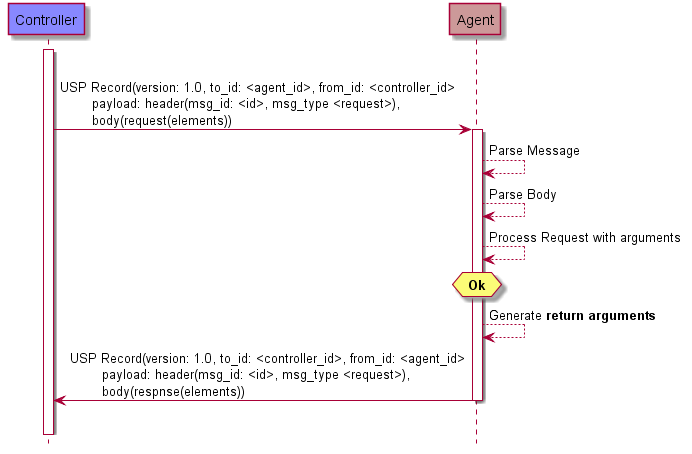
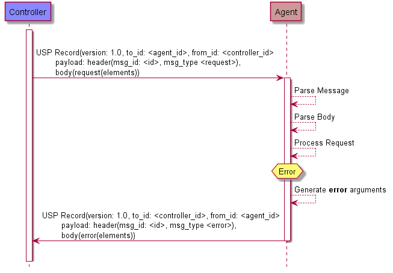
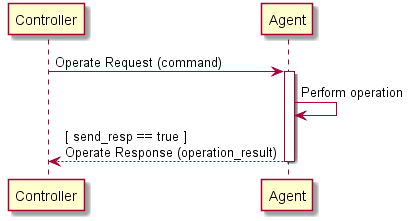
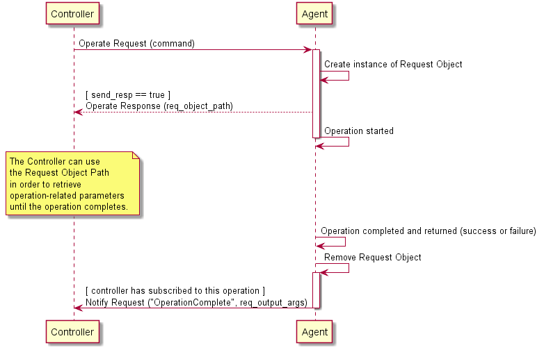

<!-- Reference Links -->
[1]:	https://usp-data-models.broadband-forum.org/ "Device Data Model"
[2]: https://www.broadband-forum.org/technical/download/TR-069.pdf	"TR-069 Amendment 6	CPE WAN Management Protocol"
[3]:	https://www.broadband-forum.org/technical/download/TR-106_Amendment-8.pdf "TR-106 Amendment 8	Data Model Template for CWMP Endpoints and USP Agents"
[4]:	https://tools.ietf.org/html/rfc7228 "RFC 7228	Terminology for Constrained-Node Networks"
[5]:	https://tools.ietf.org/html/rfc2136	"RFC 2136 Dynamic Updates in the Domain Name System"
[6]:	https://tools.ietf.org/html/rfc3007	"RFC 3007 Secure Domain Name System Dynamic Update"
[7]:	https://tools.ietf.org/html/rfc6763	"RFC 6763 DNS-Based Service Discovery"
[8]:	https://tools.ietf.org/html/rfc6762	"RFC 6762 Multicast DNS"
[9]:	https://tools.ietf.org/html/rfc7252	"RFC 7252 The Constrained Application Protocol (CoAP)"
[10]:	https://tools.ietf.org/html/rfc7390	"RFC 7390 Group Communication for the Constrained Application Protocol (CoAP)"
[11]:	https://tools.ietf.org/html/rfc4033	"RFC 4033 DNS Security Introduction and Requirements"
[12]:	https://developers.google.com/protocol-buffers/docs/proto3 "Protocol Buffers v3	Protocol Buffers Mechanism for Serializing Structured Data Version 3"
[13]: https://regauth.standards.ieee.org/standards-ra-web/pub/view.html#registries "IEEE Registration Authority"
[14]: https://tools.ietf.org/html/rfc4122 "RFC 4122 A Universally Unique IDentifier (UUID) URN Namespace"
[15]: https://tools.ietf.org/html/rfc5280 "RFC 5290 Internet X.509 Public Key Infrastructure Certificate and Certificate Revocation List (CRL) Profile"
[16]: https://tools.ietf.org/html/rfc6818 "RFC 6818 Updates to the Internet X.509 Public Key Infrastructure Certificate and Certificate Revocation List (CRL) Profile"
[17]: https://tools.ietf.org/html/rfc2234 "RFC 2234 Augmented BNF for Syntax Specifications: ABNF"
[18]: https://tools.ietf.org/html/rfc3986 "RFC 3986 Uniform Resource Identifier (URI): Generic Syntax"
[19]: https://tools.ietf.org/html/rfc2141 "RFC 2141 URN Syntax"
[20]: https://tools.ietf.org/html/rfc6455 "RFC 6455 The WebSocket Protocol"
[21]: https://stomp.github.io/stomp-specification-1.2.html "Simple Text Oriented Message Protocol"
[22]: https://tools.ietf.org/html/rfc5246 "The Transport Layer Security (TLS) Protocol Version 1.2"
[23]: https://tools.ietf.org/html/rfc6347 "Datagram Transport Layer Security Version 1.2"
[Conventions]: https://tools.ietf.org/html/rfc2119 "Key words for use in RFCs to Indicate Requirement Levels"


# Messages

1. [Encapsulation in a USP Record](#encapsulation_in_a_usp_record)
2. [Requests, Responses and Errors](#requests_responses_and_errors)
    1. [Handling Duplicate Messages](#handling_duplicate_messages)
    2. [Example Message Flows](#example_message_flows)
3. [Message Structure](#message_structure)
    1. [The USP Message](#the_usp_message)
    2. [Message Header](#message_header)
    3. [Message Body](#message_body)
4. [Creating, Updating, and Deleting Objects](#creating_updating_and_deleting_objects)
    1. [Selecting Objects and Parameters](#selecting_objects_and_parameters)
    2. [Using Allow Partial and Required Parameters](#using_allow_partial_and_required_parameters)
    3. [The Add Message](#add)
    4. [The Set Message](#set)
    5. [The Delete Message](#delete)
5. [Reading an Agent’s State and Capabilities](#reading_agent_state_and_capabilities)
    1. [The Get Message](#get)
    2. [The GetInstances Message](#getinstances)
    3. [The GetSupportedDM Message](#getsupporteddm)
    4. [The GetSupportedProtocol Message](#getsupportedprotocol)
6. [Notifications and Subscription Mechanism](#notifications_and_subscriptions)
    1. [Using Subscription Objects](#using_subscription_objects)
    2. [Responses to Notifications and Notification Retry](#notification_retry)
    3. [Notification Types](#notification_types)
    4. [The Notify Message](#notify)
7. [Defined Operations Mechanism](#defined_operations_mechanism)
    1. [Synchronous Operations](#synchronous_operations)
    2. [Asynchronous Operations](#asynchronous_operations)
    3. [Operate Requests on Multiple Objects](#operate_requests_on_multiple_objects)
    4. [Event Notifications for Operations](#event_notifications_for_operations)
    5. [Concurrent Operations](#concurrent_operations)
    6. [The Operate Message](#operate)
8. [Error Codes](#error_codes)
    1. [Vendor Defined Error Codes](#vendor_defined_error_codes)

USP contains messages to create, read, update, and delete Objects, perform Object-defined operations, and allow agents to notify controllers of events. This is often referred to as CRUD with the addition of O (operate) and N (notify), or CRUD-ON.

*Note: This version of the specification defines its messages in Protocol Buffers v3 (see [encoding](/specification/encoding/)). This part of the specification may change to a more generic description (normative and non-normative) if further encodings are specified in future versions.*

These sections describe the types of USP messages and the normative requirements for their flow and operation. USP messages are described in a protocol buffers schema, and the normative requirements for the individual fields of the schema are outlined below.

<a id='encapsulation_in_a_usp_record' />

## Encapsulation in a USP Record

All USP messages are encapsulated by a USP record. The definition of the USP record
portion of a USP message, and the rules for managing transactional integrity, are
described in [End to End Message Exchange](/specification/e2e-message-exchange/).

<a id="requests_responses_and_errors" />

## Requests, Responses and Errors

The three types of USP messages are Request, Response, and Error.

A request is a message sent from a source USP endpoint to a target USP endpoint that includes fields to be processed and returns a response or error. Unless otherwise specified, all requests have an associated response. Though the majority of requests are made from a Controller to an Agent, the Notify message follows the same format as a request but is sent from an Agent to a Controller.

**R-MSG.0** - The target USP endpoint MUST respond to a request message from the source USP endpoint with either a response message or error message, unless otherwise specified (see Operate and Notify messages).

**R-MSG.1** - The target USP endpoint MUST ignore or send an error message in response to messages it does not understand.

**R-MSG.2** - When the target USP endpoint is not required to send a response, the MTP endpoint that received the message MUST gracefully end the MTP message exchange. How the MTP gracefully ends the MTP message exchange is dependent on the type of MTP.

**R-MSG.3** - In any USP Message originating from an Agent, unless otherwise specified, Path Names reported from the Agent's Instantiated Data Model MUST use Instance Number Addressing.

<a id="handling_duplicate_messages" />

### Handling Duplicate Messages

Circumstances may arise (such as multiple Message Transfer Protocols) that cause duplicate messages (those with an identical message ID) to arrive at the target USP endpoint.

**R-MSG.4** - If a target USP endpoint receives a message with a duplicate message ID before it has processed and sent a Response or Error to the original message, it MUST gracefully ignore the duplicate message.

For messages that require no response, it is up to the target endpoint implementation when to allow the same message ID to be re-used by the same source USP endpoint.

<a id="example_message_flows" />

### Example Message Flows

Successful request/response: In this successful message sequence, a Controller sends an Agent a request. The message header and body are parsed, the message is understood, and the Agent sends a response with the relevant information in the body.


Figure MSG.1 - A successful request/response sequence

Failed request/response: In this failed message sequence, a Controller sends an Agent a request. The message header and body are parsed, but the Agent throws an error. The error arguments are generated and sent in an error message.


Figure MSG.2 - A failed request/response sequence

<a id='message_structure' />

## Message Structure

A Message consists of a header and body. When using [protocol buffers][12], the fields of the header and body for different messages are defined in a schema and sent in an encoded format from one USP endpoint to another.

**R-MSG.5** - A Message MUST conform to the schemas defined in [usp-msg-1-1.proto](/specification/usp-msg-1-1.proto).

*Note: When not explicitly set or included in the Message, the fields have a default value based on the type of field. For strings, the default value is an empty byte string. For booleans, the default value is "false". For numbers (fixed32) and enumerations, the default value is 0. For repeated bytes, the default value is an empty byte string. For a `oneof` field, none of the allowed values is assumed if the field is absent. If there is no requirement stating a field must be present, it is not necessary to include the field in a sent Message. The receiving Endpoint will use default values for fields not included in a received Message. Any field with a requirement indicating it must be present is required to always be included. A Message without a required field will fail to be processed by a receiving Endpoint. “Repeated” fields can be included any number of times, including zero. For additional information,  default values (when fields are missing) are described in [Protocol Buffers v3](https://developers.google.com/protocol-buffers/docs/proto3#default).*

Every USP message contains a header and a body. The header contains basic destination and coordination information, and is separated to allow security and discovery mechanisms to operate. The body contains the message itself and its arguments.

Each of the message types and fields below are described with the field type according to [Protocol Buffers version 3][12], followed by its name.

<a id="the_usp_message" />

### The USP Message

`Header header`

**R-MSG.6** - A Message MUST contain exactly one header field.

`Body body`

The Message Body that must be present in every Message.  The Body field contains either a Request, Response, or Error field.

**R-MSG.7** - A Message MUST contain exactly one body field.

<a id="message_header" />

### Message Header

The message header contains information on source and target of the message, as well as useful coordination information. Its fields include a message ID, the endpoint identifiers for the source and target endpoints, an optional reply-to identifier, and a field indicating the type of message.

The purpose of the message header is to provide basic information necessary for the target endpoint to process the message.

#### Message Header fields

`string msg_id`

A locally unique opaque identifier assigned by the Endpoint that generated this message.

**R-MSG.8** - The msg_id field MUST be present in every Header.

**R-MSG.9** - The msg_id field in the Message Header for a Response or Error that is associated with a Request MUST contain the message ID of the associated request. If the msg_id field in the Response or Error does not contain the message ID of the associated Request, the response or error MUST be ignored.

`enum MsgType msg_type`

This field contains an enumeration indicating the type of message contained in the message body. It is an enumeration of:
```
    ERROR (0)
    GET (1)
    GET_RESP (2)
    NOTIFY (3)
    SET (4)
    SET_RESP (5)
    OPERATE (6)
    OPERATE_RESP (7)
    ADD (8)
    ADD_RESP (9)
    DELETE (10)
    DELETE_RESP (11)
    GET_SUPPORTED_DM (12)
    GET_SUPPORTED_DM_RESP (13)
    GET_INSTANCES (14)
    GET_INSTANCES_RESP (15)
    NOTIFY_RESP (16)
    GET_SUPPORTED_PROTO (17)
    GET_SUPPORTED_PROTO_RESP (18)
```

**R-MSG.10** - The `msg_type` field MUST be present in every Header. Though
required, it is meant for information only. In the event this field differs
from the `req_type` or `resp_type` in the message body (respectively), the
type given in either of those elements SHOULD be regarded as correct.

<a id="message_body" />

### Message Body

The message body contains the intended message and the appropriate fields for the message type.

Every message body contains exactly one message and its fields. When an Agent is the target endpoint, these messages can be used to create, read, update, and delete Objects, or execute Object-defined operations. When a Controller is the target endpoint, the message will contain a notification, response, or an error.

#### Message Body fields

`oneof msg_body`

This field contains one of the types given below:

`Request request`

This field indicates that the Message contains a request of a type given in the Request Message.

`Response response`

This field indicates that the Message contains a response of a type given in the Response Message.

`Error	error`

This field indicates that the Message contains an Error Message.

#### Request fields

<a id="request" />

`oneof req_type`

This field contains one of the types given below. Each indicates that the Message contains a Message of the given type.

```
    Get get
    GetSupportedDM get_supported_dm
    GetInstances get_instances
    Set set
    Add add
    Delete delete
    Operate operate
    Notify notify
    GetSupportedProtocol get_supported_protocol
```

#### Response fields

`oneof resp_type`

This field contains one of the types given below. Each indicates that the Message contains a Message of the given type.

```
    GetResp get_resp
    GetSupportedDMResp get_supported_dm_resp
    GetInstancesResp get_instances_resp
    SetResp set_resp
    AddResp add_resp
    DeleteResp delete_resp
    OperateResp operate_resp
    NotifyResp notify_resp
    GetSupportedProtocolResp get_supported_protocol_resp
```

#### Error fields

`fixed32 err_code`

This field contains a [numeric code](#error-codes) indicating the type of error that caused the overall message to fail.

`string err_msg`

This field contains additional information about the reason behind the error.

`repeated ParamError param_errs`

This field is present in an Error Message in response to an Add, Set, or Delete message when the allow_partial field is false and detailed error information is available for each Object or parameter that have caused the message to report an Error.

##### ParamError fields

`string param_path`

This field contains a Path Name to the Object or parameter that caused the error.

`fixed32 err_code`

This field contains a [numeric code](#error-codes) indicating the type of error that caused the message to fail.

`string err_msg`

This field contains additional information about the reason behind the error.

<a id='creating_updating_and_deleting_objects' />

## Creating, Updating, and Deleting Objects

The [Add](#add), [Set](#set), and [Delete](#delete) requests are used to create, configure and remove Objects that comprise Service fields.

<a id='selecting_objects_and_parameters' />

### Selecting Objects and Parameters

Each Add, Set, and Delete request operates on one or more paths. For the Add request, these paths are references to Multi-Instance Objects. For all other requests, these paths can contain either addressing based identifiers that match zero or one Object or search based identifiers that matches one or more Objects.

For Add and Set requests, each Object address or search is conveyed in an field that also contains a sub-field listing the parameters to update in the matched Objects.

The Add response contains details about the success or failure of the creation of the Object and the parameters set during its creation. In addition, it also returns those parameters that were set by the Agent upon creation of the Object.

For example, a Controller wants to create a new WiFi network on an Agent. It could use an Add message with the following fields:

```
    allow_partial: false
    create_objs {
    	obj_path: "Device.WiFi.SSID."
    	param_settings {
        {
      		param: "LowerLayers"
      		value: "Device.WiFi.Radio.1."
      		required: true
        }
    		{
          param: "SSID"
    		  value: "NewSSIDName"
    		  required: true
          }
    		}
    	}
```

The Agent’s response would include the object created (with its instance identifier) and the unique keys of the created object as defined in [Device:2][1]:

```
    created_obj_results {
      requested_path: "Device.WiFi.SSID."
      oper_status {
        oper_success {
          instantiated_path: "Device.WiFi.SSID.4."
          unique_keys {
            {
              key: "BSSID"
              value: "112233445566"
            }
            {
              key: "Name"
              value: "GuestNetwork1"
            }
            {
              key: "Alias"
              value: "cpe-alias-1"
            }
          }
        }
      }
    }
```

<a id='using_allow_partial_and_required_parameters' />

### Using Allow Partial and Required Parameters

The Add, Set, and Delete requests contain an field called "`allow_partial`". This field determines whether or not the message should be treated as one complete configuration change, or a set of individual changes, with regards to the success or failure of that configuration.

For Delete, this is straightforward - if `allow_partial` is `true`, the Agent should return a Response message with `affected_paths` and `unaffected_path_errs` containing the successfully deleted Objects and unsuccessfully deleted objects, respectively. If `allow_partial` is `false`, the Agent should return an Error message if any Objects fail to be deleted.

For the Add and Set messages, parameter updates contain an field called "`required`". This details whether or not the update or creation of the Object should fail if a required parameter fails.

This creates a hierarchy of error conditions for the Add and Set requests, such as:

Parameter Error -> Object Error -> Message Error

If `allow_partial` is true, but one or more required parameters fail to be updated or configured, the creation or update of an individual Object fails. This results in an `oper_failure` in the `oper_status` field and `updated_obj_result` or `created_obj_result` returned in the Add or Set response.

If `allow_partial` is false, the failure of any required parameters will cause the update or creation of the Object to fail, which will cause the entire message to fail. In this case, the Agent returns an error message rather than a response message.

The `oper_failure` and `oper_success` fields as well as Error messages contain an field called `param_errs`, which contains fields of type `ParameterError` or `ParamError`. This is so that the Controller will receive the details of failed parameter updates regardless of whether or not the Agent returned a response message or error message.

The logic can be described as follows:

| `allow_partial`	| Required Parameters	| Required Parameter Failed	| Other Parameter Failed | 	Response/Error |	Oper_status of Object	| Contains param_errs |
| -----: | :-----: | :-----: | :-----: | :-----: | :-----: | :----- |
| `True`/`False`	| No |-	|	No	| Response	| `oper_success`	| No |
| `True`/`False`	| No | - | Yes | Response | `oper_success` | Yes |
| `True`/`False` | Yes | No | No | Response | `oper_success` | No |
| `True`/`False` | Yes | No | Yes | Response | oper_success | Yes |
| `True` | Yes | Yes | - | Response | `oper_failure` | Yes |
| `False` | Yes | Yes | - | Error | N/A | Yes |

<a id="add" />

### The Add Message

The Add message is used to create new Instances of Multi-Instance Objects in the Agent's Instantiated Data Model.

#### Add Example

In this example, the Controller requests that the Agent create a new instance in the `Device.LocalAgent.Controller` table.

```
Add Request:
header {
  msg_id: "52867"
  msg_type: ADD
}
body {
  request {
    add {
      allow_partial: true
      create_objs {
        obj_path: "Device.LocalAgent.Controller."
        param_settings {
          {
            param: "Enable"
            value: "True"
          }
          {
            param: "EndpointID"
            value: "controller-temp"
          }
        }
      }
    }
  }
}

Add Response:
header {
  msg_id: "52867"
  msg_type: ADD_RESP
}
body {
  response {
    add_resp {
      created_obj_results {
        requested_path: "Device.LocalAgent.Controller."
        oper_status {
          oper_success {
            instantiated_path: "Device.LocalAgent.Controller.31185."
            unique_keys {
              key: "EndpointID"
              value: "controller-temp"
            }
          }
        }
      }
    }
  }
}
```

#### Add Request fields

`bool allow_partial`

This field tells the Agent how to process the message in the event that one or more of the Objects specified in the `create_objs` argument fails creation.

**R-ADD.0** - If the `allow_partial` field is set to `true`, and no other exceptions are encountered, the Agent treats each Object matched in `obj_path` independently. The Agent MUST complete the creation of valid Objects regardless of the inability to create or update one or more Objects (see [allow partial and required parameters](#using_allow_partial_and_required_parameters)).

**R-ADD.1** - If the `allow_partial` field is set to `false`, and no other exceptions are encountered, the Agent treats each Object matched in `obj_path` holistically. A failure to create any one Object MUST cause the Add message to fail and return an `Error` Message (see [allow partial and required parameters](#using_allow_partial_and_required_parameters)).

`repeated CreateObject create_objs`

This field contains a repeated set of CreateObject fields.

##### CreateObject fields

`string obj_path`

This field contains an Object Path to a writeable Table in the Agent’s Instantiated Data Model.

**R-ADD.2** - The `obj_path` field in the `CreateObject` message of an Add Request MUST NOT contain Search Paths.

`repeated CreateParamSetting param_settings`

This field contains a repeated set of CreateParamSetting fields.

###### CreateParamSetting fields

`string param`

This field contains a relative path to a parameter of the Object specified in `obj_path`, or a parameter of a single instance sub-object of the Object specified in `obj_path`.

`string value`

This field contains the value of the parameter specified in the `param` field that the Controller would like to configure as part of the creation of this Object.

`bool required`

This field specifies whether the Agent should treat the creation of the Object specified in `obj_path` as conditional upon the successful configuration of this parameter (see [allow partial and required parameters](#using_allow_partial_and_required_parameters)).

**R-ADD.3** - If the `required` field is set to true, a failure to update this parameter MUST result in a failure to create the Object.

#### Add Response fields

`repeated CreatedObjectResult created_obj_results`

A repeated set of `CreatedObjectResult` fields for each `CreateObject` field in the Add message.

##### CreatedObjectResult fields

`string requested_path`

This field returns the value of `obj_paths` in the `CreateObject` message associated with this `CreatedObjectResult`.

`OperationStatus oper_status`

The field contains a message of type `OperationStatus` that specifies the overall status for the creation of the Object specified in `requested_path`.

###### OperationStatus fields

`oneof oper_status`

This field contains one of the types given below. Each indicates that the field contains a message of the given type.

`OperationFailure oper_failure`

This message is used when the object given in `requested_path` failed to be created.

`OperationSuccess oper_success`

###### OperationFailure fields

`fixed32 err_code`

This field contains a [numeric code](#error-codes) indicating the type of error that caused the Object creation to fail. A value of 0 indicates the Object was created successfully.

`string err_msg`

This field contains additional information about the reason behind the error.

###### Operation Success fields

`string instantiated_path`

This field contains the Object Instance Path of the created Object.

`repeated ParameterError param_errs`

This field returns a repeated set of ParameterError messages.

**R-ADD.4** - If any of the parameters and values specified in the `param_settings` field fail to configure upon creation, this set MUST include one field describing each of the failed parameters and the reason for their failure.

`map<string, string> unique_keys`

This field contains a map of the local name and value for each supported parameter that is part of any of this Object's unique keys.

**R-ADD.5** - If the Controller did not include some or all of a unique key that the Agent supports in the `param_settings` field, the Agent MUST assign values to the unique key(s) and return them in the `unique_keys`.

**R-ADD.6** - If the Controller does not have Read permission on any of the parameters specified in `unique_keys`, these parameters MUST NOT be returned in this field.

###### ParameterError fields

`string param`

This field contains the Relative Parameter Path to the parameter that failed to be set.

`fixed32 err_code`

This field contains the [error code](#error-codes) of the error that caused the parameter set to fail.

`string err_msg`

This field contains text related to the error specified by `err_code`.

#### Add Message Supported Error Codes

Appropriate error codes for the Add message include `7000-7019`, `7026`, and `7800-7999`.

<a id="set" />

### The Set Message

The Set Message is used to update the Parameters of existing Objects in the Agent's Instantiated Data Model.

#### Set Example

In this example the Controller requests that the Agent change the value of the `FriendlyName` Parameter in the `Device.DeviceInfo.` Object.

```
Set Request:
header {
  msg_id: "19220"
  msg_type: SET
}
body {
  request {
    set {
      allow_partial: true
      update_objs {
        obj_path: "Device.DeviceInfo."
        param_settings {
          param: "FriendlyName"
          value: "MyDevicesFriendlyName"
          required: true
        }
      }
    }
  }

Set Response:
header {
  msg_id: "19220"
  msg_type: SET_RESP
}
body {
  response {
    set_resp {
      updated_obj_results {
        requested_path: "Device.DeviceInfo."
        oper_status {
          oper_success {
            updated_inst_results {
              affected_path: "Device.DeviceInfo."
              updated_params {
                {
                  key: "FriendlyName"
                  value: "MyDevicesFriendlyName"
                }
              }
            }
          }
        }
      }
    }
  }
}
```

#### Set Request fields

`bool allow_partial`

This field tells the Agent how to process the message in the event that one or more of the Objects matched in the `obj_path` fails to update.

**R-SET.0** - If the `allow_partial` field is set to true, and no other exceptions are encountered, the Agent treats each `UpdateObject` message `obj_path` independently. The Agent MUST complete the update of valid Objects regardless of the inability to update one or more Objects (see [allow partial and required parameters](#using_allow_partial_and_required_parameters)).

*Note: This may cause some counterintuitive behavior if there are no required parameters to be updated. The Set Request can still result in a Set Response (rather than an Error Message) if `allow_partial` is set to true.*

**R-SET.1** - If the `allow_partial` field is set to false, and no other exceptions are encountered, the Agent treats each `UpdateObject` message `obj_path` holistically. A failure to update any one Object MUST cause the Set message to fail and return an Error message (see [allow partial and required parameters](#using_allow_partial_and_required_parameters)).

`repeated UpdateObject update_objs`

This field contains a repeated set of UpdateObject messages.

##### UpdateObject fields

`string obj_path`

This field contains an Object Path, Instance Path, or Search Path to Objects or Object Instances in the Agent’s Instantiated Data Model.

`repeated UpdateParamSetting param_settings`

The field contains a repeated set of `UpdatedParamSetting` messages.

###### UpdateParamSetting fields

`string param`

This field contains the local name of a parameter of the Object specified in `obj_path`.

`string value`

This field contains the value of the parameter specified in the `param` field that the Controller would like to configure.

`bool required`

This field specifies whether the Agent should treat the update of the Object specified in `obj_path` as conditional upon the successful configuration of this parameter.

**R-SET.2** - If the `required` field is set to `true`, a failure to update this parameter MUST result in a failure to update the Object (see [allow partial and required parameters](#using_allow_partial_and_required_parameters)).

#### Set Response

`repeated UpdatedObjectResult updated_obj_results`

This field contains a repeated set of `UpdatedObjectResult` messages for each `UpdateObject` message in the associated Set Request.

##### UpdatedObjectResult fields

`string requested_path`

This field returns the value of `updated_obj_results` in the `UpdateObject` message associated with this `UpdatedObjectResult`.

`OperationStatus oper_status`

The field contains a message of type `OperationStatus` that specifies the overall status for the update of the Object specified in `requested_path`.

###### OperationStatus fields

`oneof oper_status`

This field contains a message of one of the following types.

`OperationFailure oper_failure`

Used when the Object specified in `requested_path` failed to be updated.

`OperationSuccess oper_success`

###### OperationFailure fields

`fixed32 err_code`

This field contains a [numeric code](#error-codes) indicating the type of error that caused the Object update to fail.

`string err_msg`

This field contains additional information about the reason behind the error.

`repeated UpdatedInstanceFailure updated_inst_failures`

This field contains a repeated set of messages of type `UpdatedInstanceFailure`.

###### UpdatedInstanceFailure fields

`string affected_path`

This field returns the Object Path or Object Instance Path of the Object that failed to update.

`repeated ParameterError param_errs`

This field contains a repeated set of `ParameterError` messages.

###### ParameterError fields

`string param`

This field contains the Parameter Path to the parameter that failed to be set.

`fixed32 err_code`

This field contains the [error code](#error-codes) of the error that caused the parameter set to fail.

`string err_msg`

This field contains text related to the error specified by `err_code`.

###### OperationSuccess fields

`repeated UpdatedInstanceResult updated_inst_results`

This field contains a repeated set of `UpdatedInstanceResult` messages.

###### UpdatedInstanceResult fields

`string affected_path`

This field returns the Object Path or Object Instance Path of the updated Object.

`repeated ParameterError param_errs`

This field contains a repeated set of `ParameterError` messages.

`map<string, string> updated_params`

This field returns a set of key/value pairs containing a path (relative to the `affected_path`) to each of the updated Object’s parameters, their values, plus sub-Objects and their values that were updated by the Set Request.

**R-SET.3** - If the Controller does not have Read permission on any of the parameters specified in `updated_params`, these parameters MUST NOT be returned in this field.

*Note: If the Set Request configured a parameter to the same value it already had, this parameter is still returned in the `updated_params`.*

###### ParameterError fields

`string param`

This field contains the Parameter Path to the parameter that failed to be set.

`fixed32 err_code`

This field contains the [error code](#error-codes) of the error that caused the parameter set to fail.

`string err_msg`

This field contains text related to the error specified by `err_code`.

#### Set Message Supported Error Codes
Appropriate error codes for the Set message include `7000-7016`, `7020`, `7021`, `7026`, and `7800-7999`.

<a id="delete" />

### The Delete Message

The Delete Message is used to remove Instances of Multi-Instance Objects in the Agent's Instantiated Data Model.

#### Delete Example

In this example, the Controller requests that the Agent remove the instance in
`Device.LocalAgent.Controller` table that has the EndpointID value of "`controller-temp`".

```
Delete Request:
header {
  msg_id: "24799"
  msg_type: DELETE
}
body {
  request {
    delete {
      obj_paths: "Device.LocalAgent.Controller.[EndpointID=="controller-temp"]."
    }
  }
}

Delete Response:
header {
  msg_id: "24799"
  msg_type: DELETE_RESP
}
body {
  response {
    delete_resp {
      deleted_obj_results {
        requested_path: "Device.LocalAgent.Controller.[EndpointID=="controller-temp"]."
        oper_status {
          oper_success {
            affected_paths {
              {
                "Device.LocalAgent.Controller.31185."
              }
              {
                "Device.LocalAgent.Controller.31185.E2ESession."
              }
            }
          }
        }
      }
    }
  }
}
```

#### Delete Request fields

`bool allow_partial`

This field tells the Agent how to process the message in the event that one or more of the Objects specified in the `obj_path` argument fails deletion.

**R-DEL.0** - If the `allow_partial` field is set to true, and no other exceptions are encountered, the Agent treats each entry in `obj_path` independently. The Agent MUST complete the deletion of valid Objects regardless of the inability to delete one or more Objects (see [allow partial and required parameters](#using_allow_partial_and_required_parameters)).

**R-DEL.1** - If the `allow_partial` field is set to false, and no other exceptions are encountered, the Agent treats each entry in `obj_path` holistically. A failure to delete any one Object MUST cause the Delete message to fail and return an Error message (see [allow partial and required parameters](#using_allow_partial_and_required_parameters)).

`repeated string obj_paths`

This field contains a repeated set of Object Instance Paths or Search Paths.

#### Delete Response fields

`repeated DeletedObjectResult deleted_obj_results`

This field contains a repeated set of `DeletedObjectResult` messages.

##### DeletedObjectResult fields

`string requested_path`

This field returns the value of the entry of `obj_paths` (in the Delete Request) associated with this `DeleteObjectResult`.

`OperationStatus oper_status`

This field contains a message of type `OperationStatus`.

###### OperationStatus fields

`oneof oper_status`

This field contains a message of one of the following types.

`OperationFailure oper_failure`

Used when the Object specified in `requested_path` failed to be deleted.

`OperationSuccess oper_success`

###### OperationFailure fields

*Note: Since the `OperationSuccess` message of the Delete Response contains an `unaffected_path_errs`, the `OperationStatus` will only contain an `OperationFailure` message if the `requested_path` did not match any existing Objects (error `7016`) or was syntactically incorrect (error `7008`).*

`fixed32 err_code`

This field contains a [numeric code](#error-codes) indicating the type of error that caused the delete to fail. A value of 0 indicates the Object was deleted successfully.

`string err_msg`

This field contains additional information about the reason behind the error.

###### OperationSuccess fields

`repeated string affected_paths`

This field returns a repeated set of Path Names to Object Instances.

**R-DEL.2** - If the Controller does not have Read permission on any of the Objects specified in `affected_paths`, these Objects MUST NOT be returned in this field.

**R-DEL.2a** - If the requested_path was valid (i.e., properly formatted and in the Agent's supported data model) but did not resolve to any objects in the Agent's instantiated data model, the Agent MUST return an OperationSuccess for this requested_path, and include an empty set for affected_path.

`repeated UnaffectedPathError unaffected_path_errs`

This field contains a repeated set of messages of type `UnaffectedPathError`.

**R-DEL.3** - If any of the Object Instances specified in the `obj_paths` field fail to delete, this set MUST include one `UnaffectedPathError` message for each of the Object Instances that failed to Delete.

**R-DEL.4** - If the Controller does not have Read permission on any of the Objects specified in `unaffected_paths`, these Objects MUST NOT be returned in this field.

###### UnaffectedPathError fields

`string unaffected_path`

This field returns the Path Name to the Object Instance that failed to be deleted.

`fixed32 err_code`

This field contains the error code of the error that caused the deletion of this object to fail.

`string err_msg`

This field contains text related to the error specified by `err_code`.

#### Delete Message Supported Error Codes

Appropriate error codes for the Delete message include `7000-7008`, `7015`, `7016`, `7018`, `7024`, `7026` and `7800-7999`.

<a id='reading-agent-state-and-capabilities' />

## Reading an Agent’s State and Capabilities

An Agent’s current state and capabilities are represented in its data model. The current state is referred to as its Instantiated Data Model, while the data model that represents its set of capabilities is referred to as its Supported Data Model. Messages exist to retrieve data from both the instantiated and Supported Data Models.

<a id='get' />

### The Get Message

The basic Get message is used to retrieve the values of a set of Object’s parameters in order to learn an Agent’s current state. It takes a set of search paths as an input and returns the complete tree of parameters, plus the parameters of all sub-Objects, of any Object matched by the specified expressions. The search paths specified in a Get request can also target individual parameters within Objects to be returned.

*Note: Those familiar with Broadband Forum [TR-069][2] will recognize this behavior as the difference between "partial paths" and "complete paths". This behavior is replicated in USP for the Get message for each path that is matched by the expression(s) supplied in the request.*

*Note: Each search path is intended to be evaluated separately, and the results from a given search path are returned in an field dedicated to that path. As such, it is possible that the same information may be returned from more than one search path. This is intended, and the Agent should treat each search path atomically.*

The response returns an entry for each Path Name resolved by the path given in `requested_path`. If a path expression specified in the request does not match any valid parameters or Objects, the response will indicate that this expression was an "invalid path", indicating that the Object or parameter does not currently exist in the Agent’s Supported Data Model.

For each resolved Path Name, a `ResolvedPathResult` message is given in the Response. This ResolvedPathResult contains the `resolved_path`, followed by a list of parameters (`result_params`) of both the resolved_path Object and all of its sub-objects, plus their values. If there are no parameters, `result_params` may be empty.  These Parameter Paths are Relative Paths to the `resolved_path`.

#### Get Examples

For example, a Controller wants to read the data model to learn the settings and stats of a single WiFi SSID, "HomeNetwork" with a BSSID of "00:11:22:33:44:55". It could use a Get request with the following fields:

```
    Get {
      param_paths {
        "Device.WiFi.SSID.[SSID=="Homenetwork"&&BSSID==00:11:22:33:44:55]."
      }
    }
```

In response to this request the Agent returns all parameters, plus sub-Objects and their parameters, of the addressed instance. The Agent returns this data in the Get response using a field for each of the requested paths. In this case:

```
    GetResp {
        req_path_results {
        requested_path: "Device.WiFi.SSID.[SSID=="Homenetwork"&&BSSID=00:11:22:33:44:55]."
        err_code : 0
        err_msg :
        resolved_path_results {
          resolved_path : "Device.WiFi.SSID.1."
          result_params {
            {
              key: "Enable"
              value: "True"
            }
            {
              key: "Status"
              value: "Up"
            }
            {
              key: "Name"
              value: "Home Network"
            }
            {
              key: "LastChange"
              value: "864000"
            }
            {
              key: "BSSID"
              value: "00:11:22:33:44:55"
            }
            {
              key: "Stats.BytesSent"
              value: "24901567"
            }
            {
              key: "Stats.BytesReceived"
              value: "892806908296"
            }

            (etc.)
          }
        }
      }
    }
```

In another example, the Controller only wants to read the current status of the WiFi network with the SSID "HomeNetwork" with the BSSID of 00:11:22:33:44:55. It could use a Get request with the following fields:

```
    Get {
      param_paths {
        "Device.WiFi.SSID.[SSID=="Homenetwork"&&BSSID==00:11:22:33:44:55].Status"
      }
    }
```

In response to this request the Agent returns only the Status parameter and its value.

```
    GetResp {
      req_path_results {
        requested_path: "Device.WiFi.SSID.[SSID=="Homenetwork"&&BSSID==00:11:22:33:44:55].Status"
        err_code : 0
        err_msg :
        resolved_path_results {
          resolved_path : "Device.WiFi.SSID.1."
          result_params {
            key: "Status"
            value: "Up"
          }
        }
      }
    }
```

Lastly, using wildcards or another Search Path, the requested path may resolve to more than one resolved path. For example for a Request sent to an Agent with two `WiFi.SSID` instances:

```
    Get {
      param_paths {
        "Device.WiFi.SSID.*.Status"
      }
    }
```

The Agent's GetResponse would be:

```
    GetResp {
      req_path_results {
        requested_path: "Device.WiFi.SSID.*."
        err_code : 0
        err_msg :
        resolved_path_results {
          resolved_path : "Device.WiFi.SSID.1."
          result_params {
            key: "Status"
            value: "Up"
          }

          resolved_path : "Device.WiFi.SSID.2."
          result_params {
              key: "Status"
              value: "Up"
          }
        }
      }
    }
```

In an example with full USP message header and body, the Controller requests all parameters of the MTP table entry that contains the Alias value "CoAP-MTP1", and the value of the Enable parameter of the Subscription table where the subscription ID is "boot-1" and the Recipient parameter has a value of "Device.LocalAgent.Controller.1":

```
Get Request:

header {
  msg_id: "5721"
  msg_type: GET
}
body {
  request {
    get {
      param_paths: "Device.LocalAgent.MTP.[Alias=="CoAP-MTP1"]."
      param_paths: "Device.LocalAgent.Subscription.[ID=="boot-1"&&Recipient=="Device.LocalAgent.Controller.1"].Enable"
    }
  }
}

Get Response:

header {
  msg_id: "5721"
  msg_type: GET_RESP
}
body {
  response {
    get_resp {
      req_path_results {
        requested_path: "Device.LocalAgent.MTP.[Alias=="CoAP-MTP1"]."
        resolved_path_results {
          resolved_path: "Device.LocalAgent.MTP.5156." {
              {
                key: "Alias"
                value: "CoAP-MTP1"
              }
              {
                key: "Enable"
                value: "False"
              }
              {
                key: "EnableMDNS"
                value: "True"
              }
              {
                key: "Protocol"
                value: "CoAP"
              }
              {
                key: "Status"
                value: "Inactive"
              }
            }
          }

        resolved_path_results {
          resolved_path: "Device.LocalAgent.MTP.5156.CoAP."
          result_params {
            {
              key: "CheckPeerID"
              value: "False"
            }
            {
              key: "EnableEncryption"
              value: "True"
            }
            {
              key: "Host"
              value: "127.0.0.1"
            }
            {
              key: "IsEncrypted"
              value: "False"
            }
            {
              key: "Path"
              value: "/e/agent"
            }
            {
              key: "Port"
              value: "5684"
            }
            {
              key: "ValidatePeerCertificate"
              value: "True"
            }
          }
        }
        resolved_path_results {
          resolved_path: "Device.LocalAgent.MTP.5156.STOMP."
          result_params {
            {
              key: "Destination"
            }
            {
              key: "Reference"
            }
          }
        }
      }
      req_path_results {
        requested_path: "Device.LocalAgent.Subscription.[ID=="boot-1"&&Recipient=="Device.LocalAgent.Controller.1"].Enable"
        resolved_path_results {
          resolved_path: "Device.LocalAgent.Subscription.6629."
          result_params {
            key: "Enable"
            value: "True"
          }
        }
      }
    }
  }
}
```

#### Get Request fields

`repeated string param_paths`

This field is a set of Object Paths, Instance Paths, Parameter Paths, or Search Paths to Objects, Object Instances, and Parameters in an Agent’s Instantiated Data Model.

#### Get Response fields

`repeated RequestedPathResult req_path_results`

A repeated set of `RequestedPathResult` messages for each of the Path Names given in the associated Get request.

##### RequestedPathResult field

`string requested_path`

This field contains one of the Path Names or Search Paths given in the `param_path` field of the associated Get Request.

`fixed32 err_code`

This field contains a [numeric code](#error-codes) indicating the type of error that caused the Get to fail on this path. A value of 0 indicates the path could be read successfully.

**R-GET.0** - If `requested_path` contains a Path Name that does not match any Object or Parameter in the Agent's Supported Data Model, the Agent MUST use the `7026 - Invalid Path` error in this `RequestedPathResult`.

**R-GET.1** - If the Controller making the Request does not have Read permission on an Object or Parameter matched through the `requested_path` field, the Object or Parameter MUST be treated as if it is not present in the Agent’s Supported data model.

`string err_msg`

This field contains additional information about the reason behind the error.

`repeated ResolvedPathResult resolved_path_results`

This field contains one message of type ResolvedPathResult for each path resolved by the Path Name or Search Path given by `requested_path`.

**R-GET.1a** - If the requested_path is valid (i.e., properly formatted and in the Agent's supported data model) but did not resolve to any objects in the Agent's instantiated data model, the resolved_path_results set MUST be empty and is not considered an error.

###### ResolvedPathResult fields

`string resolved_path`

This field contains a Path Name to an Object or Object Instance that was resolved from the Path Name or Search Path given in `requested_path`.

**R-GET.2** - If the `requested_path` included a Path Name to a Parameter, the `resolved_path` MUST contain only the Path Name to the parent Object or Object Instance of that parameter.

`map<string, string> result_params`

This field contains a set of mapped key/value pairs listing a Parameter Path (relative to the Path Name in `resolved_path`) to each of the parameters and their values, plus sub-objects and their values, of the Object given in `resolved_path`.

**R-GET.3** - If the `requested_path` included a Path Name to a Parameter, `result_params` MUST contain only the Parameter included in that path.

**R-GET.4** - If the Controller does not have Read permission on any of the parameters specified in `result_params`, these parameters MUST NOT be returned in this field. This MAY result in this field being empty.

###### Get Message Supported Error Codes

Appropriate error codes for the Get message include `7000-7006`, `7008`, `7010`, `7026` and `7800-7999`.

<a id="getinstances" />

### The GetInstances Message

The GetInstances message takes a Path Name to an Object and requests that the Agent return the Instances of that Object that exist and *possibly* any Multi-Instance sub-Objects that exist as well as their Instances. This is used for getting a quick map of the Multi-Instance Objects (i.e., tables) the Agent currently represents, and their unique keys, so that they can be addressed and manipulated later.

GetInstances takes one or more Path Names to Multi-Instance Objects in a Request to an Agent. In addition, both GetInstances and GetSupportedDM (below) make use of a flag called `first_level_only`, which determines whether or not the Response should include all of the sub-Objects that are children of the Object specified in `obj_path`. A value of `true` means that the Response should return data *only* for the Object specified. A value of false means that all sub-Objects should be resolved and returned.

#### GetInstances Examples

For example, if a Controller wanted to know *only* the current instances of WiFi SSID Objects that exist on an Agent (that has 3 SSIDs), it would send a GetInstances Request as:

```
    GetInstances {
      obj_paths : "Device.WiFi.SSID."
      bool first_level_only : true
    }
```

The Agent's Response would contain:

```
    GetInstancesResp {
      req_path_results {
        requested_path : "Device.WiFi.SSID."
        err_code : 0
        err_msg :
        curr_insts {
          instantiated_obj_path : "Device.WiFi.SSID.1."
          unique_keys {
            {
              key : "Alias"
              value : "UserWiFi1"
            }
            {
              key : "Name"
              value : "UserWiFi1"
            }
            {
              key : "SSID"
              value : "SecureProviderWiFi"
            }
            {
              key : "BSSID"
              value : "00:11:22:33:44:55"
            }
          }
          instantiated_obj_path : "Device.WiFi.SSID.2."
          unique_keys {
            {
              key : "Alias"
              value : "UserWiFi2"
            }
            {
              key : "Name"
              value : "UserWiFi2"
            }
            {
              key : "SSID"
              value : "GuestProviderWiFi"
            }
            {
              key : "BSSID"
              value : "00:11:22:33:44:55"
            }
          }
        }
      }
    }
```

In another example, the Controller wants to get all of  the Instances of the `Device.WiFi.AccessPoint` table, plus all of the instances of the AssociatedDevice Object and AC Object (sub-Objects of AccessPoint). It would issue a GetInstances Request with the following:

```
    GetInstances {
      obj_paths : "Device.WiFi.AccessPoint."
      bool first_level_only : false
    }
```

The Agent's Response will contain an entry in `curr_insts` for all of the Instances of the `Device.WiFi.AccessPoint` table, plus the Instances of the Multi-Instance sub-Objects `.AssociatedDevice.` and `.AC.`:

```
    GetInstancesResp {
      req_path_results {
        requested_path : "Device.WiFi.AccessPoint."
        err_code : 0
        err_msg :
        curr_insts {
          instantiated_obj_path : "Device.WiFi.AccessPoint.1."
          unique_keys {
            {
              key : "Alias"
              value : "SomeAlias"
            }
            {
              key : "SSIDReference"
              value : "Device.WiFi.SSID.1"
            }
          }
          instantiated_obj_path : "Device.WiFi.AccessPoint.2."
          unique_keys :
            {
              key : "Alias"
              value : "SomeAlias"
            }
            {
              key : "SSIDReference"
              value : "Device.WiFi.SSID.2"
            }
          instantiated_obj_path : "Device.WiFi.AccessPoint.1.AssociatedDevice.1."
          unique_keys {
              key : "MACAddress"
              value : "11:22:33:44:55:66"
          }

          instantiated_obj_path : "Device.WiFi.AccessPoint.1.AC.1."
          unique_keys {
            key : "AccessCategory"
            value : "BE"
          }

          instantiated_obj_path : "Device.WiFi.AccessPoint.2.AssociatedDevice.1."
          unique_keys {
            key : "MACAddress"
            value : "11:22:33:44:55:66"
          }

          instantiated_obj_path : "Device.WiFi.AccessPoint.2.AC.1."
          unique_keys {
            key : "AccessCategory"
            value : "BE"
          }
        }
      }
    }
```

Or more, if more Object Instances exist.

#### GetInstances Request fields

`repeated string obj_paths`

This field contains a repeated set of Path Names or Search Paths to Multi-Instance Objects in the Agent's Instantiated Data Model.

`bool first_level_only`

This field, if `true`, indicates that the Agent should return only those instances in the Object(s) matched by the Path Name or Search Path in `obj_path`, and not return any child objects.

#### GetInstances Response fields

`repeated RequestedPathResult req_path_results`

This field contains a RequestedPathResult message for each Path Name or Search

`string requested_path`

This field contains one of the Path Names or Search Paths given in `obj_path` of the associated GetInstances Request.

`fixed32 err_code`

This field contains a [numeric code](#error-codes) indicating the type of error that caused the Get to fail on this path. A value of 0 indicates the path could be read successfully.

**R-GIN.0** - If the Controller making the Request does not have Read permission on an Object or Parameter matched through the `requested_path` field, the Object or Parameter MUST be treated as if it is not present in the Agent’s Supported Data Model.

`string err_msg`

This field contains additional information about the reason behind the error.

`repeated CurrInstance curr_insts`

This field contains a message of type `CurrInstance` for each Instance of *all* of the Objects matched by `requested_path` that exists in the Agent's Instantiated Data Model.

###### CurrInstance fields

`string instantiated_obj_path`

This field contains the Instance Path Name of the Object Instance.

`map<string, string> unique_keys`

This field contains a map of key/value pairs for all supported parameters that are part of any of this Object's unique keys.

**R-GIN.1** - If the Controller does not have Read permission on any of the parameters specified in `unique_keys`, these parameters MUST NOT be returned in this field.

#### GetInstances Error Codes

Appropriate error codes for the GetInstances message include `7000-7006`, `7008`, `7016`, `7018`, `7026` and `7800-7999`.

<a id="getsupporteddm" />

### The GetSupportedDM Message

GetSupportedDM is used to retrieve the Objects, Parameters, Events, and Commands in the Agent's Supported Data Model. This allows a Controller to learn what an Agent understands, rather than its current state.

The GetSupportedDM is different from other USP messages in that it deals exclusively with the Agent's Supported Data Model. This means that Path Names to Multi-Instance Objects only address the Object itself, rather than Instances of the Object, and those Path Names that contain Multi-Instance objects in the Path use the `{i}` identifier to indicate their place in the Path Name.

For example, a Path Name to the `AssociatedDevice` Object (a child of the `.WiFi.AccessPoint` Object) would be addressed in the Supported Data Model as:

`Device.WiFi.AccessPoint.{i}.AssociatedDevice.` or `Device.WiFi.AccessPoint.{i}.AssociatedDevice.{i}.`

Both of these syntaxes are supported and equivalent. The Agent's Response returns the Path Name to the Object in the associated Device Type document as specified in [TR-106][3].

#### GetSupportedDM Examples

For example, the Controller wishes to learn the WiFi capabilities the Agent represents. It could issue a GetSupportedDM Request as:

```
    GetSupportedDM {
    	obj_paths : "Device.WiFi."
    	first_level_only : false
    	return_commands : false
    	return_events : false
    	return_params : false
    }
```

The Agent's Response would be:

```
GetSupportedDMResp {
	req_obj_results {
		req_obj_path : "Device.WiFi."
		err_code : 0
		err_msg :
		data_model_inst_uri : "urn:broadband-forum-org:tr-181-2-12-0"
		supported_objs {
      {
			  supported_obj_path : "Device.WiFi."
			  access : OBJ_READ_ONLY
			  is_multi_instance : false
      }		
			{
        supported_obj_path : "Device.WiFi.Radio.{i}."
			  access : ADD_DELETE (1)
			  is_multi_instance : true
			  supported_obj_path : "Device.WiFi.Radio.{i}.Stats"
			  access : ADD_DELETE (1)
			  is_multi_instance : true
      }			
			{
        supported_obj_path : "Device.WiFi.SSID.{i}."
			  access : ADD_DELETE (1)
			  is_multi_instance : true
			  supported_obj_path : "Device.WiFi.SSID.{i}.Stats"
			  access : ADD_DELETE (1)
			  is_multi_instance : true
      }			
			{
        supported_obj_path : "Device.WiFi.AccessPoint.{i}."
			  access : ADD_DELETE (1)
			  is_multi_instance : true
      }
			{
        supported_obj_path : "Device.WiFi.AccessPoint.{i}.Security."
			  access : ADD_DELETE (1)
			  is_multi_instance : true
      }
			{
        supported_obj_path : "Device.WiFi.AccessPoint.{i}.WPS."
			  access : ADD_DELETE (1)
			  is_multi_instance : true
      }
			{
        supported_obj_path : "Device.WiFi.AccessPoint.{i}.AssociatedDevice.{i}."
			  access : ADD_DELETE (1)
			  is_multi_instance : true
      }
			{
        supported_obj_path : "Device.WiFi.AccessPoint.{i}.AssociatedDevice.{i}.Stats."
			  access : ADD_DELETE (1)
			  is_multi_instance : true
      }
			{
        supported_obj_path : "Device.WiFi.AccessPoint.{i}.AC.{i}."
			  access : ADD_DELETE (1)
			  is_multi_instance : true
      }
			{
        supported_obj_path : "Device.WiFi.AccessPoint.{i}.AC.{i}.Stats."
			  access : ADD_DELETE (1)
			  is_multi_instance : true
      }
			{
        supported_obj_path : "Device.WiFi.AccessPoint.{i}.Accounting."
			  access : ADD_DELETE (1)
			  is_multi_instance : true
      }
			{
			  supported_obj_path : "Device.WiFi.EndPoint.{i}."
			  access : ADD_DELETE (1)
			  is_multi_instance : true
      }

      // And continued, for Device.WiFi.EndPoint.{i}. sub-objects such as Device.WiFi.EndPoint.{i}.Stats., Device.WiFi.EndPoint.{i}/// .Security., etc.
		}
  }
}
```

In another example request:

```
    GetSupportedDM {
    	obj_paths : "Device.WiFi."
    	first_level_only : true
    	return_commands : true
    	return_events : true
    	return_params : true
    }
```

The Agent's response would be:

```
    GetSupportedDMResp {
    	req_obj_results {
    		req_obj_path : "Device.WiFi."
    		err_code : 0
    		err_msg :
    		data_model_inst_uri : "urn:broadband-forum-org:tr-181-2-12-0"
    		supported_objs {
    			supported_obj_path : "Device.WiFi."
    			access : OBJ_READ_ONLY
    			is_multi_instance : false
    			supported_params {
    				{param_name : "RadioNumberOfEntries"
    				acces : PARAM_READ_ONLY}
    				{param_name : "SSIDNumberOfEntries"
    				acces : PARAM_READ_ONLY}
    				// Continued for all Device.WiFi. parameters
    			}
    			supported_commands {
    				command_name : NeighboringWiFiDiagnostic()
    				output_arg_names {"Result.{i}.Radio" "Result.{i}.SSID"
    				"Result.{i}.BSSID" "Result.{i}.Mode" "Result.{i}.Channel"
    				// Continued for other NeighboringWiFiDiagnostic() output arguments
    				}
    			}
    			//followed by its immediate child objects with no details
    			{
            supported_obj_path : "Device.WiFi.Radio.{i}."
    			  access : ADD_DELETE (1)
    			  is_multi_instance : true
          }
    			{
    			  supported_obj_path : "Device.WiFi.SSID.{i}."
    			  access : ADD_DELETE (1)
    			  is_multi_instance : true
          }
    			{
    			  supported_obj_path : "Device.WiFi.AccessPoint.{i}."
    			  access : ADD_DELETE (1)
    			  is_multi_instance : true
          }
    			{
    			  supported_obj_path : "Device.WiFi.EndPoint.{i}."
    			  access : ADD_DELETE (1)
    			  is_multi_instance : true
          }
    		}
    	}
    }
```

#### GetSupportedDM Request fields

`repeated obj_paths`

This field contains a repeated set of Path Names to Objects in the Agent's Supported Data Model.

`bool first_level_only`

This field, if `true`, indicates that the Agent should return only those objects matched by the Path Name or Search Path in `obj_path` and its immediate (i.e., next level) child objects. The list of child objects does not include commands, events, or parameters of the child objects regardless of the values of the following elements:

`bool return_commands`

This field, if `true`, indicates that, in the `supported_objs`, the Agent should include a `supported_commands` field containing Commands supported by the reported Object(s).

`bool return_events`

This field, if `true`, indicates that, in the `supported_objs`, the Agent should include a `supported_events` field containing Events supported by the reported Object(s).

`bool return_params`

This field, if `true`, indicates that, in the `supported_objs`, the Agent should include a `supported_params` field containing Parameters supported by the reported Object(s).

#### GetSupportedDMResp fields

`repeated RequestedObjectResult req_obj_results`

This field contains a repeated set of messages of type `RequestedObjectResult`.

##### RequestedObjectResult fields

`string req_obj_path`

This field contains one of the Path Names given in `obj_path` of the associated GetSupportedDM Request.

`fixed32 err_code`

This field contains a [numeric code](#error-codes) indicating the type of error that caused the Get to fail on this path. A value of 0 indicates the path could be read successfully.

**R-GSP.0** - If the Controller making the Request does not have Read permission on an Object or Parameter matched through the `requested_path` field, the Object or Parameter MUST be treated as if it is not present in the Agent’s Supported Data Model.

`string err_msg`

This field contains additional information about the reason behind the error.

`string data_model_inst_uri`

This field contains a Uniform Resource Identifier (URI) to the Data Model associated with the Object specified in `obj_path`.

`repeated SupportedObjectResult supported_objs`

The field contains a message of type `SupportedObjectResult` for each reported Object.

###### SupportedObjectResult fields

`string supported_obj_path`

This field contains the Path Name of the reported Object.

`ObjAccessType access`

The field contains an enumeration of type ObjAccessType specifying the access permissions that are specified for this Object in the Agent's Supported Data Model. This usually only applies to Multi-Instance Objects. This may be further restricted to the Controller based on rules defined in the Agent's Access Control List. It is an enumeration of:

```
    OBJ_READ_ONLY (0)
    OBJ_ADD_DELETE (1)
    OBJ_ADD_ONLY (2)
    OBJ_DELETE_ONLY (3)
```

`bool is_multi_instance`

This field, if `true`, indicates that the reported Object is a Multi-Instance Object.

`repeated SupportedParamResult supported_params`

The field contains a message of type `SupportedParamResult` for each Parameter supported by the reported Object. If there are no Parameters in the Object, this should be an empty list.

`repeated SupportedCommandResult supported_commands`

The field contains a message of type `SupportedCommandResult` for each Command supported by the reported Object. If there are no Parameters in the Object, this should be an empty list.

`repeated SupportedEventResult supported_events`

The field contains a message of type `SupportedEventResult` for each Event supported by the reported Object. If there are no Parameters in the Object, this should be an empty list.

###### SupportedParamResult fields

`string param_name`

This field contains the local name of the Parameter.

`ParamAccessType access`

The field contains an enumeration of type ParamAccessType specifying the access permissions that are specified for this Parameter in the Agent's Supported Data Model. This may be further restricted to the Controller based on rules defined in the Agent's Access Control List. It is an enumeration of:

```
    PARAM_READ_ONLY (0)
    PARAM_READ_WRITE (1)
    PARAM_WRITE_ONLY (2)
```

###### SupportedCommandResult fields

`string command_name`

This field contains the local name of the Command.

`repeated string input_arg_names`

This field contains a repeated set of local names for the input arguments of the Command.

`repeated string output_arg_names`

This field contains a repeated set of local names for the output arguments of the Command.

###### SupportedEventResult

`string event_name`

This field contains the local name of the Event.

`repeated string arg_names`

This field contains a repeated set of local names for the arguments of the Event.

#### GetSupportedDM Error Codes

Appropriate error codes for the GetSupportedDM message include `7000-7006`, `7008`, `7016`, `7026`, and `7800-7999`.

*Note - when using error `7026` (invalid path), it is important to note that in the context of GetSupportedDM this applies to the Agent's Supported Data Model.*

<a id="getsupportedprotocol" />

### GetSupportedProtocol

The GetSupportedProtocol message is used as a simple way for the Controller and Agent to learn
which versions of USP each supports to aid in interoperability and backwards
compatibility.

#### GetSupportedProtocol Request fields

`string controller_supported_protocol_versions`

A comma separated list of USP Protocol Versions (major.minor) supported by this Controller.

#### GetSupportedProtocolResponse fields

`string agent_supported_protocol_versions`

A comma separated list of USP Protocol Versions (major.minor) supported by this Agent.

<a id='notifications_and_subscriptions' />

## Notifications and Subscription Mechanism

A Controller can use the Subscription mechanism to subscribe to certain events that occur on the Agent, such as a parameter change, Object removal, wake-up, etc. When such event conditions are met, the Agent sends a [Notify message](#notify) to the Controller.

<a id='using_subscription_objects' />

### Using Subscription Objects

Subscriptions are maintained in instances of the Multi-Instance Subscription Object in the USP data model. The normative requirements for these Objects are described in the data model parameter descriptions for `Device.LocalAgent.Subscription.{i}.` in [Device:2][1].

**R-NOT.0** - The Agent and Controller MUST follow the normative requirements defined in the `Device.LocalAgent.Subscription.{i}.` Object specified in [Device:2][1].

*Note: Those familiar with Broadband Forum [TR-069][2] will recall that a notification for a value change caused by an Auto-Configuration Server (ACS - the CWMP equivalent of a Controller) are not sent to the ACS. Since there is only a single ACS notifying the ACS of value changes it requested is unnecessary. This is not the case in USP: an Agent should follow the behavior specified by a subscription, regardless of the originator of that subscription.*

#### ReferenceList Parameter

All subscriptions apply to one or more Objects or parameters in the Agent’s Instantiated Data Model. These are specified as Path Names or Search Paths in the `ReferenceList` parameter. The `ReferenceList` parameter may have different meaning depending on the nature of the notification subscribed to.

For example, a Controller wants to be notified when a new WiFi station joins the WiFi network. It uses the Add message to create a subscription Object instance with `Device.WiFi.AccessPoint.1.AssociatedDevice.` specified in the `ReferenceList` parameter and `ObjectCreation` as the `NotificationType`.

In another example, a Controller wants to be notified whenever an outside source changes the SSID of a WiFi network. It uses the Add message to create a subscription Object instance with `Device.WiFi.SSID.1.SSID` specified in the `ReferenceList` and `ValueChange` as the `NotificationType`.

<a id='notification_retry' />

### Responses to Notifications and Notification Retry

The Notify request contains a flag, `send_resp`, that specifies whether or not the Controller should send a response message after receiving a Notify request. This is used in tandem with the `NotifRetry` parameter in the subscription Object - if `NotifRetry` is `true`, then the Agent sends its Notify requests with `send_resp : true`, and the Agent considers the notification delivered when it receives a response from the Controller. If `NotifRetry` is `false`, the Agent does not need to use the `send_resp` flag and should ignore the delivery state of the notification.

If `NotifRetry` is `true`, and the Agent does not receive a response from the Controller, it begins retrying using the retry algorithm below. The subscription Object also uses a `NotifExpiration` parameter to specify when this retry should end if no success is ever achieved.

**R-NOT.1** - When retrying notifications, the Agent MUST use the following retry algorithm to manage the retransmission of the Notify request.

The retry interval range is controlled by two Parameters, the minimum wait interval and the interval multiplier, each of which corresponds to a data model Parameter, and which are described in the table below. The factory default values of these Parameters MUST be the default values listed in the Default column. They MAY be changed by a Controller with the appropriate permissions at any time.

| Descriptive Name | Symbol | Default | Data Model Parameter Name |
| ---------: | :-----: | :------: | :------------ |
|Minimum wait interval | m | 5 seconds |	`Device.Controller.{i}.USPRetryMinimumWaitInterval` |
| Interval multiplier |	k | 2000 | `Device.Controller.{i}.USPRetryIntervalMultiplier` |

| Retry Count | Default Wait Interval Range (min-max seconds) | Actual Wait Interval Range (min-max seconds) |
| ----------: | :---------: | :-------------- |
| #1 | 5-10 | m - m.(k/1000) |
| #2 | 10-20 | m.(k/1000) - m.(k/1000)^2 |
| #3 | 20-40 | m.(k/1000)^2 - m.(k/1000)^3 |
| #4 | 40-80 | m.(k/1000)^3 - m.(k/1000)^4 |
| #5 | 80-160 | m.(k/1000)^4 - m.(k/1000)^5 |
| #6 | 160-320 | m.(k/1000)^5 - m.(k/1000)^6 |
| #7 | 320-640 | m.(k/1000)^6 - m.(k/1000)^7 |
| #8 | 640-1280 | m.(k/1000)^7 - m.(k/1000)^8 |
| #9 | 1280-2560 | m.(k/1000)^8 - m.(k/1000)^9 |
| #10 and subsequent | 2560-5120 | m.(k/1000)^9 - m.(k/1000)^10 |

**R-NOT.2** - Beginning with the tenth retry attempt, the Agent MUST choose from the fixed maximum range. The Agent will continue to retry a failed notification until it is successfully delivered or until the `NotifExpiration` time is reached.

**R-NOT.3** - Once a notification is successfully delivered, the Agent MUST reset the retry count to zero for the next notification message.

**R-NOT.4** - If a reboot of the Agent occurs, the Agent MUST reset the retry count to zero for the next notification message.

<a id='notification_types' />

### Notification Types

There are several types events that can cause a Notify request. These include those that deal with changes to the Agent’s Instantiated Data Model (`ValueChange`, `ObjectCreation`, `ObjectDeletion`), the completion of an asynchronous Object-defined operation (`OperationComplete`), a policy-defined `OnBoardRequest`, and a generic `Event` for use with Object-defined events.

#### ValueChange

The `ValueChange` notification is subscribed to by a Controller when it wants to know that the value of a single or set of parameters has changed from the state it was in at the time of the subscription or to a state as described in an expression, and then each time it transitions from then on for the life of the subscription. It is triggered when the defined change occurs, even if it is caused by the originating Controller.

####	 ObjectCreation and ObjectDeletion
These notifications are used for when an instance of the subscribed to Multi-Instance Objects is added or removed from the Agent’s Instantiated Data Model. Like `ValueChange`, this notification is triggered even if the subscribing Controller is the originator of the creation or deletion.

The `ObjectCreation` notification also includes the Object’s unique keys and their values as data in the notification.

#### OperationComplete

The `OperationComplete` notification is used to indicate that an asynchronous Object-defined operation finished (either successfully or unsuccessfully). These operations may also trigger other Events defined in the data model (see below).

#### OnBoardRequest

An `OnBoardRequest` notification is used by the Agent when it is triggered by an external source to initiate the request in order to communicate with a Controller that can provide on-boarding procedures and communicate with that Controller (likely for the first time).

**R-NOT.5** - An Agent MUST send an `OnBoardRequest` notify request in the following circumstances:

1.	When the `SendOnBoardRequest()` command is executed. This sends the notification request to the Controller that is the subject of that operation. The `SendOnBoardRequest()` operation is defined in the [Device:2 Data Model][1]. This requirement applies only to those Controller table instances that have their `.Enabled` parameter set to `true`.

2.	When instructed to do so by internal application policy (for example, when using DHCP discovery defined above).

*Note: as defined in the Subscription table, OnBoardRequest is not included as one of the enumerated types of a Subscription, i.e., it is not intended to be the subject of a Subscription.*

**R-NOT.6** If a response is required, the OnBoardRequest MUST follow the Retry logic defined above.

#### Event
The `Event` notification is used to indicate that an Object-defined event was triggered on the Agent. These events are defined in the data model and include what parameters, if any, are returned as part of the notification.

#### Notify Examples

In this example, a Controller has subscribed to be notified of changes in value to the `Device.DeviceInfo.FriendlyName` parameter. When it is changed, the Agent sends a Notify Request to inform the Controller of the change.

```
Notify Request:
header {
  msg_id: "33936"
  msg_type: NOTIFY
}
body {
  request {
    notify {
      subscription_id: "vc-1"
      send_resp: true
      value_change {
          param_path: "Device.DeviceInfo.FriendlyName"
          param_value: "MyDevicesFriendlyName"
      }
    }
  }
}

Notify Response:
header {
  msg_id: "33936"
  msg_type: NOTIFY_RESP
}
body {
  response {
    notify_resp {
      subscription_id: "vc-1"
    }
  }
}

```

In another example, the event "Boot!", defined in the `Device.` object, is triggered. The Agent sends a Notify Request to the Controller(s) subscribed to that event.

```
Notify Request
header {
  msg_id: "26732"
  msg_type: NOTIFY
}
body {
  request {
    notify {
      subscription_id: "boot-1"
      send_resp: true
      event {
        obj_path: "Device."
        event_name: "Boot!"
        params {
          {
            key: "Cause"
            value: "LocalReboot"
          }
          {
            key: "CommandKey"
            value: ""
          }
          {
            key: "Parameter.1.Path"
            value: "Device.LocalAgent.Controller.1.Enable"
          }
          {
            key: "Parameter.1.Value"
            value: "True"
          }
        }
      }
    }
  }
}

Notify Response:
header {
  msg_id: "26732"
  msg_type: NOTIFY_RESP
}
body {
  response {
    notify_resp {
      subscription_id: "boot-1"
    }
  }
}
```

<a id='notify' />

### The Notify Message

#### Notify Request fields

`string subscription_id`

This field contains the locally unique opaque identifier that was set by the Controller when it created the Subscription on the Agent.

**R-NOT.7** - The `subscription_id` field MUST contain the Subscription ID of the Subscription Object that triggered this notification. If no subscription_id is available (for example, for OnBoardRequest notifications), this field MUST be set to an empty string.

`bool send_resp`

This field lets the Agent indicate to the Controller whether or not it expects a response in association with the Notify request.

**R-NOT.8** - When `send_response` is set to false, the Controller SHOULD NOT send a response or error to the Agent. If a response is still sent, the responding Controller MUST expect that any such response will be ignored.

`oneof notification`

Contains one of the following Notification messages:

    Event	event
    ValueChange value_change
    ObjectCreation obj_creation
    ObjectDeletion obj_deletion
    OperationComplete oper_complete
    OnBoardRequest on_board_req

##### Event fields

`string obj_path`

This field contains the Object or Object Instance Path of the Object that caused this event (for example, `Device.LocalAgent.`).

`string event_name`

This field contains the name of the Object defined event that caused this notification (for example, `Boot!`).

`map<string, string> parameters`

This field contains a set of key/value pairs of parameters associated with this event.

##### ValueChange fields

`string param_path`

This field contains the Path Name of the changed parameter.

`string param_value`

This field contains the value of the parameter specified in `param_path`.

##### ObjectCreation fields

`string obj_path`

This field contains the Path Name of the created Object instance.

`map<string, string> unique_keys`

This field contains a map of key/value pairs for all supported parameters that are part of any of this Object's unique keys.

##### ObjectDeletion fields

`string obj_path`

This field contains the Path Name of the deleted Object instance.

##### OperationComplete fields

`string command_name`

This field contains the local name l of the Object defined command that caused this notification (i.e., `Download()`).

`string obj_path`

This field contains the Object or Object Instance Path to the Object that contains this operation.

`string command_key`

This field contains the command key set during an Object defined Operation that caused this notification.

`oneof operation_resp`

Contains one of the following messages:

    OutputArgs req_output_args
    CommandFailure cmd_failure

###### OutputArgs fields

`map<string, string> output_args`

This field contains a map of key/value pairs indicating the output arguments (relative to the command specified in the `command_name` field) returned by the method invoked in the Operate message.

###### CommandFailure fields

`fixed32 err_code`

This field contains the [error code](#error-codes) of the error that caused the operation to fail. Appropriate error codes for CommandFailure include `7002-7008`, `7016`, `7022`, `7023`, and `7800-7999`.

`string err_msg`

This field contains additional (human readable) information about the reason behind the error.

##### OnBoardRequest fields

`string oui`

This field contains the Organizationally Unique Identifier associated with the Agent.

`string product_class`

This field contains a string used to provide additional context about the Agent.

`string serial_number`

This field contains a string used to provide additional context about the Agent.

`string agent_supported_protocol_versions`

A comma separated list of USP Protocol Versions (major.minor) supported by this Agent.

#### Notify Response fields

`string subscription_id`

This field contains the Subscription ID that was received with the Notify Request.

**R-NOT.9** - The `subscription_id` field MUST contain same Subscription ID as was presented in the Notify Request. If the `subscription_id` field does not match the Subscription ID of the Subscription Object that triggered this notification, this Response MUST be ignored.

#### Notify Error Codes

Appropriate error codes for the Notify message include `7000-7006`, and `7800-7999`.

<a id="defined_operations_mechanism">

## Defined Operations Mechanism

Additional methods (operations) are and can be defined in the USP data model. Operations are generally defined on an Object, using the "command" attribute, as defined in [TR-106][3]. The mechanism is controlled using the [Operate message](#operate) in conjunction with the Multi-Instance Request Object.

<a id='synchronous_operations' />

### Synchronous Operations

A synchronous operation is intended to complete immediately following its processing. When complete, the output arguments are sent in the Operate response. If the `send_resp` flag is false, the Controller doesn’t need the returned information (if any), and the Agent does not send an Operate Response.



Figure OPR.1 - Operate Message Flow for Synchronous Operations

<a id='asynchronous_operations' />

### Asynchronous Operations

An asynchronous operation expects to take some processing on the system the Agent represents and will return results at a later time. When complete, the output arguments are sent in a `Notify` (`OperationComplete`) request to any Controllers that have an active subscription to the operation and Object(s) to which it applies.

When a Controller using the Operate request specifies an operation that is defined as asynchronous, the Agent creates an instance of the Request Object in its data model, and includes a reference to the created Object in the Operate response. If the `send_resp` flag is `false`, the Controller doesn’t need the Request details, and intends to ignore it.

The lifetime of a Request Object expires when the operation is complete (either by success or failure). An expired Request Object is removed from the Instantiated Data Model.

**R-OPR.0** - When an Agent receives an Operate Request that addresses an asynchronous operation, it MUST create a Request Object in the Request table of its Instantiated Data Model (see [Device:2][1]). When the Operation is complete (either success or failure), it MUST remove this Object from the Request table.

If any Controller wants a notification that an operation has completed, it creates a Subscription Object with the `NotificationType` set to `OperationComplete` and with the `ReferenceList` parameter including a path to the specified command. The Agent processes this Subscription when the operation completes and sends a Notify message, including the `command_key` value that the Controller assigned when making the Operate request.

A Controller can cancel a request that is still present in the Agent's `Device.LocalAgent.Request.` table by invoking the `Device.LocalAgent.Request.{i}.Cancel()` command through another Operate message.



Figure OPR.2 - Operate Message Flow for Asynchronous Operations

#### Persistance of Asynchronous Operations

Synchronous Operations do not persist across a reboot or restart of the Agent or its underlying system. It is expected that  Asynchronous Operations do not persist, and a command that is in process when the Agent is rebooted can be expected to be removed from the Request table, and is considered to have failed. If a command is allowed or expected to be retained across a reboot, it will be noted in the command description.

<a id='operate_requests_on_multiple_objects' />

### Operate Requests on Multiple Objects

Since the Operate request can take a path expression as a value for the command field, it is possible to invoke the same operation on multiple valid Objects as part of a single Operate request. Responses to requests to Operate on more than one Object are handled using the `OperationResult` field type, which is returned as a repeated set in the Operate Response. The success or failure of the operation on each Object is handled separately and returned in a different `OperationResult` entry. For this reason, operation failures are never conveyed in an Error message - in reply to an Operate request, Error is only used when the message itself fails for one or more reasons, rather than the operation invoked.

*Note: This specification does not make any requirement on the order in which commands on multiple objects selected with a path expression are executed.*

**R-OPR.1** - When processing Operate Requests on multiple Objects, an Agent MUST NOT send an Error message due to a failed operation. It MUST instead include the failure in the `cmd_failure` field of the Operate response.

**R-OPR.2** - For asynchronous operations the Agent MUST create a separate Request Object for each Object and associated operation matched in the command field.

<a id='event_notifications_for_operations' />

### Event Notifications for Operations

When an operation triggers an Event notification, the Agent sends the Event notification for all subscribed recipients as described [above](#notifications_and_subscriptions).

<a id='concurrent_operations' />

### Concurrent Operations

If an asynchronous operation is triggered multiple times by one or more Controllers, the Agent has the following options:

1. Deny the new operation (with, for example, `7005 Resources Exceeded` )
2. The operations are performed in parallel and independently.
3. The operations are queued and completed in order.

**R-OPR.3** - When handling concurrently invoked operations, an Agent MUST NOT cancel an operation already in progress unless explicitly told to do so by a Controller with permission to do so (i.e., via the `Device.LocalAgent.Request.{i}.Cancel()` operation).

### Operate Examples

In this example, the Controller requests that the Agent initiate the SendOnBoardRequest() operation defined in the `Device.LocalAgent.Controller.` object.

```
Operate Request:
header {
  msg_id: "42314"
  msg_type: OPERATE
}
body {
  request {
    operate {
      command: "Device.LocalAgent.Controller.[EndpointID=="controller"].SendOnBoardRequest()"
      command_key: "onboard_command_key"
      send_resp: true
    }
  }
}


Response:
header {
  msg_id: "42314"
  msg_type: OPERATE_RESP
}
body {
  response {
    operate_resp {
      operation_results {
        executed_command: "Device.LocalAgent.Controller.1.SendOnBoardRequest()"
      }
    }
  }
}
```

<a id='operate' />

### The Operate Message

#### Operate Request fields
`string command`

This field contains a Command Path or Search Path to an Object defined Operation in one or more Objects.

`string command_key`

This field contains a string used as a reference by the Controller to match the operation with notifications.

`bool send_resp`

This field lets the Controller indicate to Agent whether or not it expects a response in association with the operation request.

**R-OPR.4** - When `send_resp` is set to `false`, the target Endpoint SHOULD NOT send a response or error to the source Endpoint. If a response is still sent, the responding Endpoint MUST expect that any such response will be ignored.

`map<string, string> input_args`

This field contains a map of key/value pairs indicating the input arguments (relative to the command path in the command field) to be passed to the method indicated in the command field.

#### Operate Response fields

`repeated OperationResult operation_results`

This field contains a repeated set of `OperationResult` messages.

##### OperationResult fields

`string executed_command`

This field contains a Command Path to the Object defined Operation that is the subject of this `OperateResp` message.

`oneof operate_resp`

This field contains a message of one of the following types.

```
  string req_obj_path
  OutputArgs req_output_args
  CommandFailure cmd_failure
```

###### Using req_obj_path

The req_obj_path field, when used as the `operate_resp`, contains an Object Instance Path to the Request Object created as a result of this asynchronous operation.

###### OutputArgs fields

`map<string, string> output_args`

This field contains a map of key/value pairs indicating the output arguments (relative to the command specified in the `command` field) returned by the method invoked in the Operate message.

###### CommandFailure fields

`fixed32 err_code`

This field contains the [error code](#error-codes) of the error that caused the operation to fail.

`string err_msg`

This field contains additional (human readable) information about the reason behind the error.

#### Operate Message Error Codes
Appropriate error codes for the Operate message include `7000-7008`, `7012` `7015`, `7016`, `7022`, and `7800-7999`.

<a id="error_codes" />

## Error Codes

USP uses error codes with a range 7000-7999 for both Controller and Agent errors. The errors appropriate for each message (and how they must be implemented) are defined in the message descriptions below.

| Code | Name | Applicability | Description |
| :--- | :--- | :------------ | :---------- |
| `7000` | Message failed	| Error Message | This error indicates a general failure that is described in an err_msg field. |
| `7001` | Message not supported | Error Message | This error indicates that the attempted message was not understood by the target endpoint.|
| `7002` | Request denied (no reason specified) | Error Message | This error indicates that the target endpoint cannot or will not process the message. |
| `7003` | Internal error | Error Message | This error indicates that the message failed due to internal hardware or software reasons. |
| `7004` | Invalid arguments | Error Message | This error indicates that the message failed due to invalid values in the USP message. |
| `7005` | Resources exceeded | Error Message | This error indicates that the message failed due to memory or processing limitations on the target endpoint. |
| `7006` | Permission denied  | Error Message | This error indicates that the source endpoint does not have the authorization for this action. |
| `7007` | Invalid configuration | Error Message | This error indicates that the message failed because processing the message would put the target endpoint in an invalid or unrecoverable state. |
| `7008` | Invalid path syntax | any requested_path | This error indicates that the Path Name used was not understood by the target endpoint. |
| `7009` | Parameter action failed | Set | This error indicates that the parameter failed to update for a general reason described in an err_msg field. |
| `7010` | Unsupported parameter | Add, Set | This error indicates that the requested Path Name associated with this ParamError did not match any instantiated parameters. |
| `7011` | Invalid type | Add, Set | This error indicates that the requested value was not of the correct data type for the parameter. |
| `7012` | Invalid value | Add, Set | This error indicates that the requested value was not within the acceptable values for the parameter. |
| `7013` | Attempt to update non-writeable parameter | Add, Set | This error indicates that the source endpoint attempted to update a parameter that is not defined as a writeable parameter. |
| `7014` | Value conflict | Add, Set | This error indicates that the requested value would result in an invalid configuration based on other parameter values. |
| `7015` | Operation error | Add, Set, Delete | This error indicates a general failure in the creation, update, or deletion of an Object that is described in an err_msg field.
| `7016` | Object does not exist | Add, Set | This error indicates that the requested Path Name associated with this OperationStatus did not match any instantiated Objects. |
| `7017` | Object could not be created | Add | This error indicates that the operation failed to create an instance of the specified Object. |
| `7018` | Object is not a table | Add | This error indicates that the requested Path Name associated with this OperationStatus is not a Multi-Instance Object. |
| `7019` | Attempt to create non-creatable Object | Add | This error indicates that the source endpoint attempted to create an Object that is not defined as able to be created. |
| `7020` | Object could not be updated | Set | This error indicates that the requested Object in a Set request failed to update. |
| `7021` | Required parameter failed | Add, Set | This error indicates that the request failed on this Object because one or more required parameters failed to update. Details on the failed parameters are included in an associated ParamError message. |
| `7022` | Command failure | Operate | This error indicates that an command initiated in an Operate Request failed to complete for one or more reasons explained in the err_msg field. |
| `7023` | Command canceled | Operate | This error indicates that an asynchronous command initiated in an Operate Request failed to complete because it was cancelled using the Cancel() operation. |
| `7024` | Delete failure | Delete | This error indicates that this Object Instance failed to be deleted. |
| `7025` | Object exists with duplicate key | Add | This error indicates that an Object tried to be created with a unique keys that already exist, or the unique keys were configured to those that already exist. |
| `7026` | Invalid path | Any | This error indicates that the Object or Parameter Path Name specified does not match any Objects or Parameters in the Agent's Supported Data Model |
| `7027` | Invalid Command Arguments | Operate | This error indicates that an Operate message failed due to invalid or unknown arguments specified in the command. |
| `7100-7199` | USP Record error codes | - | These errors are listed and described in (Message Transfer Protocols)[/specification/mtp/]. |
| `7800-7999`| Vendor defined error codes | - | These errors are [vendor defined](#vendor_defined_error_codes). |

<a id="vendor_defined_error_codes" />

### Vendor Defined Error Codes

Implementations of USP MAY specify their own error codes for use with Errors and Responses. These codes use  the `7800-7999` series. There are no requirements on the content of these errors.
