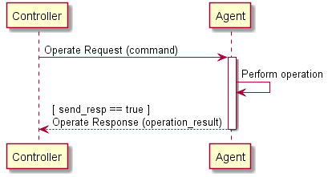
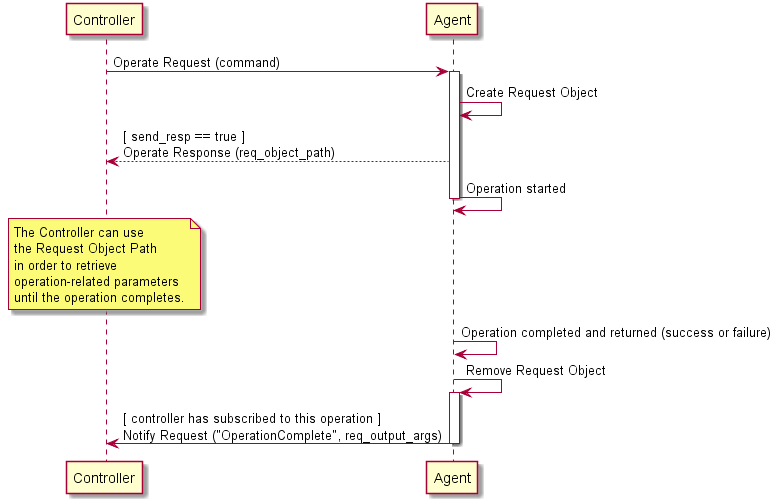

<!-- Reference Links -->
[1]:	https://www.broadband-forum.org/technical/download/TR-181_Issue-2_Amendment-12.pdf "TR-181 Issue 2 Device Data Model for TR-069"
[2]: https://www.broadband-forum.org/technical/download/TR-069.pdf	"TR-069 Amendment 6	CPE WAN Management Protocol"
[3]:	https://www.broadband-forum.org/technical/download/TR-106_Amendment-8.pdf "TR-106 Amendment 8	Data Model Template for TR-069 Enabled Devices"
[4]:	https://tools.ietf.org/html/rfc7228 "RFC 7228	Terminology for Constrained-Node Networks"
[5]:	https://tools.ietf.org/html/rfc2136	"RFC 2136 Dynamic Updates in the Domain Name System"
[6]:	https://tools.ietf.org/html/rfc3007	"RFC 3007 Secure Domain Name System Dynamic Update"
[7]:	https://tools.ietf.org/html/rfc6763	"RFC 6763 DNS-Based Service Discovery"
[8]:	https://tools.ietf.org/html/rfc6762	"RFC 6762 Multicast DNS"
[9]:	https://tools.ietf.org/html/rfc7252	"RFC 7252 The Constrained Application Protocol (CoAP)"
[10]:	https://tools.ietf.org/html/rfc7390	"RFC 7390 Group Communication for the Constrained Application Protocol (CoAP)"
[11]:	https://tools.ietf.org/html/rfc4033	"RFC 4033 DNS Security Introduction and Requirements"
[12]:	https://developers.google.com/protocol-buffers/docs/proto3 "Protocol Buffers v3	Protocol Buffers Mechanism for Serializing Structured Data Version 3"
[15]: https://tools.ietf.org/html/rfc5280 "RFC 5290 Internet X.509 Public Key Infrastructure Certificate and Certificate Revocation List (CRL) Profile"
[16]: https://tools.ietf.org/html/rfc6818 "RFC 6818 Updates to the Internet X.509 Public Key Infrastructure Certificate and Certificate Revocation List (CRL) Profile"
[Conventions]: https://www.ietf.org/rfc/rfc2119.txt "Key words for use in RFCs to Indicate Requirement Levels"

# The Operate Message

### Synchronous Operations

A synchronous operation is intended to complete immediately following its processing. When complete, the output arguments are sent in the Operate response. If the send_resp flag is false, the Controller doesn’t need the returned information (if any), and the Agent does not send an Operate Response.

Figure 1 - Operate Message Flow for Synchronous Operations

### Asynchronous Operations

An asynchronous operation expects to take some processing on the system the Agent represents and will return results at a later time. When complete, the output arguments are sent in a `Notify` (`OperationComplete`) request to any Controllers that have an active subscription to the operation and Object(s) to which it applies.

When a Controller using the Operate request specifies an operation that is defined as asynchronous, the Agent creates an instance of the Request Object in its data model, and includes a reference to the created Object in the Operate response. If the `send_resp` flag is `false`, the Controller doesn’t need the Request details, and intends to ignore it.

The lifetime of a Request Object expires when the operation is complete (either by success or failure). An expired Request Object is removed from the Instantiated Data Model.

**R-OPR.0** - When an Agent receives an Operate Request that addresses an asynchronous operation, it MUST create a Request Object in the Request table of its Instantiated Data Model (see [Device:2][1]). When the Operation is complete (either success or failure), it MUST remove this Object from the Request table.

If any Controller wants a notification that an operation has completed, it creates a Subscription Object with the `NotificationType` set to `OperationComplete` and with the `ReferenceList` parameter including a path to the specified command. The Agent processes this Subscription when the operation completes and sends a Notify message, including the `command_key` value that the Controller assigned when making the Operate request.

Figure 2 - Operate Message Flow for Asynchronous Operations

#### Persistance of Asynchronous Operations

Synchronous Operations do not persist across a reboot or restart of the Agent or its underlying system. It is expected that  Asynchronous Operations do not persist, and a command that is in process when the Agent is rebooted can be expected to be removed from the Request table, and is considered to have failed. If a command is allowed or expected to be retained across a reboot, it will be noted in the command description.

### Operate Requests on Multiple Objects

Since the Operate request can take a path expression as a value for the command element, it is possible to invoke the same operation on multiple valid Objects as part of a single Operate request. Responses to requests to Operate on more than one Object are handled using the `OperationResult` element type, which is returned as a repeated set in the Operate Response. The success or failure of the operation on each Object is handled separately and returned in a different `OperationResult` entry. For this reason, operation failures are never conveyed in an Error message - in reply to an Operate request, Error is only used when the message itself fails for one or more reasons, rather than the operation invoked.

**R-OPR.1** - When processing Operate Requests on multiple Objects, an Agent MUST NOT send an Error message due to a failed operation. It MUST instead include the failure in the `cmd_failure` element of the Operate response.

**R-OPR.2** - For asynchronous operations the Agent MUST create a separate Request Object for each Object and associated operation matched in the command element.

### Event Notifications for Operations

When an operation triggers an Event notification, the Agent sends the Event notification for all subscribed recipients as described [above](#notifications_and_subscrptions

### Concurrent Operations

If an asynchronous operation is triggered multiple times by one or more Controllers, the Agent has the following options:

1. Deny the new operation (with, for example, `7005 Resources Exceeded` )
2. The operations are performed in parallel and independently.
3. The operations are queued and completed in order.

**R-OPR.3** - When handling concurrently invoked operations, an Agent MUST NOT cancel an operation already in progress unless explicitly told to do so by a Controller with permission to do so.

## Operate Request Elements
`string command`

This element contains a Command Path or Search Path to an Object defined Operation in one or more Objects.

`string command_key`

This element contains a string used as a reference by the Controller to match the operation with notifications.

`bool send_resp`

This element lets the Controller indicate to Agent whether or not it expects a response in association with the operation request.

**R-OPR.4** - When `send_resp` is set to `false`, the target Endpoint SHOULD NOT send a response or error to the source Endpoint. If a response is still sent, the responding Endpoint MUST expect that any such response will be ignored.

`map<string, string> input_arg_map`

This element contains a map of key/value pairs indicating the input arguments (relative to the command path in the command element) to be passed to the method indicated in the command element.

**R-OPR.5** - Any key in the `input_arg_map` that contains multi-instance arguments MUST use Instance Number Addressing. This element contains a map of name/value pairs indicating the input arguments (relative to the Object that is the subject of this command) to be passed to the method invoked indicated in the command element.

## Operate Response Elements

`repeated OperationResult operation_result_list`

This element contains a repeated set of `OperationResult` messages.

### OperationResult Elements

`string executed_command`

This element contains a Command Path to the Object defined Operation that is the subject of this `OperateResp` message.

`oneof operate_resp`

This element contains a message of one of the following types.

`string req_object_path`

This element contains an Object Instance Path to the Request Object created as a result of this asynchronous operation.

**R-OPR.6** - Path Names in the `req_object_path` MUST use Instance Number Addressing.

    OutputArgs req_output_args
    CommandFailure cmd_failure

This element contains one message of type `CommandFailure`. It is used when at synchronous operation is not successful.

#### OutputArgs Elements

`map<string, string> output_arg_map`

This element contains a map of key/value pairs indicating the output arguments (relative to the command specified in the `command` element) returned by the method invoked in the Operate message.

**R-OPR.7** - Any key in the `output_arg_map` that contains multi-instance arguments MUST use Instance Number Addressing.

#### CommandFailure elements

`fixed32 err_code`

This element contains the [error code](/usp/specification/error-codes/) of the error that caused the operation to fail.

`string err_msg`

This element contains additional (human readable) information about the reason behind the error.

## Operate Message Error Codes
Appropriate error codes for the Operate message include `7000-7008`, `7015`, `7016`, `7022`, and `7800-7999`.
