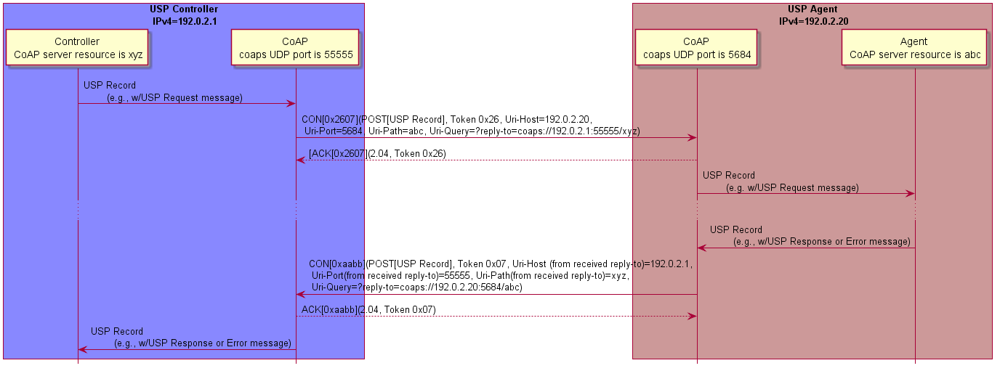

## CoAP Binding (DEPRECATED)

*Note: The CoAP MTP was deprecated in USP 1.2. Due to the way it is specified this MTP can only be used in local area networks under narrow conditions. Please see @sec:websocket for a suitable alternative.*

The Constrained Application Protocol (CoAP) MTP transfers USP Records between USP Endpoints using the CoAP protocol as defined in RFC 7252 [@RFC7252]. Messages that are transferred between CoAP clients and servers utilize a request/response messaging interaction based on RESTful architectural principles. The following figure depicts the transfer of the USP Records between USP Endpoints.

{#fig:usp-request-response-over-coap}

In this example, a USP Request is encoded within a USP Record and encapsulated within a CoAP request message. When a USP Endpoint receives the CoAP request message the USP Endpoint immediately sends a CoAP response message (with no USP Record) to indicate receipt of the message. A USP Response encoded within a USP Record is encapsulated in a new CoAP request message. When the USP Endpoint receives the USP Response, it sends a CoAP response message that indicates receipt of the message. Therefore, all Endpoints supporting CoAP will implement both CoAP client and server.

As noted in the definition of a USP Request, this USP Record either requests the Agent perform some action (create, update, delete, operate, etc.), requests information about an Agent or one or more Service Elements, or acts as a means to deliver Notifications from the Agent to the Controller. Notifications will only cause a USP Response to be generated if specified in the Notification Request. However, the CoAP response will always be sent.

### Mapping USP Endpoints to CoAP URIs

Section 6 of RFC 7262 [@RFC7252] discusses the URI schemes for identifying CoAP resources and provides a means of locating the resource.  These resources are organized hierarchically and governed by a CoAP server listening for CoAP requests on a given port. USP Endpoints are one type of CoAP resource that is identified and discovered.

**[R-COAP.0]{}** - As the USP Endpoint is a resource governed by a CoAP server, the CoAP server MUST also be identified as defined in section 6 of RFC 7262 [@RFC7252].

**[R-COAP.1]{}** - A USP Endpoint MUST be represented as a CoAP resource with the following resource attributes:

* Identifier within the CoAP server (uri-path)
* Resource type (rt): "`bbf.usp.endpoint`"
* Interface (if): "`bbf.usp.c`" for USP Controller or "`bbf.usp.a`" for USP Agent

The identifier within the CoAP server is used to deliver messages to the USP Endpoint. When this identifier is used to deliver messages to the USP Endpoint, this identifier is a uri-path that represents the USP Endpoint.

**[R-COAP.2]{}** - A CoAP request message MUST include a Uri-Query option that supplies the CoAP server URI of the Endpoint that is the source of the CoAP request, formatted as `?reply-to=<coap or coaps uri>`. The coap and coaps URIs are defined in sections 6.1 and 6.2 of RFC 7262 [@RFC7252]. The URI MUST NOT include any optional queries at the end.

**[R-COAP.2a]{}** - When a USP Endpoint receives a CoAP request message it MUST use the reply-to Uri-Query option included in the CoAP request as the CoAP URI for the USP Response (if a response is required by the incoming USP Request).

**[R-COAP.3]{}** - When creating DNS-SD records (see ), an Endpoint MUST set the DNS-SD TXT record "path" attribute equal to the value of the CoAP server identifier (uri-path).

### Mapping USP Records to CoAP Messages

**[R-COAP.4]{}** - In order for USP Records to be transferred between a USP Controller and Agent using CoAP, the USP Record MUST be encapsulated within the CoAP message as defined in RFC 7262 [@RFC7252].

**[R-COAP.5]{}** – USP Records that exceed the CoAP message size MUST be block encapsulated in accordance with [@RFC7959].

USP Records are transferred using the CoAP resource that represents the receiving USP Endpoint using the CoAP POST method as defined in RFC 7252.

**[R-COAP.6]{}** - The CoAP Content-Format for USP Records MUST be application/octet-stream (ID=42) for .

**[R-COAP.7]{}** - Upon successful reception of the CoAP message using POST, the CoAP server MUST respond with a response code of `2.04 (Changed)`.

#### Handling CoAP Request Failures

At times CoAP requests fail to complete due to problems in the underlying transport (e.g., timeout) or a failure response code received from the CoAP server due to problems in the CoAP request sent by the CoAP client (4.xx) or problems with the CoAP server implementation (5.xx).

**[R-COAP.8]{}** - CoAP clients and servers MUST implement the required CoAP response codes defined in section 5.9 of RFC 7262 [@RFC7252].

**[R-COAP.9]{}** - When a CoAP client receives a failure indication (e.g., timeout) from the underlying transport layer, the CoAP client MUST indicate a timeout to the USP Endpoint.

**[R-COAP.10]{}** - When a CoAP client receives a response code of 4.xx or 5.xx, the CoAP client MUST indicate a CoAP failure to the USP Endpoint.

When a CoAP client sends a CoAP request, the CoAP client can provide incorrect or missing information in the CoAP request. For example, a CoAP client can send a CoAP request with an:

*	Invalid CoAP method: The CoAP server responds with a `4.05`
*	Invalid Content-Format options: The CoAP server responds with a `4.15`
*	Invalid or not understandable payload: The CoAP server responds with a `4.00`

**[R-COAP.11]{}** - When a CoAP server receives a CoAP request with an invalid CoAP method, the CoAP server MUST respond with a `4.05` response code.

**[R-COAP.12]{}** - When a CoAP server receives a CoAP request with an invalid CoAP Content-Format option, the CoAP server MUST respond with a `4.15` response code.

**[R-COAP.13]{}** - When a CoAP server receives a CoAP request and the receiving USP Endpoint cannot interpret or decode the USP Record for processing, the CoAP server MUST respond with a `4.00` response code.

### MTP Message Encryption

CoAP MTP message encryption is provided using DTLS as described in Section 9 of RFC 7262 [@RFC7252].

In section 9 of RFC 7262 [@RFC7252], CoAP messages are secured using one of three modes:

* NoSec: DTLS is disabled
* PreSharedKey: DTLS is enabled and the MTP endpoint uses pre-shared keys that are used to validate the identity of CoAP endpoints involved in the message exchange
* RawPublicKey: DTLS is enabled and the MTP endpoint has an asymmetric key pair without a certificate. The MTP endpoint has an identity calculated from the public key and a list of other MTP endpoints to which it can communicate
* Certificate: DTLS is enabled and the MTP endpoint has an asymmetric key pair with an X.509 certificate.

**[R-COAP.14]{}** - CoAP clients and servers MUST implement the NoSec and Certificate modes of CoAP security as defined in RFC 7262 [@RFC7252].

While section 9 of RFC 7262 [@RFC7252] provides guidance on securing CoAP, further guidance related to DTLS implementations for the Internet of Things is provided by RFC 7925 [@RFC7925].

**[R-COAP.15]{}** - CoAP clients and servers MUST implement the mandatory statements of RFC 7925 [@RFC7925] with the exception that:

* Section 4.4.1 USP Controller certificates can contain domain names with wildcard characters per RFC 6125 [@RFC6125] guidance.
* Section 4.4.2 Client certificate identifiers do not use EUI-64 identifier but instead use the identifier defined for Client certificates in this Working Text.
* Section 4.4.5 Client Certificate URLs are not required to be implemented.

As USP Endpoints play the role of both CoAP client and server; when the MTP is secured using the Certificate mode of CoAP Security, the USP Endpoint provides a X.509 certificate to the MTP peer.

**[R-COAP.16]{}** – When the Certificate mode of CoAP is used to secure an MTP, a USP Endpoint MUST provide an X.509 certificate to the MTP peer.

Note that DTLS sessions established for an Endpoint's CoAP client and CoAP server are distinct. Therefore, it is possible for CoAP to be encrypted in one direction and not the other. If this happens, the requirements and flows in  will dictate that  be used.
