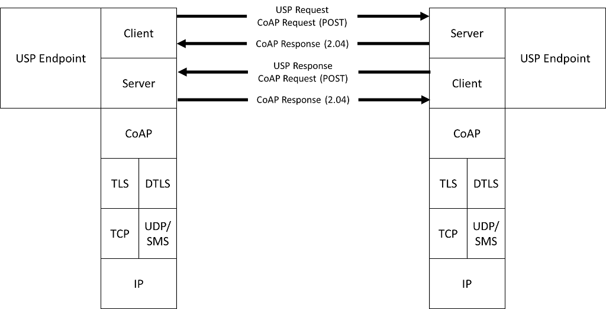
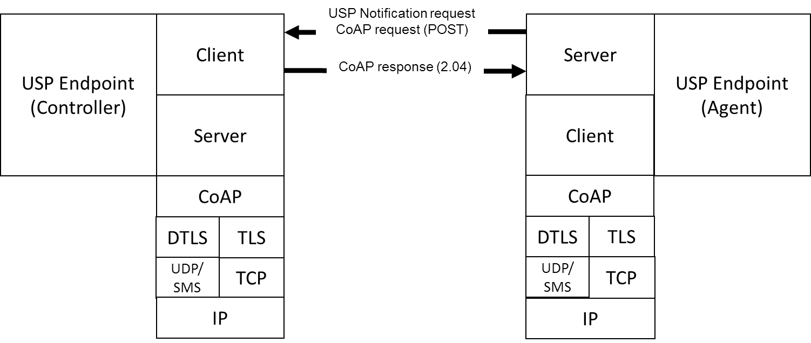

<!-- Reference Links -->
[1]:	https://www.broadband-forum.org/technical/download/TR-181_Issue-2_Amendment-12.pdf "TR-181 Issue 2 Device Data Model for TR-069"
[2]: https://www.broadband-forum.org/technical/download/TR-069.pdf	"TR-069 Amendment 6	CPE WAN Management Protocol"
[3]:	https://www.broadband-forum.org/technical/download/TR-106_Amendment-8.pdf "TR-106 Amendment 8	Data Model Template for TR-069 Enabled Devices"
[4]:	https://tools.ietf.org/html/rfc7228 "RFC 7228	Terminology for Constrained-Node Networks"
[5]:	https://tools.ietf.org/html/rfc2136	"RFC 2136 Dynamic Updates in the Domain Name System"
[6]:	https://tools.ietf.org/html/rfc3007	"RFC 3007 Secure Domain Name System Dynamic Update"
[7]:	https://tools.ietf.org/html/rfc6763	"RFC 6763 DNS-Based Service Discovery"
[8]:	https://tools.ietf.org/html/rfc6762	"RFC 6752 Multicast DNS"
[9]:	https://tools.ietf.org/html/rfc7252	"RFC 7252 The Constrained Application Protocol (CoAP)"
[10]:	https://tools.ietf.org/html/rfc7390	"RFC 7390 Group Communication for the Constrained Application Protocol (CoAP)"
[11]:	https://tools.ietf.org/html/rfc4033	"RFC 4033 DNS Security Introduction and Requirements"
[12]:	https://developers.google.com/protocol-buffers/docs/proto3 "Protocol Buffers v3	Protocol Buffers Mechanism for Serializing Structured Data Version 3"
[Conventions]: https://www.ietf.org/rfc/rfc2119.txt "Key words for use in RFCs to Indicate Requirement Levels"

# CoAP Binding

The Constrained Application Protocol (CoAP) MTP transfers USP messages between USP endpoints using the CoAP protocol as defined in [RFC 7252][9]. Messages that are transferred between CoAP clients and servers utilize a request/response messaging interaction based on RESTful architectural principles. The following figure depicts the transfer of the USP messages between USP controllers and agents.

Figure 1 – A USP message over the CoAP MTP

USP messages that originate from USP Controllers are encapsulated within a CoAP request message. When a USP Agent receives the CoAP request message the USP Agent sends a CoAP response message to the USP Controller that indicates receipt of the message. When the USP Agent responds to the USP Controller's request, the Agent encapsulates the USP response in a new CoAP request message. When the USP Controller receives the USP response, the USP Controller sends a CoAP response message that indicates receipt of the message.

In addition to the USP Requests that are exchanged between USP Controllers and Agents, the USP Notify Request from a USP Agent to one or more Controllers utilizes the same message pattern described in [RFC 7252][9] except the roles played by the CoAP endpoint are modified. The USP Agent plays the role of the CoAP client and the USP Controller plays the role of the CoAP server. When a USP Controller subscribes to receive notifications from a USP Agent, the USP Agent transmits the USP notification using the CoAP message as depicted in the following figure.

Figure 2 – USP Notifications over CoAP

## Mapping USP Endpoints to CoAP URIs
<a id="mapping_usp_endpoints_to_coap_uri" />

Section 6 of [RFC 7252][9] discusses the URI schemes for identifying CoAP resources and provides a means of locating the resource.  These resources are organized hierarchically and governed by a CoAP server listening for CoAP requests on a given port. USP Endpoints are one type of CoAP resource that is identified and discovered.

**R-COAP.0** - As the USP Endpoint is a resource governed by a CoAP server, the CoAP server MUST also be identified as defined in section 6 of [RFC 7252][9].

**R-COAP.1** - A USP Endpoint MUST be represented as a CoAP resource with the following resource attributes:
*	Identifier within the CoAP server (uri-path)
*	Resource type (rt): “`usp.endpoint`”
*	Interface (if): "`usp.c`" for USP Controller or “`usp.a`” for USP Agent

The identifier within the CoAP server is used to deliver messages to the USP Endpoint. When this identifier is used to deliver messages to the USP Endpoint, this identifier is a uri-path that represents the the USP Endpoint Identifier. For example: “`/e/{endpointId}`”

## Mapping USP Messages to CoAP Messages
<a id="mapping_usp_messages_to_coap_messages" />

**R-COAP.2** - In order for USP Messages to be transferred between a USP Controller and Agent using CoAP, the USP Message MUST be encapsulated within the CoAP message as defined in [RFC 7252][9].

**R-COAP.3** - USP Messages that exceed the CoAP message size MUST be block encapsulated in accordance with [draft-ietf-core-block](https://www.rfc-editor.org/rfc/rfc7959.txt).

USP Messages are transferred using the CoAP resource that represents the receiving USP Endpoint using the CoAP POST method as defined in [RFC 7252][9].

**R-COAP.4** - The CoAP Content-Format for USP Messages MUST be `application/octet-stream (ID=42)` for [protobuf encoding](/mtp).

### Handling CoAP Request Success
<a id="handling_coap_request_success" />

**R-COAP.5** - Upon successful reception of the CoAP message using POST, the CoAP server MUST respond with a response code of `2.04 (Changed)`.

### Handling CoAP Request Failures
<a id="handling_coap_request_failures" />

At times CoAP requests fail to complete due to problems in the underlying transport (e.g., timeout) or a failure response code received from the CoAP server due to problems in the CoAP request sent by the CoAP client (4.xx) or problems with the CoAP server implementation (5.xx).

**R-COAP.6** - CoAP clients and servers MUST implement the required CoAP response codes defined in section 5.9 of [RFC 7252][9].

**R-COAP.7** - When a CoAP client receives a failure indication (e.g., timeout) from the underlying transport layer, the CoAP client MUST indicate a timeout to the USP Endpoint.

**R-COAP.8** - When a CoAP client receives a failure indication (e.g., timeout) from the underlying transport layer, the CoAP client MUST indicate a timeout to the USP Endpoint.

**R-COAP.9** - When a CoAP client receives a response code of 4.xx or 5.xx, the CoAP client MUST indicate a CoAP failure to the USP Endpoint.

When a CoAP client sends a CoAP request, the CoAP client can provide incorrect or missing information in the CoAP request. For example, a CoAP client can send a CoAP request with an:

*	Invalid CoAP method: The CoAP server responds with a `4.05`
*	Invalid Content-Format options: The CoAP server responds with a `4.15`
*	Invalid or not understandable payload: The CoAP server responds with a `4.00`

**R-COAP.10** - When a CoAP server receives a CoAP request with an invalid CoAP method, the CoAP server MUST respond with a `4.05` response code.

**R-COAP.11** - When a CoAP server receives a CoAP request with an invalid CoAP Content-Format option, the CoAP server MUST respond with a `4.15` response code.

**R-COAP.12** - When a CoAP server receives a CoAP request and the receiving USP Endpoint cannot interpret or decode the USP Message for processing, the CoAP server MUST respond with a `4.00` response code.

## Mapping USP Notification Message to CoAP Message
<a id="mapping_usp_notification_message_to_coap_message" />

The USP Notify Request is the only message of the Request type that is sent from an Agent to a Controller. In these cases, the Agent functions as a CoAP client rather than a CoAP server in the POST/Response sequence.

**R-COAP.13** - When a CoAP server receives a USP Notify Request, the CoAP server MUST adhere to the requirements defined in [Mapping USP Messages to CoAP Messages](#mapping_usp_messages_to_coap_messages).
