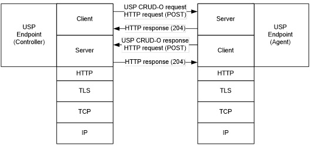
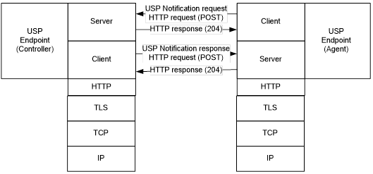

<!-- Reference Links -->
[1]:	https://www.broadband-forum.org/technical/download/TR-181_Issue-2_Amendment-12.pdf "TR-181 Issue 2 Device Data Model for TR-069"
[2]: https://www.broadband-forum.org/technical/download/TR-069.pdf	"TR-069 Amendment 6	CPE WAN Management Protocol"
[3]:	https://www.broadband-forum.org/technical/download/TR-106_Amendment-8.pdf "TR-106 Amendment 8	Data Model Template for TR-069 Enabled Devices"
[4]:	https://tools.ietf.org/html/rfc7228 "RFC 7228	Terminology for Constrained-Node Networks"
[5]:	https://tools.ietf.org/html/rfc2136	"RFC 2136 Dynamic Updates in the Domain Name System"
[6]:	https://tools.ietf.org/html/rfc3007	"RFC 3007 Secure Domain Name System Dynamic Update"
[7]:	https://tools.ietf.org/html/rfc6763	"RFC 6763 DNS-Based Service Discovery"
[8]:	https://tools.ietf.org/html/rfc6762	"RFC 6752 Multicast DNS"
[9]:	https://tools.ietf.org/html/rfc7252	"RFC 7252 The Constrained Application Protocol (CoAP)"
[10]:	https://tools.ietf.org/html/rfc7390	"RFC 7390 Group Communication for the Constrained Application Protocol (CoAP)"
[11]:	https://tools.ietf.org/html/rfc4033	"RFC 4033 DNS Security Introduction and Requirements"
[12]:	https://developers.google.com/protocol-buffers/docs/proto3 "Protocol Buffers v3	Protocol Buffers Mechanism for Serializing Structured Data Version 3"
[13]: https://tools.ietf.org/html/rfc7230 "Hypertext Transfer Protocol (HTTP/1.1): Message Syntax and Routing"
[14]: https://tools.ietf.org/html/rfc7231
[Conventions]: https://www.ietf.org/rfc/rfc2119.txt "Key words for use in RFCs to Indicate Requirement Levels"

# HTTP/1.1 Binding

The Hypertext Transfer Protocol (HTTP) version 1.1 MTP transfers USP messages between USP endpoints using the HTTP protocol as defined in [RFC 7230][13] and [RFC 7231][14]. Messages that are transferred between HTTP clients and servers utilize a request/response messaging interaction. The following figure depicts the transfer of USP messages between USP Controllers and Agents.

Figure 1 - A USP message over the HTTP/1.1 MTP

USP messages that originate from USP Controllers are encapsulated within an HTTP request message. When a USP Agent receives the HTTP request message the USP Agent sends an HTTP response message to the USP Controller that indicates receipt of the message. When the USP Agent responds to the USP Controller's request, the Agent encapsulates the USP response in a new HTTP request message. When the USP Controller receives the USP response, the USP Controller sends an HTTP response message that indicates receipt of the message.

In addition to the USP Requests that are exchanged between USP Controllers and Agents, the Notify Request from a USP Agent to one or more Controllers utilizes the same message pattern except the roles played by the HTTP endpoint are modified. The USP Agent plays the role of the HTTP client and the USP Controller plays the role of the HTTP server when the USP Agent makes a Notify Request. When a USP Controller subscribes to receive notifications from a USP Agent, the USP Agent transmits the Notify Request using the HTTP message as depicted in the following figure. Likewise if the USP Agent requests a response to the Notification, the USP Controller transmits the response to the Notify Request as depicted in the following figure.

Figure 2 - USP Notify Request over HTTP

## Mapping USP Endpoints to HTTP URIs

Section 8.2 of [RFC 7230][13] discusses the URI schemes for identifying HTTP origin servers and their target resources.  These resources are organized hierarchically and governed by an HTTP origin server listening for HTTP requests on a given port. USP Endpoints are one type of HTTP resource that is identified and discovered.

**R-HTTP.0** - As the USP Endpoint is a resource governed by an HTTP origin server, the HTTP server MUST also be identified as defined in section 8.2 of [RFC 7230][13].

**R-HTTP.1** - A USP Endpoint MUST be represented as an HTTP resource using the path component as defined in section 8.2 of [RFC 7230][13].

## Mapping USP Messages to HTTP Messages

**R-HTTP.2** - In order for USP Messages to be transferred between a USP Controller and Agent using HTTP 1.1, the USP Message MUST be encapsulated within the HTTP message as defined in section 2.1 of [RFC 7230][13].

**R-HTTP.3** - USP Messages are transferred between USP Endpoints using message body procedures as defined in section 3.3 of [RFC 7230][13].

**R-HTTP.4** - USP Messages are transferred using the HTTP path resource to the receiving USP Endpoint using the HTTP POST method as defined in section 4 of [RFC 7231][14].

**R-HTTP.5** - The HTTP Content-Type header for USP Messages MUST be application/octet-stream media type for the [encoding mechanism](/encoding/) used (i.e., [protocol-buffers][12]).

### Handling HTTP Request Success

**R-HTTP.6** - Upon successful reception of the HTTP message using POST, the HTTP origin server MUST respond with a response code of `204 (No Content)`.

### Handling HTTP Request Failures

At times HTTP requests fail to complete due to problems in the underlying transport (e.g., timeout) or a failure response code received from the HTTP origin server due to problems in the HTTP request sent by the HTTP client (4xx) or problems with the HTTP origin server implementation (5xx).

**R-HTTP.7** - HTTP clients and servers MUST implement the required HTTP response codes defined in section 6 of [RFC 7231][14].

**R-HTTP.8** - When an HTTP client receives a failure indication (e.g., timeout) from the underlying transport layer, the HTTP client MUST indicate a timeout to the USP Endpoint.

**R-HTTP.9** - When an HTTP client receives a response code in the 4xx or 5xx series, the HTTP client MUST indicate an HTTP failure to the USP Endpoint.

When an HTTP client sends an HTTP/1.1 request, the HTTP client can provide incorrect or missing information in the HTTP/1.1 request. For example, an HTTP client can send an HTTP/1.1 request with an:

*	Invalid HTTP method: The HTTP origin server responds with a `405` response code.
*	Unsupported Media Type: The HTTP origin server responds with a `415` response code.
*	Invalid or not understandable payload: The HTTP origin server responds with a `400` response code.

**R-HTTP.10** - When an HTTP origin server receives an HTTP/1.1 request with an invalid HTTP method, the HTTP origin server MUST respond with a `405` response code.

**R-HTTP.11** - When an HTTP origin server receives an HTTP/1.1 request with an invalid HTTP Media Type option, the HTTP origin server MUST respond with a `415` response code.

**R-HTTP.12** - When an HTTP origin server receives an HTTP/1.1 request and the receiving USP Endpoint cannot interpret or decode the USP Message for processing, the HTTP origin server MUST respond with a `400` response code.

## Mapping USP Notify Requests to HTTP

The USP Notify Request is the only message of the Request type that is sent from an Agent to a Controller. In these cases, the Agent functions as an HTTP client rather than an HTTP server in the POST/Response sequence.

**R-HTTP.13** - When an HTTP client receives a USP Notification, the HTTP client MUST adhere to the requirements defined in the USP [Notifications and Subscription Mechanism](/messages/#notify).

## MTP Message Encryption

HTTP MTP message encryption is provided using certificates in TLS as described in [RFC 2818](https://tools.ietf.org/html/rfc2818) and the updates to RFC 2818 contained in sections 2.7.2 and 9 of RFC 7230[13].

**R-HTTP.14** - USP Endpoints utilizing HTTP clients and servers for message transport MUST implement the Certificate modes of TLS security as defined in [RFC 2818](https://tools.ietf.org/html/rfc2818) and the updates to RFC 2818 contained in sections 2.7.2 and 9 of RFC 7230[13].

**R-HTTP.15** - While section 9 of [RFC 7230][13] provides guidance on securing HTTP, further guidance related to TLS implementations for HTTP clients and servers are as follows:

*	USP Endpoints that implement an HTTP MTP MUST support TLS 1.2 as defined in [RFC 5246](https://tools.ietf.org/html/rfc5246).
*	USP Endpoints that implement an HTTP MTP SHOULD use the [RFC 6066](https://tools.ietf.org/html/rfc6066) Server Name TLS extension to send the host portion of the USP Endpoint's URL as the server name during the TLS handshake.
*	USP Endpoints that implement an HTTP MTP MUST support the required (MUST/MUST NOT) recommendations and guidelines defined in the following sections of [RFC 7525](https://tools.ietf.org/html/rfc7525):
    *	Section 3.2 - Strict TLS
    *	Section 3.3 - TLS Compression
    *	Section 3.4 - TLS Session Resumption
    *	Section 3.5 - TLS Renegotiation
    *	Section 4.1 - Cipher Suites: General Guidelines
*	A USP Endpoint that implements an HTTP MTP authenticates its HTTP MTP peer using the peer’s HTTP MTP-provided certificate. Authentication of the peer HTTP MTP requires that the HTTP MTP MUST validate the certificate against a root certificate.
    *	If the host portion of the peer HTTP MTP's URL is a DNS name, this MUST be done per the principles of [RFC 6125](https://tools.ietf.org/html/rfc6125), using the host portion of the peer HTTP's USP URL as the reference identifier.
    *	If the host portion of the peer HTTP MTP's URL is an IP address, this MUST be done by comparing the IP address against any presented identifiers that are IP addresses.
* USP Endpoints that implement an HTTP MTP MUST use subjectAltName extensions for validating the certificate.

*Note - the terms "reference identifier" and "presented identifier" are defined in [RFC 6125](https://tools.ietf.org/html/rfc6125).*

*Note - wildcard certificates are permitted as described in [RFC 6125](https://tools.ietf.org/html/rfc6125).*

**R-HTTP.16** - USP Endpoints capable of obtaining absolute time SHOULD wait until it has accurate absolute time before contacting the peer USP Endpoint.  If a USP Endpoint for any reason is unable to obtain absolute time, it can contact the peer USP Endpoint without waiting for accurate absolute time.  If a USP Endpoint chooses to contact the peer USP Endpoint before it has accurate absolute time (or if it does not support absolute time), it MUST ignore those components of the peer USP Endpoint's HTTP MTP certificate that involve absolute time, e.g. not-valid-before and not-valid-after certificate restrictions.

**R-HTTP.17** -	Support for HTTP MTP authentication using client-side certificates is OPTIONAL for USP Endpoints.  If supported, client-side certificates MUST be signed by a trusted certificate authority.  When client-side certificates are used to authenticate the HTTP MTP to the peer HTTP MTP, the endpoints MUST use subjectAltName extensions for validating the certificate.
