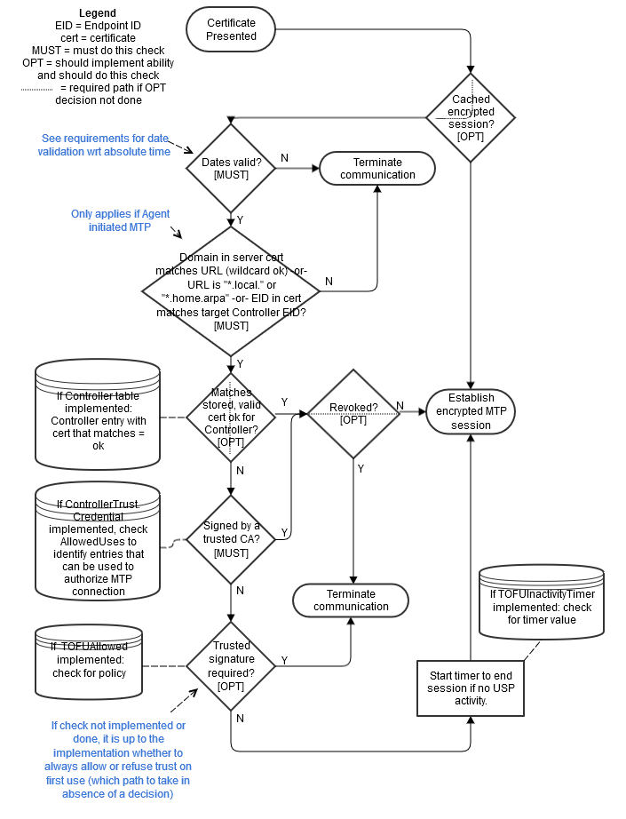

<!-- Reference Links -->
[1]:	https://github.com/BroadbandForum/usp/tree/master/data-model "TR-181 Issue 2 Device Data Model for TR-069"
[2]: https://www.broadband-forum.org/technical/download/TR-069.pdf	"TR-069 Amendment 6	CPE WAN Management Protocol"
[3]:	https://www.broadband-forum.org/technical/download/TR-106_Amendment-8.pdf "TR-106 Amendment 8	Data Model Template for TR-069 Enabled Devices"
[4]:	https://tools.ietf.org/html/rfc7228 "RFC 7228	Terminology for Constrained-Node Networks"
[5]:	https://tools.ietf.org/html/rfc2136	"RFC 2136 Dynamic Updates in the Domain Name System"
[6]:	https://tools.ietf.org/html/rfc3007	"RFC 3007 Secure Domain Name System Dynamic Update"
[7]:	https://tools.ietf.org/html/rfc6763	"RFC 6763 DNS-Based Service Discovery"
[8]:	https://tools.ietf.org/html/rfc6762	"RFC 6762 Multicast DNS"
[9]:	https://tools.ietf.org/html/rfc7252	"RFC 7252 The Constrained Application Protocol (CoAP)"
[10]:	https://tools.ietf.org/html/rfc7390	"RFC 7390 Group Communication for the Constrained Application Protocol (CoAP)"
[11]:	https://tools.ietf.org/html/rfc4033	"RFC 4033 DNS Security Introduction and Requirements"
[12]:	https://developers.google.com/protocol-buffers/docs/proto3 "Protocol Buffers v3	Protocol Buffers Mechanism for Serializing Structured Data Version 3"
[13]: https://regauth.standards.ieee.org/standards-ra-web/pub/view.html#registries "IEEE Registration Authority"
[14]: https://tools.ietf.org/html/rfc4122 "RFC 4122 A Universally Unique IDentifier (UUID) URN Namespace"
[15]: https://tools.ietf.org/html/rfc5280 "RFC 5290 Internet X.509 Public Key Infrastructure Certificate and Certificate Revocation List (CRL) Profile"
[16]: https://tools.ietf.org/html/rfc6818 "RFC 6818 Updates to the Internet X.509 Public Key Infrastructure Certificate and Certificate Revocation List (CRL) Profile"
[17]: https://www.ietf.org/rfc/rfc2234.txt "RFC 2234 Augmented BNF for Syntax Specifications: ABNF"
[18]: https://www.ietf.org/rfc/rfc3986.txt "RFC 3986 Uniform Resource Identifier (URI): Generic Syntax"
[19]: https://www.ietf.org/rfc/rfc2141.txt "RFC 2141 URN Syntax"
[20]: https://www.ietf.org/rfc/rfc5246.txt "The Transport Layer Security (TLS) Protocol Version 1.2"
[21]: https://www.ietf.org/rfc/rfc6347.txt "Datagram Transport Layer Security Version 1.2"
[Conventions]: https://www.ietf.org/rfc/rfc2119.txt "Key words for use in RFCs to Indicate Requirement Levels"

# Message Transfer Protocols

USP messages are sent between Endpoints over one or more Message Transfer Protocols.

Note: Message Transfer Protocol was a term adopted to avoid confusion with the term “Transport”, which is often overloaded to include both application layer (i.e. CoAP) and the actual OSI Transport layer (i.e. UDP). Throughout this document, Message Transfer Protocol (MTP) refers to application layer transport.

The requirements for each individual Message Transfer Protocol is covered in a section of this document. This version of the specification includes definitions for:

*	The [Constrained Application Protocol (CoAP)](./coap/)
* [WebSockets](./websocket/)
* The [Simple Text-Oriented Messaging Protocol](./stomp/)

## Securing MTPs

<a id="securing_mtps" />

This specification places the following requirement for encrypting MTP headers and payloads on USP implementations that are intended to be used in environments where USP Messages will be transported across the Internet:

**R-MTP.0** – The Message Transfer Protocol MUST use secure transport when USP Messages cross inter-network boundaries.

For example, it may not be necessary to use MTP layer security when within an end-user’s local area network (LAN). It is necessary to secure transport to and from the Internet, however. If the device implementer can reasonably expect Messages to be transported across the Internet when the device is deployed, then the implementer needs to ensure the device supports encryption of all MTP protocols.

MTPs that operate over UDP will be expected to implement, at least, DTLS 1.2 as defined in [RFC 6347]( https://tools.ietf.org/html/rfc6347).

MTPs that operate over TCP will be expected to implement, at least, TLS 1.2 as defined in [RFC 5246]( https://tools.ietf.org/html/rfc5246).

Specific requirements for implementing these are provided in the individual MTP sections.

**R-MTP.1** – When TLS or DTLS is used to secure an MTP, an Agent MUST require the MTP peer to provide an X.509 certificate.

**R-MTP.2** - An Agent capable of obtaining absolute time SHOULD wait until it has accurate absolute time before establishing TLS or DTLS encryption to secure MTP communication.  If an Agent for any reason is unable to obtain absolute time, it can establish TLS or DTLS without waiting for accurate absolute time. If an Agent chooses to establish TLS or DTLS before it has accurate absolute time (or if it does not support absolute time), it MUST ignore those components of the received X.509 certificate that involve absolute time, e.g. not-valid-before and not-valid-after certificate restrictions.

**R-MTP.3** - An Agent that has obtained an accurate absolute time MUST validate those components of the received X.509 certificate that involve absolute time.

**R-MTP.4** - When an Agent receives an X.509 certificate while establishing TLS or DTLS encryption of the MTP, the Agent MUST execute logic that achieves the same results as in the decision flow from Figures [MTP.1](#figure-MTP1).

Figure MTP.1 – Receiving a X.509 Certificate

<a id='figure-MTP1'/>

[<-- Discovery](../specification/discovery/)
[--> CoAP as a Message Transfer Protocol](../specification/mtp/coap/)
