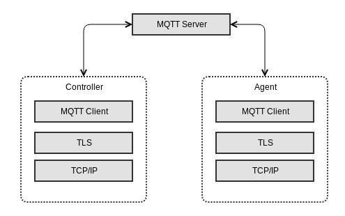
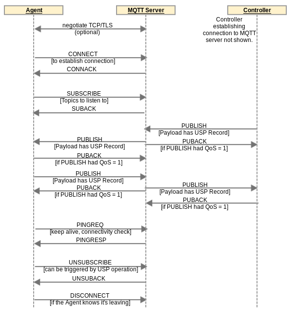

<!-- Reference Links -->
[1]:	https://broadbandforum.github.io/usp-data-models/ "TR-181 Issue 2 Device:2 Data Model"
[2]: https://www.broadband-forum.org/technical/download/TR-069.pdf	"TR-069 Amendment 6	CPE WAN Management Protocol"
[3]:	https://www.broadband-forum.org/technical/download/TR-106_Amendment-8.pdf "TR-106 Amendment 8	Data Model Template for TR-069 Enabled Devices"
[4]:	https://tools.ietf.org/html/rfc7228 "RFC 7228	Terminology for Constrained-Node Networks"
[5]:	https://tools.ietf.org/html/rfc2136	"RFC 2136 Dynamic Updates in the Domain Name System"
[6]:	https://tools.ietf.org/html/rfc3007	"RFC 3007 Secure Domain Name System Dynamic Update"
[7]:	https://tools.ietf.org/html/rfc6763	"RFC 6763 DNS-Based Service Discovery"
[8]:	https://tools.ietf.org/html/rfc6762	"RFC 6762 Multicast DNS"
[9]:	https://tools.ietf.org/html/rfc7252	"RFC 7252 The Constrained Application Protocol (CoAP)"
[10]:	https://tools.ietf.org/html/rfc7390	"RFC 7390 Group Communication for the Constrained Application Protocol (CoAP)"
[11]:	https://tools.ietf.org/html/rfc4033	"RFC 4033 DNS Security Introduction and Requirements"
[12]:	https://developers.google.com/protocol-buffers/docs/proto3 "Protocol Buffers v3	Protocol Buffers Mechanism for Serializing Structured Data Version 3"
[13]: https://regauth.standards.ieee.org/standards-ra-web/pub/view.html#registries "IEEE Registration Authority"
[14]: https://tools.ietf.org/html/rfc4122 "RFC 4122 A Universally Unique IDentifier (UUID) URN Namespace"
[15]: https://tools.ietf.org/html/rfc5280 "RFC 5290 Internet X.509 Public Key Infrastructure Certificate and Certificate Revocation List (CRL) Profile"
[16]: https://tools.ietf.org/html/rfc6818 "RFC 6818 Updates to the Internet X.509 Public Key Infrastructure Certificate and Certificate Revocation List (CRL) Profile"
[17]: https://tools.ietf.org/html/rfc2234 "RFC 2234 Augmented BNF for Syntax Specifications: ABNF"
[18]: https://tools.ietf.org/html/rfc3986 "RFC 3986 Uniform Resource Identifier (URI): Generic Syntax"
[19]: https://tools.ietf.org/html/rfc2141 "RFC 2141 URN Syntax"
[20]: https://tools.ietf.org/html/rfc6455 "RFC 6455 The WebSocket Protocol"
[21]: https://stomp.github.io/stomp-specification-1.2.html "Simple Text Oriented Message Protocol"
[22]: https://tools.ietf.org/html/rfc5246 "The Transport Layer Security (TLS) Protocol Version 1.2"
[23]: https://tools.ietf.org/html/rfc6347 "Datagram Transport Layer Security Version 1.2"
[Conventions]: https://tools.ietf.org/html/rfc2119 "Key words for use in RFCs to Indicate Requirement Levels"

# MQTT Binding

1. [Connecting a USP Endpoint to the MQTT Server](#connecting_a_usp_endpoint_to_the_mqtt_server)
    1. [CONNECT Flags and Properties](#connect_flags_and_properties)
    2. [Keep Alive](#keep_alive)
2. [Subscribing to MQTT Topics](#subscribing_to_mqtt_topics)
3. [Sending the USP Record in a PUBLISH Packet Payload](#sending_the_usp_record_in_a_publish_packet_payload)
4. [Handling Errors](#handling_errors)
4. [Handling Other MQTT Packets](#handling_other_mqtt_packets)
4. [Discovery Requirements](#discovery_requirements)
5. [MQTT Server Requirements](#mqtt_server_requirements)
6. [MTP Message Encryption](#mtp_message_encryption)

The Message Queuing Telemetry Transport (MQTT) MTP transfers USP Records between USP Endpoints using the MQTT protocol. Messages that are transferred between MQTT clients utilize a message bus interaction model where the MQTT server is the messaging broker that routes and delivers messages based on the Topic Name included in the MQTT Publish packet variable header.

The following figure depicts the transfer of the USP Records between USP Agents and Controllers.

Figure MQTT.1 - USP over MQTT Architecture

The basic steps for any USP Endpoint that utilizes an MQTT MTP are:

*    Negotiate TLS (if required/configured)
*    Connect to the MQTT Server (server may require Authentication)
*    Subscribe to a Topic
*    Publish USP Records
*    Optionally send `PINGREQ` messages to keep the connection alive

The following figure shows the MQTT packets that have requirements in this section for their use when MQTT is a USP MTP.

Figure MQTT.2 - MQTT Packets

**R-MQTT.1** - USP Endpoints utilizing MQTT clients for message transport MUST implement [MQTT 5.0](https://docs.oasis-open.org/mqtt/mqtt/v5.0/mqtt-v5.0.html).

**R-MQTT.2** - USP Endpoints utilizing MQTT clients for message transport MAY implement [MQTT 3.1.1](https://docs.oasis-open.org/mqtt/mqtt/v3.1.1/mqtt-v3.1.1.html).

Requirements in this MQTT MTP specification are common to both the MQTT 3.1.1 and MQTT 5.0 specifications unless an MQTT version is named.

The MQTT specifications are very complete and comprehensive in describing syntax and usage requirements of MQTT packets and behaviors. Therefore, none of those requirements are re-iterated in this specification. This specification only contains requirements unique to use of MQTT as a USP MTP. The above two requirements for compliance with the MQTT specifications are critical in developing an implementation compliant with this MQTT Binding specification. Wherever an MQTT packet or other functionality is mentioned in the requirements in this MQTT Binding specification, the requirement for compliance with the MQTT specification (R-MQTT.1 and R-MQTT.2) apply.

**R-MQTT.3** - USP Agents utilizing MQTT clients for message transport MUST support MQTT over TCP transport protocol.

The MQTT specification also describes how MQTT can run over WebSockets. Deployments can choose to use MQTT over WebSockets, if they use MQTT clients and servers with support for this option. The TCP option is required to ensure interoperability.

**R-MQTT.4** - USP Agents utilizing MQTT clients for message transport MUST support the `MQTTClientCon:1`, `MQTTClientSubscribe:1`, `MQTTAgent:1`, and `MQTTController:1` data model profiles.

**R-MQTT.5** - USP Agents utilizing MQTT clients for message transport SHOULD support the `MQTTClientExtended:1` data model profile.

<a id='connecting_a_usp_endpoint_to_the_mqtt_server' />

## Connecting a USP Endpoint to the MQTT Server

When exchanging USP Records across MQTT MTPs, each USP Endpoint establishes a communications session with an MQTT server. These MQTT communications sessions are expected to be long-lived and are re-used for subsequent exchange of USP Records. an MQTT communications session is established using the procedure in this section. an MQTT communications session is intended to be established as soon as the USP Endpoint becomes network-aware and can send TCP/IP messages.

When an MQTT communications session is no longer necessary or expires (see "Keep Alive" section below), the MQTT connection is closed by the MQTT client, preferably by sending a `DISCONNECT` packet (see [Handling Other MQTT Packets](#handling_other_mqtt_packets) section below).

R-MQTT-1 and R-MQTT-2 require that all MQTT capabilities referenced in this section and its sub-sections are compliant with the MQTT specifications. Reading the MQTT specification is highly recommended to ensure the correct syntax and usage of MQTT packets and properties (`CONNECT`, `CONNACK`, User Name, Password, ClientId, User Property, Keep Alive, `PINGREQ`, `PINGRESP`, etc.).

**R-MQTT.6** - USP Endpoints utilizing MQTT clients for message transport MUST send a `CONNECT` packet to the MQTT server to initiate the MQTT communications session.

**R-MQTT.7** - USP Endpoints with a configured MQTT User Name and Password for use with this MQTT server MUST include these in the MQTT `CONNECT` packet. The `.MQTT.Client.{i}.Username` and `.MQTT.Client.{i}.Password` parameters values (associated with this MQTT server) will be used for User Name and Password.

**R-MQTT.8** - USP Endpoints MUST set the value of the `CONNECT` packet Client Identifier (ClientId) as follows:

* If a non-empty, non-null ClientId value exists for use with this MQTT server, this MUST be used. The data model parameter for the ClientId is  `.MQTT.Client.{i}.ClientID`.
* If an MQTT 5.0 client has no configured ClientId (null or empty string) the USP Endpoint MUST send an empty string in the Client Identifier property.
* If an MQTT 3.1.1 client has no configured ClientId, the USP Endpoint SHOULD attempt to use its USP Endpoint ID as the ClientId.

**R-MQTT.9** - an MQTT 5.0 client MUST save (in the `.MQTT.Client.{i}.ClientID` parameter) an Assigned Client Identifier included in a `CONNACK` packet as its configured ClientId for future use.

**R-MQTT.10** - If the connection to the MQTT server is NOT successful then the USP Endpoint MUST enter a connection retry state. For a USP Agent the retry mechanism is based on the `MQTT.Client.{i}.` retry parameters: `ConnectRetryTime`, `ConnectRetryIntervalMultiplier`, and `ConnectRetryMaxInterval`.

**R-MQTT.11** - Once a USP Endpoint has successfully connected to an MQTT server, it MUST use the same ClientId for all subsequent connections with that server.

<a id='connect_flags_and_properties' />

### CONNECT Flags and Properties

The MQTT `CONNECT` packet has a number of flags and properties that can be set. The User Name and Password flags are set to 1 if these parameters are included. The use of the Will Retain, Will QoS, and Will Flag are left up to the deployment. They are not needed in order to use MQTT as a USP MTP and can be “0” if there is no deployment-specified need for them. The Clean Start flag can also be used according to deployment-specified needs. Configured values for these flags can be provided through the related `.MQTT.Client.{i}.` parameters.

MQTT 3.1.1 does not provide a simple mechanism for a USP MQTT client to provide its Endpoint ID to the MQTT server. But the server does have other options, such as:

1. Support Endpoint ID as ClientId.
2. Get Endpoint ID from client TLS certificate.

MQTT 3.1.1 also does not provide a mechanism for the MQTT server to tell a client what Topic other Endpoints should use to send it a message (the "reply to" Topic). This information would need to be pre-configured or provided in some manner not specified here.

MQTT 5.0 includes additional properties that deployments can choose to use.

**R-MQTT.12** - an MQTT 5.0 USP Endpoint MUST support setting the Request Response Information property to 1, and MUST support receiving the corresponding Response Information in the `CONNACK` packet.

The Response Information property is used by an MQTT 5.0 client as the Response Topic (which is the MQTT 5.0 `PUBLISH` packet property identifying the Topic to send a USP response to). The Response Information property requirements for use of the received Response Information are below in the section [Sending the USP Record in a PUBLISH Packet Payload](#sending_the_usp_record_in_a_publish_packet_payload). Ensuring the client is subscribed to this Topic or a Topic Filter that includes this Topic is described in [Subscribing to MQTT Topics](#subscribing_to_mqtt_topics).

**R-MQTT.13** - an MQTT 5.0 USP Endpoint MUST include a User Property name-value pair in the `CONNECT` packet with name of "usp-endpoint-id" and value of this Endpoint's USP Endpoint ID.

<a id='keep_alive' />

### Keep Alive

The MQTT Keep Alive mechanism has several components:

* The `CONNECT` packet Keep Alive field tells the server to disconnect the client if the server does not receive a packet from the client before the Keep Alive time (in seconds) has elapsed since the prior received packet.
* The MQTT 5.0 `CONNACK` packet Keep Alive field allows the server to inform the client the maximum interval the server will allow to elapse between received packets before it disconnects the client due to inactivity.
* `PINGREQ` and `PINGRESP` packets can be used to keep the connection up if the timer is nearing expiry and there is no need for another type of message. `PINGREQ` can also be used by the client at any time to check on the status of the connection.

The client can indicate the Server is not required to disconnect the Client on the grounds of inactivity by setting the `CONNECT` Keep Alive to zero (0). Note that WebSockets mechanisms can be used to keep the connection alive if MQTT is being run over WebSockets. Also note the server is allowed to disconnect the client at any time, regardless of Keep Alive value.

**R-MQTT.14** - USP Endpoints with a configured Keep Alive value MUST include this in the MQTT `CONNECT` packet. The `.MQTT.Client.{i}. KeepAliveTime` parameter value (associated with this MQTT server) will be used for the Keep Alive value.

Use of `PINGREQ` and `PINGRESP` for keeping sessions alive (or determining session aliveness) is as described in the MQTT specification. No additional requirements are provided for use of these packets in a USP context.

<a id='subscribing_to_mqtt_topics' />

## Subscribing to MQTT Topics

The `SUBSCRIBE` packet is sent by the MQTT client to subscribe to one or more Topics or Topic Filters. These are needed to allow the MQTT client to receive application messages. The MQTT client will receive all application messages published by other clients that are sent to a Topic that matches (either exactly or within a wildcarded Topic Filter) a subscribed-to Topic or Topic Filter. The MQTT server indicates in the `SUBACK` response packet whether the client has succeeded or failed to subscribe to each Topic or Topic Filter sent in the `SUBSCRIBE` packet.

USP Endpoints can be configured with one or more specific MQTT Topics or Topic Filters to subscribe to for each MQTT server they are associated with. In MQTT 5.0, a `CONNACK` User Property named “subscribe-topic” can be used to provide the client with Topic or Topic Filter values for the client to subscribe to. There is no similar capability in MQTT 3.1.1. This means configuration or some out-of-band mechanism are the only means of supplying subscription Topics or Topic Filters to an MQTT 3.1.1 client. An Agent will need to be configured with a Controller’s MQTT Topic (the Device.LocalAgent.Controller.{i}.MTP.{i}.MQTT.Topic parameter is used to configure this), to send a Notification to that Controller.

R-MQTT-1 and R-MQTT-2 require that all MQTT capabilities referenced in this section and its sub-sections are compliant with the MQTT specifications. Reading the MQTT specification is highly recommended to ensure the correct syntax and usage of MQTT packets and properties (`SUBSCRIBE`, Topic Filter, QoS 0, QoS 1, QoS 2, etc.).

**R-MQTT.15** - USP Endpoints that successfully connect to an MQTT server MUST send a `SUBSCRIBE` packet with all Topic Filters identified in the following list:

* All configured Topic Filter values for use with this MQTT server MUST be included in a `SUBSCRIBE` packet. For a USP Agent, the `.MQTT.Client.{i}.Subscription.{i}. ` table can be used to configure Topic Filter values.
* If an MQTT 5.0 USP Endpoint received one or more User Property in the `CONNACK` packet where the name of the name-value pair is “subscribe-topic”, the USP Endpoint MUST include the value of all such name-value pairs in its `SUBSCRIBE` packet as a Topic Filter.
* If an MQTT 5.0 Endpoint received a Response Information property in the `CONNACK` packet, and the topic from that Response Information property is not included (directly or as a subset of a Topic Filter) among the Topic Filters of the previous 2 bullets, the Endpoint MUST include the value of the Response Information property in its `SUBSCRIBE` packet.
* If an Endpoint has a `ResponseTopicConfigured` value and did not receive a Response Information property in the `CONNACK` packet, and the topic in the `ResponseTopicConfigured` parameter is not included (directly or as a subset of a Topic Filter) among the Topic Filters of the first 2 bullets, the Endpoint MUST include the value of the `ResponseTopicConfigured` in its `SUBSCRIBE` packet.

**R-MQTT.16** - USP Agents that have NOT received a "subscribe-topic" User Property in the `CONNACK` and do NOT have a configured Topic Filter (`Device.MQTT.Client.{i}.Subscription.{i}.Topic` parameter for this Client instance in the data model) MUST terminate the MQTT communications session (via the `DISCONNECT` packet) and consider the MTP disabled.

**R-MQTT.17** - If a USP Endpoint does not successfully subscribe to at least one Topic, it MUST NOT publish a packet with a USP Record in its Application Message, and MUST disconnect from the MQTT server.

For each Topic listed in a `SUBSCRIBE` packet, the client will also provide a desired QoS level. See the MQTT specification ([MQTT 3.1.1](https://docs.oasis-open.org/mqtt/mqtt/v3.1.1/mqtt-v3.1.1.html) or [MQTT 5.0](https://docs.oasis-open.org/mqtt/mqtt/v5.0/mqtt-v5.0.html), Section 4.3) for description of the three QoS levels (QoS 0, QoS 1, QoS 2). The usefulness of these QoS levels in the context of USP depends on the particulars of the MQTT deployment. It is therefore up to the implementer / deployer to decide which QoS setting to use. In order to ensure deployments have the ability to use at least QoS 1, MQTT clients and servers are required to implement at least QoS 1 (see requirements in [Sending the USP Record in a PUBLISH Packet Payload](#sending_the_usp_record_in_a_publish_packet_payload) and [MQTT Server Requirements](#mqtt_server_requirements).

<a id='sending_the_usp_record_in_a_publish_packet_payload' />

## Sending the USP Record in a PUBLISH Packet Payload

A USP Record is sent from a USP Endpoint to an MQTT Server within a `PUBLISH` packet payload. The MQTT Server delivers that `PUBLISH` packet to the destination MQTT client USP Endpoint. This is true of all USP Message types.

R-MQTT-1 and R-MQTT-2 require that all MQTT capabilities referenced in this section and its sub-sections are compliant with the MQTT specifications. Reading the MQTT specification is highly recommended to ensure the correct syntax and usage of MQTT packets and properties (`PUBLISH`, Content Type, Response Topic, etc.).

**R-MQTT.18** - USP Endpoints utilizing MQTT clients for message transport MUST send the USP Record in the payload of a `PUBLISH` packet.

**R-MQTT.19** - USP Endpoints MUST send USP Records using the [Protocol Buffer](12) binary encoding of the USP Record.

**R-MQTT.20** - USP Endpoints utilizing MQTT clients for message transport MUST support MQTT QoS 0 and QoS 1.

The USP Controller's MQTT Topic needs to be known by any USP Agent expected to send a Notify message to the Controller.

The USP Agent will also need to know an exact Topic where it can be reached (and not just a Topic Filter) in order to provide a Controller with the Agent’s “reply to” Topic.

**R-MQTT.21** - an MQTT 5.0 USP Endpoint that receives Response Information in the `CONNACK` packet MUST use this as its "reply to" Topic.

**R-MQTT.22** - USP Endpoints MUST include a "reply to" Topic in all `PUBLISH` packets transporting USP Records.

**R-MQTT.23** - USP Endpoints using MQTT 5.0 MUST include their “reply to” Topic in the `PUBLISH` Response Topic property.

**R-MQTT.24** - USP Endpoints using MQTT 3.1.1 MUST include their “reply to” Topic after a forward slash “/reply-to=” at the end of the `PUBLISH` Topic Name, with any “/” character in the Topic replaced by “%2F”.

For example, if a Controller’s “reply to” Topic is “usp/controllers/oui:00256D:my-unique-bbf-id-42”, and it is sending to an Agent whose Topic is “usp/agents/cid:3AA3F8:my-unique-usp-id-42”, the `PUBLISH` Topic Name for a USP Controller using an MQTT 3.1.1 client will be “usp/agents/cid:3AA3F8:my-unique-usp-id-42/reply-to= usp%2Fcontrollers%2Foui:00256D:my-unique-bbf-id-42”.

USP Endpoints that need to send a response to a received USP Record will need to determine the Topic Name to use in the responding `PUBLISH` packet.

**R-MQTT.25** - USP Endpoints using MQTT 3.1.1 MUST interpret the portion of the received `PUBLISH` Topic Name following the last forward slash “/reply-to=” as the response Topic Name. Any instance of “%2F” in this received string MUST be replaced with “/”.

**R-MQTT.26** - USP Endpoints using MQTT 5.0 MUST use the received `PUBLISH` Response Topic property as the response Topic Name.

**R-MQTT.27** - USP Endpoints sending a USP Record using MQTT 5.0 MUST have “application/vnd.bbf.usp.msg” in the Content Type property.

MQTT clients using MQTT 3.1.1 will need to know to pass the payload to the USP Agent for handling. There is no indication in MQTT 3.1.1 of the payload application or encoding. an MQTT 3.1.1 deployment could choose to dedicate the MQTT connection to USP, or put something in the syntax of `PUBLISH` packet Topic Names that would indicate the payload is a USP Record.

<a id='handling_errors' />

## Handling Errors

The MQTT specification requires servers and clients to disconnect if there is a violation at the MQTT protocol layer.

If an MQTT 5.0 USP Endpoint receives a `PUBLISH` packet containing a USP Record that cannot be extracted for processing (e.g., text frame instead of a binary frame, malformed USP Record or USP Message, bad encoding), it is required to send an error message (described below). an MQTT 3.1.1 receiving USP Endpoint will silently drop the unprocessed USP Record.

R-MQTT-1 and R-MQTT-2 require that all MQTT capabilities referenced in this section and its sub-sections are compliant with the MQTT specifications. Reading the MQTT specification is highly recommended to ensure the correct syntax and usage of MQTT packets and properties (`PUBLISH`, `PUBACK`, etc.).

**R-MQTT.28** - MQTT 5.0 Endpoints MUST support `PUBLISH` Content Type value of application/vnd.bbf.usp.error.

**R-MQTT.29** - MQTT 5.0 Endpoints MUST include a `usp-err-id` MQTT User Property in `PUBLISH` packets of content-type “application/vnd.bbf.usp.msg”. The value of this header is:  \<USP Record to-id\> + "/" + \<USP Message msg\_id\>.

**R-MQTT.30** - When an MQTT 3.1.1 USP Endpoint receives a `PUBLISH` packet containing a USP Record or an encapsulated USP Message within a USP Record that cannot be extracted for processing, the receiving USP Endpoint MUST silently drop the USP Record.

**R-MQTT.31** - When an MQTT 5.0 USP Endpoint receives a `PUBLISH` packet containing a USP Record or an encapsulated USP Message within a USP Record that cannot be extracted for processing, the receiving USP Endpoint MUST send a `PUBLISH` packet with Content Type application/vnd.bbf.usp.error, a User Property set to the received `usp-err-id` User Property, the Topic Name  set to the received Response Topic, and a `PUBLISH` Payload (formatted using UTF-8 encoding) with the following 2 lines:

*    `err_code:`\<numeric code indicating the type of error that caused the overall message to fail\>
*    `err_msg:`\<additional information about the reason behind the error\>

The specific error codes are listed in the MTP [Brokered USP Record Errors](/specification/mtp#brokered-usp-record-errors) section.

MQTT 5.0 includes a Reason Code that is used to respond to `PUBLISH` packets when QoS 1 or QoS 2 is used.

**R-MQTT.32** - When a USP Endpoint using MQTT 5.0 receives a `PUBLISH` packet with QoS 1 or QoS 2 containing a USP Record or an encapsulated USP Message within a USP Record that cannot be extracted for processing, the receiving USP Endpoint MUST include Reason Code 153 (0x99) identifying “Payload format invalid” in any `PUBACK` or `PUBREC` packet.

Note these packets will be received by the MQTT server and will not be forwarded to the USP Endpoint that originally sent the USP Record.

**R-MQTT.33** - If the MQTT server terminates the connection, the USP Endpoint MUST enter a connection retry state. For a USP Agent the retry mechanism is based on the MQTT.Client.{i}. `ConnectRetryTime` parameter.

<a id='handling_other_mqtt_packets' />

## Handling Other MQTT Packets

Use of `PUBREL`, and `PUBCOMP` depends on the QoS level being used for the subscribed Topic. No additional requirements are provided for use of these packets in a USP context.

Use of `PINGREQ` and `PINGRESP` for keeping sessions alive (or determining session aliveness) is as described in the MQTT specification. No additional requirements are provided for use of these packets in a USP context.

Use of `UNSUBSCRIBE` and `UNSUBACK` is as described in the MQTT specification. If an Agent's configured Topics are disabled by a Controller (by setting Device.MQTT.Client.{i}.Subscription.{i}.Enable to "false"), `UNSUBSCRIBE` is used to unsubscribe from them.

**R-MQTT.34** - USP Endpoints utilizing MQTT clients for message transport SHOULD send an `UNSUBSCRIBE` packet when a subscribed Topic or Topic Filter is no longer indicated but the MQTT connection is expected to stay up.

R-MQTT-1 and R-MQTT-2 require that all MQTT capabilities referenced in this section and its sub-sections are compliant with the MQTT specifications. Reading the MQTT specification is highly recommended to ensure the correct syntax and usage of MQTT packets and properties (`DISCONNECT`, etc.).

**R-MQTT.35** - USP Endpoints utilizing MQTT clients for message transport SHOULD send a `DISCONNECT` packet when shutting down an MQTT connection.

MQTT 5.0 specifies the `AUTH` packet to use for extended authentication. Implementations can make use of extended authentication but should only do so if they are sure that all clients and servers will support the same authentication mechanisms.

<a id='discovery_requirements' />

## Discovery Requirements

The USP discovery section details requirements about the general usage of DNS, mDNS, and DNS-SD records as it pertains to the USP protocol. This section provides further requirements as to how a USP Endpoint advertises discovery information when an MQTT MTP is being utilized.

**R-MQTT.36** - When creating a DNS-SD record, an Agent MUST set the DNS-SD "path" attribute equal to the value of its “reply to ” Topic.

**R-MQTT.37** - When creating a DNS-SD record, a Controller MUST set the DNS-SD "path" attribute equal to a value that is included among the Controller's subscribed Topics and Topic Filters.

**R-MQTT.38** - When creating a DNS-SD record, an Endpoint MUST utilize the MQTT server's address information in the A and AAAA records instead of the USP Endpoint's address information.

<a id='mqtt_server_requirements' />

## MQTT Server Requirements

**R-MQTT.39** -  MQTT servers MUST implement [MQTT 5.0](https://docs.oasis-open.org/mqtt/mqtt/v5.0/mqtt-v5.0.html).

**R-MQTT.40** - MQTT servers SHOULD implement [MQTT 3.1.1](https://docs.oasis-open.org/mqtt/mqtt/v3.1.1/mqtt-v3.1.1.html).

**R-MQTT.41** - MQTT servers MUST implement MQTT over TCP transport protocol.

**R-MQTT.42** - an MQTT server MUST support authentication of the MQTT client through at least one of the mechanisms described in Section 5.4.1 of the MQTT specification, and support an Access Control List mechanism that can restrict the topics an authenticated MQTT client can subscribe or publish to.

**R-MQTT.43** - an MQTT server SHOULD support both Client Certification Authentication and User Name / Password Authentication mechanisms.

**R-MQTT.44** - an MQTT server SHOULD support sending Topic or Topic Filter values in a "subscribe-topic" User Property in the `CONNECT` packet.

**R-MQTT.45** - If an MQTT server supports subscriptions from unconfigured Agents, it MUST support wildcarded Topic Filters.

This will allow support for Agents that try to subscribe to “+/\<Endpoint ID\>/#” and “+/+/\<Endpoint ID\>/#” Topic Filters.

**R-MQTT.46** - an MQTT server MUST support at least MQTT QoS 1 level.

**R-MQTT.47** - an MQTT server SHOULD support a ClientId value that is a USP Endpoint ID. This includes supporting all Endpoint ID characters (includes "\-", ".", "\_", "%", and ":") and at least 64 characters length.

<a id='mtp_message_encryption' />

## MTP Message Encryption

MQTT MTP message encryption is provided using TLS certificates.

**R-MQTT.48** - USP Endpoints utilizing MQTT clients for message transport MUST implement TLS 1.2 [RFC 5246][22] or later with backward compatibility to TLS 1.2.

**R-MQTT.49** - MQTT server certificates MAY contain domain names and those domain names MAY contain domain names with wildcard characters per [RFC 6125](https://tools.ietf.org/html/rfc6125) guidance.

[\<-- Message Transfer Protocols](/specification/mtp/)
[--\> Message Encoding](/specification/encoding/)
