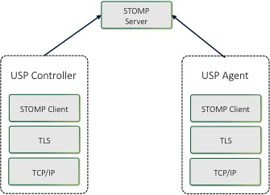

<!-- Reference Links -->
[1]:	https://github.com/BroadbandForum/usp/tree/master/data-model "TR-181 Issue 2 Device:2 Data Model for TR-069 Devices and USP Agents"
[2]: https://www.broadband-forum.org/technical/download/TR-069.pdf	"TR-069 Amendment 6	CPE WAN Management Protocol"
[3]:	https://www.broadband-forum.org/technical/download/TR-106_Amendment-8.pdf "TR-106 Amendment 8	Data Model Template for TR-069 Enabled Devices"
[4]:	https://tools.ietf.org/html/rfc7228 "RFC 7228	Terminology for Constrained-Node Networks"
[5]:	https://tools.ietf.org/html/rfc2136	"RFC 2136 Dynamic Updates in the Domain Name System"
[6]:	https://tools.ietf.org/html/rfc3007	"RFC 3007 Secure Domain Name System Dynamic Update"
[7]:	https://tools.ietf.org/html/rfc6763	"RFC 6763 DNS-Based Service Discovery"
[8]:	https://tools.ietf.org/html/rfc6762	"RFC 6762 Multicast DNS"
[9]:	https://tools.ietf.org/html/rfc7252	"RFC 7252 The Constrained Application Protocol (CoAP)"
[10]:	https://tools.ietf.org/html/rfc7390	"RFC 7390 Group Communication for the Constrained Application Protocol (CoAP)"
[11]:	https://tools.ietf.org/html/rfc4033	"RFC 4033 DNS Security Introduction and Requirements"
[12]:	https://developers.google.com/protocol-buffers/docs/proto3 "Protocol Buffers v3	Protocol Buffers Mechanism for Serializing Structured Data Version 3"
[13]: https://regauth.standards.ieee.org/standards-ra-web/pub/view.html#registries "IEEE Registration Authority"
[14]: https://tools.ietf.org/html/rfc4122 "RFC 4122 A Universally Unique IDentifier (UUID) URN Namespace"
[15]: https://tools.ietf.org/html/rfc5280 "RFC 5290 Internet X.509 Public Key Infrastructure Certificate and Certificate Revocation List (CRL) Profile"
[16]: https://tools.ietf.org/html/rfc6818 "RFC 6818 Updates to the Internet X.509 Public Key Infrastructure Certificate and Certificate Revocation List (CRL) Profile"
[17]: https://tools.ietf.org/html/rfc2234 "RFC 2234 Augmented BNF for Syntax Specifications: ABNF"
[18]: https://tools.ietf.org/html/rfc3986 "RFC 3986 Uniform Resource Identifier (URI): Generic Syntax"
[19]: https://tools.ietf.org/html/rfc2141 "RFC 2141 URN Syntax"
[20]: https://tools.ietf.org/html/rfc6455 "RFC 6455 The WebSocket Protocol"
[21]: https://stomp.github.io/stomp-specification-1.2.html "Simple Text Oriented Message Protocol"
[22]: https://tools.ietf.org/html/rfc5246 "The Transport Layer Security (TLS) Protocol Version 1.2"
[23]: https://tools.ietf.org/html/rfc6347 "Datagram Transport Layer Security Version 1.2"
[Conventions]: https://tools.ietf.org/html/rfc2119 "Key words for use in RFCs to Indicate Requirement Levels"

# STOMP Binding

The STOMP MTP transfers USP Records between USP endpoints using [version 1.2 of the STOMP protocol](https://stomp.github.io/stomp-specification-1.2.html) (further referred to as "STOMP Spec"), or the Simple Text Oriented Message Protocol. Messages that are transferred between STOMP clients utilize a message bus interaction model where the STOMP server is the messaging broker that routes and delivers messages based on the destination included in the STOMP header.

The following figure  depicts the transfer of the USP Records between USP Agents and Controllers.

Figure STOMP.1 - USP over STOMP Architecture

The basic steps for any USP Endpoint that utilizes a STOMP MTP are:

1. Negotiate TLS (if required/configured)
2. Connect to the STOMP Server
3. Maintain Heart Beats (if configured)
4. Subscribe to a Destination
5. Send USP Records

**R-STOMP.0** - USP Endpoints utilizing STOMP clients for message transport MUST support the `STOMPConn:1` and `STOMPController:1` data model profiles.

**R-STOMP.1** - USP Endpoints utilizing STOMP clients for message transport SHOULD support the `STOMPAgent:1` data model profile.

## Handling of the STOMP Session

When exchanging USP Records across STOMP MTPs, each USP Endpoint establishes a communications session with a STOMP server. These STOMP communications sessions are expected to be long lived and are reused for subsequent exchange of USP Records. A STOMP communications session is established using a handshake procedure as described in "Connecting a USP Endpoint to the STOMP Server" section below. A STOMP communications session is intended to be established as soon as the USP Endpoint becomes network-aware and is capable of sending TCP/IP messages.

When a STOMP communications session is no longer necessary, the STOMP connection is closed by the STOMP client sending a `DISCONNECT` frame (see "Handling Other STOMP Frames" section below).

### Connecting a USP Endpoint to the STOMP Server

**R-STOMP.2** - USP Endpoints utilizing STOMP clients for message transport MUST send a `STOMP` frame to the STOMP server to initiate the STOMP communications session as defined in the "Connecting" section of the STOMP Spec.

**R-STOMP.3** - USP Endpoints that DO NOT utilize client certificate authentication MUST include the login and passcode STOMP headers in the STOMP frame.  For a USP Agent, the `login` STOMP header MUST include the appropriate `.STOMP.Connection.{i}.Username` parameter, and the `passcode` STOMP header MUST include the associated `.STOMP.Connection.{i}.Password` parameter.

**R-STOMP.4** - USP Endpoints sending a `STOMP` frame MUST include (in addition to other mandatory STOMP headers) an `endpoint-id` STOMP header containing the Endpoint ID of the USP Endpoint sending the frame.

**R-STOMP.5** - USP Endpoints sending a STOMP frame MUST include a host STOMP header. For a USP Agent the value MUST contain the value from the appropriate `.STOMP.Connection.{i}.VirtualHost` parameter.

**R-STOMP.6** - If the connection to the STOMP server is successful then a `CONNECTED` frame will be sent to the USP Endpoint, and that frame MAY contain a `subscribe-dest` STOMP header that the USP Endpoint MUST use (if included) when Subscribing to its destination (see "Subscribing a USP Endpoint to a STOMP Destination" section for more details).

**R-STOMP.7** - If the connection to the STOMP server is NOT successful then an `ERROR` frame will be sent to the USP Endpoint, in which case the STOMP server will terminate the connection and the USP Endpoint MUST enter a connection retry state. For a USP Agent the retry mechanism is based on the `STOMP.Connection.{i}.` retry parameters: `ServerRetryInitialInterval`, `ServerRetryIntervalMultiplier`, and `ServerRetryMaxInterval`.

### Handling the STOMP Heart Beat Mechanism

The STOMP Heart Beat mechanism can be used to periodically send data between a STOMP client and a STOMP server to ensure that the underlying TCP connection is still available.  This is an optional STOMP mechanism and is negotiated when establishing the STOMP connection.

**R-STOMP.8** - If the `STOMP.Connection` instance's `EnableHeartbeats` parameter value is `True` then the USP Agent MUST negotiate the STOMP Heart Beat mechanism within the `STOMP` frame during the process of establishing the STOMP connection as is defined in the "Heart-beating" section of the STOMP Spec.

**R-STOMP.9** - If the `STOMP.Connection` instance's `EnableHeartbeats` parameter value is either `False` or not implemented then the USP Agent MUST not send the `heart-beat` STOMP header in the `STOMP` frame.

**R-STOMP.10** - USP Agents negotiating the STOMP Heart Beat mechanism MUST use the `STOMP.Connection.{i}.OutgoingHeartbeat` and `STOMP.Connection.{i}.IncomingHeartbeat` parameter values within the `heart-beat` STOMP header as defined in the "Heart-beating" section of the STOMP Spec.

**R-STOMP.11** - USP Agents that have negotiated a STOMP Heart Beat mechanism with a STOMP server MUST adhere to the heart beat values (as defined in the "Heart-beating" section of the STOMP Spec) as returned in the `CONNECTED` frame.

## Mapping USP Endpoints to STOMP Destinations

USP Agents will have one STOMP destination per STOMP MTP independent of whether those STOMP MTPs use the same `STOMP.Connection` instance or a different one. The STOMP destination is either configured by the STOMP server via the `subscribe-dest` STOMP Header received in the `CONNECTED` frame (exposed in the `Device.LocalAgent.MTP.{i}.STOMP.Destination` parameter) or taken from the `Device.LocalAgent.MTP.{i}.STOMP.Destination` parameter if there wasn't a `subscribe-dest` STOMP Header received in the `CONNECTED` frame.

A USP Controller will subscribe to a STOMP destination for each STOMP server that it is associated with. The USP Controller's STOMP destination needs to be known by the USP Agent (this is configured in the `Device.LocalAgent.Controller.{i}.MTP.{i}.STOMP.Destination` parameter) as it is used when sending a USP Record containing a Notification.

### Subscribing a USP Endpoint to a STOMP Destination

**R-STOMP.12** - USP Endpoints utilizing STOMP clients for message transport MUST subscribe to their assigned STOMP destination.

**R-STOMP.13** - USP Endpoints utilizing STOMP clients for message transport MUST send a `SUBSCRIBE` frame to the STOMP server as defined in the "SUBSCRIBE" section of the STOMP Spec.

**R-STOMP.14** - USP Endpoints sending a `SUBSCRIBE` frame MUST include (in addition to other mandatory STOMP headers) a `destination` STOMP header containing the STOMP destination associated with the USP Endpoint sending the frame.

**R-STOMP.15** - USP Agents that receive a `subscribe-dest` STOMP Header in the `CONNECTED` frame MUST use that STOMP destination in the `destination` STOMP header when sending a `SUBSCRIBE` frame.

**R-STOMP.16** - USP Agents that have NOT received a `subscribe-dest` STOMP Header in the `CONNECTED` frame MUST use the STOMP destination found in the `Device.LocalAgent.MTP.{i}.STOMP.Destination` parameter in the `destination` STOMP header when sending a `SUBSCRIBE` frame.

**R-STOMP.17** - USP Agents that have NOT received a `subscribe-dest` STOMP Header in the `CONNECTED` frame and do NOT have a value in the `Device.LocalAgent.MTP.{i}.STOMP.Destination` parameter MUST terminate the STOMP communications session (via the `DISCONNECT` frame) and consider the MTP disabled.

**R-STOMP.18** - USP Endpoints sending a `SUBSCRIBE` frame MUST include a `ack` STOMP header with a value of "auto".

**R-STOMP.19** - If the subscription to the destination is NOT successful then an `ERROR` frame will be sent to the USP Endpoint, in which case the STOMP server will terminate the connection and the USP Endpoint MUST enter a connection retry state. For a USP Agent the retry mechanism is based on the `STOMP.Connection.{i}.` retry parameters: `ServerRetryInitialInterval`, `ServerRetryIntervalMultiplier`, and `ServerRetryMaxInterval`.

## Mapping USP Records to STOMP Frames

A USP Record is sent from a USP Endpoint to a STOMP Server within a `SEND` frame. The STOMP Server delivers that USP Record to the destination STOMP Endpoint within a `MESSAGE` frame. When a USP Endpoint responds to the USP request, the USP Endpoint sends the USP Record to the STOMP Server within a `SEND` frame, and the STOMP Server delivers that USP Record to the destination USP Endpoint within a `MESSAGE` frame.

**R-STOMP.20** - USP Endpoints utilizing STOMP clients for message transport MUST send USP Records in a `SEND` frame to the STOMP server as defined in the "SEND" section of the STOMP Spec.

**R-STOMP.21** - USP Endpoints sending a `SEND` frame MUST include (in addition to other mandatory STOMP headers) a `content-length` STOMP header containing the length of the body included in the `SEND` frame.

**R-STOMP.22** - USP Endpoints sending a `SEND` frame MUST include (in addition to other mandatory STOMP headers) a `content-type` STOMP header with a value of "`application/octet-stream`", which signifies that the body included in the `SEND` frame contains a [Protocol Buffer][12] binary encoding message.

**R-STOMP.23** - USP Endpoints sending a `SEND` frame MUST include (in addition to other mandatory STOMP headers) a `media-type` STOMP header with a value of "`vnd.bbf.usp.msg`", which signifies that the body included in the `SEND` frame contains a USP Record.

**R-STOMP.24** - USP Endpoints sending a `SEND` frame MUST include (in addition to other mandatory STOMP headers) a `reply-to-dest` STOMP header containing the STOMP destination that indicates where the USP Endpoint that receives the USP Record should send any response (if required).

**R-STOMP.25** - USP Endpoints sending a `SEND` frame MUST include the [Protocol Buffer][12] binary encoding of the USP Record as the body of the `SEND` frame.

**R-STOMP.26** - When a USP Endpoint receives a `MESSAGE` frame it MUST use the `reply-to-dest` included in the STOMP headers as the STOMP destination of the USP response (if a response is required by the incoming USP request).

### Handling ERROR Frames

If a USP Endpoint receives a `MESSAGE` frame containing a USP Record that cannot be extracted for processing (e.g., text frame instead of a binary frame, malformed USP Record or USP Message, bad encoding), the receiving USP Endpoint might be capable of notifying the originating USP Endpoint that an error occurred by sending an `ERROR` frame that causes the STOMP communications session to be terminated.  If the receiving USP Endpoint is not capable of notifying the originating USP Endpoint of the error, then it will simply drop the USP Record.

**R-STOMP.27** - When a USP Endpoint receives a `MESSAGE` frame containing a USP Record or an encapsulated USP Message within a USP Record that cannot be extracted for processing, the receiving USP Endpoint MAY terminate the STOMP communications session by triggering the STOMP server to send an `ERROR` frame to the originating STOMP client.  If the implementation prevents such a mechanism from happening, then the receiving USP Endpoint MUST NOT attempt to process the USP Record, and MUST ignore the USP Record.

**R-STOMP.28** - If an `ERROR` frame is received by the USP Endpoint, the STOMP server will terminate the connection. In this case the USP Endpoint MUST enter a connection retry state. For a USP Agent the retry mechanism is based on the `STOMP.Connection.{i}.` retry parameters: `ServerRetryInitialInterval`, `ServerRetryIntervalMultiplier`, and `ServerRetryMaxInterval`.

### Handling other STOMP Frames

**R-STOMP.29** - USP Endpoints utilizing STOMP clients for message transport MUST NOT send the transactional STOMP frames including: `BEGIN`, `COMMIT`, and `ABORT`.

**R-STOMP.30** - USP Endpoints utilizing STOMP clients for message transport MUST NOT send the acknowledgement STOMP frames including: `ACK` and `NACK`.

**R-STOMP.31** - USP Endpoints utilizing STOMP clients for message transport MAY send the following STOMP frames when shutting down a STOMP connection: `UNSUBSCRIBE` (according to the rules defined in the UNSUBSCRIBE section of the STOMP Spec) and `DISCONNECT` (according to the rules defined in the DISCONNECT section of the STOMP Spec).

**R-STOMP.32** - USP Endpoints utilizing STOMP clients for message transport that DID NOT receive a `subscribe-dest` STOMP Header in the `CONNECTED` frame when establishing the STOMP communications session MUST update their STOMP subscription when their destination is altered by sending the `UNSUBSCRIBE` STOMP frame (according to the rules defined in the UNSUBSCRIBE section of the STOMP Spec) and then re-subscribing as detailed in the "Subscribing a USP Endpoint to a STOMP Destination" section.

**R-STOMP.33** - USP Endpoints utilizing STOMP clients for message transport MAY receive a `RECEIPT` frame in which case the USP Endpoint MUST process the STOMP frame as defined in the RECEIPT section of the STOMP Spec.

## Discovery Requirements

The USP [discovery section](/specification/discovery) details requirements about the general usage of DNS, mDNS, and DNS-SD records as it pertains to the USP protocol.  This section provides further requirements as to how a USP Endpoint advertises discovery information when a STOMP MTP is being utilized.

**R-STOMP.34** - When creating a DNS-SD record, an Endpoint MUST set the DNS-SD "`path`" attribute equal to the value of the destination that it has subscribed to.

**R-STOMP.35** - When creating a DNS-SD record, an Endpoint MUST utilize the STOMP server's address information in the A and AAAA records instead of the USP Endpoint's address information.

## STOMP Server Requirements

**R-STOMP.36** - A STOMP server implementation MUST adhere to the requirements defined in the STOMP Spec.

**R-STOMP.37** - A STOMP server implementation MUST perform authentication of the STOMP client and ensure that a Remote USP Endpoint is only allowed to subscribe to the destination that is associated with the USP Endpoint.

## MTP Message Encryption

STOMP MTP message encryption is provided using certificates in TLS as described in section 10.5 and section 10.6 of [RFC 6455][20].

**R-STOMP.38** - USP Endpoints utilizing STOMP clients for message transport MUST implement the Certificate modes of TLS security as defined in sections 10.5 and 10.6 of [RFC 6455][20].

**R-STOMP.39** - USP Endpoints capable of obtaining absolute time SHOULD wait until it has accurate absolute time before contacting the STOMP server. If a USP Endpoint for any reason is unable to obtain absolute time, it can contact the STOMP server without waiting for accurate absolute time. If a USP Endpoint chooses to contact the STOMP server before it has accurate absolute time (or if it does not support absolute time), it MUST ignore those components of the STOMP server's certificate that involve absolute time, e.g. not-valid-before and not-valid-after certificate restrictions.

**R-STOMP.40** - STOMP server certificates MAY contain domain names and those domain names MAY contain domain names with wildcard characters per [RFC 6125](https://tools.ietf.org/html/rfc6125) guidance.

[<-- Message Transfer Protocols](/specification/mtp/)
[--> Message Encoding](/specification/encoding/)
