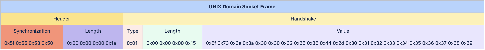

## UNIX Domain Socket Binding {#sec:unix-domain-socket}

This is an internal Message Transfer Protocol (MTP) for communicating between a USP Agent and a USP Controller that reside on separate processes within a single device.  This MTP uses UNIX domain sockets to send Frames between the UNIX domain socket clients and servers.  The Frame contains a Header field and one or more Type-Length-Value (TLV) fields to transport USP Records and other information related to the use of this transport as a USP MTP.

### Handling UNIX Domain Socket Connections

UNIX domain socket concepts are broken down into two key aspects: server and client.  A UNIX domain socket server is responsible for listening on an UNIX domain socket for incoming connections and then accepting those connections such that the server can then send and receive messages over the connection.  A UNIX domain socket client is responsible for establishing a connection to a server such that the client can then send and receive messages over the established communications session.

UNIX domain sockets are different than other sockets as they aren't governed by a host and port.  Instead, the UNIX domain socket is associated to a local file path (and its internal file descriptor).

A USP Agent communicating over UNIX domain sockets as the USP MTP can act as either a UNIX domain socket server or a UNIX domain socket client, but not both.

A USP Controller communicating over UNIX domain sockets as the USP MTP can act as either a UNIX domain socket server or a UNIX domain socket client, but not both.

Since UNIX domain sockets and this type of internal MTP is completely contained within the device itself, there is no need to advertise the USP Agent or USP Controller details via mDNS.

**[R-UDS.1]{}** - USP Agents utilizing UNIX domain socket servers or clients for message transport MUST support the UDSAgent:1 and UDSController:1 data model profiles.

#### Establishing a UNIX Domain Socket Connection

This section contains requirements related to setting up a UNIX domain socket connection between a USP Agent and a USP Controller that reside on two separate processes within the same device.

**[R-UDS.2]{}** - A USP Endpoint acting as a UNIX domain socket server MUST bind to a UNIX domain socket and listen for incoming connections.

**[R-UDS.3]{}** - A USP Endpoint acting as a UNIX domain socket server MUST accept incoming connections from UNIX domain socket clients.

To get to this point, a connection to the server's listen socket must be made from the USP Endpoint acting as a UNIX domain socket client.

**[R-UDS.4]{}** - A USP Endpoint acting as a UNIX domain socket client MUST connect to a known UNIX domain socket server.

At this point we have a bidirectional UNIX domain socket connection, which can be used to send USP Records between a USP Agent and a USP Controller.

#### Retrying a UNIX Domain Socket Connection

UNIX domain sockets don't often get disconnected after the connection has been established on both ends, but there are cases where a retry algorithm is valuable:

* Many UNIX domain socket clients are simultaneously attempting to establish a connection with the UNIX domain socket server, and that limit exceeds the "backlog" value that the UNIX domain socket server used when calling the "listen" system call.
* A UNIX domain socket is terminated by the USP Agent or USP Controller due to some failure to deliver or handle a frame message (see Section 4.6.2.1 Handling Failures to Handshake, Section 4.6.3.1 Handling Failures to Deliver USP Records, Section 4.6.5 Handling Other UNIX Domain Socket Failures, and Section 4.6.6 Error Handling)

If for any reason a UNIX domain socket connection fails to be established or is closed, the USP Endpoint acting as a client will attempt to re-establish the UNIX domain socket connection.

**[R-UDS.5]{}** - When a UNIX domain socket connection is closed or fails to be established, the USP Endpoint acting as a client MUST attempt to re-establish the UNIX domain socket within a random amount of time between 1 and 5 seconds.

#### Sending a Message over a UNIX Domain Socket

This MTP uses UNIX domain sockets to send Frames between the UNIX domain socket clients and servers.  The UNIX domain socket Frame contains a Header field and one or more Type-Length-Value (TLV) fields to transport the information related to the use of this transport as a USP MTP.  The Header field contains a Synchronization part (which includes the hexadecimal version of "_USP") and a Length part that contains the length of the remainder of the Frame (i.e. the length of the entire Frame excluding the size of the Header).  The Type part of the TLV field will always be 1 byte, the Length part of the TLV field will always be 4 bytes, and the Value part of the TLV field is based on the Type.  

**[R-UDS.6]{}** - A Frame sent across a UNIX domain socket that is being used as an MTP MUST have a Header field and one or more TLV fields.

**[R-UDS.7]{}** - The Header of a Frame sent across a UNIX domain socket that is being used as an MTP MUST have a synchronization part and a length part.

**[R-UDS.8]{}** - The synchronization portion of the Frame's Header MUST contain the following 4 bytes: 0x5f 0x55 0x53 0x50 (the hexadecimal version of "_USP").

**[R-UDS.9]{}** - The length portion of the Frame's Header MUST contain the length of the remainder of the Frame (i.e. the length of the entire Frame excluding the size of the Header) as a 4 byte unsigned integer in network byte order.

**[R-UDS.10]{}** - A TLV field contained in a Frame sent across a UNIX domain socket that is being used as an MTP MUST have a 1 byte Type.

**[R-UDS.11]{}** - A TLV field contained in a Frame sent across a UNIX domain socket that is being used as an MTP MUST have a 4 byte Length in network byte order.

The following set of Types are defined as allowable types in the TLV fields:

| Type | Name | Description of Value
| :----- | :------------ | :---------------------- |
| `1` | Handshake  | The Handshake contains a UTF-8 string that represents the Endpoint ID of the USP Endpoint sending the message. |
| `2` | Error      | The Error contains a UTF-8 string that provides the error message related to the communications failure. |
| `3` | USP Record | The USP Record contains the Google Protocol Buffer binary-encoded USP Record being sent between a USP Agent and USP Controller. |

**[R-UDS.12]{}** - A Frame sent across a UNIX domain socket that is being used as an MTP MUST contain a TLV with Type 1 for any Handshake negotiation messages

**[R-UDS.13]{}** - A Frame sent across a UNIX domain socket that is being used as an MTP MUST contain a TLV with Type 2 for any Error messages

**[R-UDS.14]{}** - A Frame sent across a UNIX domain socket that is being used as an MTP MUST contain a TLV with Type 3 for any USP Record messages

**[R-UDS.15]{}** - A Frame sent across a UNIX domain socket that is being used as an MTP MUST ignore any TLVs that have unexpected Types

### Handshaking with UNIX Domain Sockets

After a UNIX domain socket is established between a server (either a USP Agent acting as a server or a USP Controller acting as a server) and a client (either a USP Agent acting as a client or a USP Controller acting as a client), the USP Endpoints need to exchange Handshake Frames to provide each other with their identities because every USP Record contains the from and to Endpoint ID.  This means that both the USP Agent and USP Controller will send a Frame with a Type 1 TLV and their own Endpoint ID before sending any USP Record across the newly established UNIX domain socket connection.

**[R-UDS.16]{}** - A USP Endpoint acting as a UNIX domain socket client MUST send a Unix domain socket Frame containing a Type 1 (Handshake) TLV field once it establishes a UNIX domain socket connection.  This message MUST contain the Endpoint ID of the USP Endpoint sending the message.

**[R-UDS.17]{}** - A USP Endpoint acting as a UNIX domain socket server MUST send a Unix domain socket Frame containing a Type 1 (Handshake) TLV field once it receives a Unix domain socket Frame containing a Type 1 (Handshake) TLV field from a USP Endpoint acting as a UNIX domain socket client. This message MUST contain the Endpoint ID of the USP Endpoint sending the message.

**[R-UDS.18]{}** - A USP Endpoint acting as a UNIX domain socket client MUST terminate the UNIX domain socket connection if it doesn't receive a Unix domain socket Frame containing a Type 1 (Handshake) TLV field within 30 seconds of when it sent its own Unix domain socket Frame containing a Type 1 (Handshake) TLV field.

Once both sides of the UNIX domain socket have successfully completed the handshake process, which is done by the USP Agent and the USP Controller exchanging Unix domain socket Frames that contain a Type 1 (Handshake) TLV field, then either the USP Agent or USP Controller may begin sending USP Record messages.

**[R-UDS.19]{}** - A USP Endpoint acting as a UNIX domain socket client or server MUST ignore an unexpected UNIX domain socket Frame that contains a Type 2 (Handshake) TLV field.

**[R-UDS.20]{}** - A USP Endpoint acting as a UNIX domain socket client or server MUST ignore any UNIX domain socket Frames that contain a Type 3 (USP Record) TLV field until it has successfully completed the handshake process.

The following image shows an example of a UNIX domain socket Frame that contains a Type 1 (Handshake) TLV field used for handshaking between a USP Agent and USP Controller.  In this example, the Endpoint ID being used is "os::00256D-0123456789".

#### Handling Failures to Handshake

If for any reason the handshake process fails on one side of the UNIX domain socket or the other, then the side that fails the handshake process is responsible for sending a UNIX domain socket Frame containing an Error (using a Type 2 TLV field) that explains why the handshake process has failed .

**[R-UDS.21]{}** - A USP Endpoint acting as a UNIX domain socket client or server MUST send a UNIX domain socket Frame containing a Type 2 (Error) TLV field if it can not process an incoming UNIX domain socket Frame that contains a Type 1 (Handshake) TLV field.

### Sending USP Records across UNIX Domain Sockets

Once a UNIX domain socket is established between a server (either a USP Agent acting as a server or a USP Controller acting as a server) and a client (either a USP Agent acting as a client or a USP Controller acting as a client), and the USP Endpoints have successfully completed the handshake process, then either the USP Agent or USP Controller may begin sending UNIX domain socket Frames that contain a USP Record.  A USP Endpoint sends a USP Record by sending a UNIX domain socket Frame with a Type 3 (USP Record) TLV field that contains the Google Protocol Buffer binary-encoded USP Record across the established UNIX domain socket connection.

**[R-UDS.22]{}** - A USP Endpoint MUST send Google Protocol Buffer binary-encoded USP Records by utilizing a UNIX domain socket Frame that contains a Type 3 (USP Record) TLV field.

The following image shows an example of a UNIX domain socket Frame that contains a Type 3 (USP Record) TLV field, which is used for sending a USP Record between a USP Agent and USP Controller.

#### Handling Failures to Deliver USP Records

If a USP Endpoint acting as a UNIX domain socket client or server receives a UNIX domain socket Frame that contains a USP Record that cannot be extracted for processing (e.g., a UNIX domain socket Frame that includes a Type 3 TLV with text instead of a binary data, a malformed USP Record), a UNIX domain socket Frame containing a Type 2 (Error) TLV field is sent in response and the UNIX domain socket connection gets closed.  

**[R-UDS.23]{}** - A USP Endpoint acting as a UNIX domain socket client or server MUST send a UNIX domain socket Frame containing a Type 2 (Error) TLV field and terminate the UNIX Domain Socket connection, if it receives an incoming UNIX domain socket Frame containing a USP Record that cannot be extracted for processing.

Other USP Record processing failures (where the USP Record can be extracted, but other issues exist) are handled by [R-MTP.5]().

### MTP Message Encryption

Encryption is not required for the UNIX domain socket MTP as all messages are exchanged between processes that reside internally within the device.

### Handling Other UNIX Domain Socket Failures

If a USP Endpoint acting as a UNIX domain socket client or server receives a TLV Message that cannot be parsed, a UNIX domain socket Frame containing a Type 2 (Error) TLV field is sent in response and the UNIX domain socket connection gets closed.  

**[R-UDS.24]{}** - A USP Endpoint acting as a UNIX domain socket client or server MUST send a UNIX domain socket Frame containing a Type 2 (Error) TLV field and terminate the UNIX Domain Socket connection, if it can not parse an incoming UNIX domain socket Frame.

### Error Handling

If a USP Endpoint receives a UNIX domain socket Frame containing a Type 2 (Error) TLV field, then it closes the UNIX domain socket connection.

**[R-UDS.25]{}** - A USP Endpoint acting as a UNIX domain socket client or server that receives a UNIX domain socket Frame containing a Type 2 (Error) TLV field MUST terminate the UNIX domain socket connection.
