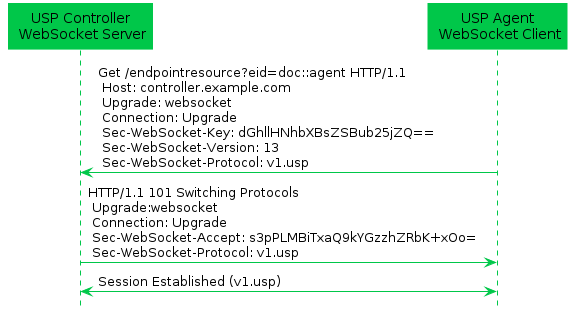

## WebSocket Binding {#sec:websocket}

The WebSockets MTP transfers USP Records between USP Endpoints using the WebSocket protocol as defined in RFC 6455 [@RFC6455]. Messages that are transferred between WebSocket clients and servers utilize a request/response messaging interaction across an established WebSocket session.

### Mapping USP Endpoints to WebSocket URIs

Section 3 of RFC 6455 discusses the URI schemes for identifying WebSocket origin servers and their target resources. These resources are organized hierarchically and governed by a WebSocket origin server listening for WebSocket messages on a given port. USP Endpoints are one type of WebSocket resource that is identified and discovered.

**[R-WS.1]{}** - As the USP Endpoint is a resource governed by a WebSocket origin server, the WebSocket server MUST also be identified as defined in section 3 of RFC 6455 [@RFC6455].

**[R-WS.2]{}** - A USP Endpoint MUST be represented as a WebSocket resource using the path component as defined in section 3 of RFC 6455 [@RFC6455].

**[R-WS.3]{}** - When creating DNS-SD records (see [Discovery](#sec:discovery)), an Endpoint MUST set the DNS-SD TXT record "path" attribute equal to the value of the Websocket resource using the path component as defined in section 3 of RFC 6455 [@RFC6455].

### Handling of the WebSocket Session

When exchanging the USP Records across WebSockets MTPs, the two USP Endpoints establish a WebSocket session. These WebSocket sessions are expected to be long lived and are reused for subsequent USP Record exchange.  A WebSocket session is established using a handshake procedure described in section 4 of RFC 6455. When a WebSocket connection is not longer necessary, the WebSocket connection is closed according to section 7 of RFC 6455.  The following figure depicts a WebSocket session handshake that is originated by an Agent.

While WebSocket sessions can be established by either USP Controllers or USP Agents in many deployment scenarios (e.g. communication between USP Endpoints across the Internet), in general, USP Agents will establish the WebSocket session and not expose an open port toward the Internet for security reasons. Regardless of which entity establishes the WebSocket session, at most one (1) open WebSocket session is utilized between the USP Endpoints.

**[R-WS.4]{}** - USP Endpoints that exchange USP Records MUST utilize at most one (1) open WebSocket session.

**[R-WS.5]{}** - USP Agent MUST provide the capability to originate the establishment of a WebSocket session.

**[R-WS.6]{}** - USP Agent MUST provide the capability to accept the establishment of a WebSocket session from a USP Controller.

*Note: Requirement [R-WS.6]() was altered from a MAY to a MUST in USP 1.2 to ensure that the WebSocket MTP is suitable for the in-home communications use case.*

**[R-WS.7]{}** - A USP Endpoint MUST implement the WebSocket handshake protocol to establish a WebSocket connection as defined in section 4 of RFC 6455 [@RFC6455].

**[R-WS.8]{}** - A USP Endpoint MUST implement the procedures to close a WebSocket  connection  as defined in section 7 of RFC 6455 [@RFC6455].

#### Mapping USP Records to WebSocket Messages

During the establishment of the WebSocket session, the WebSocket client informs the WebSocket server in the `Sec-WebSocket-Protocol` header about the type of USP Records that will be exchanged across the established WebSocket connection. For USP Records, the `Sec-WebSocket-Protocol` header contains the value `v1.usp`.  When presented with a `Sec-WebSocket-Protocol` header containing `v1.usp`, the WebSocket Server serving a USP Endpoint returns `v1.usp` in the response's Sec-WebSocket-Protocol header. If the WebSocket client doesn't receive a `Sec-WebSocket-Protocol` header with a value of `v1.usp`, the WebSocket client does not establish the WebSocket session.

When a WebSocket connection is being initiated with TLS, no USP Record is sent until the TLS negotiation is complete. The WebSocket server will be unable to identify the Endpoint ID of the client unless it looks inside the certificate. To make it easier for the server to identify the client, the request URI of the opening handshake contains a `key=value` pair in its `query` component to provide the Endpoint ID of the client. `eid` is used as the key to the pair, while the value is the Endpoint ID of the client, e.g. `eid=doc::agent`.

**[R-WS.9]{}** - The WebSocket's handshake `Sec-WebSocket-Protocol` header for exchange of USP Records using the protocol-buffers encoding mechanism MUST be `v1.usp`.

**[R-WS.10]{}** - A WebSocket client MUST include the `Sec-WebSocket-Protocol` header for exchange of USP Records when initiating a WebSocket session.

**[R-WS.10a]{}** (DEPRECATED) - A WebSocket client MUST include the `Sec-WebSocket-Extensions` header with `bbf-usp-protocol` WebSocket Extension and extension parameter `eid` equal to the client's Endpoint ID when initiating a WebSocket session.

*Note: Requirement [R-WS.10a]() was removed in USP 1.3, due to the impossibility of setting WebSocket Extensions in some environments.*

**[R-WS.10b]{}** - A WebSocket client MUST include its Endpoint ID, via a `key=value` pair, in the query component of the request URI in its opening handshake, defined in section 1.3 of RFC 6455 [@RFC6455]. The `key` part of the pair MUST have a value of `eid` and the `value` part MUST be the client's Endpoint ID. This pair MUST be separated from other query data by the `&` character.

**[R-WS.11]{}** - A WebSocket server that supports USP Endpoints MUST include the `Sec-WebSocket-Protocol` header for exchange of USP Records when responding to an initiation of a WebSocket session.

**[R-WS.11a]{}** - A WebSocket server SHOULD include the `Sec-WebSocket-Extensions` header with `bbf-usp-protocol` WebSocket Extension and extension parameter `eid` equal to the server's Endpoint ID when responding to an initiation of a WebSocket session that includes the `bbf-usp-protocol` extension.

**[R-WS.11b]{}** - WebSocket clients MUST NOT consider WebSocket responses that do not include the `bbf-usp-protocol` WebSocket Extension to be an error.

**[R-WS.11c]{}** - WebSocket servers MUST NOT consider WebSocket session initiation requests that do not include the `bbf-usp-protocol` WebSocket Extension to be an error.

**[R-WS.12]{}** - A WebSocket client MUST NOT establish a WebSocket session if the response to a WebSocket session initiation request does not include the `Sec-WebSocket-Protocol` header for exchange of USP Records in response to an initiation of a WebSocket session.

**[R-WS.12a]{}** - A WebSocket server MUST NOT establish a WebSocket session if the WebSocket session initiation request does not include the `Sec-WebSocket-Protocol` header.

### Handling of WebSocket Frames

RFC 6455 defines a number of type of WebSocket control frames (e.g., Ping, Pong, Close) and associated condition codes in order to maintain a WebSocket connection. In addition messages are transferred in WebSocket Data control frame.

**[R-WS.13]{}** - A USP Endpoint MUST implement the WebSocket control frames defined in section 5.5 of RFC 6455 [@RFC6455].

USP Records can be transferred between USP Controllers and USP Agents over an established WebSocket session. These USP Records are encapsulated within a binary WebSocket data frame as depicted by the figure below.

**[R-WS.14]{}** - In order for USP Records to be transferred between a USP Controller and Agent using WebSockets MUST be encapsulated within as a binary WebSocket data frame as defined in section 5.6 of RFC 6455 [@RFC6455].

**[R-WS.15]{}** - USP Records are transferred between USP Endpoints using message body procedures as defined in section 6 of RFC 6455 [@RFC6455].

#### Handling Failures to Deliver USP Records

If a USP Endpoint receives a WebSocket frame containing a USP Record that cannot be extracted for processing (e.g., text frame instead of a binary frame, malformed USP Record or USP Record, bad encoding), the receiving USP Endpoint notifies the originating USP Endpoint that an error occurred by closing the WebSocket connection with a `1003` Status Code with the WebSocket Close frame.

**[R-WS.16]{}** - A USP Endpoint that receives a WebSocket frame containing a USP Record that cannot be extracted for processing, the receiving USP Endpoint MUST terminate the connection using a WebSocket Close frame with a Status Code of `1003`.

#### Keeping the WebSocket Session Alive

Once a WebSocket session is established, the WebSocket session is expected to remain open for future exchanges of USP Records. The WebSocket protocol uses Ping and Pong control frames as a keep-alive session. Section 5.5 of RFC 6455 discusses the handling of Ping and Pong control frames.

**[R-WS.17]{}** - A USP Agent MUST implement a WebSocket keep-alive mechanism by periodically sending Ping control frames and responding to received Ping control frames with Pong control frames as described in section 5.5 of RFC 6455 [@RFC6455].

**[R-WS.18]{}** - A USP Agent MUST provide the capability to assign a keep-alive interval in order to send Ping control frames to the remote USP Endpoint.

#### WebSocket Session Retry

If for any reason a WebSocket Session is closed, the USP Endpoint will attempt to re-establish the WebSocket Session according to its session retry policy. For Controllers, this session retry policy is implementation specific.

**[R-WS.19]{}** – When retrying to establish a WebSocket Session, the Agent MUST use the following retry algorithm to manage the WebSocket Session establishment procedure:

For Agents, the retry interval range is controlled by two variables (described in the table below): the minimum wait interval and the interval multiplier. The corresponding data model Parameter MAY be implemented to allow a USP Controller to change the values of these variables. The factory default values of these variables MUST be the default values listed in the Default column of the table below.

| Descriptive Name | Symbol | Default | Data Model Parameter Name |
| ---------: | :-----: | :------: | :------------ |
|Minimum wait interval | m | 5 seconds |	`Device.LocalAgent.Controller.{i}.MTP.{i}.WebSocket.SessionRetryMinimumWaitInterval` |
| Interval multiplier |	k | 2000 | `Device.LocalAgent.Controller.{i}.MTP.{i}.WebSocket.SessionRetryIntervalMultiplier` |

| Retry Count | Default Wait Interval Range (min-max seconds) | Actual Wait Interval Range (min-max seconds) |
| ----------: | :---------: | :-------------- |
| #1 | 5-10 | m - m.(k/1000) |
| #2 | 10-20 | m.(k/1000) - m.(k/1000)^2 |
| #3 | 20-40 | m.(k/1000)^2 - m.(k/1000)^3 |
| #4 | 40-80 | m.(k/1000)^3 - m.(k/1000)^4 |
| #5 | 80-160 | m.(k/1000)^4 - m.(k/1000)^5 |
| #6 | 160-320 | m.(k/1000)^5 - m.(k/1000)^6 |
| #7 | 320-640 | m.(k/1000)^6 - m.(k/1000)^7 |
| #8 | 640-1280 | m.(k/1000)^7 - m.(k/1000)^8 |
| #9 | 1280-2560 | m.(k/1000)^8 - m.(k/1000)^9 |
| #10 and subsequent | 2560-5120 | m.(k/1000)^9 - m.(k/1000)^10 |

**[R-WS.20]{}** – Once a WebSocket session is established between the Agent and the Controller, the Agent MUST reset the WebSocket MTP's retry count to zero for the next WebSocket Session establishment.

**[R-WS.21]{}** – If a reboot of the Agent occurs, the Agent MUST reset the WebSocket MTP's retry count to zero for the next WebSocket Session establishment.

### MTP Message Encryption

WebSocket MTP message encryption is provided using certificates in TLS as described in section 10.5 and section 10.6 of RFC 6455 [@RFC6455].

**[R-WS.22]{}** - USP Endpoints utilizing WebSockets clients and servers for message transport MUST implement the Certificate modes of TLS security  as defined in sections 10.5 and 10.6 of RFC 6455 [@RFC6455].

**[R-WS.23]{}** - USP Endpoints capable of obtaining absolute time SHOULD wait until it has accurate absolute time before contacting the peer USP Endpoint. If a USP Endpoint for any reason is unable to obtain absolute time, it can contact the peer USP Endpoint without waiting for accurate absolute time. If a USP Endpoint chooses to contact the peer USP Endpoint before it has accurate absolute time (or if it does not support absolute time), it MUST ignore those components of the peer USP Endpoint's WebScoket MTP certificate that involve absolute time, e.g. not-valid-before and not-valid-after certificate restrictions.

**[R-WS.24]{}** - USP Controller certificates MAY contain domain names with wildcard characters per RFC 6125 [@RFC6125] guidance.
