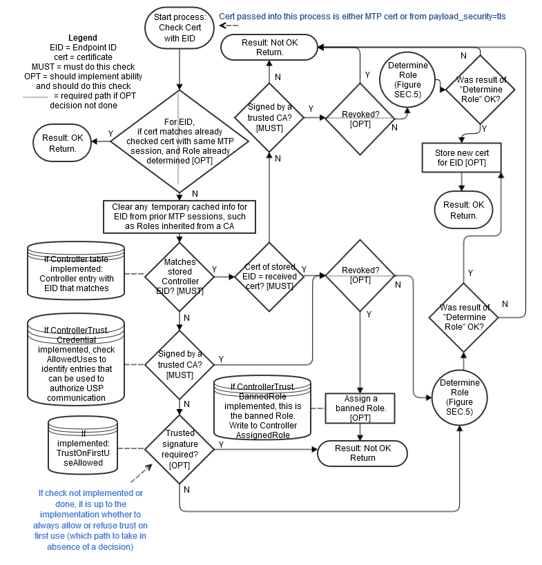

# Authentication and Authorization {#sec:auth}

USP contains mechanisms for Authentication and Authorization, and Encryption. Encryption can be provided at the MTP layer, the USP layer, or both. Where Endpoints can determine (through Authentication) that the termination points of the MTP and USP messages are the same, MTP encryption is sufficient to provide end-to-end encryption and security. Where the termination points are different (because there is a proxy or other intermediate device between the USP Endpoints), USP layer [](#sec:e2e-message-exchange) is required, or the intermediate device must be a trusted part of the end-to-end ecosystem.

## Authentication

Authentication of Controllers is done using X.509 certificates as defined in [@RFC5280] and [@RFC6818]. Authentication of Agents is done either by using X.509 certificates or shared secrets. X.509 certificates, at a minimum, need to be usable for [](#sec:securing-mtps) with TLS or DTLS protocols. It is recommended that Agents implement the ability to encrypt all MTPs using one of these two protocols, enable it by default, and not implement the ability to disable it.

In order to support various authentication models (e.g., trust Endpoint identity and associated certificate on first use; precise Endpoint identity is indicated in a certificate issued by a trusted Certificate Authority; trust that MTP connection is being made to a member of a trusted domain as verified by a trusted Certificate Authority (CA)), this specification provides guidance based on conditions under which the Endpoint is operating, and on the Endpoint's policy for storing certificates of other Endpoints or certificates of trusted CAs. The `Device.LocalAgent.Certificate.` Object can be implemented if choosing to expose these stored certificates through the data model. See the [](#sec:theory-of-operations), [](#sec:certificate-management) subsection, below for additional information.

**[R-SEC.0]{}** - Prior to processing a USP Message from a Controller, the Agent MUST either:

* have the Controller's certificate information and have a cryptographically protected connection between the two Endpoints, or
* have a Trusted Broker's certificate information and have a cryptographically protected connection between the Agent and the Trusted Broker

**[R-SEC.0a]{}** - Whenever a X.509 certificate is used to authenticate a USP Endpoint, the certificate MUST contain a representation of the Endpoint ID in the `subjectAltName` extension. This representation MUST be either the URN form of the Endpoint ID with a type `uniformResourceIdentifier` attribute OR, in the specific case where the Endpoint ID has an `authority-scheme` of `fqdn`, the `instance-id` portion of the Endpoint ID with a type `dNSName` attribute. When this type of authentication is used at the MTP layer, USP Endpoints MUST check the `from_id` field of received USP Records and MUST NOT process Records that do not match the Endpoint ID found in the certificate.

TLS and DTLS both have handshake mechanisms that allow for exchange of certificate information. If the MTP connection is between the Agent and Controller (for example, without going through any application-layer proxy or other intermediate application-layer middle-box), then a secure MTP connection will be sufficient to ensure end-to-end protection, and the USP Record can use `payload_security` "PLAINTEXT" encoding of the Message. If the middle-box is part of a trusted end-to-end ecosystem, the MTP connection may also be considered sufficient. Otherwise, the USP Record will use [](#sec:e2e-message-exchange).

Whether a Controller requires Agent certificates is left up to the Controller implementation.

## Role Based Access Control (RBAC) {#sec:rbac}

It is expected that Agents will have some sort of Access Control List (ACL) that will define different levels of authorization for interacting with the Agent's data model. This specification refers to different levels of authorization as "Roles". The Agent may be so simple as to only support a single Role that gives full access to its data model; or it may have just an "untrusted" Role and a "full access" Role. Or it may be significantly more complex with, for example, "untrusted" Role, different Roles for parents and children in a customer household, and a different Role for the service provider Controller. These Roles may be fully defined in the Agent's code, or Role definition may be allowed via the data model.

**[R-SEC.1]{}** - An Agent MUST confirm a Controller has the necessary permissions to perform the requested actions in a Message prior to performing that action.

**[R-SEC.1a]{}** - Agents SHOULD implement the `Controller` Object with the `AssignedRole` Parameter (with at least read-only data model definition) and `InheritedRole` Parameter (if allowed Roles can come from a trusted CA), so users can see what Controllers have access to the Agent and their permissions. This will help users identify rogue Controllers that may have gained access to the Agent.

See the [](#sec:theory-of-operations), [](#sec:roles-access-control) and [](#sec:assigning-controller-roles) subsections, below for additional information on data model elements that can be implemented to expose information and allow control of Role definition and assignment.

## Trusted Certificate Authorities

An Endpoint can have a configured list of trusted Certificate Authority (CA) certificates. The Agent policy may trust the CA to authorize authenticated Controllers to have a specific default Role, or the policy may only trust the CA to authenticate the Controller identity. The Controller policy may require an Agent certificate to be signed by a trusted CA before the Controller exchanges USP Messages with the Agent.

**[R-SEC.2]{}** - To confirm a certificate was signed by a trusted CA, the Endpoint MUST contain information from one or more trusted CA certificates that are either pre-loaded in the Endpoint or provided to the Endpoint by a secure means. At a minimum, this stored information will include a certificate fingerprint and fingerprint algorithm used to generate the fingerprint. The stored information MAY be the entire certificate.

This secure means can be accomplished through USP (see [](#sec:theory-of-operations)), [](#sec:certificate-management) subsection, making use of the `Device.LocalAgent.Certificate.` Object), or through a mechanism external to USP. The stored CA certificates can be root or intermediate CAs.

**[R-SEC.3]{}** - Where a CA is trusted to authenticate Controller identity, the Agent MUST ensure that the Controller certificate conforms with the [R-SEC.0a]() requirement.

**[R-SEC.4]{}** - Where a CA is trusted to authorize a Controller Role, the Agent MUST ensure either that the Controller certificate matches the certificate stored in the `Credential` Parameter of the `Device.LocalAgent.Controller.` entry specific to that Controller OR that the Controller certificate itself is suitable for authentication as per the [R-SEC.0a]() requirement.

Note that trusting a CA to authorize a Controller Role requires the Agent to maintain an association between a CA certificate and the Role(s) that CA is trusted to authorize. If the Agent allows CAs to authorize Roles, the Agent will need to identify specific CA certificates in a Controller’s chain of trust that can authorize Roles. The specific Role(s) associated with such a CA certificate can then be inherited by the Controller. The `Device.LocalAgent.ControllerTrust.Credential.` Object can be implemented to expose and allow control over trust and authorization of CAs.

Note that if an Agent supports and has enabled a Trust on First Use (TOFU) policy, it is possible for Controllers signed by unknown CAs to be granted the "untrusted role". See [@fig:check-cert; @fig:determine-role] and the penultimate bullet in the [](#sec:assigning-controller-roles) section below for more information related to TOFU and the "untrusted" role.

## Trusted Brokers

An Endpoint can have a configured list of Trusted Broker certificates. The Endpoint policy would be to trust the broker to vouch for the identity of Endpoints it brokers – effectively authenticating the `from_id` contained in a received USP Record. The Agent policy may trust the broker to authorize all Controllers whose Records transit the broker to have a specific default Role.

**[R-SEC.4a]{}** - To confirm a certificate belongs to a Trusted Broker, the Endpoint MUST contain information from one or more Trusted Broker certificates that are either pre-loaded in the Endpoint or provided to the Endpoint by a secure means. This stored information MUST be sufficient to determine if a presented certificate is the Trusted Broker certificate.

This secure means of loading certificate information into an Agent can be accomplished through USP (see [](#sec:theory-of-operations) section related to [](#sec:certificate-management)), or through a mechanism external to USP.

Note that trusting a broker to authorize a Controller Role requires the Agent to maintain an association between a Trusted Broker certificate and the Role(s) that Trusted Broker is trusted to authorize. The `Device.LocalAgent.ControllerTrust.Credential.` Object can be implemented to expose and allow control over identifying Trusted Brokers. The `AllowedUses` Parameter is used to indicate whether an entry is a Trusted Broker.

**[R-SEC.4b]{}** - A Trusted Broker MUST confirm the identity of all clients by exclusively allowing authentication via unique client certificates that identify the USP Endpoint. Also the confidentiality of all communications MUST be guaranteed by a Trusted Broker, i.e. there MUST NOT be any possibility to forward the communication between Endpoints to another party.

**[R-SEC.4c]{}** - A Trusted Broker MUST guarantee that USP Records sent from clients contain the correct value for the `from_id` field, tying it to the identity provided during the connection establishment. A Trusted Broker MUST NOT inspect USP payloads contained in USP Records.

## Self-Signed Certificates

**[R-SEC.5]{}** - An Endpoint that generates a self-signed certificate MUST ensure that the certificate is suitable for USP authentication as per the [R-SEC.0a]() requirement.

Self-signed certificates supplied by Controllers can only be meaningfully used in cases where a person is in a position to provide Authorization (what Role the Controller is trusted to have). Whether or not an Agent allows self-signed certificates from a Controller is a matter of Agent policy.

**[R-SEC.6]{}** - If an Agent allows Controllers to provide self-signed certificates, the Agent MUST assign such Controllers an "untrusted" Role on first use.

That is, the Agent will trust the certificate for purpose of encryption, but will heavily restrict what the Controller is authorized to do. See [@fig:check-cert; @fig:determine-role] and the penultimate bullet in the [](#sec:assigning-controller-roles) section below for more information related to TOFU and the "untrusted" role.

**[R-SEC.7]{}** - If an Agent allows Controllers to provide self-signed certificates, the Agent MUST have a means of allowing an external entity to change the Role of each such Controller.

Controller policy related to trust of Agent self-signed certificates is left to the Controller. Controllers may be designed to refuse self-signed certificates (thereby refusing to control the Agent), they may have a means of allowing a person to approve controlling the Agent via the Controller, or they may automatically accept the Agent.

**[R-SEC.8]{}** - An Endpoint that accepts self-signed certificates MUST maintain the association of accepted certificate and Endpoint IDs.

Self-signed certificates require a "trust on first use" (TOFU) policy when using them to authenticate an Endpoint's identity. An external entity (a trusted Controller or user) can then authorize the authenticated Endpoint to have certain permissions. Subsequent to the first use, this same self-signed certificate can be trusted to establish the identity of that Endpoint. However, authentication of the Endpoint can only be subsequently trusted if the association of certificate to identity is remembered (i.e., it is known this is the same certificate that was used previously by that Endpoint). If it is not remembered, then every use is effectively a first use and would need to rely on an external entity to authorize permissions every time. The `Device.LocalAgent.Certificate.` Object can be implemented if choosing to expose and allow control of remembered certificates in the data model.

## Agent Authentication {#sec:agent-authentication}

**[R-SEC.9]{}** - Controllers MUST authenticate Agents either through X.509 certificates, a shared secret, or by trusting a Trusted Broker to vouch for Agent identity.

When authentication is done using X.509 certificates, it is up to Controller policy whether to allow for Agents with self-signed certificates or to require Agent certificates be signed by a CA.

Note that allowing use of, method for transmitting, and procedure for handling shared secrets is specific to the MTP used, as described in [](#sec:mtp). Shared secrets that are not unique per device are not recommended as they leave devices highly vulnerable to various attacks -- especially devices exposed to the Internet.

**[R-SEC.10]{}** - An Agent certificate MUST be suitable for USP authentication as per the [R-SEC.0a]() requirement.

**[R-SEC.10a]{}** - The certificate `subjectAltName` extension MUST be used to authenticate the USP Record `from_id` for any Records secured with an Agent certificate.

Agent certificates can be used to secure Records by encrypting at the [MTP layer](#sec:mtp) and/or encrypting at the [USP layer](#sec:e2e-message-exchange).

Some Controller implementations may allow multiple Agents to share a single certificate with a wildcarded Endpoint ID.

**[R-SEC.11]{}** - If a single certificate is shared among multiple Agents, those Agents MUST include a wild-carded `instance-id` in the Endpoint ID in the `subjectAltName` extension with identical `authority-scheme` and `authority-id`.

Use of a shared certificate is not recommended, and which portion of the `instance-id` can be wildcarded may be specific to the authorizing CA or to the `authority-id` and `authority-scheme` values of the Endpoint ID. Wildcards can only be allowed in cases where the assigning entity is explicitly identified. Controllers are not required to support wildcarded certificates.

**[R-SEC.12]{}** - If a wildcard character is present in the `instance-id` of an Endpoint ID in a certificate `subjectAltName` extension, the `authority-scheme` MUST be one of "oui", "cid", "pen", "os", or "ops". In the case of "os" and "ops", the portion of the `instance-id` that identifies the assigning entity MUST NOT be wildcarded.

## Challenge Strings and Images

It is possible for the Agent to allow an external entity to change a Controller Role by means of a Challenge string or image. This Challenge string or image can take various forms, including having a user supply a passphrase or a PIN. Such a string could be printed on the Agent packaging, or supplied by means of a SMS to a phone number associated with the user account. These Challenge strings or images can be done using USP operations. Independent of how challenges are accomplished, following are some basic requirements related to Challenge strings and images.

**[R-SEC.13]{}** - The Agent MAY have factory-default Challenge value(s) (strings or images) in its configuration.

**[R-SEC.14]{}** - A factory-default Challenge value MUST be unique to the Agent. Re-using the same passphrase among multiple Agents is not permitted.

**[R-SEC.15]{}** - A factory-default Challenge value MUST NOT be derivable from information the Agent communicates about itself using any protocol at any layer.

**[R-SEC.16]{}** - The Agent MUST limit the number of tries for the Challenge value to be supplied successfully.

**[R-SEC.17]{}** - The Agent SHOULD have policy to lock out all use of Challenge values for some time, or indefinitely, if the number of tries limit is exceeded.

See the [](#sec:theory-of-operations), [](#sec:challenges) subsection, below for a description of data model elements that need to be implemented and are used when doing challenges through USP operations.

## Analysis of Controller Certificates {#sec:analysis-controller-certificates}

An Agent will analyze Controller certificates to determine if they are valid, are appropriate for authentication of Controllers, and to determine what permissions (Role) a Controller has. The Agent will also determine whether MTP encryption is sufficient to provide end-to-end protection of the Record and Message, or if USP layer [](#sec:e2e-message-exchange) is required.

The diagrams in this section use the database symbol to identify where the described information can be represented in the data model, if an implementation chooses to expose this information through the USP protocol.

### Receiving a USP Record

**[R-SEC.19]{}** - An Agent capable of obtaining absolute time SHOULD wait until it has accurate absolute time before contacting a Controller.  If an Agent for any reason is unable to obtain absolute time, it can contact the Controller without waiting for accurate absolute time. If an Agent chooses to contact a Controller before it has accurate absolute time (or if it does not support absolute time), it MUST ignore those components of the Controller certificate that involve absolute time, e.g. not-valid-before and not-valid-after certificate restrictions.

**[R-SEC.20]{}** - An Agent that has obtained accurate absolute time MUST validate those components of the Controller certificate that involve absolute time.

**[R-SEC.21]{}** – An Agent MUST clear all cached encryption session and Role authorization information when it reboots.

**[R-SEC.22]{}** - When an Agent receives a USP Record, the Agent MUST execute logic that achieves the same results as in the mandatory decision flow elements (identified with "MUST") from [@fig:receive-record; @fig:no-secure-message-exchange].

**[R-SEC.22a]{}** - When an Agent receives a USP Record, the Agent SHOULD execute logic that achieves the same results as in the optional decision flow elements (identified with "OPT") from [@fig:receive-record; @fig:no-secure-message-exchange].

{#fig:receive-record}

---

{#fig:no-secure-message-exchange}

### Sending a USP Record

**[R-SEC.23]{}** - When an Agent sends a USP Record, the Agent MUST execute logic that achieves the same results as in the mandatory decision flow elements (identified with "MUST") from @fig:send-record.

**[R-SEC.23a]{}** - When an Agent sends a USP Record, the Agent SHOULD execute logic that achieves the same results as in the optional decision flow elements (identified with "OPT") from @fig:send-record.

{#fig:send-record}

### Checking a Certificate

**[R-SEC.24]{}** - When an Agent analyzes a Controller certificate for authentication and determining permissions (Role), the Agent MUST execute logic that achieves the same results as in the mandatory decision flow elements (identified with "MUST") from [@fig:check-cert; @fig:determine-role].

**[R-SEC.24a]{}** - When an Agent analyzes a Controller certificate for authentication and determining permissions (Role), the Agent SHOULD execute logic that achieves the same results as in the optional decision flow elements (identified with "OPT") from [@fig:check-cert; @fig:determine-role].

**[R-SEC.25]{}** - When determining the inherited Role to apply based on Roles associated with a trusted CA, only the first matching CA in the chain will be used.

{#fig:check-cert}

---

{#fig:determine-role}

### Using a Trusted Broker

Support for Trusted Broker logic is optional.

**[R-SEC.26]{}** - If Trusted Brokers are supported, and a Trusted Broker is encountered (from the optional "OPT" "Trusted Broker cert?" decision diamonds in [@fig:no-secure-message-exchange, @fig:send-record]) the Agent MUST execute logic that achieves the same results as in the mandatory decision flow elements (identified with "MUST") from @fig:broker-with-received-record for a received USP Record and @fig:broker-with-sent-record for sending a USP Record.

**[R-SEC.26a]{}** - If Trusted Brokers are supported, and a Trusted Broker is encountered (from the optional "OPT" "Trusted Broker cert?" decision diamonds in [@fig:no-secure-message-exchange, @fig:send-record]) the Agent SHOULD execute logic that achieves the same results as in the optional decision flow elements (identified with "OPT") from @fig:broker-with-received-record for a received USP Record and @fig:broker-with-sent-record for sending a USP Record.

{#fig:broker-with-received-record}

---

{#fig:broker-with-sent-record}

## Theory of Operations

The following theory of operations relies on Objects, Parameters, events, and operations from the `LocalAgent` Object of the Device:2 Data Model [@TR-181].

### Data Model Elements

These data model elements play a role in reporting on and allowing control of trusted Controllers and the permissions they have to read and write parts of the Agent’s data model, and allowing an Agent to establish trust with a Controller.

* `LocalAgent.Controller.{i}.AssignedRole` Parameter
* `LocalAgent.Controller.{i}.InheritedRole` Parameter
* `LocalAgent.Controller.{i}.Credential` Parameter

From component `ControllerTrust`:

* Object `LocalAgent.ControllerTrust.`
* Parameters `UntrustedRole`, `BannedRole`, `SecuredRoles`, `TOFUAllowed`, `TOFUInactivityTimer`
* Commands `RequestChallenge()`, `ChallengeResponse()`
* Object `LocalAgent.ControllerTrust.Role.{i}.`
* Object `LocalAgent.ControllerTrust.Credential.{i}.`
* Object `LocalAgent.ControllerTrust.Challenge.{i}.`

The Object `LocalAgent.Certificate.` can be used to manage Controller and CA certificates, along with the `LocalAgent.AddCertificate()` and `LocalAgent.Controller.{i}.AddMyCertificate()` commands.

For brevity, `Device.LocalAgent.` is not placed in front of all further Object references in this Security section. However, all Objects references are under `Device.LocalAgent.`. This section does not describe use of Parameters under other top level components.

### Roles (Access Control)

Controller permissions are conveyed in the data model through Roles.

#### Role Definition

A Role is described in the data model through use of the `ControllerTrust.Role.{i}.` Object. Each entry in this Object identifies the Role it describes, and has a `Permission.` Sub-Object for the `Targets` (data model Path Names that the related permissions apply to), permissions related to Parameters, Objects, instantiated Objects, and commands identified by the `Targets` Parameter, and the relative `Order` of precedence among `Permission.` entries for the Role (the larger value of this Parameter takes priority over an entry with a smaller value in the case of overlapping `Targets` entries for the Role).

The permissions of a Role for the specified `Target` entries are described by `Param`, `Obj`, `InstantiatedObj`, and `CommandEvent` Parameters. Each of these is expressed as a string of 4 characters where each character represents a permission ("`r`" for Read, "`w`" for Write, "`x`" for Execute", and "`n`" for Notify). The 4 characters are always presented in the same order in the string (`rwxn`) and the lack of a permission is signified by a "`-`" character (e.g., `r--n`). How these permissions are applied to Parameters, Objects, and various Messages is described in the data model description of these Parameters.

An Agent that wants to allow Controllers to define and modify Roles will implement the `ControllerTrust.Role.{i}.` Object with all of the Parameters listed in the data model. In order for a Controller to define or modify Role entries, it will need to be assigned a Role that gives it the necessary permission. Care should be taken to avoid defining this Role’s permissions such that an Agent with this Role can modify the Role and no longer make future modifications to the `ControllerTrust.Role.{i}.` Object.

A simple Agent that only wants to inform Controllers of pre-defined Roles (with no ability to modify or define additional Roles) can implement the `ControllerTrust.Role.` Object with read-only data model definition for all entries and Parameters. A simple Agent could even implement the Object with read-only data model definition and just the `Alias` and `Role` Parameters, and no `Permission.` Sub-Object; this could be sufficient in a case where the Role names convey enough information (e.g., there are only two pre-defined Roles named `"Untrusted"` and `"FullAccess"`).

#### Special Roles

Three special Roles are identified by the `UntrustedRole`, `BannedRole` and `SecuredRoles` Parameters under the `ControllerTrust.` Object. An Agent can expose these Parameters with read-only data model implementation if it simply wants to tell Controllers the names of these specific Roles.

The `UntrustedRole` is the Role the Agent will automatically assign to any Controller that has not been authorized for a different Role. Any Agent that has a means of allowing a Controller’s Role to be changed (by users through a Challenge string, by other Controllers through modification of `Controller.{i}.AssignedRole`, or through some other external means) and that allows "unknown" Controllers to attach will need to have an "untrusted" Role defined; even if the identity of this Role is not exposed to Controllers through implementation of the `UntrustedRole` Parameter.

The `BannedRole` (if implemented) is assigned automatically by the Agent to Controllers whose certificates have been revoked. If it is not implemented, the Agent can use the `UntrustedRole` for this, as well. It is also possible to simply implement policy for treatment of invalid or revoked certificates (e.g., refuse to connect), rather than associate them with a specific Role. This is left to the Agent policy implementation.

The `SecuredRoles` (if implemented) is the Role assigned to Controllers that are authorized to have access to `secured` Parameter values. If the `SecuredRoles` is not assigned to a given Controller, or if the `SecuredRoles` is not implemented, then `secured` Parameters are to be considered as `hidden`, in which case the Agent returns a null value, e.g. an empty string, to this Controller, regardless of the actual value. Only Controllers with a secured Role assigned (and the appropriate permissions set), are able to have access to secured parameter values.

#### A Controller’s Role

A Controller’s assigned Roles can be conveyed by the `Controller.{i}.AssignedRole` Parameter. This Parameter is a list of all Role values assigned to the Controller through means other than `ControllerTrust.Credential.{i}.Role`. A Controller’s inherited Roles (those inherited from `ControllerTrust.Credential.{i}.Role` as described in the next section) need to be maintained separately from assigned Roles and can be conveyed by the `Controller.{i}.InheritedRole` Parameter. Where multiple assigned and inherited Roles have overlapping `Targets` entries, the resulting permission is the union of all assigned and inherited permissions. For example, if two Roles have the same `Targets` with one Role assigning the `Targets` `Param` a value of `r---` and the other Role assigning `Param` a value of `---n`, the resulting permission will be `r--n`. This is done after determining which `ControllerTrust.Role.{i}.Permission.{i}` entry to apply for each Role for specific `Targets`, in the case where a Role has overlapping `Permission.{i}.Targets` entries for the same Role.

For example,
 Given the following `ControllerTrust.Role.{i}.` entries:

```
  i=1, Role = "A"; Permission.1.: Targets = "Device.LocalAgent.", Order = 3, Param = "r---"
  i=1, Role = "A"; Permission.2.: Targets = "Device.LocalAgent.Controller.", Order = 55, Param = "r-xn"
  i=3, Role = "B"; Permission.1: Targets = "Device.LocalAgent.", Order = 20, Param = "r---"
  i=3, Role = "B"; Permission.5: Targets = "Device.LocalAgent.Controller.", Order = 78, Param = "----"
```

 and `Device.LocalAgent.Controller.1.AssignedRole` = "Device.LocalAgent. ControllerTrust.Role.1., Device.LocalAgent. ControllerTrust.Role.3."

When determining permissions for the `Device.LocalAgent.Controller.` table, the Agent will first determine that for Role A Permission.2 takes precedence over Permission.1 (55 > 3). For B, Permission.5 takes precedence over Permission.1 (78 > 20). The union of A and B is "r-xn" + "----" = "r-xn".

#### Role Associated with a Credential or Challenge

The `ControllerTrust.Credential.{i}.Role` Parameter value is inherited by Controllers whose credentials have been validated using the credentials in the same entry of the `ControllerTrust.Credential.{i}.` table. Whenever `ControllerTrust.Credential.{i}.` is used to validate a certificate, the Agent writes the current value of the associated `ControllerTrust.Credential.{i}.Role` into the `Controller.{i}.InheritedRole` Parameter.  For more information on use of this table for assigning Controller Roles and validating credentials, see the sections below.

The `ControllerTrust.Challenge.{i}.Role` Parameter is a Role that is assigned to Controllers that send a successful `ChallengeResponse()` command. For more information on use of challenges for assigning Controller Roles, see the sections below.

### Assigning Controller Roles

As mentioned above, the `Controller.{i}.AssignedRole` Parameter can be used to expose the Controller’s assigned Role via the data model.

*Note: Even if it is not exposed through the data model, the Agent is expected to maintain knowledge of the permissions assigned to each known Controller.*

Controllers can be assigned Roles through a variety of methods, depending on the data model elements an Agent implements and the Agent’s coded policy. Note that it is possible for an Agent to maintain trusted CA credentials with associated permissions (as described by the `ControllerTrust.Credential.{i}.` Object) and various default permission definitions (as identified by the `UntrustedRole` and `BannedRole` Parameters) without exposing these through the data model. If the data is maintained but not exposed, the same methods can still be used.

[@fig:check-cert; @fig:determine-role] in the above [](#sec:analysis-controller-certificates) section identify points in the decision logic where some of the following calls to data model Parameters can be made. The following bullets note when they are identified in one of these figures.

* Another Controller (with appropriate permission) can insert a Controller (including the `AssignedRole` Parameter value) into the `Controller.{i}.` table, or can modify the `AssignedRole` Parameter of an existing `Controller.{i}.` entry. The `InheritedRole` value cannot be modified by another Controller.

* If credentials in an entry in a `ControllerTrust.Credential.{i}.Credential` Parameter with an associated `ControllerTrust.Credential.{i}.Role` Parameter are used to successfully validate the certificate presented by the Controller, the Controller inherits the Role from the associated `ControllerTrust.Credential.{i}.Role`. The Agent writes this value to the `Controller.{i}.InheritedRole` Parameter. This step is shown in @fig:determine-role.

* A Controller whose associated certificate is revoked by a CA can be assigned the role in `BannedRole`, if this Parameter or policy is implemented. In this case, the value of `BannedRole` must be the only value in `Controller.{i}.AssignedRole` (all other entries are removed) and `Controller.{i}.InheritedRole` must be empty (all entries are removed). This step is shown in @fig:check-cert. In the case of a Controller that has not previously been assigned a Role or who has been assigned the value of `UntrustedRole`:

* If the Controller’s certificate is validated by credentials in a `ControllerTrust.Credential.{i}.Credential` Parameter but there is no associated `ControllerTrust.Credential.{i}.Role` Parameter (or the value is empty) and `Controller.{i}.AssignedRole` is empty, then the Controller is assigned the role in `UntrustedRole` (written to the `Controller.{i}.AssignedRole` Parameter). This step is shown in @fig:determine-role. Note that assigning `UntrustedRole` means there needs to be some implemented way to elevate the Controller’s Role, either by another Controller manipulating the Role, implementing Challenges, or some non-USP method.

* If the Controller’s certificate is self-signed or is validated by credentials not in `ControllerTrust.Credential.{i}.`, the Agent policy may be to assign the role in `UntrustedRole`. The optional policy decision (whether or not to allow Trust on First Use (TOFU), which can be codified in the data model with the ControllerTrust.TOFUAllowed flag) is shown in @fig:check-cert; @fig:determine-role shows the Role assignment.

* If the Agent implements the `RequestChallenge()` and `ChallengeResponse()` commands, a Controller assigned the role in `UntrustedRole` can have permission to read one or more `ControllerTrust.Challenge.{i}.Alias` and `Description` values and issue the commands. Roles with more extensive permissions can have permission to read additional `ControllerTrust.Challenge.{i}.Alias` and `Description` values. A successful Challenge results in the Controller being assigned the associated Role value.

### Controller Certificates and Certificate Validation

When an Agent is presented with a Controller’s certificate, the Agent will always attempt to validate the certificate to whatever extent possible. [@fig:no-secure-message-exchange, @fig:check-cert; @fig:determine-role] identify points in the decision logic where data model Parameters can be used to influence policy decisions related to Controller certificate analysis.

Note that it is possible for an Agent to maintain policy of the type described by the `UntrustedRole`, `BannedRole`, and the information described by `ControllerTrust.Credential.{i}.` and `Controller.{i}.Credential` without exposing these through the data model. If the policy concepts and data are maintained but not exposed, the same methods can still be used. It is also possible for an Agent to have policy that is not described by any defined data model element.

### Challenges

An Agent can implement the ability to provide Controllers with challenges via USP, in order to be trusted with certain Roles. It is also possible to use non-USP methods to issue challenges, such as HTTP digest authentication with prompts for login and password.

To use the USP mechanism, the `RequestChallenge()` and `ChallengeResponse()` commands and `ControllerTrust.Challenge.{i}.` Object with at least the `Alias`, `Role`, and `Description` Parameters needs to be implemented. The functionality implied by the other `ControllerTrust.Challenge.{i}.` Parameters needs to be implemented, but does not have to be exposed through the data model.

A Controller that sends a Get Message on `Device.ControllerTrust.Challenge.{i}.` will receive all entries and Parameters that are allowed for its current assigned Role. In the simplest case, this will be a single entry and only Alias and Description will be supplied for that entry. It is important to restrict visibility to all other implemented Parameters to highly trusted Roles, if at all.

The Controller can display the value of `Description` to the user and allow the user to indicate they want to request the described challenge. If multiple entries were returned, the user can be asked to select which challenge they want to request, based on the description. An example of a description might be "Request administrative privileges" or "Request guest privilege".

When the user indicates to the Controller which challenge they want, the Controller sends `RequestChallenge()` with the Path Name of the `Challenge` Object Instance associated with the desired `Description`. The Agent replies with the associated `Instruction`, `InstructionType`, `ValueType` and an auto-generated `ChallengeID`. The Controller presents the value of `Instruction` to the user (in a manner appropriate for `InstructionType`). Examples of an instruction might be "Enter passphrase printed on bottom of device" or "Enter PIN sent to registered email address". The user enters a string per the instructions, and the Controller sends this value together with the `ChallengeID` in `ChallengeResponse()`.

If the returned value matches `Value`, the Agent gives a successful response - otherwise it returns an unsuccessful response. If successful, the `ControllerTrust.Challenge.{i}.Role` replaces an `UntrustedRole` in `Controller.{i}.AssignedRole` or is appended to any other `Controller.{i}.AssignedRole` value.

The number of times a `ControllerTrust.Challenge.{i}.` entry can be consecutively failed (across all Controllers, without intermediate success) is defined by `Retries`. Once the number of failed consecutive attempts equals `Retries`, the `ControllerTrust.Challenge.{i}.` cannot be retried until after `LockoutPeriod` has expired.

Type values other than `Passphrase` can be used and defined to trigger custom mechanisms, such as requests for emailed or SMS-provided PINs.

### Certificate Management

If an Agent wants to allow certificates associated with Controllers and CAs to be exposed through USP, the Agent can implement the `Controller.{i}.Credential` and `ControllerTrust.Credential.{i}.Credential` Parameters, which require implementation of the `LocalAgent.Certificate.` Object. Allowing management of these certificates through USP can be accomplished by implementing `LocalAgent.AddCertificate()`, `Controller.{i}.AddMyCertificate()` and `Certificate.{i}.Delete()` commands.

To allow a Controller to check whether the Agent has correct certificates, the `Certificate.{i}.GetFingerprint()` command can be implemented.

### Application of Modified Parameters

It is possible that various Parameters related to authentication and authorization may change that would impact cached encrypted sessions and Role permissions for Controllers. Example of such Parameters include `Controller.{i}.AssignedRole`, `Controller.{i}.Credential`, `ControllerTrust.Role.` definition of a Role, and `ControllerTrust.Credential.{i}.Role`.

There is no expectation that an Agent will apply these changes to cached sessions. It is up to the Agent to determine whether or not it will detect these changes and flush cached session information. However, it is expected that a reboot will clear all cached session information.
